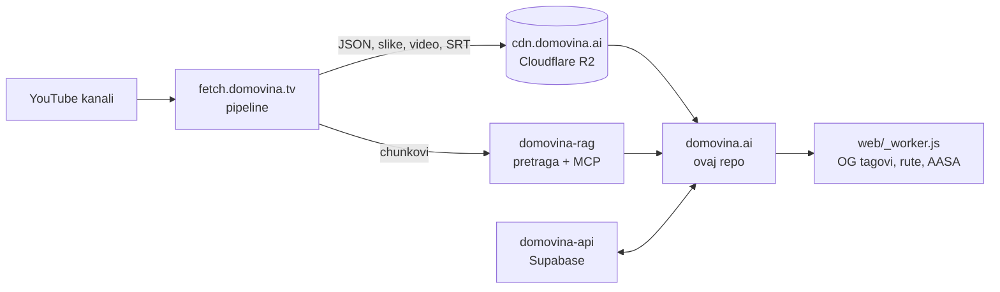

# DOMOVINA.ai

Aplikacija za hrvatske podcaste koje je obradio AI. Svaka epizoda dobiva
članak po sekcijama, sažetak, poglavlja, govornike, titlove (i riječ po riječ),
spominjane osobe i teološku provjeru (Magisterium AI). Uz to: pretraga kroz cijeli
korpus, profil osobe kroz sve epizode u kojima govori ili se spominje, e-knjiga
epizode, glasanje za sljedeći podcast i zid podrške (Pinka).

**Produkcija:** <https://domovina.ai> · iOS (App Store) · Android (Google Play)

Ovaj repo je **samo klijent**. Obradu radi pipeline, podaci stižu s CDN-a, a
prijava i korisnički podaci žive u zasebnom backendu (vidi [Povezani repoi](#povezani-repoi)).

## Platforme

| Platforma | Status | Napomena |
|---|---|---|
| Web | primarna | Flutter `--wasm` (skwasm), Cloudflare Pages + edge worker |
| iOS | u App Storeu | TestFlight svaku noć iz `main` |
| Android | na Google Playu | |
| Android TV | isti APK kao Android | Leanback se prepozna sam; zaseban UI u `lib/screens/tv/`, D-pad navigacija |
| macOS | razvojni | |

## Arhitektura



- **Sadržaj epizode** se čita izravno s CDN-a u runtimeu
  (`data/<id>/info.json`, `article.json`, `summary.json`, `diarized.srt`…).
  Klijent ne vjeruje zastavicama iz listinga, nego mjeri što stvarno postoji
  (`lib/models/episode_status.dart`).
- **Korisnički podaci** (prijava, favoriti, napredak slušanja, glasanje,
  pretplata) idu u Supabase na `api.domovina.ai`.
- **Edge worker** (`web/_worker.js`) ubacuje OG tagove i JSON-LD za share
  poveznice, servira AASA za iOS Universal Links i radi SPA ruting.
- **Ruting** je go_router (`lib/router/app_router.dart`), a prijelazi idu kroz
  helpere u `lib/router/nav.dart`.
- **Sučelje** je na hrvatskom i engleskom (gen-l10n, `lib/l10n/`), a jezik
  sadržaja epizode bira se zasebno.

## Struktura

```
lib/
  screens/       ekrani (epizoda, kanal, osoba, pretraga, račun, TV…)
  widgets/       dijeljeni widgeti (player, članak, titlovi, kartice…)
  services/      CDN, Supabase, reprodukcija, jezik, dijeljenje…
  models/        modeli za JSON s CDN-a i iz backenda
  router/        go_router + navigacijski helperi
  l10n/          ARB prijevodi (HR je izvorni jezik)
  pinka_sdk/     zid podrške i SEPA / on-chain doprinosi
web/             index.html, _worker.js (Cloudflare Pages Function)
android/ ios/ macos/
scripts/         deploy, nightly build, store upload, alati
docs/            odluke, mjerenja i planovi (vidi niže)
test/            unit i widget testovi
e2e/             Playwright testovi weba
```

## Pokretanje

Treba Flutter (stable, Dart `^3.11`).

```bash
flutter pub get
flutter run -d chrome                 # protiv produkcijskog CDN-a, bez prijave
./scripts/run-local.sh                # web protiv lokalnog domovina-api stacka (port 5173)
flutter test
```

Za prijavu protiv produkcije build treba `SUPABASE_URL` i `SUPABASE_ANON_KEY`
kroz `--dart-define`. `.env.example` popisuje sve varijable.

## Deploy

```bash
./scripts/deploy.sh           # release build → Cloudflare Pages → purge CDN-a → provjera
./scripts/deploy.sh --debug   # isto, s neminificiranim buildom
```

Produkcija ide **samo s grane `main`**. Deploy s druge grane završi kao
Cloudflare Preview, a `domovina.ai` ostane na staroj verziji. Provjerava se
verzija, ne HTTP status:

```bash
curl -s https://domovina.ai/main.dart.js | grep -o 'DOMOVINA v[0-9.]*' | head -1
```

Mobilni buildovi idu svaku noć na TestFlight i Play internal
(`scripts/nightly-build.sh`, launchd u 03:00), a testovi su vrata za upload.
Detalji: `docs/nightly-build-pipeline.md`, `docs/mobile-release-pipeline.md`.

## Dokumentacija

`CLAUDE.md` je glavni popis pravila i poznatih zamki (piše se za AI agente, ali
vrijedi i za ljude). Dublje teme:

| Tema | Dokument |
|---|---|
| Web isporuka, cache, rendering | `docs/web-delivery-and-rendering.md` |
| Navigacija i vraćanje scrolla | `docs/2026-09-04-navigacija-i-scroll-restoration.md` |
| Faze obrade epizode | `docs/2026-08-26-episode-processing-status.md` |
| Lokalizacija | `docs/i18n-and-localization.md` |
| Android TV | `docs/android-tv.md`, `docs/android-tv-performance.md` |
| iOS pozadinska reprodukcija | `docs/ios-background-playback.md` |
| Prijava i baza | `docs/auth-and-database-plan-v3.md`, `docs/auth-ux-backlog.md` |
| E2E testovi | `docs/e2e-testing.md` |
| Zašto Flutter, a ne Expo | `docs/tech-stack-assessment-flutter-vs-expo.md` |

Datirani dokumenti (`docs/2026-…`) bilježe jednu odluku: što je izmjereno, što je
odbačeno i što je ostalo otvoreno.

## Povezani repoi

| Repo | Uloga |
|---|---|
| [fetch.domovina.tv](https://github.com/domovinatv/fetch.domovina.tv) | pipeline: preuzimanje, transkripcija, AI obrada, upload na CDN |
| [domovina-rag](https://github.com/domovinatv/domovina-rag) | semantička pretraga, profil osobe, MCP server |
| [domovina-api](https://github.com/domovinatv/domovina-api) | Supabase (shema, RLS, edge funkcije) za cijeli ekosustav |
| [domovina-cutter](https://github.com/domovinatv/domovina-cutter) | rezanje poglavlja u MP4 za dijeljenje |
| [pipeline.domovina.ai](https://github.com/domovinatv/pipeline.domovina.ai) | red za ad-hoc obradu pojedinačnih videa |
| [podcast.domovina.ai](https://github.com/domovinatv/podcast.domovina.ai) | katalog hrvatskih podcasta |
| [dataset.domovina.tv](https://github.com/domovinatv/dataset.domovina.tv) | javni dataset transkripata |

Pregled cijele organizacije: <https://github.com/domovinatv>.

## Ime repoa

Do 6.10.2026. repo se zvao `ai.domovina.tv`. GitHub stare adrese i git remote
preusmjerava ovamo, ali je bolje ažurirati remote:

```bash
git remote set-url origin git@github.com:domovinatv/domovina.ai.git
```
