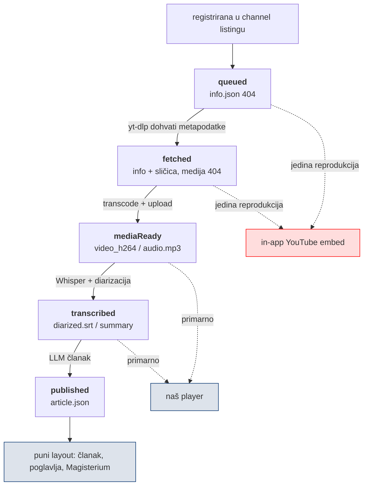

# Faza obrade epizode — što korisnik vidi dok pipeline nije gotov

*26. kolovoza 2026. — uz v2.0.142*

Epizoda se u aplikaciji pojavi čim je yt-dlp registrira u channel listingu, a to
je **sati do tjedana** prije nego pipeline proizvede članak. Do ovog prolaza su
sva ta međustanja korisniku govorila istu rečenicu („AI obrada još nije gotova"),
iako se bitno razlikuju u jedinoj stvari koja korisnika zanima: **može li epizodu
pustiti, i gdje.**

Ovaj dokument bilježi izmjereno stanje koje je odredilo dizajn, i ono što
frontend NE može popraviti.

## 1. Izmjereno stanje produkcije (26.8.2026.)

Sve epizode bez `has_article`, mlađe od 30 dana — dakle točno populacija rail-a
„Upravo stiglo":

```bash
node scripts/audit-episode-stages.mjs          # brojke iz ove sekcije, ~1 min
node scripts/audit-episode-stages.mjs --json   # sirovi redovi
```

| faza | broj | značenje |
|---|---|---|
| `queued` | **1** | ni `info.json` nije na CDN-u |
| `fetched` | **7** | metapodaci ✓, medija 404 |
| `mediaReady` | **12** | medija ✓, nijedan AI artefakt |
| **ukupno** | **20** | |

Tri su karakteristična slučaja (i tri regresijska primjera u
`test/episode_status_test.dart`):

| epizoda | `info.json` | medija | što je korisnik vidio PRIJE |
|---|---|---|---|
| `UclibQB3SZM` | **404** | — | „nije pronađena na CDN-u" — slijepa ulica |
| `ZYG_ksNDl3s` | ✓ | **404** | „Prikazujemo samo **video** i osnovne podatke" |
| `DnzG2OvRflI` | ✓ | `video_h264.mp4` ✓ | crveni „Gledaj na YouTubeu" |

Druga je poruka bila **neistinita** — videa nije bilo nigdje. Treća je slala
korisnika van iako video imamo, i to je bio **najveći bucket (12 od 20)**.

## 2. Zašto se faza mjeri, a ne čita iz listinga

Channel listing nosi `pipeline` blok (`has_transcript`, `has_summary`,
`has_article`, …). Izgleda kao gotov izvor istine — i **nije**:

- `DnzG2OvRflI` ima `video_h264.mp4` na CDN-u uz `has_transcript:false`.
  Listing o mediji ne zna **ništa** — nema zastavicu za nju.
- `UclibQB3SZM` ima listingan `thumbnail` URL koji vraća **404**. Listing
  zapisuje putanju koju će datoteka *imati*, ne onu koju ima.

To je ista klasa problema kao WebP varijante iz 25.8.2026.: producent zapisuje
**namjeru**, potrošač treba **stanje**. Zato:

> `EpisodeStatus.measured(...)` je jedini autoritet za poruku koju korisnik čita.
> `EpisodeStatus.fromPipeline(...)` postoji samo za oznake na karticama u
> railovima (gdje probe nije izvediv) i nosi `measured: false`.

## 3. Faze i prijelazi



Granica koja nosi cijeli UI je **`needsExternalSource`** (`queued` ∪ `fetched`):
lijevo od nje YouTube je jedini put do reprodukcije, desno od nje je naš player
primaran a YouTube pada na tihu tekstualnu poveznicu.

`mediaReady` namjerno **ne** čeka transcode da bi se smatrao dosegnutim ako
postoji prijepis — prijepis ne može nastati bez preuzetog zvuka, pa faza ne
smije nazadovati na „preuzimamo" dok `video_h264.mp4` još nije gotov.

## 4. Odbačene alternative

**Odmah ubaciti `<iframe>` umjesto facade postera.** Odbačeno iz dva razloga:
stranica bez korisnikove geste dobiva mutirani autoplay (ista browserska
politika opisana u CLAUDE.md § „Muted autoplay"), i svaka posjeta plaća ~1 MB
YouTube playera na stranici koja je korisniku ionako samo status. Facade riješi
oboje — prvi tap **jest** gesta.

**Prikazati embed za svaki `/v/<id>`.** Odbačeno kao sigurnosni problem: bez
provjere da ID doista postoji u nekom channel listingu, `/v/<bilo-koji-YT-ID>`
bi ugrađivao proizvoljan tuđi video pod našim brandom. Zato `_QueuedEpisodeScreen`
prvo traži epizodu (`channelCache.findVideoAsync`), i tek na pogodak nudi player;
inače ostaje prava 404.

**Skidati/streamati YouTube izvor umjesto embeda.** Nije razmatrano — krši
YouTube ToS. Vrijedi i dalje pravilo iz CLAUDE.md: samo službeni
`youtube-nocookie` iframe, bez modifikacija playera.

**Zadržati crveni „Gledaj na YouTubeu" kao primarnu radnju.** Odbačeno jer je za
12 od 20 epizoda bio **kriv savjet** — video je bio kod nas. Sad je primarno
„Gledaj epizodu" (otvara `endDrawer` na uskom ekranu), što je usput popravilo i
to da na mobitelu takva epizoda **nije imala nijedan vidljiv gumb** za našeg
playera.

## 5. Zamke otkrivene usput

**`info.json` 404 ne znači „epizoda ne postoji".** Znači „preuzimanje nije
stiglo ili je palo". Ekran koji je na to odgovarao s „nije pronađena na CDN-u"
bio je i netočan i slijepa ulica — a epizoda je istovremeno bila **vidljiva u
railu na naslovnici**.

**Sve HEAD probe moraju nositi cache-buster.** CDN cachira 404 četiri sata, pa
jedan prerani probe zaključa fallback na cijeli prozor. Postojeće pravilo za
`videoH264ProbeUrl`, ali vrijedi jednako za audit skripte.

**`playable_in_embed` postoji u `info.json`** (yt-dlp ga piše) i vrijedan je
signal — kad je `false`, iframe bi ostao crn („Video unavailable"), pa se mora
ići van uz objašnjenje. Prije se nije čitao.

## 6. Otvoreno — nije frontend

Ove stavke frontend može samo **iskomunicirati**, ne popraviti. Rade se iz
`fetch.domovina.tv` sesije (vidi memory `feedback_pipeline_work_from_fetch_repo`).

1. **`UclibQB3SZM` nikad nije preuzet** (Mreže Riječi, 25.8.2026.). Hipoteza je
   yt-dlp bot detection, **neprovjereno** — treba pogledati nightly log.
   Nema retry mehanizma ni obavijesti: epizoda tiho ostaje `queued`.
2. **Nema tripwirea za `queued`.** Registar ↔ glasački bazen ima
   (`voting-drift-check.sh`, launchd 08:30); listing ↔ CDN nema. Epizoda može
   danima stajati bez `info.json`-a i nitko to ne dozna. Ista klasa problema,
   ista klasa rješenja.
3. **`mediaReady` backlog je star.** 11 od 12 epizoda u tom bucketu je iz
   razdoblja 1.–12.8., dakle **14 do 25 dana** s gotovom medijom i bez članka
   (`fetched` bucket je za usporedbu star najviše 7 dana). Ili LLM korak
   zaostaje, ili je dio epizoda tiho ispao iz reda.
4. **`pipeline` blok nema zastavicu za mediju.** Kad bi listing nosio
   `has_media`, railovi bi mogli pokazati točnu fazu bez probe-a. Trenutno
   `fromPipeline` mora nagađati (prijepis ⇒ medija je bila tu).

## Vezani dokumenti

- `CLAUDE.md` § „Faza obrade epizode — `EpisodeStatus`" — pravila za kod
- `CLAUDE.md` § „In-app YouTube za epizode bez medije — `InAppYouTubePlayer`"
- `CLAUDE.md` § „Muted autoplay — browserska politika, ne naš bug" — zašto facade
- `docs/web-delivery-and-rendering.md` — CDN cache i 404 cache prozor
- `test/episode_status_test.dart` — kontrakt faza, s tri produkcijska slučaja
