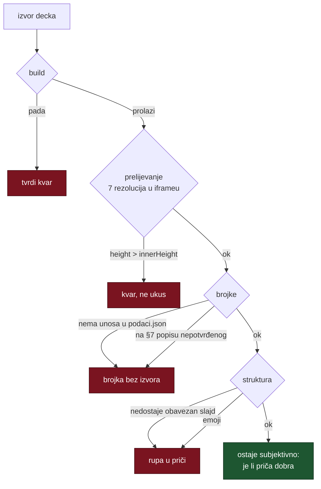

# Pitch deck kao mjerljiv artefakt — što se u decku može provjeriti strojno

*Izmjereno 26.–27.8.2026. na `docs/marketing/deck/domovina-seed.html` tijekom
prijevoda na engleski i popravka layouta.*

> Vezani dokumenti: [`marketing/deck/README.md`](marketing/deck/README.md) (pravila
> decka), [`marketing/vc-pitch-strategija.md`](marketing/vc-pitch-strategija.md)
> (§7 zabranjene tvrdnje, §9 otvoreno),
> [`oglasni-prostor-trziste-i-usporedba.md`](oglasni-prostor-trziste-i-usporedba.md)
> (§7 popis nepotvrđenog).

Deck izgleda kao najsubjektivniji mogući artefakt. Nije: tri stvari u njemu su
mjerljive i baš one najčešće puknu. Ovaj dokument bilježi **brojke** iz jednog
stvarnog prolaza, da sljedeći put ne krene od nule i da se napiše orakl
(`provjeri.sh`) pitch vertikale u `~/git/stepanic/claude-tmux-teams`, koji
**još ne postoji** — `tim-orakl.sh` zato pada s izlaznim kodom 3.

---

## 1. Prelijevanje je kvar, ne stvar ukusa

Prijavljeno je „raspada se na slajdovima 4, 7 i 12". Mjerenjem na 1280×720
ispalo je da prelijeva **osam od 14** slajdova:

| slajd | 2 | 4 | 5 | 7 | 9 | 11 | 12 | 14 |
|---|---|---|---|---|---|---|---|---|
| px ispod ruba | 120 | 306 | 114 | 251 | 92 | 117 | **797** | 188 |

Slajd 12 (rizici) gubio je gotovo pola popisa ispod ruba, a `scroll-snap-stop:
always` je učinio da gumb „Dalje" **preskoči** taj dio. Sadržaj je formalno bio
na stranici i nedostupan iz kontrola — najgora kombinacija, jer se ne vidi ni
kao greška.

**Mjerna metoda** (jeftina, bez OCR-a): učitaj deck u iframe zadane veličine i
za svaki slajd usporedi `getBoundingClientRect().height` s `innerWidth/Height`
iframe-a. Nula ovisnosti, traje sekundu.

```js
[...d.querySelectorAll('.slide')]
  .map((s,i)=>[i+1, Math.round(s.getBoundingClientRect().height - win.innerHeight)])
  .filter(x => x[1] > 0)
```

**Rule**: Chrome ne da prozor uži od ~500 px, a `resize_window` na HiDPI vraća
krivi `innerWidth` (tražen 1280, dobiven 1745). Mjeri u **iframeu** — medijski
upiti i `vh`/`vw` unutar njega razrješavaju se prema iframe viewportu, pa je to
vjerna emulacija za layout.

Rezolucije koje moraju proći: 1024×768, 1152×864, 1280×720, 1366×768, 1440×900,
1600×900, 1920×1080. Na 390 i 430 px širine gusti slajdovi ostaju viši od
ekrana i to je u redu — ondje se scrolla.

## 2. Dva strukturna uzroka, oba nevidljiva iz izvora

### 2.1 Ugniježđeni grid razriješi tračnice obrnuto

`ul.plain li{display:grid;grid-template-columns:auto 1fr}` unutar dvostupčanog
roditelja (`ul.plain.split{display:grid;grid-template-columns:1fr 1fr}`)
razriješio je tračnice **naopako**: crtica je dobila **409 px**, tekst **89 px**.
Svaka natuknica išla je 5–7 redaka u dubinu.

```
getComputedStyle(li).gridTemplateColumns → "409.336px 89.0625px"
```

Popravak je hanging indent — `padding-left` + apsolutno pozicionirana
`::before`. Roditeljski grid ga ne može preračunati.

**Rule**: za natuknice ne ugnježđuj grid u grid. Izgleda identično dok netko ne
doda stupce roditelju, a onda pukne tiho.

### 2.2 Labela dimenzionirana prema onome na što pokazuje

Vremenska os slajda 4 imala je tri flex labele s `flex:1442 / 625 / 4147`, tj.
labela je bila **proporcionalna segmentu** na koji pokazuje. Ta srednja dobila
je **114 px** za cijelu rečenicu i prelomila se u pet redaka.

Popravak: os nosi samo `00:00` / `1:44:06`, a objašnjenje je callout **pune
širine** ispod. Veza je boja, ne poravnanje.

## 3. Gustoća se ne piše u px nego u tokenima

`--gap`, `--gap-s`, `--cellpad`, `--lipad`, `--srcgap` u `:root`, stisnu se na
`@media (max-height:880px)` i `(max-height:800px)`. Tipografija odgovara i na
visinu: `clamp(min, min(Xvw, Yvh), max)`.

**Rule**: hardkodiran `margin-top` preživi na 1080p i pukne na 720p. Novi
razmak ide kroz token.

Sitnica s velikim učinkom: `.grid3` minmax **230 → 212 px**. Na 1024 px četiri
kartice inače prelome u 2×2 i slajd naraste za 83 px.

## 4. Maketa je najjači signal da je deck generiran

Slajd 4 je do 26.8. crtao 11 nasumičnih segmenata i **izmišljeni citat**
(„Kako mali poduzetnik u Hrvatskoj skuplja kapital?"). Ispalo je da ta epizoda
**postoji**: `WRE248YCIeI`, *#005 Marijana Šarolić Robić (CroStartup)*, 1:44:06,
**85 strojno detektiranih poglavlja**, a poglavlje na 24:35 nosi gotovo doslovno
tu rečenicu.

Danas slajd crta **pravu mapu tih 85 poglavlja u pravom mjerilu** (iz
`get_episode` preko `mcp.domovina.link`), istaknuti blok 24:35–31:40 su tri
stvarna uzastopna poglavlja o prikupljanju kapitala, i izvor nosi klikabilnu
poveznicu.

**Rule**: primjer u decku se **vadi iz MCP-a, ne piše rukom**. Ono što razlikuje
generiran deck od pravog nije tipografija nego postojanje artefakta koji je
mogao nastati samo kod nas.

## 5. Screenshotovi u artifactu

Artifact je jedna samostalna HTML datoteka — **relativne putanje do slika ne
rade**. Slike idu kao `data:` URI; izvori u `deck/shots/` (JPEG, dulja stranica
1160 px, kvaliteta ~74) da se mogu zamijeniti. Deck s dvije slike je ~514 kB,
daleko ispod ograničenja od 16 MB.

**Rule**: Flutter na `domovina.ai` traži **~30 s** do prvog painta u
automatiziranom Chromeu. Prerani screenshot je **prazna** stranica, ne puknuta —
lako se pogrešno pročita kao kvar. Čekaj dok `document.querySelectorAll(
'canvas,flt-glass-pane,flutter-view').length > 0`.

## 6. Što je od ovoga orakl



Provjera **4** je našla stvarnu rupu koju nijedno oko nije: deck je obećavao
„20 plaćenih trenutaka kroz pet kanala" a **nije imao GTM slajd** — nigdje nije
pisalo tko ih prodaje. To je prvo pitanje nakon „od čega živite". Popis
obaveznih slajdova je najjeftinija provjera u cijelom setu i jedina koja hvata
*izostanak*.

## 7. Otvoreno

- `provjeri.sh` pitch vertikale **nije napisan**. Kickoff za tim koji ga piše je
  u `~/git/domovinatv/bizops-automation/.tim/kickoff-prompt.md`.
- Brojke u decku još **nisu izdvojene u `podaci.json`** — provjera „ima li ova
  brojka izvor" je zasad ručna (protiv §7).
- **Financijski model ne postoji.** €1,2 M je izveden iz objavljenih raspona
  fondova, ne iz modela.
- **CPM za hrvatski podcast** javno ne postoji; prvi cjenik je pogađanje.
