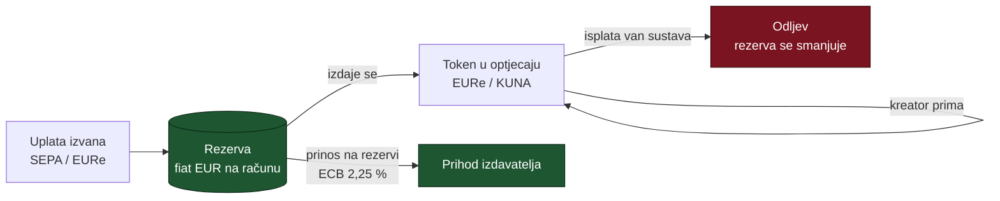

# Zatvorena petlja i prinos na floatu — što zapravo generira prihod

*Nastalo 26.8.2026. iz razgovora o tome zašto „besplatne transakcije" imaju
smisla. Ovdje je zato što se odgovor ne vidi ni iz koda ni iz git povijesti, a
sljedeći prolaz bi ga morao ponovno izvesti.*

**Vezani dokumenti**: [`plans/2026-08-26-p2p-oglasni-prostor.md`](plans/2026-08-26-p2p-oglasni-prostor.md)
(mehanizam koji parkira novac), [`marketing/vc-pitch-strategija.md`](marketing/vc-pitch-strategija.md) §4
(kako se ovo iznosi investitoru).

---

## 1. Korekcija koja mijenja što mjerimo

Intuitivna formulacija je bila: *„besplatne transakcije u zatvorenoj ekonomiji
generiraju likvidnost, a likvidnost generira novac."* Zaključak je točan, ali
razlog nije — i razlika je operativna, ne semantička.

> **Prinos ne generiraju transakcije nego stanja.**
> Korisnik koji puno transaktira a drži nula eura nosi nula prinosa.

Zatvorena petlja **ne stvara** prinos — ona ga **zadržava**, jer euri ne izlaze
iz rezerve kad novac kruži interno umjesto da odlazi van sustava.

Iz toga slijedi metrika: **prosječni euro-dani zadržani unutar sustava**, a ne
broj ili volumen transakcija. Dashboard koji broji transakcije mjeri krivu stvar.

Sve strelice koje ostaju unutar `TOK` su besplatne **i poželjne** — one ne diraju
rezervu. Jedina strelica koja košta je odljev.

---

## 2. Pravni okvir: zašto izdavatelj smije zadržati prinos

**MiCA (Uredba (EU) 2023/1114) čl. 50 zabranjuje isplatu kamate imatelju
e-novčanog tokena.** Svaki oblik naknade vezan uz trajanje držanja tokena smatra
se kamatom — uključujući popuste i pogodnosti od izdavatelja ili trećih strana.

Ali ta zabrana je **odvojena** od prava izdavatelja da zaradi na rezervi.
Izdavatelj **smije zadržati prinos** ostvaren ulaganjem rezervnih sredstava.
Rezerva mora biti u depozitima kod kreditnih institucija i sigurnoj,
niskorizičnoj, visokolikvidnoj imovini u valuti na koju token glasi.

To nije rupa u propisu nego **poslovni model Circlea, Tethera i Monerija**.

*(Za usporedbu: čl. 40 je ista zabrana za tokene vezane uz imovinu — ARTs. Za
naš slučaj mjerodavan je čl. 50.)*

---

## 3. Aritmetika koja sizea cijeli biznis

Depozitna stopa ECB-a je **2,25 %** (od 23.7.2026.).

| prosječni float | bruto prinos godišnje |
|---|---|
| 1 M€ | ~22.500 € |
| 10 M€ | ~225.000 € |
| **45 M€** | **~1.000.000 €** |
| 100 M€ | ~2.250.000 € |

**~45 M€ prosječnog floata daje ~1 M€ bruto godišnje.** To je jedina brojka koja
postavlja mjerilo — sve ispod toga je operativni trošak, ne biznis.

**Ograničenja koja idu uz tablicu, i ne smiju se prešutjeti:**

- Stopa je promjenjiva. Model koji radi samo pri 2,25 % nije model.
- Dio rezerve mora biti u bankovnim depozitima koji nose manje od depozitne
  stope ECB-a, pa je stvarni prinos **ispod** ove tablice.
- Izdavanje vlastitog tokena traži **licencu**. Danas se koristi Moneriumov EURe
  upravo zato što oni tu licencu imaju.
- Na današnjoj skali float je zanemariv. Ovo je **putanja, ne prihod.**

---

## 4. Zašto je oglasni mehanizam dobar generator floata

Ovo nije naknadno opravdanje nego posljedica dizajna iz
[`plans/2026-08-26-p2p-oglasni-prostor.md`](plans/2026-08-26-p2p-oglasni-prostor.md).
Mehanizam **parkira novac po konstrukciji**, na četiri mjesta:

| gdje | koliko dugo |
|---|---|
| Hold slota tijekom asinkrone uplate | do isteka intenta (cap 24 h) |
| **Zajamčeni let** prije nego se otkup uopće može aktivirati | **30 dana** |
| Polog izazivača dok teče prvokup | 72 h, plus 7 dana za isporuku kreative |
| Sredstva koja čekaju isplatu kreatoru | do ciklusa isplate |

Zajamčeni let od 30 dana uveden je da primarno tržište uopće postoji (bez njega
nitko ne kupuje nešto što se može oteti isti dan) — a **usput** je i najduže
parkirno mjesto u sustavu. Dva neovisna razloga za isto pravilo.

**Ali pošteno o razmjeru**: na pilot-skali to je nekoliko stotina eura. Float
mora doći iz šire airKUNA baze, ne iz oglasnog tržišta. Oglasno tržište je
**utility koji drži novac u petlji**, ne izvor floata.

---

## 5. Što ostaje neprovjereno

- **Stvarni prinos nakon strukture rezerve** — koliko postotno mora biti u
  depozitima i po kojoj stopi. Nije izračunato.
- **Trošak licence i usklađenosti** naspram prinosa pri malom floatu — vjerojatno
  je prag isplativosti znatno iznad nule, ali nije izračunat.
- **Prosječni euro-dani** kao metrika nisu nigdje instrumentirani. Ako se ovaj
  model uzme ozbiljno, to je prvo što treba mjeriti.

## Izvori

- MiCA čl. 50 (zabrana kamate na EMT) i zahtjevi za rezervu —
  [EBA: Asset-referenced and e-money tokens](https://www.eba.europa.eu/regulation-and-policy/asset-referenced-and-e-money-tokens-mica)
- Depozitna stopa ECB-a 2,25 %, odluka od 23.7.2026. —
  [ECB: Key interest rates](https://www.ecb.europa.eu/stats/policy_and_exchange_rates/key_ecb_interest_rates/html/index.en.html)
