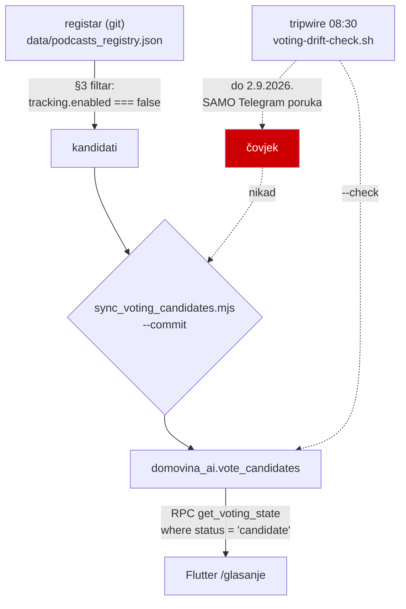

# Registar ↔ glasački bazen: rekoncilijacija umjesto transakcije

**Datum:** 2026-09-02
**Povod:** AbbaCast je 28.8.2026. ušao u pipeline, a 2.9.2026. je i dalje stajao
u glasanju na `/glasanje`.
**Dirani repoi:** `fetch.domovina.tv` (`sync_voting_candidates.mjs`),
`domovina.ai` (`scripts/voting-drift-check.sh`, launchd plist, `CLAUDE.md`).

---

## 1. Što se dogodilo

Mehanizam sinkronizacije je postojao i radio ispravno. Otkazao je **jedini ručni
korak** u lancu.



Vremenska crta:

| Datum | Događaj |
|---|---|
| 28.8. 21:42 | `fdde77c` — `abbacast tracking.enabled=true`, ispao iz §3 filtra ✅ |
| 29.8.–2.9. | tripwire svako jutro javlja `DRIFT: 1` u Telegram ✅ |
| 2.9. | `sync_voting_candidates.mjs --commit` — **nikad pokrenut** ❌ |

Pet dana drifta, pet urednih obavijesti, nula reakcija. Prethodni slučaj
(25.8.2026.) bio je isti razred: 17 dana, 37 kandidata.

**Pouka:** obavijest koja traži isti ručni potez svaki put nije tripwire nego
podsjetnik, a podsjetnik se ignorira. Ako sustav zna izračunati ispravno stanje,
ne smije čekati da ga čovjek prepiše.

## 2. Zašto transakcija nije odgovor

Prvo pitanje je bilo: može li se registar-commit i upis u bazu napraviti
atomarno, u jednoj transakciji.

**Ne može.** Korak A je git commit u `podcasts_registry.json`, korak B je red u
Postgresu. Dvofazni commit traži da oba resursa znaju `prepare`/`commit`; git to
ne zna. Svaki pokušaj da se to odglumi (rollback gita ako baza padne) uvodi više
čudnih stanja nego što ih miče — najmanje jedno novo: registar koji se razlikuje
od onoga što je autor napisao.

**Ali transakcija ni ne treba.** Odnos nije „dva ravnopravna zapisa" nego
**izvor istine → derivat**, što je već bio dizajn:

- registar (git) = željeno stanje, jedini izvor istine
- `vote_candidates` = projekcija tog stanja
- `sync_voting_candidates.mjs` = **idempotentan rekoncilijator**, ne „drugi korak"

Git commit u registar je točka odluke; sve nakon njega je konvergencija. To je
**jača** garancija od transakcije: transakcija štiti od jednog pada,
rekoncilijacija od svakog — svejedno je koliko puta sync padne i gdje je stao.

Ono što je falilo nije bila atomarnost, nego to da rekoncilijator uopće krene.

## 3. Napravljeno

### 3.1 Tripwire sinkronizira sam

Launchd job (`launchd/ai.domovina.voting-drift.plist`) sada prosljeđuje `--sync`,
pa na drift sam pokrene `--commit`. **Default skripte ostaje bez `--sync`** —
ručno pokretanje i dalje samo javlja.

Prethodno pravilo („sync mijenja produkcijske podatke → potpisuje čovjek")
oboreno je opažanjem: čovjek tu nije odlučivao ništa osim da prepiše isti
izračun. Cijena greške je niska (statusi se vraćaju), cijena neodlučivanja je
mjerena u danima nedostupnog glasanja.

### 3.2 Exit kodovi su ugovor — i bili su slomljeni

Pravi bug, reproduciran uživo pri prvom pokretanju:

```
⚠️  Ne mogu pročitati bazu (fetch failed) — nastavljam bez diffa.
❌  TypeError: Cannot read properties of null (reading 'length')
    at main (sync_voting_candidates.mjs:497)
```

`existing` ostane `null` → `izvjestaj.baza_redova = existing.length` pukne →
`main().catch` izađe s **1**. Tripwire kod 1 čita kao „ima drifta" i javi
„bazen zaostaje za registrom". Za „ne mogu provjeriti" je rezerviran kod 2, i
grana za nepostojeći `SERVICE_ROLE` to je radila ispravno — ova nije.

Bez `--sync` to je bila samo lažna uzbuna. **S `--sync` bi na prolaznu mrežnu
grešku pokrenulo pisanje.** Popravak je morao ići prije uključivanja `--sync`.

Ugovor: `0` = poravnato, `1` = ima drifta, `2` = ne mogu provjeriti. Nikad ne
miješati „ne znam" s „ima drifta".

### 3.3 `onboarded` ≠ `withdrawn`

Shema od početka ima pet statusa, ali sync je znao samo reći „ispao iz filtra" i
sve slao u `withdrawn` — isto kao podcast koji je ugašen ili obrisan iz registra.
Registar razliku zna:

| stanje u registru | status |
|---|---|
| `tracking.enabled === true` | `onboarded` — mi smo ga uzeli |
| zapis nestao, status ugašen, url maknut | `withdrawn` |

⚠ **`onboarded` se NIKAD ne vraća u bazen**, ni ako `tracking.enabled` padne
natrag na false. Vraćanje (`zaVracanje`) gleda isključivo `withdrawn`. Kanal koji
već imamo ne ide na glasanje o tome hoćemo li ga uzeti.

### 3.4 Verifikacija kao post-uvjet

Pisanje **nije** jedan poziv nego sedam odvojenih HTTP zahtjeva: 5 upsert
batcheva po 50 + 3 PATCH-a. Pad između bilo koja dva ostavlja bazu polupisanu —
najgori slučaj je da kandidat prođe kao upsert, a PATCH koji ga miče iz bazena ne
prođe, pa ostane u glasanju s osvježenim podacima.

`verifyConverged()` nakon pisanja ponovo čita bazu i provjeri oba smjera
(svaki kandidat iz registra je u bazi i nije `withdrawn`; nijedan red izvan
registra nije `candidate`). Padne s exit 2 ako nije. Preskače se pod `--limit`,
koji namjerno ostavlja drift.

**Ovo ne čini pisanje atomarnim — čini ga provjerenim.** Vidi §5.

### 3.5 Retry na čitanju baze

Nije bilo u planu, nametnulo se mjerenjem. Prvi `fetch` iz **hladnog** node
procesa pao je s golim `fetch failed` u 3 od 4 pokretanja te sesije, dok 6/6
poziva u već zagrijanom procesu prođe:

```
1 OK 200 161ms 27KB     4 OK 200 765ms 27KB
2 OK 200  53ms 27KB     5 OK 200  55ms 27KB
3 OK 200  71ms 27KB     6 OK 200  52ms 27KB
```

Reproducira se s:

```bash
cd ~/git/domovinatv/fetch.domovina.tv && node sync_voting_candidates.mjs --check
```

`fetchExistingRows` sada ima 3 pokušaja s backoffom (500 ms × i). Ponavlja se
**samo mrežni pad** — HTTP status je odgovor servera i ponavljanje ga ne mijenja.
Retry je vidljivo spasio i puni `--commit` i test tripwirea u istoj sesiji.

Bez toga bi jedna prolazna greška pod `--sync` značila cijeli dan drifta.

## 4. Rezultat (mjereno)

```
--commit   → 217 upsertano, 1 onboarded, 29 avatara na CDN
             🔎 Provjera nakon pisanja: baza je poravnata s registrom.
--check    → DRIFT: 0   (exit 0)
tripwire   → ./scripts/voting-drift-check.sh --sync --verbose → exit 0, tiho
baza       → { candidate: 217, onboarded: 1 }
```

## 5. Što ovo NIJE riješilo

### 5.1 Atomarnost — nije napravljena, samo provjerena

Pisanje je i dalje 7 HTTP poziva. Puna atomarnost traži **jednu Postgres
funkciju** koja primi cijeli payload i odradi upsert + withdraw + onboarded +
return u jednoj transakciji. Izmjereno da stane u jedan RPC poziv:

```bash
cd ~/git/domovinatv/fetch.domovina.tv && node -e '
const r=JSON.parse(require("fs").readFileSync("data/podcasts_registry.json","utf8"));
const A=new Set(["active","active-slowing","unknown"]);
const c=r.podcasts.filter(p=>p?.tracking?.enabled===false
  &&typeof p?.youtube?.url==="string"&&p.youtube.url.length&&A.has(p?.metadata?.status));
const rows=c.map(p=>({slug:p.slug,display_name:p.display_name,youtube_url:p.youtube.url,
  youtube_channel_id:p.youtube.channel_id??null,tags:p.tags||[],voditelji:p.voditelji||[],
  subscribers:p.metadata?.subscribers??null,episodes_estimate:p.metadata?.episodes_estimate??null,
  quality_score:p.quality_score?.total??null,tier:p.tier??null,notes:p.notes||null,
  source_type:p.youtube.type||null}));
console.log("kandidata:",rows.length,"| payload:",
  (Buffer.byteLength(JSON.stringify(rows))/1024).toFixed(1),"KB");'
# → kandidata: 217 | payload: 95.8 KB      (registar v1.2, 2.9.2026.)
```

Traži migraciju u `domovina-api` i deploy na Coolify — svjesno odgođeno.

### 5.2 Latencija od registra do baze je i dalje do 24 h

Tripwire je jednom dnevno u 08:30. `post-commit` hook u `fetch.domovina.tv`
(`.git/hooks/` je prazan, ništa se ne gazi) dao bi brzu putanju, uz tripwire kao
mrežu ispod za slučaj drugog stroja ili `--no-verify`. Hook **ne smije obarati
commit** — registar je izvor istine i mora se moći commitati i kad je baza
nedostupna. Nije napravljeno.

### 5.3 Četiri kandidata s mrtvim YouTube handleom

`iza-okvira`, `povijest-cetvrtkom`, `duhovno-duhoviti-poziv`,
`rijec-zivota-podcast` — yt-dlp vraća 404 (`Unable to download API page`), jedini
su bez avatara u bazi, i **ljudi mogu glasati za kanale kojih više nema**.

To je drugi razred čudnog stanja i popravak je u **registru**, ne u syncu: handle
se promijenio ili je kanal ugašen, a `metadata.status` je ručno polje koje nitko
nije spustio. §3 filtar bi ih hvatao da je status točan — što je argument za
periodičnu provjeru živosti handleova, ne za širenje filtra.

### 5.4 Nijedno kolo još nije promoviralo pobjednika

Statusi u bazi: `candidate: 217`, `onboarded: 1`. AbbaCast je onboardan **ručno**,
ne pobjedom na glasanju, pa je `promote_winner` tok (§9 plana) i dalje neizvršen.
`onboarded_channel_id` ostaje `null` — otvoreno je je li to isti YouTube channel
id (`UCCLmXuMmUwOlcE829aTUjsQ`) ili naš zaseban id iz `channels index.json`.
O tome ovisi može li ga sync popuniti sam.

---

**Vezani dokumenti**: `docs/plans/2026-08-08-glasanje-o-kanalima.md` (§3 filtar,
§9 winner flow, §5 model podataka), `docs/plans/2026-08-08-glasanje-predaja.md`,
`fetch.domovina.tv/CLAUDE.md` (§ `sync_voting_candidates.mjs`).
