# Navigacijski sustav — snimka stanja, storyboard i prijedlozi

**Datum:** 4.9.2026. · **Opseg:** web + mobitel + TV, sve rute u `lib/router/app_router.dart`
**Status:** ~~analiza + prijedlog~~ → **IMPLEMENTIRANO 6.9.2026.**
Stavke 1–14 i 16 iz §8 su u kodu (grana `feat/navigacijski-stog`, 5 commitova).
Ugovor živi u `lib/router/nav.dart`, sažetak pravila u `CLAUDE.md` §Routing.
Otvoreno ostaje: **15** (`/glasanje/:slug` sheet kao prava ruta — funkcionalno
pokriveno `closeOnRouteChange`, ali sheet i dalje nema vlastiti history entry) i
**17** (horizontalna pozicija railova).

**Ishod kritičnog puta (stavka 2):** zastavica
`GoRouter.optionURLReflectsImperativeAPIs = true` **radi** — `push('/v/abc')`
daje adresnu traku `/v/abc`, query preživljava, `pop` vraća baznu rutu.
Verificirano u `test/nav_contract_test.dart` nad pravim `GoRouter`om, kroz
`restoreRouteInformation` (jedini put kojim URL na webu nastaje), a NE ručnim
mjerenjem u browseru: automation Chrome ne isporučuje klik ni scroll Flutterovoj
canvas plohi, pa je šestostupanjska provjera iz §5.7 ostala neizvediva tim putem.
Umjesto nje stoji test koji s ISKLJUČENOM zastavicom dokazuje da URL ostane na
`/` — zastavica je time pod regresijskom zaštitom.

---

## 0. Verdikt (prvo zaključak)

Aplikacija **nema navigacijski stog**. 82 od 98 navigacijskih poziva su
`context.go()`, koji u go_routeru **zamjenjuje cijelu listu ruta**, a ne gura
novu na postojeću. Posljedice su sve tri stvari koje si primijetio, i sve tri
imaju isti korijen:

| Simptom | Uzrok |
|---|---|
| Scroll na naslovnici se ne vraća | `go()` **uništi** `HomeScreen` State → nova instanca, `ScrollPosition` počinje na 0 |
| „Back nije uvijek logičan" | in-app gumb „nazad" **gura novi** history entry (`go('/')`) umjesto da popa postojeći; browser Back nakon toga ide *naprijed* u detalj |
| Na mobitelu (native) je najgore | stog je dubine 1 → sistemski Back nema što popati → `popRoute()` vrati `false` → **aplikacija se zatvori** |

Najveći pojedinačni popravak nije pisanje scroll-restoration sloja, nego
**zamjena `go()` s `push()` na drill-down prijelazima**. Kad se ruta ispod
zadrži živa (`maintainState: true`, što je default za `NoTransitionPage`),
`HomeScreen` se **ne demontira**, njegov `ScrollPosition` ostaje netaknut, i
scroll se vraća sam — bez ijedne linije koda za pamćenje offseta.

Taj popravak ima **dva blokera**, oba obavezna prije migracije:

1. **`push()` po defaultu NE mijenja adresnu traku.**
   `GoRouter.optionURLReflectsImperativeAPIs` je `false`
   (`go_router-14.8.1/lib/src/router.dart:284`), pa bi nakon
   `push('/v/abc')` s naslovnice URL ostao `/`. Za proizvod koji živi od
   share linkova i worker OG injekcije to nije sitnica nego rušenje. **[S]**
   Puna analiza i izlaz: §5.7.
2. **`url_sync_web.dart` briše history state** u koji go_router serijalizira
   `imperativeMatches` (tj. baš pushani stog). Izmjereno na produkciji, §5.6.

Uz to: `ValueKey`-evi u ruteru **nisu** uzrok resetiranja scrolla, iako se tako
pamti. Njihova je povijest i stvarni učinak u §5.8.

---

## 1. Metoda — što je izmjereno, a što pročitano

Dokument razlikuje tri razine tvrdnje. Ne miješaj ih.

| Oznaka | Značenje |
|---|---|
| **[M]** | **Izmjereno** u browseru na `https://domovina.ai`, 4.9.2026. Naredba za reprodukciju u §10. |
| **[S]** | **Pročitano iz izvora** — naš kod (`lib/…:linija`), go_router 14.8.1 ili Flutter web engine 3.41.6. Deterministički slijedi iz koda. |
| **[H]** | **Hipoteza** — logično slijedi iz [S], ali nije potvrđena mjerenjem na uređaju. Uz svaku stoji recept za provjeru. |

Ovo je namjerno: dokument koji tvrdi „aplikacija se zatvara na Back" bez oznake
tko je to vidio, za mjesec dana postane predaja bez pokrića (CLAUDE.md,
pravilo „dokumentacija se provjerava, ne vjeruje joj se").

---

## 2. Inventar — što uopće postoji

29 ruta, 24 ekrana. Karta prostora prije karte kretanja:

```mermaid
flowchart LR
  subgraph ROOT["Korijen"]
    HOME["/<br/>HomeScreen"]
  end

  subgraph MASTER["Master liste"]
    CH["/channels<br/>AllChannelsScreen<br/>(?prikaz=osobe)"]
    FAV["/favorites<br/>FavoritesScreen"]
    VOTE["/glasanje<br/>VotingScreen"]
    SEARCH["/search<br/>MeiliSearchScreen"]
  end

  subgraph DETAIL["Detalji sadržaja"]
    CHAN["/c/:slug<br/>ChannelScreen"]
    PERS["/p/:slug<br/>PersonScreen"]
    EP["/v/:id (+/en, /t/:sec)<br/>EpisodeScreen"]
    EPS["/m/:id (+/en, /t/:sec)<br/>EpisodeSimpleScreen"]
  end

  subgraph SIDE["Bočne grane"]
    SUP["/c/:slug/doniraj · /v/:id/doniraj<br/>PinkaCampaignScreen"]
    CLAIM["/c/:slug/claim<br/>ChannelOwnershipScreen"]
    ACC["/account (+/channels/**)"]
    PAY["/subscribe"]
    LEG["/privacy · /terms"]
    HAND["/handoff"]
    AUTH["/auth/callback · /invite"]
  end

  subgraph TV["Android TV (Leanback)"]
    TVH["TvHomeScreen"]
    TVC["TvChannelScreen"]
    TVP["TvPersonScreen"]
    TVE["TvEpisodeScreen"]
    TVR["/v/:id/read<br/>TvEpisodeReaderScreen"]
  end

  ROOT --> MASTER --> DETAIL
  DETAIL --> SIDE
```

**Napomena o TV-u:** iste rute, drugi ekrani — `TvMode.isTv` grana u
`pageBuilder`-u. TV nema browser history, ima D-pad BACK. Analizira se odvojeno
u §6.4.

---

## 3. Storyboard — forward graf, kakav stvarno jest

Boja brida = mehanizam. Ovo je **snimka koda**, ne željeno stanje.

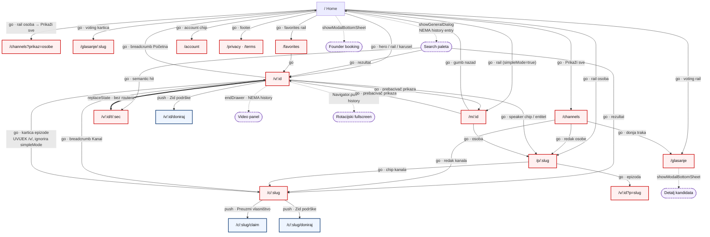

**Legenda:** crveno = `go()` (briše stog), plavo = `push()` (slaže stog),
ljubičasto isprekidano = imperativna ruta / modal (nevidljiv browser historyju).

Prvo što se vidi na grafu: **sve što je stvarni sadržaj ide crveno**, a plavo je
samo pet rubnih grana (donacije, claim, paywall, kampanje). Točno obrnuto od
onoga što UX traži.

---

## 4. Što se stvarno događa na BACK

### 4.1 Web — browserov Back

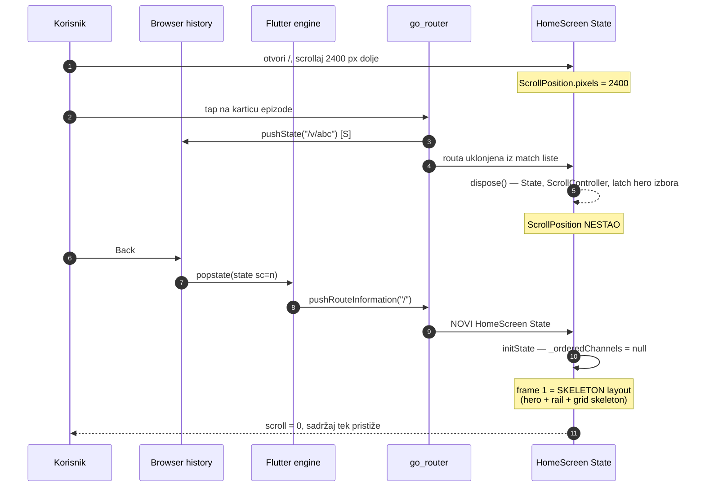

**Zašto baš skeleton:** `_orderedChannels` živi u `_HomeScreenState`
(`home_screen.dart:72`), a ne u `channelCache` singletonu. Na povratku je
`null`, pa `_ChannelGridViewState.build` uzme skeleton granu
(`home_screen.dart:376-393`) i tek u `addPostFrameCallback` → `_applyOrder`
(async) dobije prave kanale. **[S]**

Sve ostalo je isto: `channelCache`, `personIndexCache`, `VotingService` **jesu**
singletoni i pamte podatke, ali svaki rail u prvom frameu vrati
`SizedBox.shrink()` dok mu se `initState` microtask ne izvrti
(`persons_rail.dart:50-72`, `voting_rail.dart:44-53`). Visina naslovnice zato
naraste u **najmanje četiri skoka** nakon povratka. Tome bi svaki naivni
„vrati offset 2400" bio clampan na `maxScrollExtent` prvog framea.

### 4.2 Web — in-app gumb „nazad"

Ovo je „back nije logičan" dio.

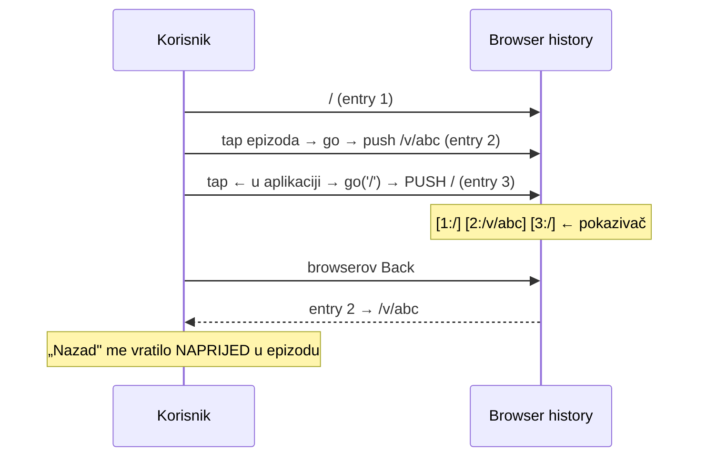

Nijedan in-app „nazad" u aplikaciji ne popa — jer `canPop()` uvijek vrati
`false` (stog je dubine 1 nakon `go()`). Osam ekrana ima ispravan uzorak
`canPop() ? pop() : go('/')`, ali `canPop()` im nikad nije `true`, pa se svih
osam ponaša kao tvrdi `go('/')`. **[S]**

### 4.3 Native (iOS/Android) — sistemski Back

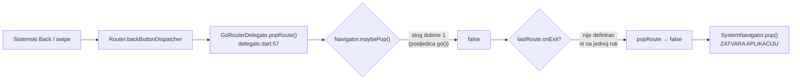

**[S]** iz `go_router-14.8.1/lib/src/delegate.dart:57-77` + `parser.dart:212`
(`NavigatingType.go` → `return newMatchList`, dakle bez baze).
**[H]** za konačni ishod na uređaju.

Provjera na fizičkom uređaju (30 s):
```bash
adb shell am start -a android.intent.action.VIEW -d "https://domovina.ai/"
# tapni epizodu, pa:
adb shell input keyevent 4
adb shell dumpsys activity activities | grep -m1 "mResumedActivity"
```
Ako u ispisu više nema `ai.domovina`, hipoteza je potvrđena.

Na iOS-u je isti korijen, blaži simptom: nema `SystemNavigator.pop()`, ali
**edge-swipe natrag ne radi ništa**, a `EpisodeScreen` nema gumb „nazad" —
`_episodeAppBar` ima `automaticallyImplyLeading: false`
(`episode_screen.dart:2929`), pa je jedini izlaz breadcrumb „Početna". Na
uskom ekranu je breadcrumb horizontalno skrolabilan i „Početna" je prvi čvor,
često izvan vidljivog dijela nakon što se traka pomakne.

### 4.4 Modali — nevidljivi historyju

`showGeneralDialog` / `showModalBottomSheet` / rotacijski fullscreen guraju rute
kroz **imperativni** `Navigator`, o kojem go_router ne zna ništa i koji ne
proizvodi history entry. **[S]**

Posljedica na webu: dok je otvorena search paleta (`search_overlay.dart:40`),
detalj kandidata (`voting_screen.dart:316`) ili rotacijski fullscreen
(`rotated_fullscreen.dart:31`) — browserov Back **ne zatvara modal**, nego
navigira stranicu ispod njega. **[H]**, provjera u §10.3.

---

## 5. Šest uzroka, svaki s dokazom

### 5.1 `go()` je zamjena stoga, ne guranje

```
go_router-14.8.1/lib/src/parser.dart:212
  case NavigatingType.go:
    return newMatchList;      // ← baza se odbacuje
```
**[S]** 82 poziva `context.go()` naspram 16 `context.push()` u `lib/`.

### 5.2 `go()` ipak **gura** browser history entry

Suprotno od intuicije „go = replace": go_router zove `_setValue` bez
`type` argumenta, pa se koristi default `RouteInformationReportingType.none`,
koji daje `replace = false` → `pushState`.
```
go_router-14.8.1/lib/src/information_provider.dart:105-128
```
**[S]** Zato history raste na svaki tap, uključujući tapove koji su
konceptualno „nazad".

To je najgori mogući spoj: **logički** se stog briše (nema `pop`), a
**fizički** browser history raste. Korisnik dobiva dugačak trag entryja od
kojih nijedan ne odgovara „gdje sam bio".

### 5.3 Nula scroll-restoration primitiva u repou

```bash
grep -rn "PageStorageKey\|restorationId\|restorationScopeId" lib --include=*.dart
# → 0 pogodaka
```
**[M]** `MaterialApp.router` u `main.dart:194,213` nema `restorationScopeId`,
pa je Flutterova ugrađena state restoration **potpuno isključena**.

Postojećih 11 `ScrollController`-a su svi lokalni i svi se stvaraju u
`initState` — uključujući `EpisodesRail._scrollController`
(`episodes_rail.dart:37`), pa se gubi i **horizontalna** pozicija svakog raila,
ne samo vertikalna pozicija stranice.

### 5.4 Naslovnica se na povratku vraća u skeleton

`_orderedChannels` je u `_HomeScreenState`, a ne u `channelCache`
(`home_screen.dart:72`). Podaci su u singletonu i odmah dostupni; **izračunati
redoslijed nije**, i mora proći kroz `addPostFrameCallback` +
`_applyOrder` (async, čita localStorage/SharedPreferences).

Isto vrijedi za `_simpleMode` (`home_screen.dart:137`) i `_continueWatching`
(`home_screen.dart:131`). Ovo je i ono „forsirali smo rendering homepagea na
back" — nije forsirano ničim eksplicitnim, nego je **posljedica** toga što
`go()` demontira ekran, a ekran ne može biti gotov u prvom frameu.

### 5.5 Uvjetni railovi rastu iz visine 0

`if (continueWatching.isNotEmpty)`, `VotingRail`, `PersonsRail`,
`FollowedRail`, `FavoritesRail` — svaki vrati `SizedBox.shrink()` dok mu podaci
ne stignu (`home_screen.dart:479-590`). **[S]**

CLAUDE.md već ima to pravilo za hero („`HeroSkeleton` mora biti **točno jednako
visok** kao `HeroCarousel`"). Nije generalizirano na railove — a bez toga
nikakva scroll-restoration ne može pogoditi poziciju, jer meta se pomiče
ispod nje.

### 5.6 `url_sync` briše engine-ov history state — **[M]**

Ovo je bloker za §7.1 i zaslužuje vlastiti odjeljak.

Flutter web engine svaki history entry omota u
`{serialCount: n, state: <routeInformation>}`
(`flutter_web_sdk/lib/_engine/engine/navigation/history.dart:145-147`).
go_router u to `state` polje serijalizira **`location` + `imperativeMatches`** —
tj. cijeli pushani stog.

Izmjereno na produkciji, `/v/nOCD7LosCxc`:

```js
// prije
history.state
// → {serialCount: 0, state: {location: "/v/nOCD7LosCxc",
//                            state: {...}, imperativeMatches: []}}

// točno ono što radi lib/services/url_sync_web.dart:26
history.replaceState(null, '', '/v/nOCD7LosCxc/t/120');

// poslije
history.state
// → null          ← omot uništen
```

Što slijedi iz engine izvora **[S]**
(`history.dart:177-196`): kad korisnik kasnije uđe u taj entry, `onPopState(null)`
vidi `!_hasSerialCount(state)` i **pretpostavi da je to sljedeći entry unaprijed**
(`_lastSeenSerialCount + 1`), pa mu prepiše brojač. Uz to framework dobije
`pushRouteInformation` s `state: null`, pa go_router mora rekonstruirati rutu
**samo iz stringa lokacije** — bez `imperativeMatches`.

Praktično danas: šteta je mala jer `imperativeMatches` ionako gotovo uvijek
prazan (§3). Praktično **nakon** prelaska na `push()`: svaki povratak u epizodu
koja je svirala izgubio bi cijeli stog ispod sebe. Zato je popravak `url_sync`-a
u §8 označen kao P0, ispred same migracije.

Popravak je jednoredan — sačuvati postojeći state umjesto da se pošalje `null`:
```dart
// url_sync_web.dart
web.window.history.replaceState(web.window.history.state, '', url);
```

### 5.7 `push()` i adresna traka — **[S]**, i ovo mijenja preporuku

Pitanje „podržava li `push` URL parametre kao `go`" ima dva odvojena odgovora, i
oni se ne poklapaju.

**Unutar aplikacije: da, potpuno.** `push('/v/abc?t=120&p=ivan')` gradi
`ImperativeRouteMatch` nad punom novom match listom, pa `state.pathParameters`
i `state.uri.queryParameters` u `pageBuilder`-u sadrže točno iste vrijednosti
kao kod `go()`. Nijedan `pageBuilder` u `app_router.dart` ne bi se morao mijenjati.

**U adresnoj traci: ne, po defaultu.**

```
go_router-14.8.1/lib/src/match.dart:509-511
  /// The uri of the current match.
  /// This uri only reflects [RouteMatch]s that are NOT [ImperativeRouteMatch].
  final Uri uri;

lib/src/match.dart:584-595   RouteMatchList.push(...) → copyWith(matches: …)
                             ← `uri:` se NE prosljeđuje, ostaje BAZNI

lib/src/parser.dart:133-158  restoreRouteInformation() uzme uri imperativne
                             rute SAMO ako je optionURLReflectsImperativeAPIs

lib/src/router.dart:284      static bool optionURLReflectsImperativeAPIs = false;
```

Dakle s golim `push()`:

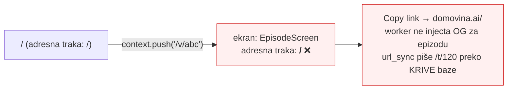

Za nas je to fatalno: cijela share arhitektura (`/v/<id>/t/<sec>`,
`og-t-<sec>.jpg` manifest, OG inject u `web/_worker.js`, „Kopiraj poveznicu na
trenutak") pretpostavlja da adresna traka **jest** kanonski URL epizode.

**Izlaz je jedna statička linija**, postavljena prije `createRouter()`:

<!-- doc-refs:ignore-start -->
```dart
// main.dart, prije runApp
GoRouter.optionURLReflectsImperativeAPIs = true;
```
<!-- doc-refs:ignore-end -->

Tada `restoreRouteInformation` uzme URI imperativne rute (`parser.dart:151-153`)
i adresna traka prati pushani ekran; na `pop()` se vraća bazni URI jer
`configuration.matches.last` više nije imperativan.

go_router dokumentacija „strongly suggests against" tu zastavicu, uz obrazloženje:
*„the URL of the top-most GoRoute is not always deeplink-able"*
(`router.dart:279-281`). **Kod nas to obrazloženje ne vrijedi**: nemamo nijedan
`ShellRoute`, sve su rute top-level `GoRoute`, i svaka je već danas dosežna
izravnim URL-om — to je preduvjet koji nam nameću AASA popis, Android intent
filteri i worker OG inject. Zastavica nam vraća točno ono ponašanje koje već
imamo, uz stog ispod.

**Ali to je [S], ne [M].** Prije migracije mora se izmjeriti, jer je jeftino:

```
1. postavi zastavicu, `flutter run -d chrome`
2. / → tap epizoda (push) → adresna traka MORA biti /v/<id>
3. pusti player 10 s → url_sync mora pisati /v/<id>/t/<sec>, ne /t/<sec> na "/"
4. Copy link → zalijepi u novi tab → mora otvoriti epizodu
5. ← → adresna traka MORA biti "/" i scroll na starom mjestu
6. browser Back/Forward preko cijelog niza
```

Ako korak 3 ili 5 padne, alternativa je `push` **samo** na rutama koje nemaju
share vrijednost (`/channels`, `/favorites`, `/glasanje`, `/account`), a za
`/v/`, `/m/`, `/c/`, `/p/` ostati na `go()` + `ScrollMemory` (§7.3). To je
slabija, ali sigurna varijanta i ne dira share arhitekturu.

### 5.8 Zašto se naslovnica „forsirano" renderira — prava povijest

Sjećanje je točno da je odluka postojala; mehanizam je drukčiji od onoga što se
pamti, a razlog joj je **u međuvremenu nestao**.

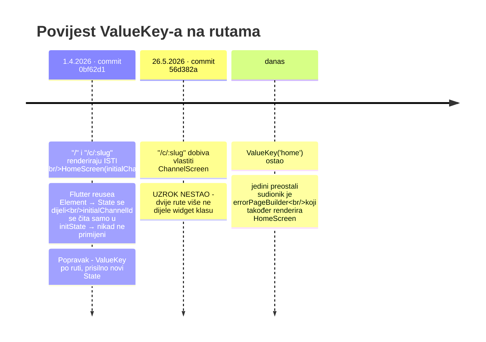

Originalna poruka commita **[S]**:

> `fix: add ValueKey to go_router pages to force rebuild on navigation`
> „go_router reuses widgets when the same type is rendered for different routes.
> Added unique ValueKey per route (home, channel-slug, video-id) so the framework
> correctly rebuilds when navigating between / and /c/:slug."

**Tri stvari koje iz ovoga slijede, a mijenjaju plan:**

1. **`ValueKey('home')` NIJE uzrok resetiranja scrolla.** Ključ je *konstanta* —
   isti je pri svakom dolasku na `/`, pa ne prisiljava ništa. Naslovnicu ubija
   `go()` koji rutu izbaci iz match liste (§5.1). Micanje ključa ne bi popravilo
   ništa, a vratilo bi sudar s `errorPageBuilder`-om (jedina druga ruta koja
   danas renderira `HomeScreen`).
2. **Ključ epizode JEST prisilni teardown, i to je skriveni trošak.**
   ```dart
   // app_router.dart:181
   key: ValueKey('video-$videoId-${startAt ?? 0}-hr-${person ?? ''}')
   ```
   `startAt` je **u ključu**. Prijelaz `/v/abc` → `/v/abc/t/120` je zato novi
   ključ → novi `EpisodeScreen` State → **uništen player, ponovno učitavanje
   svih artefakata**. To je pravi razlog zbog kojeg `url_sync` mora zaobići
   ruter i pisati `replaceState` ručno — komentar u
   `url_sync_web.dart:10` navodi samo „push bi bio loš — back button bi bio
   puno timestampa", što je istina, ali ne i cijela.
3. **Ključ mora prestati nositi `startAt` prije nego se `push` uvede.** Inače
   svaki `push` na epizodu s timestampom (share link iz raila, tap na poglavlje,
   `?p=` marker) plaća puni remount. Prijedlog: ključ nosi samo
   `videoId + jezik`, a `startAt`/`person` idu kroz `didUpdateWidget` kao što to
   već radi `PersonScreen` (`person_screen.dart:65-70`).

---

## 6. Prijelaz po prijelaz

### 6.1 Naslovnica → master liste

| Prijelaz | Forward danas | Back danas | Back kakav treba | Prijedlog |
|---|---|---|---|---|
| `/` → `/channels` | `go` (`home_screen.dart:653`) | browser Back → home od nule, scroll 0 | povratak na točno mjesto raila | `push` |
| `/` → `/channels?prikaz=osobe` | `go` (`persons_rail.dart:103`) | isto | isto | `push` |
| `/` → `/favorites` | `go` (`favorites_rail.dart:86`) | isto | isto | `push` |
| `/` → `/glasanje` | `go` (3 ulaza: rail, app bar ×2) | isto | isto | `push` |
| `/` → `/glasanje/:slug` | `go` + auto-sheet | Back zatvara *stranicu*, ne sheet | Back zatvara sheet, drugi Back vraća | `push` + sheet kao ruta (§7.4) |
| `/` → `/search` | — (nema ulaza s home-a) | — | — | paleta pokriva; ostaviti |
| `/` → search paleta | `showGeneralDialog` | Back navigira ispod modala | Back zatvara paletu | vidi §7.4 |

### 6.2 Master → detalj

| Prijelaz | Forward danas | Back danas | Problem | Prijedlog |
|---|---|---|---|---|
| `/channels` → `/c/:slug` | `go` (`all_channels_screen.dart:261`) | ← vodi na `/` **[S]** jer `canPop()==false` | gubi se filtar, upit i pozicija u lazy listi | `push` — `canPop()` postaje `true`, ← popa |
| `/channels` → `/p/:slug` | `go` (`:265`) | isto | isto | `push` |
| `/favorites` → `/v/:id` | `go` (`favorites_screen.dart:77`) | ← vodi na `/` | trebalo bi na `/favorites` | `push` |
| `/glasanje` → sheet | modal | Back navigira stranicu | — | §7.4 |
| paleta → `/v/:id/t/:sec` | `pop` + `go` | Back vraća na `/` bez palete i bez upita | upit se gubi | `pop` + `push`; upit u `ScrollMemory` (§7.3) |

### 6.3 Detalj → detalj i detalj → korijen

| Prijelaz | Forward danas | Ocjena | Prijedlog |
|---|---|---|---|
| `/c/:slug` → `/v/:id` | `go` (`channel_screen.dart:56`) | **dvostruki bug**: gubi stog **i** ignorira `simpleMode` — home poštuje pref (`home_screen.dart:213`), kanal ne | `push` + proslijediti `simpleMode` kao na home-u |
| `/v/:id` → `/p/:slug` (speaker chip) | `go` (`speaker_chip.dart:70`, `entities_section.dart:46,180`, `summary_section.dart:100`) | drill-down u drugu os; trag se briše | `push` |
| `/p/:slug` → `/v/:id?p=` | `go` (`person_screen.dart:1273`) | isto | `push` |
| `/p/:slug` → `/c/:slug` | `go` (`:921`) | isto | `push` |
| `/v/:id` ↔ `/m/:id` (prikaz) | `go` (`episode_screen.dart:1725,2028`; `episode_simple_screen.dart:720`) | **ne smije biti novi entry** — isti sadržaj, druga prezentacija; dva prebacivanja = dva lažna Back koraka | `context.replace()` |
| `/v/:id` HR ↔ EN | `replaceState` (`episode_screen.dart:1071`) | **ispravno** — jedini prijelaz koji već radi kako treba | zadržati, ali sačuvati state (§5.6) |
| `/v/:id` timestamp sync | `replaceState` svaku sekundu | ispravna namjera, briše state | jednoredni popravak §5.6 |
| breadcrumb „Kanal" | `go` (`episode_screen.dart:604`) | „gore" (up), ne „nazad" | zadržati `go`, ali **kao `pushReplacement` kad je kanal već u stogu** |
| breadcrumb „Početna" | `go('/')` (`:598`) | reset na korijen — semantički točan `go` | zadržati **[jedini ispravan `go('/')` u aplikaciji]** |
| `/v/:id` gumb ← | **ne postoji** (`:2929` `automaticallyImplyLeading: false`) | na iOS-u nema izlaza osim breadcrumba | dodati ← kad `canPop()` |
| `/m/:id` gumb ← | tvrdi `go('/')` (`episode_simple_screen.dart:653`) | vodi na home iako app bar piše ime kanala | `canPop() ? pop() : go(upTarget)` |
| `/c/:slug` gumb ← | tvrdi `go('/')` (`channel_screen.dart:53`) | jedini ekran bez `canPop` provjere na webu | poravnati s ostalih 8 |

### 6.4 Android TV (D-pad BACK)

TV je poseban slučaj: nema browser history, ima `Focus.onKeyEvent` i eksplicitni
BACK handler. Sva tri TV ekrana rade `context.go('/')`:

| Ekran | BACK danas | Problem | Prijedlog |
|---|---|---|---|
| `TvChannelScreen` | `go('/')` (`:58`) | gubi poziciju grida na home-u | `push` s home-a → `pop` |
| `TvPersonScreen` | `go('/')` (`:99`) | isto | isto |
| `TvEpisodeScreen` | `go('/')` (`:452`) | epizoda otvorena **s kanala** vraća na home, ne na kanal | isto |
| `TvEpisodeReaderScreen` | `go('/v/:id')` (`:400`) | ispravno (reader je nad epizodom) | `pop` kad `canPop()` |

Na TV-u je regresija najuočljivija: 10-foot UI se navigira D-padom, pa
„vratio sam se na vrh" znači **desetke pritisaka** da se dođe natrag do reda
na kojem si bio.

---

## 7. Prijedlog

### 7.1 Navigacijski ugovor — pet pravila

Sve što slijedi je jedno pravilo po vrsti prijelaza. Bez toga svaki novi ekran
ponovno pogađa.

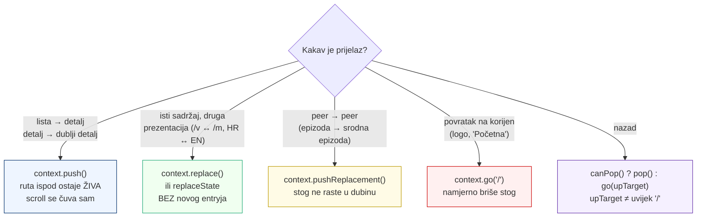

**Zašto `push()` rješava scroll bez koda:** `NoTransitionPage` ima
`maintainState: true` (default). Ruta ispod ostaje u stablu, njezin `Element` i
`State` žive, `ScrollPosition` zadržava `pixels`. Na `pop()` se ista instanca
vraća na ekran — nema `initState`, nema skeletona, nema async čekanja. Scroll
je na 2400 px jer nikad nije ni otišao.

**Cijena i ograda:** stog raste u memoriji. Korisnik koji prolista 20 epizoda
drži 20 živih ekrana. Zato je **`pushReplacement` za peer prijelaze obavezan**,
a ne kozmetika — bez njega je ovo curenje memorije. Predlažem i tvrdu ogradu:

<!-- doc-refs:ignore-start -->
```dart
// zamišljeni helper, lib/router/nav.dart
const kMaxStackDepth = 8;   // preko toga push → pushReplacement
```
<!-- doc-refs:ignore-end -->

**`upTarget` (Android „Up" vs „Back"):** kad `canPop()` vrati `false` (dubok
link, hard refresh), ← ne smije uvijek na `/`. Semantički roditelj:

| Ekran | `upTarget` |
|---|---|
| `/v/:id`, `/m/:id` | `/c/<slug>` ako je kanal razriješen (`_resolveChannelSlug`), inače `/` |
| `/c/:slug` | `/channels` |
| `/p/:slug` | `/channels?prikaz=osobe` |
| `/glasanje/:slug` | `/glasanje` |
| `/account/channels/:uc/**` | `/account/channels` |
| ostalo | `/` |

### 7.2 Redoslijed migracije (da se ne razbije sve odjednom)

<!-- doc-refs:ignore-start -->
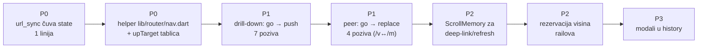
<!-- doc-refs:ignore-end -->

### 7.3 `ScrollMemory` — za slučajeve koje `push()` ne pokriva

`push()` ne pomaže kad ekran **stvarno** mora nastati iznova:
dolazak iz vana na `/v/x` pa ← na `/`, hard refresh, browser Back nakon
zatvaranja taba, `go('/')` s breadcrumba.

Za to treba mali sloj: singleton mapa `location → offset`, upisivanje
debounceano na scroll, čitanje pri montiranju.

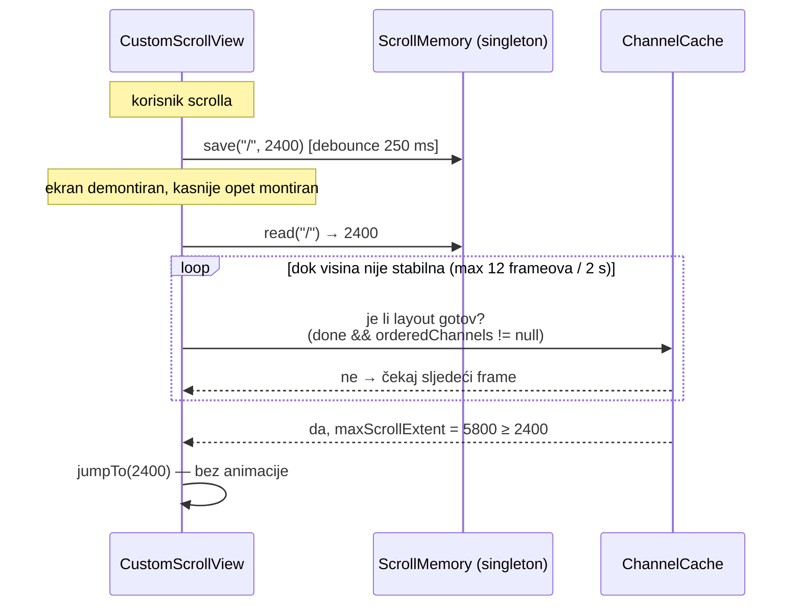

Tri obavezna detalja, inače sloj ne radi:

1. **`jumpTo`, ne `animateTo`.** Animacija na povratku izgleda kao da je
   stranica sama otišla dolje.
2. **Čekaj `maxScrollExtent >= offset`.** Bez toga se offset clampa na visinu
   skeletona (§5.5) i tiho se izgubi. Odustani nakon 2 s i ostavi vrh — bolje
   vrh nego skok u pogrešno mjesto nakon što korisnik već čita.
3. **Ključ mora nositi query.** `/channels` i `/channels?prikaz=osobe` su dva
   različita prikaza iste rute i moraju imati dvije pozicije (isti razlog zbog
   kojeg ruter već ima različit `ValueKey` po prikazu, `app_router.dart:63`).

**Preduvjet za pouzdanost: `_orderedChannels` mora u `ChannelCache`.** Dok je u
`_HomeScreenState`, naslovnica u prvom frameu nakon remounta uvijek nacrta
skeleton, i restoration mora čekati barem dva framea + async čitanje prefa. S
redoslijedom u singletonu naslovnica se u prvom frameu crta **puna**, i
restoration je jedan `jumpTo`.

**Alternativa koju NE predlažem kao prvu:** `restorationScopeId` +
`restorationId` na scrollablima. Flutterov ugrađeni mehanizam radi i preko
reloada, ali traži `RestorationMixin` po ekranu, ima svoje zamke s go_routerom,
i **ne rješava** glavni problem (da `go()` demontira ekran). Vrijedi ga uzeti
poslije, kao dodatak za „preživi hard refresh".

### 7.4 Modali — kad zaslužuju history entry

Pravilo: **modal koji ima vlastiti URL mora biti ruta; modal koji ga nema
ostaje imperativan, ali mora hvatati Back.**

| Modal | Ima URL? | Prijedlog |
|---|---|---|
| Detalj kandidata (`/glasanje/:slug`) | **da** | pretvoriti u `push`anu rutu iznad `/glasanje`; sheet ostaje vizualno isti |
| Search paleta | ne | ostaviti imperativnu; dodati `PopScope` da Back zatvori paletu prije nego dođe do rutera |
| Rotacijski fullscreen | ne | `rotated_fullscreen.dart:23` već namjerno nema `PopScope` jer se ruta popa sama — **na nativeu ispravno**; na webu Back ide ruteru. Dodati web-guard. |
| Founder booking, clip share, auth sheet | ne | `PopScope` |
| Video `endDrawer` (mobitel) | ne | Back treba zatvoriti drawer, ne napustiti epizodu — `PopScope` na `_EpisodeContent` |

Zadnji red je vjerojatno najbolniji na mobitelu: korisnik otvori video u
draweru, hoće ga zatvoriti Backom, i **ispadne iz epizode**.

### 7.5 Što ovo znači za „forsirani rendering naslovnice"

Ne treba ga „odforsirati" — treba ukloniti razlog zbog kojeg naslovnica uopće
nastaje iznova. Nakon §7.1 + §7.3:

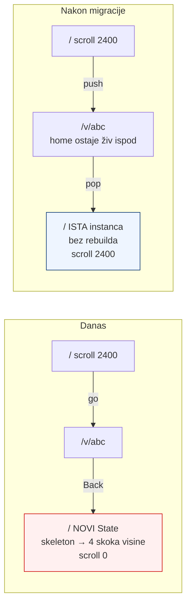

---

## 8. Backlog s procjenom

<!-- doc-refs:ignore-start -->

| # | Zahvat | Prio | Opseg | Rizik | Zašto tim redom |
|---|---|---|---|---|---|
| 1 | `url_sync_web.dart` čuva `history.state` | **P0** | 1 linija | nizak | bloker za `push()` (§5.6); dobitak i bez migracije |
| 2 | `GoRouter.optionURLReflectsImperativeAPIs = true` + mjerenje iz §5.7 | **P0** | 1 linija + 6 koraka provjere | **visok — dira share** | bez toga `push` obara adresnu traku i OG inject |
| 3 | Maknuti `startAt`/`person` iz `ValueKey`-a epizode → `didUpdateWidget` | **P0** | 1 datoteka | srednji | inače svaki push na timestamp remounta player (§5.8) |
| 4 | `lib/router/nav.dart` — helperi + `upTarget` tablica | **P0** | ~120 linija | nizak | bez njega migracija postane 82 ad-hoc odluke |
| 5 | Drill-down `go` → `push` (7 poziva: home→ch/fav/vote/channels, channels→c/p, c→v, p→v, v→p) | **P1** | ~7 datoteka | **srednji** | rješava scroll *i* back logiku odjednom |
| 6 | `pushReplacement` + `kMaxStackDepth` ograda | **P1** | uz #5 | srednji | bez toga #5 je curenje memorije |
| 7 | `/v` ↔ `/m` i HR↔EN na `replace` | **P1** | 4 poziva | nizak | miče lažne Back korake |
| 8 | `ChannelScreen._back` + `EpisodeSimpleScreen` ← na `canPop`/`upTarget` | **P1** | 2 datoteke | nizak | poravnava 2 odstupanja od uzorka koji 8 ekrana već ima |
| 9 | Gumb ← u `EpisodeScreen` app baru kad `canPop()` | **P1** | 1 datoteka | nizak | iOS trenutno nema izlaza osim breadcrumba |
| 10 | `ChannelScreen` poštuje `simpleMode` pri otvaranju epizode | **P1** | 1 linija | nizak | nesuglasje s home-om, nevezano za stog |
| 11 | `_orderedChannels` iz `_HomeScreenState` u `ChannelCache` | **P2** | ~40 linija | srednji | preduvjet da restoration pogodi iz prvog framea |
| 12 | `ScrollMemory` singleton + integracija na `/`, `/channels`, `/c/`, `/p/` | **P2** | ~150 linija | srednji | pokriva deep-link i refresh, koje `push` ne pokriva |
| 13 | Rezervacija visina uvjetnih railova (skeleton iste visine) | **P2** | 5 railova | nizak | bez toga #12 promašuje metu |
| 14 | `PopScope` na modalima + `endDrawer` | **P2** | 6 mjesta | nizak | „Back me izbacio iz epizode" |
| 15 | `/glasanje/:slug` sheet → prava `push`ana ruta | **P3** | ~60 linija | srednji | jedini modal koji ima vlastiti URL |
| 16 | TV: `push`/`pop` umjesto `go('/')` na 3 ekrana | **P3** | 3 datoteke | nizak | najveći dobitak po pritisku tipke, najmanja publika |
| 17 | Horizontalna pozicija railova u `ScrollMemory` | **P3** | ~30 linija | nizak | fino podešavanje nakon #12 |

<!-- doc-refs:ignore-end -->

**Preporučeni prvi rez:** #1 → #2 (s mjerenjem!) → #3 → #4, pa tek onda #5–#9.
Stavke #1–#3 su preduvjeti. Ako mjerenje u #2 padne, cijela `push` grana otpada i
prelazi se na sigurniju varijantu iz §5.7 — `push` samo na rutama bez share
vrijednosti, `go()` + `ScrollMemory` za `/v/`, `/m/`, `/c/`, `/p/`.
#11–#13 tek kad se izmjeri koliko je slučajeva ostalo (deep-link, hard refresh);
moguće je da su rijetki i da ne opravdavaju 150 linija stanja.

**Kritični put:** #2 je jedina stavka s visokim rizikom i jedina koja može
oboriti plan. Napravi je prvu, u zasebnoj grani, i izmjeri **prije** nego se
dirne ijedan `context.go`.

---

## 9. Odbačene alternative

| Ideja | Zašto ne |
|---|---|
| **Ostaviti `go()`, dodati samo `ScrollMemory`** | Riješilo bi scroll, ne bi riješilo back logiku, ne bi riješilo zatvaranje appa na Androidu, i bilo bi trajno u utrci s async visinama railova. Liječi simptom. |
| **`ShellRoute` s `IndexedStack`-om preko svih ekrana** | Drži sve ekrane žive uvijek → memorija raste bez granice i bez pop semantike. `push` s `kMaxStackDepth` daje isto za scroll, uz ogradu. |
| **`restorationScopeId` kao primarno rješenje** | Rješava preživljavanje reloada, ne rješava demontiranje ekrana pri `go()`. Dobar **drugi** korak, loš prvi. |
| **Vlastiti `popstate` listener uz go_router** | Već imamo jedno takvo zaobilaženje (`url_sync` piše u history mimo rutera) i ono je proizvelo bug iz §5.6. Drugo bi bilo gore. |
| **Prijelaz na Navigator 1.0 (`onGenerateRoute`)** | Migracija na go_router je već obavljena (CLAUDE.md, §Routing). Povratak bi razbio deep-linkove, AASA/App Links popise i OG injekciju. |
| **Vratiti se na `push` za *sve*, uključujući breadcrumb „Početna"** | „Početna" je namjerno reset na korijen. Kad bi i ona pushala, stog bi rastao u ciklusima home→epizoda→home→epizoda. |

---

## 10. Reprodukcija

### 10.1 Brojke iz §5 (statika)
```bash
cd /Users/ms/git/domovinatv/domovina.ai
grep -rn "context\.go(" lib --include=*.dart | wc -l      # 82
grep -rn "context\.push(" lib --include=*.dart | wc -l    # 16
grep -rn "PageStorageKey\|restorationId\|restorationScopeId" lib --include=*.dart | wc -l   # 0
grep -rn "showModalBottomSheet\|showDialog\|showGeneralDialog" lib --include=*.dart | wc -l # 18
```

### 10.2 Brisanje history statea (§5.6) — **[M]**
Otvori `https://domovina.ai/v/nOCD7LosCxc`, pa u konzoli:
```js
const before = JSON.stringify(history.state);
history.replaceState(null, '', '/v/nOCD7LosCxc/t/120');   // ono što radi url_sync_web.dart:26
console.log({before, after: history.state});               // after === null
```

### 10.3 Modal vs browser Back (§4.4) — **[H]**
```
1. otvori https://domovina.ai/
2. Cmd+K (search paleta)
3. browserov Back
   očekivano ako je hipoteza točna: URL se promijeni, paleta ostane otvorena
```

### 10.4 Zatvaranje appa na Androidu (§4.3) — **[H]**
```bash
adb shell am start -a android.intent.action.VIEW -d "https://domovina.ai/"
# tapni bilo koju epizodu, pa:
adb shell input keyevent 4
adb shell dumpsys activity activities | grep -m1 mResumedActivity
```

### 10.5 Scroll reset (§4.1)
Nije skriptabilno kroz DOM — canvaskit ne izlaže scroll poziciju
(`document.querySelectorAll('flt-semantics')` na naslovnici vraća 16 čvorova,
bez kartica railova; **[M]** 4.9.2026.). Provjerava se ručno: scroll na dno
naslovnice → tap epizode → Back.

---

## 11. Testovi koje treba dodati uz migraciju

Bez ovih je regresija nevidljiva do sljedeće ručne provjere.

<!-- doc-refs:ignore-start -->

| Test | Što čuva |
|---|---|
| `test/nav_contract_test.dart` — `pumpWidget` s ruterom, tap na rail karticu, provjera `canPop() == true` | da drill-down stvarno pusha |
| isti test, `pop()` pa provjera da je `HomeScreen` `State` **ista instanca** (`GlobalKey` ili `identityHashCode`) | da se scroll čuva razlogom, ne slučajno |
| `/v` ↔ `/m` toggle → dubina stoga nepromijenjena | da prebacivanje prikaza ne gura entry |
| `upTarget` tablica kao čista funkcija + unit testovi | da ← s duboko linkane epizode ide na kanal, ne na `/` |
| lint/grep vrata: `context.go('/')` dopušten samo u `nav.dart`, breadcrumbu i error stanjima | da se 82 poziva ne vrate kroz nove ekrane |

<!-- doc-refs:ignore-end -->

---

## 12. Sažetak u tri rečenice

Scroll se ne vraća zato što se naslovnica **uništi** na svakoj navigaciji, a ne
zato što nedostaje kod za pamćenje pozicije. Back nije logičan zato što
aplikacija nema stog, a in-app „nazad" gura novi history entry umjesto da popa
postojeći. Oboje se rješava istim zahvatom — `push()` na drill-down
prijelazima — koji prvo traži jednoredni popravak u `url_sync_web.dart`, jer
on trenutno briše baš onaj history state u koji bi se taj stog serijalizirao.
