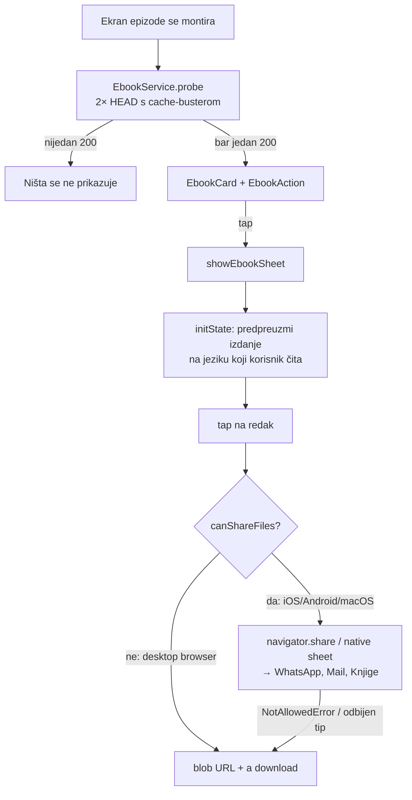

# E-knjiga (EPUB) na frontendu — od CDN datoteke do WhatsAppa

**Datum:** 15.9.2026. · **Verzija:** v2.0.152 · **Commit:** `433e455`

Pipeline je knjigu počeo raditi 25.8.2026. (`fetch.domovina.tv`, KORAK 9.8) i od
tada je uredno uploadao na CDN. Frontend je nije znao prikazati, pa je EPUB za
svaku obrađenu epizodu ležao nedosežan — 2,5 MB po epizodi koje nitko nije mogao
otvoriti. `fetch.domovina.tv/docs/ebook_epub_pipeline.md` §8 to je i pisao kao
otvorenu stavku („Frontend je zasad ne zna prikazati").

Ovaj dokument bilježi ono što se ne vidi iz diffa.

## 1. Što je na CDN-u, izmjereno

```bash
curl -sI -H "Origin: https://domovina.ai" \
  https://cdn.domovina.ai/data/pNSblshqEuU/book.epub
```

| polje | vrijednost |
|---|---|
| `content-type` | `application/epub+zip` |
| `content-length` | 2 638 696 (2,6 MB) |
| `cache-control` | `public, max-age=31536000, immutable` |
| `access-control-allow-origin` | `*` |

`book.en.epub` je 15.9.2026. bio **404 na svim provjerenim epizodama**
(`pNSblshqEuU`, `h_6vqQEL2uc`) — englesko izdanje je u pipeline ušlo tog istog
dana (`41f893f` u fetch repou), pa knjige generirane prije njega imaju samo
hrvatsko. Zato UI ne smije pretpostaviti par HR/EN: nudi točno ona izdanja koja
je probe našao, i sam se proširi kad EN stigne.

CORS `*` je bio uvjet za cijelu ideju: bez njega `package:http` na webu ne može
povući bajtove, a `navigator.share` traži `File` objekt — ne URL.

## 2. Tok



Probe je **izvan** `EpisodeData.load`. Knjiga je dodatak, a ne uvjet da se
epizoda prikaže; da je u `Future.wait` s ostalih 17 poziva, produžila bi kritični
put svakog otvaranja epizode za dva HEAD-a zbog ponude koju većina korisnika
nikad ne otvori.

## 3. Četiri zamke

**3.1 Gesta na iOS-u istekne prije nego 2,6 MB stigne.** `navigator.share` mora
biti pozvan unutar korisnikove geste. Ako se u tapu prvo čeka `fetch`, WebKit
share odbije s `NotAllowedError` — knjiga se povuče, a sheet ne otvori. Zato
`_EbookSheet.initState` pokrene preuzimanje čim se sheet **otvori** (što je već
bila gesta), a tap kasnije zatekne bajtove u `EbookService._bytes`. Preuzimanje
se i tako mora dogoditi; jedino je pomaknuto jednu gestu ranije.

**3.2 CDN cachira 404 četiri sata.** Ista zamka koju `videoH264ProbeUrl` već
nosi. Knjiga nastaje NAKON članka, englesko izdanje NAKON prijevoda — probe bez
cache-bustera koji jednom uhvati 404 drži knjigu skrivenom do kraja tog prozora.
Probe zato ide na `?v=<5-min bucket>`, a preuzimanje na čisti (immutable) URL.

**3.3 `share_plus` bi na desktopu isporučio `data:` URL.** Njegov web fallback
(`_download`) radi `Uri.dataFromBytes` — 2,6 MB postane ~3,5 MB base64 URL, što
browseri znaju tiho odbiti. Naš `file_share_web.dart` zato radi vlastiti ispad:
`Blob` → `URL.createObjectURL` → `<a download>` s pravim imenom datoteke, uz
`revokeObjectURL` odgođen minutu (Safari prekine preuzimanje ako se URL oslobodi
odmah).

**3.4 Ikona se sudarala s Magisteriumom.** `Icons.menu_book_outlined` je u
jednostavnom prikazu već oznaka Magisterium taba, pa je app bar akcija
`Icons.auto_stories_outlined`.

## 4. Odbačene alternative

| Alternativa | Zašto ne |
|---|---|
| `has_ebook` zastavica u channel listingu (predloženo u pipeline docu) | Zastavice lažu u oba smjera (CLAUDE.md, „pipeline zastavice ≠ stvarnost"). Probe je jedan HEAD i uvijek govori istinu. |
| `share_plus` i na webu | Njegov fallback je `data:` URL (§3.3), a share put je ionako 20 redaka `package:web` koda. Paket ostaje samo za native. |
| Meta paket bez provjere `--wasm` | Ista zamka kao `passkeys` (`ua_client_hints` → `dart:html`). `share_plus` 13.3.0 ovisi o `web: ^1.1.1`; build s `--wasm` provjeren prije commita. |
| Preuzimanje tek na tap | §3.1. |
| Samo gumb u app baru | Nitko ne zna da knjiga postoji dok je ne vidi objašnjenu. Kartica iza sažetka nosi objašnjenje, ikona je prečac. |
| Otvaranje CDN URL-a u novom tabu (`openUrl`) | Datoteka bi se zvala `book.epub` za svaku epizodu, a na mobitelu ne bi bilo share sheeta — dakle ni WhatsAppa, što je bio cijeli povod. |

## 5. Što je provjereno, a što nije

Provjereno 15.9.2026.:

- `flutter analyze` čist; `flutter test` 365 prolaznih (uz dva otprije crvena,
  `widget_test` i `home_feed_test` — vidi `.nightly/test-baseline.txt`).
- `flutter build web --release --wasm` prolazi sa `share_plus` u grafu.
- Lokalni release-wasm build u Braveu na `/v/pNSblshqEuU`: kartica i sheet se
  crtaju na 430 dp, sheet piše „EPUB · 2,6 MB", nudi samo hrvatsko izdanje.
- U konzoli te stranice: `fetch` knjige s CDN-a vraća 200 i 2 638 696 B, a
  `navigator.canShare({files:[File]})` je `true` (Chromium/macOS).
- Nakon deploya: `main.dart.wasm` na produkciji sadrži `Ponesi epizodu` i
  `book.epub`; `version.json` = 2.0.152.

**Nije provjereno:**

- **Stvarno slanje u WhatsApp s iPhonea** — traži fizički uređaj. To je jedini
  dio lanca koji nije potvrđen mjerenjem.
- Native share sheet (iOS/Android aplikacija) — kod je pisan, ali build ide tek
  kroz nightly.
- Ponašanje kad EN izdanje postoji (nijedna epizoda ga još nema).

## 6. Otvoreno

- **Backfill knjiga.** Katalog ima ~2 500 epizoda s člankom; knjige su generirane
  samo za dio. Dok backfill ne prođe, većina epizoda neće imati ponudu.
  Ograda diska i CDN plan: `fetch.domovina.tv/docs/ebook_epub_pipeline.md` §8.
- **Englesko izdanje.** Prvo izdanje `book.en.epub` još nije na CDN-u ni za jednu
  epizodu.
- **`epubcheck` nikad pokrenut** (pipeline doc §8) — bitno ako knjiga ikad ide u
  Apple Books / Play Books.

## Vezani dokumenti

- `fetch.domovina.tv/docs/ebook_epub_pipeline.md` — kako knjiga nastaje
- `fetch.domovina.tv/docs/2026-09-15-linkovi-kroz-domovina-ai.md` — zašto svi
  klikabilni linkovi u knjizi vode na domovina.ai
- `docs/2026-09-15-engleski-share-i-og-slike.md` — isti dan, ista tema jezika u
  dijeljenom sadržaju
