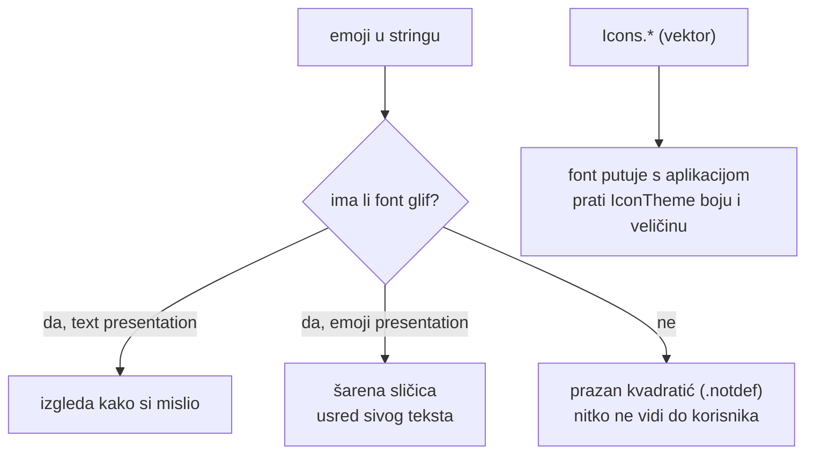

# Emoji u sučelju — inventura, odluka o icon setu i tripwire

*15. rujna 2026.*

Povod je bilo pitanje: *„jesmo li već pričali o tome da bi trebali sve emojije
zamijeniti Lucide ikonama da aplikacija izgleda više premium — emoji odmah
izgleda kao da je AI generirano?"*

Odgovor na prvi dio je **ne** — Lucide se u repou nikad nije spomenuo. Odgovor na
drugi je **da, ali djelomično i bez zapisanog pravila**: emoji su se iz sučelja
micali tri puta u godinu dana, svaki put ad hoc i svaki put iz **tehničkog**
razloga, pa estetsko pravilo nikad nije bilo formulirano.

## 1. Što je inventura zapravo našla

Sken preko punog Unicode raspona (emoji blokovi `U+1F000–1FAFF`, Misc Symbols,
Dingbats, geometrijski oblici, regional indicators, VS16) nad
`lib/ web/ assets/ android/ ios/ macos/ test/ scripts/`:

```bash
python3 scripts/scan-emoji.py --summary          # stanje danas
git worktree add -q --detach /tmp/pre 93e0393    # stanje prije čišćenja
cp scripts/scan-emoji.py /tmp/pre/scripts/ && (cd /tmp/pre && python3 scripts/scan-emoji.py --summary)
```

| | prije (`93e0393`) | poslije |
|---|---|---|
| ukupno pogodaka | **869** u 184 datoteke | 858 u 185 |
| od toga `→` i ostale strelice | 688 | 700 |
| ostali piktografi | **181** | 158 |
| **vidljivo korisniku** | **4** | **0** |

Strelica je *porasla* jer ih ovaj dokument i novi kod imaju u vlastitim
komentarima. To je uredu — tripwire iz §7 gleda samo ono što korisnik vidi.

Pouka koja se lako promaši: **gruba brojka iz grepa nije opseg posla.** Prvi
sken je izgledao kao trodnevni refaktor; stvarni posao su bila četiri stringa i
jedan widget. Komentari tipa ``/// `1` = 👍, `-1` = 👎`` dokumentiraju stvarnost
i njihovo brisanje bi dokumentaciju pogoršalo, ne popravilo.

**Zamka u samom mjerenju**: prvi, ad hoc sken je dao 921 jer je brojao i
`ios/Pods/` — RevenueCat SDK ima emojije u vlastitom sourceu. `scan-emoji.py`
zato ide preko `git ls-files`, ne `rglob`: brojka o tuđem vendoriranom kodu ne
govori ništa o našem.

Četiri vidljiva:

| Emoji | Gdje | Što je napravljeno |
|---|---|---|
| `🙏` ×2 | Pinka zahvala nakon uplate, `SupportEpisodePanel` | obrisan — iznad već stoji `Icons.check_circle` 40 dp |
| `⚙` ×2 | `mediaYouTubeQualityHint` | obrisan — riječ „postavkama" nosi značenje |
| `◀ ▶ ▲ ▼` | TV legende tipki + navigacija u čitaču | `Icons.chevron_*` / `Icons.expand_*` preko `TvKeyHint` |
| `⏱` ×3 | OG naslovi u `web/_worker.js` | obrisan — `10:00 · Naslov` je čitljiviji |

## 2. Odbačeno: Lucide (i svaki drugi icon set)

Ikone su danas **Material Icons** — 182 različite, 456 pozivnih mjesta
(`grep -rhoE 'Icons\.[a-z_0-9]+' lib/ | wc -l`). `cupertino_icons` je u
`pubspec.yaml` samo kao Flutterov template default.

Migracija na Lucide je razmotrena i **odbačena**, jer rješava problem koji nije
postojao:

- Emoji i icon set su **dvije odvojene odluke**. Nakon čišćenja emojija u
  sučelju ih više nema — a Material ikona nije ono što je odavalo „AI
  generated" dojam.
- Cijena je 456 pozivnih mjesta plus dodatni font asset.
- Material se na iOS-u uklapa u platformni izgled; Lucide ima jedinstven,
  ali stran ton.

Ako se odluka ikad revidira, nužan prvi korak je side-by-side na **jednom**
ekranu (`home_app_bar` + `playback_controls`), ne globalni sweep.

## 3. Zašto emoji nije samo estetsko pitanje

Glif ovisi o fontu koji ga na kraju dobije, i to pada tiho:



Tri izmjerena slučaja u ovom repou, sva tri po desnoj grani:

1. **`🇭🇷` — Windows Chrome** nema glif za par regional-indicator znakova.
   Zato je `HrvatskaZastavica` `CustomPaint` (8.8.2026., glasanje).
2. **`⏱` — Pillow/Helvetica** nema taj glyph; renderiran je kao `.notdef` na
   **65 759** `og-t-*.jpg` slika. Otkriveno tek 15.9.2026., vidi
   [2026-09-15-engleski-share-i-og-slike.md](2026-09-15-engleski-share-i-og-slike.md).
   Zato se ikone u OG kompozitima **crtaju** (`draw_clock_icon`).
3. **`⭐` na TV kartici** — odbijeno korisničkim feedbackom 28.5.2026., zamijenjeno
   „MAG 92" monogramom (`tv_episode_card.dart`).

Uz njih i `15939ff` (28.5.2026.): `🇭🇷`/`🇬🇧` iz language toggle chipa →
čisti HR/EN tekst.

## 4. Granica: piktograf vs. ime tipke

Ovo je jedina stvarno sporna kategorija, i pravilo je:

> Zamjenjuje se znak koji **prikazuje pojam**. Ne zamjenjuje se znak koji
> **imenuje fizičku tipku.**

- Zamijenjeno: `◀ ▶` u `_NavLabel` (pokazuju *na sadržaj* — prethodni/sljedeći
  odlomak) i `◀ ▶ ▲ ▼` u legendama (jer su bili upisani u prevedeni string).
- Zadržano: `⌘` (U+2318, otisnut na Apple tipki) i `↑ ↓ ← → ↵` u legendi
  tipkovnice u `search_overlay`. Ikona bi ih učinila manje jasnima, ne više.

## 5. `TvKeyHint` — tipka je sklop, ne tekst

`lib/screens/tv/widgets/tv_key_hint.dart`. Legenda se slaže:

```dart
TvKeyHint(entries: [
  TvHintEntry(const ['OK'], l.tvHintPlayPause),
  TvHintEntry(const [Icons.chevron_left, Icons.chevron_right], l.tvHintSections),
  TvHintEntry(const [Icons.expand_more], 'Magisterium'),
  TvHintEntry(const ['BACK'], l.tvHintVideo),
])
```

Posljedica koja je važnija od izgleda: **u ARB idu samo riječi.** Prije je
`"tvReaderControlsHint": "OK = sviraj/pauza   ◀ ▶ = odlomci   ▼ = Magisterium
BACK = video"` značilo da svaki novi jezik iznova prepisuje glifove — i prva
greška u prijepisu ostaje nevidljiva dok je netko ne ugleda na televizoru.
Tri stara ključa zamijenjena s pet atomarnih (`tvHintPlayPause`,
`tvHintSections`, `tvHintVideo`, `tvHintRead`, `tvHintExit`).

## 6. Popravak nađen usput

`home_screen.dart:239-241` veže **oba** modifikatora (`meta:` i `control:`), a
chip u app baru je bezuvjetno pisao `⌘K`. Windows i Linux korisnici su čitali
uputu za tipku koju nemaju. Sada `switch (theme.platform)` → `Ctrl K`.

## 7. Tripwire

`test/no_emoji_in_strings_test.dart` skenira ARB **vrijednosti** (ne
`@key.description` — to čita prevoditelj, ne korisnik) i Dart literale u `lib/`
(komentari izuzeti). Dopušteni su znakovi iz §4.

Provjereno da nije prazan test:

```
$ sed -i '' 's/"Hvala na podršci"/"Hvala na podršci 🙏"/' lib/l10n/app_hr.arb
$ flutter test test/no_emoji_in_strings_test.dart
  commonThanksForSupport: 🙏  →  "Hvala na podršci 🙏"
```

## 8. Provjera na produkciji

v2.0.153. Promjena OG naslova se vidi tek nakon purgea, i provjerava se **dvaput**
zbog `Vary: Origin` (dva cache zapisa):

```bash
curl -s "https://domovina.ai/v/H-p2Hl6x7I0/t/600" | grep -o 'og:title[^>]*'
curl -s -H "Origin: https://domovina.ai" "https://domovina.ai/v/H-p2Hl6x7I0/t/600" | grep -o 'og:title[^>]*'
# oba: "10:00 · Božji poziv i nepokolebljiva vjera u projekt Laudato TV-a"

node scripts/test-social-tags.mjs   # 171/171
```

## Otvoreno

- **TV ekrani nisu viđeni na uređaju.** `TvKeyHint` je `Wrap` s `runSpacing: 4`;
  na engleskom je legenda šira i može se prelomiti u dva reda u footeru čitača.
  Provjeriti na EON-u ili `@EON_TV_API31` prije nego se TV build pošalje.
- `_NavLabel` je iz `Text` prešao u `Row` s `Flexible` — ellipsis je zadržan, ali
  ponašanje pri vrlo dugom podnaslovu odlomka nije mjereno na 960×540 dp.

## Vezani dokumenti

- [2026-09-15-engleski-share-i-og-slike.md](2026-09-15-engleski-share-i-og-slike.md) — `.notdef` na 65 759 OG slika
- [android-tv.md](android-tv.md), [android-tv-emulator.md](android-tv-emulator.md) — gdje se TV promjene testiraju
- [i18n-and-localization.md](i18n-and-localization.md) — pravila za ARB ključeve
