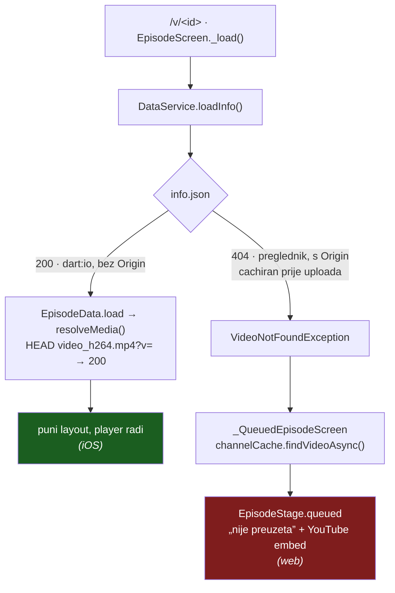

# Cachiran 404 na CDN-u: zašto je web vidio „epizoda nije preuzeta", a iOS ju je puštao

*19. 9. 2026. — incident + popravak. Vezani dokumenti:
`docs/2026-08-26-episode-processing-status.md` (faze obrade),
`docs/web-delivery-and-rendering.md` (isporuka i cache),
`CLAUDE.md` § „Cachiran 404 na CDN-u".*

## Simptom

`https://domovina.ai/v/aue1GuuMsbA` je u pregledniku prikazivao status-karticu
„This episode hasn’t been downloaded yet" i ponudu YouTube embeda. **Ista
epizoda u iOS aplikaciji se normalno reproducirala** — isti CDN, isti podaci,
isti Dart izvor. Isto za `/v/70uXR4DDZiE`.

## Što je zavaralo

Sve ručne provjere su prolazile:

| provjera | ishod | zašto je lagala |
|---|---|---|
| `curl` na `video_h264.mp4`, `article.json`, `summary.json`, `diarized.srt` | 200 | nije se provjerio `info.json`, jedini **obavezan** asset |
| `curl -I` (HEAD) s `Origin` zaglavljem | 200 | HEAD je **zaseban** cache zapis od GET-a |
| `curl` bez `Origin` zaglavlja | 200 | to je zapis koji čita **native**, ne preglednik |
| objavljeni `main.dart.js` sadrži `video_h264` | da | build JEST bio aktualan (v2.0.153 = HEAD) |
| localStorage / IndexedDB / Cache API / service worker | prazno | kvar nije bio na klijentu |

Mrežni log je pokazivao samo `channels/data/*.json` i sličicu, pa je izgledalo
da se `resolveMedia()` **ne izvršava**. Izvršavao se — ekran je samo otišao
drugom granom prije njega (vidi dijagram).

## Uzrok

`cdn.domovina.ai` šalje `Vary: Origin`. To znači **dva odvojena cache zapisa po
URL-u**: preglednik šalje `Origin` na svaki cross-origin fetch, `dart:io`
klijent (iOS/Android/macOS) ga ne šalje. HEAD je treći zapis.

Per-epizoda datoteke su `immutable` i dohvaćaju se **bez** cache-bustera. Ako
netko otvori `/v/<id>` **prije** nego pipeline uploada datoteke, Cloudflare u
„Origin" zapis upiše **404** — i ondje ostane, jer taj URL više nikad ne pita
ponovno.

Izmjereno:

```
GET data/aue1GuuMsbA/info.json                     -> 200, 151 070 B
GET data/aue1GuuMsbA/info.json -H "Origin: …"      -> 404
                                   cf-cache-status: HIT
                                   age: 20972      (cache-control: max-age=3600)
```

`age` 20 972 s (5 h 49 min) uz `max-age=3600` — CF ga je držao daleko preko
deklariranog TTL-a.



Grana desno objašnjava i „nema zahtjeva pod `data/`": `_QueuedEpisodeScreen`
pretražuje kanalske listinge da nađe naslov, pa mrežni log izgleda kao da
epizoda nikad nije ni tražena.

## Opseg

Skripta je uzela 360 epizoda iz 49 kanala i usporedila `info.json` sa i bez
`Origin` zaglavlja:

```
OTROVANO (Origin=404, bez Origina=200): 2
zdravo (oba 200):                       358
```

Obje pogođene su bile među najsvježijima — dakle **točno one koje se klikću iz
raila „Upravo stiglo"**, jer se one i otvaraju dok pipeline još radi. Kvar je
samoodržavajući: što je epizoda popularnija u prvim minutama, to je vjerojatnije
otrovana.

## Popravak 1 — produkcija (purge)

**Purge po golom URL-u `Vary` varijantu NE dira**, iako vrati `success:true`:

```bash
# vrati success:true, a s Originom i dalje 404
--data '{"files":["https://cdn.domovina.ai/data/<id>/info.json"]}'

# ovo doista očisti otrovani zapis
--data '{"files":[{"url":"https://cdn.domovina.ai/data/<id>/info.json",
                   "headers":{"Origin":"https://domovina.ai"}}]}'
```

## Popravak 2 — kod (da se ne ponovi)

`DataService._get`: na 404 ponovi zahtjev s `CdnConfig.bustCache(url)` (isti
5-minutni bucket kao postojeće probe). To je **druga cache adresa** pa ide na
origin i zaobilazi otrovani zapis. Tek drugi 404 znači da datoteke nema.

```dart
Future<http.Response> _get(String url) async {
  final first = await http.get(Uri.parse(url));
  if (first.statusCode != 404) return first;
  return http.get(Uri.parse(CdnConfig.bustCache(url)));
}
```

Cijena, mjereno na objavljenoj epizodi: od 16 per-epizoda dohvata 11 su 404 po
6,3 kB, svi paralelni → **+11 zahtjeva i +69 kB samo na assetima koji ionako
nedostaju**, nula na uspješnom dohvatu. Potvrđeno u produkciji nakon deploya:
5 assetov koji vraćaju 200 nemaju retry, svih 11 koji vraćaju 404 imaju točno
jedan `?v=…`.

### Odbačene alternative

| alternativa | zašto ne |
|---|---|
| bezuvjetni cache-buster na sve per-epizoda datoteke | gubi `immutable` browser cache za ~139 kB JSON-a po epizodi, a na 404 putanji ne dobiva ništa |
| retry samo za `info.json` | rupa je najčešći slučaj: `info.json` sleti prvi u pipelineu pa je zdrav, a `article.json` (korak 9) otrovan |
| gate po `pipeline` zastavicama iz listinga | traži `channelCache` prije svakog dohvata → serijalizira hladno učitavanje; zastavice ionako lažu u oba smjera |
| produljiti bucket na 1 h umjesto retrya | ne popravlja, samo skraćuje prozor |

## Zamka u isporuci popravka

`scripts/deploy.sh` ne prosljeđuje `--branch`, pa wrangler granu čita iz gita:
deploy s `feat/podcast-core` je završio kao **Preview**
(`feat-podcast-core.domovina-ai.pages.dev`), a `domovina.ai` je ostao na
v2.0.153. Skriptina verifikacija (`https://domovina.ai/ -> HTTP 200`) to ne
uhvati jer je 200 istinit i kad ništa nije objavljeno. Popravak je zato portan
na `main` (druge putanje: `lib/services/…` umjesto
`packages/podcast_core/lib/services/…`) i deployan odande.

Provjera koja stvarno mjeri:

```bash
curl -s https://domovina.ai/main.dart.js | grep -o 'DOMOVINA v[0-9.]*' | head -1
wrangler pages deployment list --project-name=domovina-ai | head -3   # Production + main
```

## Otvoreno

- `scripts/deploy.sh` bi mogao **odbiti** deploy s ne-`main` grane (ili tražiti
  `--preview`), i verificirati **verziju** umjesto HTTP statusa. Nije napravljeno.
- Popravak je na `main` (živo) i na `feat/podcast-core` (e884115). Pri spajanju
  grane bit će trivijalan konflikt na `appVersion`.
- Uzrok otrovanja je i dalje na CDN strani: `upload_to_r2.js` ne purga 404
  zapise nakon uploada nove epizode. Tripwire koji bi to hvatao ne postoji.
- Pipeline (`fetch.domovina.tv`) namjerno nije diran.
