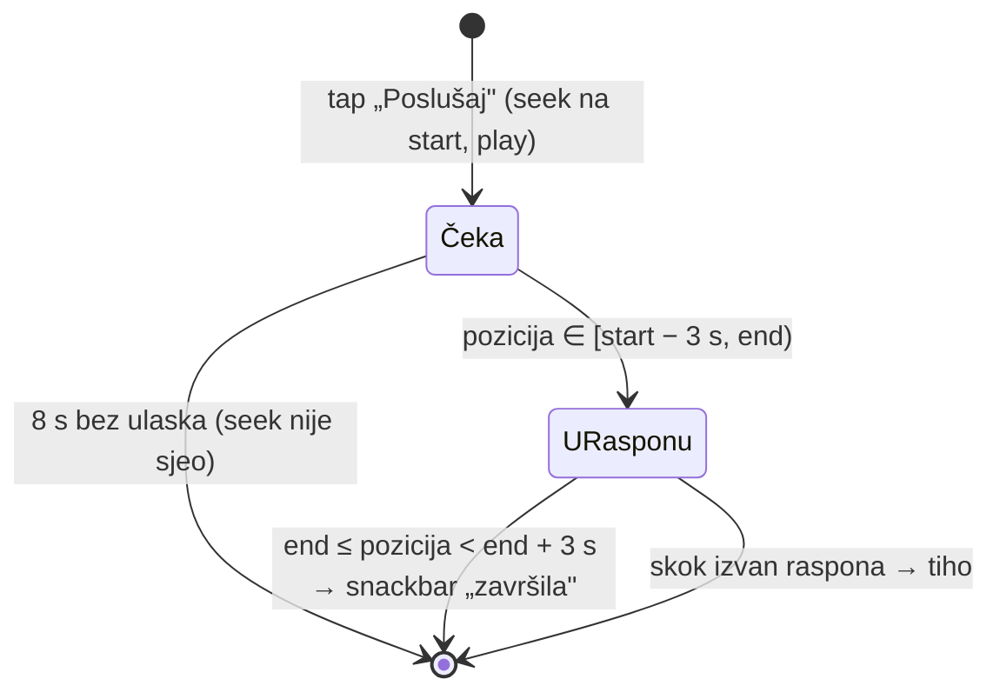

# Sponzori u snimci na frontendu — `SponsorsInVideo`

**Datum:** 24.09.2026. · **Stanje:** LIVE od v2.0.155, sadašnji oblik v2.0.158
**Producent:** `fetch.domovina.tv/detect_sponsors.js` (KORAK 9.85), ugovor u
`fetch.domovina.tv/docs/2026-09-23-sponzori-u-snimci.md`

## Što je napravljeno

| površina | gdje | što nudi |
|---|---|---|
| sekcija „Uz podršku" | tijelo `/v/:id`, iza sažetka i e-knjige | kartica po imenovanom sponzoru: uloga, opis (3 retka + „više"), web/Instagram, „Poslušaj" / „Zahvala na 57:48" |
| traka u playeru | `VideoPanel` iznad „Poglavlja" (desni stupac; ladica na < 900 px) | sponzor u svom retku (ime · uloga), ispod njega „Poslušaj · 0:45" / „Rubrika · 3:49" |
| oznaka u članku | iznad naslova sekcije u koju PADA POČETAK raspona | „Poruka sponzora na 1:39:23" + gumb „e-Duhovne vježbe · 0:45" |
| seek bar | `_ChapterMarkerPainter` | tanka traka na pouzdanim rasponima |

Kod: `lib/models/sponsors_in_video.dart`, `lib/widgets/sponsors_in_video_section.dart`,
`DataService.loadSponsorsInVideo`, `_listenSponsor` / `_checkSponsorClip` u
`lib/screens/episode_screen.dart`. Testovi: `test/sponsors_in_video_test.dart` (24).

## Kako „Poslušaj" prati kraj poruke

Player se NE zaustavlja. Na kraju raspona iskoči snackbar „Poruka sponzora je
završila" i epizoda svira dalje (odluka korisnika 24.9.2026., v2.0.157 — pauza
je djelovala kao da je player stao).



Stanje „Čeka" postoji jer position stream odmah nakon tapa još javlja STARU
poziciju: korisnik na 2:00:00 bi bez njega odmah dobio „završila".
Dok je isječak aktivan, članak se ne auto-skrola za playerom (inače bi odvukao
stranicu ispod kartice na koju je korisnik upravo kliknuo).

## Odluke i odbačene alternative

**Sidro oznake u članku je vrijeme, ne tekst.** Izmjereno nad `article.json`:

| epizoda | sponzor u JSON-u | članak piše | u sekciji |
|---|---|---|---|
| `aue1GuuMsbA` | e-Duhovne vježbe, spot 1:39:23 | „sponzorskog oglasa za aplikaciju e-Duhovne vježbe" | 1:43:05 (oglas je u 1:37:15) |
| `aue1GuuMsbA` | Cafe Brazil | „Caffe Brazil" | 58:20 |
| `NwLeHiokKSU` | HiPP, Plazma | „HIP-a i Plasme" | 2:45 |
| `B8xUC-nIVkM` | Plazma, rubrika 1:00:01 | „Plazma pauze", „suhu Plazmu" | 1:00:00 |

Isticanje imena u tekstu (kao `person_needle_highlight.dart` za osobe) zato je
**odgođeno** dok pipeline ne doda `aliases` — padežni prefix-match hvata
„Plazmu", ali ne „Caffe" ni „HIP-a", a fuzzy pravila u klijentu vode u lažne
oznake. Oznaka je prigušena, ne crvena kao pill za osobu: stoji uvijek, a
crvena posvuda po tekstu čitala bi se kao reklama.

**Traka u playeru je nastala iz prijave.** Na `/v/aue1GuuMsbA/t/8` gumb se
„nigdje nije vidio": sekcija je ~1500 px ispod vrha, a na mobitelu se ladica s
playerom sama otvori preko svega. Prva verzija trake slagala je sponzore bez
raspona u naslov („Uz podršku: Cafe Brazil") pa se gumb „e-Duhovne vježbe" čitao
kao Cafe Brazilov — sada je jedan sponzor = jedan redak.

**Dohvat:** kroz `DataService._get` (jedan retry s cache-busterom zbog
`Vary: Origin` 404 zapisa — `docs/2026-09-19-cachiran-404-vary-origin.md`),
izvan `EpisodeData.load`, bez memorije preko sesije (pipeline datoteku prepisuje
i purgea). 404 / greška / nečitljiv JSON → ništa se ne prikazuje.

## Zamke koje su koštale vremena

- **Otvaranje endDrawera pauzira web video.** Montiranje `Video` widgeta
  premjesti `<video>` u DOM-u (HTML spec: pauza). Na 390 px je seek sjeo na
  5963 s, a poruka nije krenula. `_revealPlayer` zato ponovi `play()` nakon
  300/900 ms — isti obrazac kao `_resumeAfterTransition` za fullscreen.
- **`package:http` bez `charset` čita latin1.** Test s `MockClient` bez
  `content-type: …; charset=utf-8` dao je „vježbe". CDN charset šalje
  (provjereno curlom), pa je kvar bio samo u mocku — ali mock mora nositi header.
- **`dart format` na `episode_screen.dart`** preformatira ~550 redaka tuđeg koda;
  formatiraj samo nove datoteke.

## Provjera

```bash
python3 scripts/verify-sponsor-listen.py                        # 1400 px, produkcija
python3 scripts/verify-sponsor-listen.py --width 390 --height 844
```

Izmjereno 24.9.2026. na v2.0.157/158, obje širine: `first ≈ [5964.9, false]`,
log `message ended at 6008s`, zatim 6009 → 6015 s i `paused == false`; konzola
bez grešaka. Zašto Playwright, a ne Claude-in-Chrome: u pozadinskom prozoru
Flutter ne crta frameove pa klik i scroll nemaju vidljiv efekt.

## Otvoreno

- [ ] `aliases` u `sponsors_in_video.json` (fetch repo) → isticanje imena u tekstu.
- [ ] `/m/` (jednostavni prikaz) nema ni sekciju ni traku.
- [ ] Rubrika nema svoj naziv u podacima („Grickaj i biraj uz Plazmu" je u
      `info.json.chapters`), pa gumb piše generičko „Rubrika".
- [ ] TV (`lib/screens/tv/`) nije pokriven.

## Vezani dokumenti

- `fetch.domovina.tv/docs/2026-09-23-sponzori-u-snimci.md` — detektor, ugovor
- `docs/2026-09-19-cachiran-404-vary-origin.md` — zašto dohvat ide kroz `_get`
- `CLAUDE.md` → „Sponzori u snimci — `SponsorsInVideo`"
