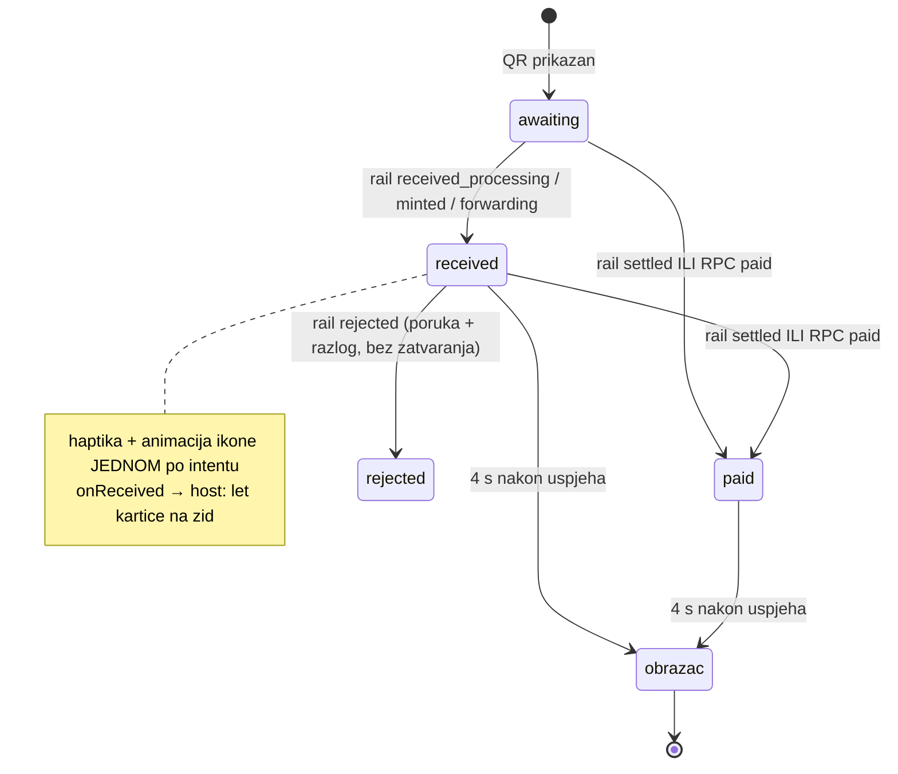

# Pinka SEPA: uspjeh na zaprimanju, let kartice, OG slike na zidu (28.9.2026.)

Verzije v2.0.159 → v2.0.165. Kod: `lib/pinka_sdk/src/widgets/pinka_contribute_panel.dart`,
`lib/pinka_sdk/src/screens/pinka_campaign_screen.dart`,
`lib/pinka_sdk/src/widgets/pinka_wall_list.dart`,
`lib/pinka_sdk/src/util/pinka_intent_status.dart`. Testovi:
`test/pinka_contribute_panel_test.dart`, `test/pinka_wall_list_test.dart`.

## Zašto: mint zna trajati satima

Rail `GET https://mpt.domovina.ai/api/intents/<sid>` vraća `status.stage`
(awaiting_payment | received_processing | minted | forwarding | settled |
rejected | expired). Izmjereno na 49 produkcijskih uplata (pay.domovina.ai):

| slučaj | od uplate do `settled` |
|---|---|
| `received_processing` | ista sekunda kao SEPA Instant u Moneriumu |
| poznati IBAN uplatitelja | ~9 s |
| **prva** uplata s novog IBAN-a (Monerium ručna provjera) | 1 min – 8 h |
| odbijeno | 0 / 49 (ali `rejected` postoji) |

RPC `contribution_status = 'paid'` (→ `onPaid`) dolazi tek na `settled`. Prije
v2.0.159 panel je čekao baš njega, a `waitForPaid` je odustajao nakon
100 × 3 s = 5 min — prva uplata s novog računa ostavljala je panel zamrznut na QR-u.

## Tok panela

- Nakon zatvaranja uspjeha praćenje namire **ne staje**: rail polling
  (`_railTimers[gen]`) i `waitForPaid(maxAttempts: null)` žive dok živi widget.
  RPC `paid` → `onPaid`; kasno `rejected` → `onRejected` + poruka u obrascu.
- `_intentGen` odvaja *prikaz* od intenta, ne gasi pozadinske petlje.
- Napomena ispod uspjeha: `review_expected` (rail, od 28.9.) `true` ili
  `seconds_in_stage > 60` → istaknuta napomena o provjeri prve uplate; `false`
  (poznati uplatitelj) → bez nje. Namjerno **bez** „obično nekoliko sekundi"
  (korisnikova odluka: nikakvo obećanje trajanja), iako checkout na
  pay.domovina.ai to piše za `review_expected=false`.
- `rejected_reason` je u `status.rejected_reason`, ne na vrhu tijela.

**Zamka (prijava 28.9.):** uspjeh je stajao na „Korak 4/5" sa spinnerom iako je
kartica već bila na zidu — RPC `paid` gasi rail polling, a kompaktni stepper je
ostao na zadnjem rail stanju. Stepper se sada prikazuje samo u fazi `received`.

## Let kartice i optimistični unos

Let je postojao, ali na `onPaid`; 12-sekundni `_refresh` zida bi karticu
redovito ubacio prije toga, pa je izgledala kao da se „samo pojavi". Sada:
`onReceived(PinkaDonation)` → puna kartica (ime, iznos, poruka, preview) leti
1,3 s iz panela na vrh zida, sleti, ubaci se kao **optimistični unos**
(`_optimistic[contributionId]`) i zasvijetli. `public_contributions.id` =
contribution id, pa ga pravi red tiho zamijeni; `onPaid` ne leti ponovno
(`_flown`). Optimistični unos živi samo u sesiji donatora (vidi „Otvoreno").

## OG slike na zidu i u obrascu

- Crta se SAMO `link_preview.image_cached` (naš storage, backend: domovina-api,
  vidi „Vezani dokumenti"). `PinkaLinkPreview`
  prihvaća `image_cached` samo s `https://api.domovina.ai`.
- Raspored po omjeru (`image_width/height`): ≥ 1,2 : 1 → ISPOD izvora i naslova,
  puna širina, stvarni omjer (klamp 1,2–3,0); portret/kvadrat → LIJEVO od teksta.
  Bez dimenzija → OG standard 1,91 : 1. Visina pločice računa se iz širine
  stupca (`pinkaWallPreviewTileExtent`), višak ide između naslova i slike.
  Prva verzija (kvadrat 64 px lijevo za sve) je odbačena — za 1200×630 nema smisla.
- Obrazac: OG preview dok donator tipka (polje „Poveznica", inače prvi
  `https://` URL u poruci; debounce 700 ms) preko `pinka-link-preview`.
  URL bez sheme u poruci namjerno ne okida preview — ni webhook ga ne prepoznaje.
- Desni stupac 400 px (bio 360), QR prati širinu panela 180–260 px (bio 200).

## Provjera u browseru — zamka

Brave tab kojim upravlja claude-in-chrome bio je `document.visibilityState ===
'hidden'`: Flutter ne crta nove frameove, pa su slike izgledale kao sive plohe
iako su se iz istog taba dohvaćale (200). Vizualnu provjeru raditi Playwrightom
(`channel='chrome'`, headed) — skripte s mockanim railom/RPC-om/`pinka-contribute`
su bile u scratchpadu; obrazac: `page.route('**/api/intents/**')`,
`'**/functions/v1/pinka-contribute'`, `'**/rest/v1/rpc/contribution_status'`.

## Otvoreno

- Let nije provjeren na mobitelu (zid je ispod panela → cilj leta je donji rub
  ekrana).
- Novi tok nije prošao pravu SEPA uplatu nakon v2.0.163 (samo mock).
- „U obradi" na zidu za druge posjetitelje / nakon reloada traži obradu
  `payment.received` u `pinka-webhook` (domovina-api) — nije napravljeno.
- `PinkaService.waitForPaid` (`lib/services/pinka_service.dart`, koristi ga
  `lib/widgets/support_episode_panel.dart`) i dalje odustaje nakon 3 min
  (60 × 3 s) — isti kvar za prvu uplatu s novog IBAN-a, drugi tok.

## Vezani dokumenti

- `docs/pinka-grid-wall.md`
- `docs/plans/2026-08-08-zid-podrske-redizajn.md`
<!-- doc-refs:ignore-start -->
- domovina-api `docs/2026-09-28-pinka-og-image-cache.md` (drugi repo)
<!-- doc-refs:ignore-end -->
