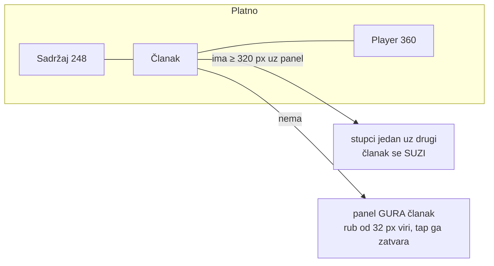

# Epizoda na uskom ekranu — tri stupca umjesto drawera (5.10.2026.)

v2.0.166, commit `114b41c`. Kod: `lib/widgets/episode_panel_canvas.dart`,
`lib/screens/episode_screen.dart`, titlovi u `lib/widgets/episode_video.dart`.
Testovi: `test/episode_panel_canvas_test.dart` (12),
`test/subtitle_fit_test.dart` (3).

## Zašto

Do v2.0.165 je `/v/:id` ispod 1100 px imao sadržaj u Scaffold `drawer`u i
player u `endDrawer`u — oba PREKO članka. Posljedice:

- iPhone u landscapeu (750–932 px) nikad nije vidio članak i player
  istovremeno, iako ima mjesta (prijava korisnika 5.10.).
- zatvaranje endDrawera je demontiralo `Video` → media_kit pauza → resume
  hack (`_onEndDrawerChanged`); otvaranje je premještalo `<video>` u DOM-u →
  pauza → `_revealPlayer` s `play()` na 300/900 ms.
- između 900 i 1100 px player je bio overlay iako je TOC već bio stupac.

## Model: vodoravno platno

- Paneli su **uvijek montirani**, izvan vidljivog dijela platna
  (`Stack` + `Clip.hardEdge`). `<video>` zato ne putuje po DOM-u. Zatvoren panel
  je u `ExcludeSemantics` + `ExcludeFocus` + `TickerMode(false)`.
- Prije guranja panel se suzi do `minRightWidth` 280 / `minLeftWidth` 200.
  Bez toga je iPhone 13 (750 px, prag tada 420) dobio izguran, odrezan članak.
  Sada: 750 → 390 | 360, 667 (SE) → 320 | 347, 844 → 484 | 360, 390 → guranje.
- Platno je u stablu UVIJEK, i bez panela (desktop) — inače bi pojava
  `_videoReady` premjestila tijelo u novo podstablo i članak bi izgubio scroll.
- Panel koji nestane (iPad zarotiran preko 1100 px) resetira stanje u
  `didUpdateWidget` bez ticka i javi `onChanged(null)` post-frame; inače
  `PopScope` guta Back.
- Povlačenje bira panel po MJESTU početka (rubni pojas / panel / rub centra),
  ne po smjeru prvog pomaka.

## Sidro čitanja

Kad se članak suzi/proširi, tekst se prelomi i apsolutni offset pokazuje drugdje.
Platno javlja `onCenterReflowStart` (sinkrono iz listenera kontrolera — layout
nove širine dolazi tek sljedeći frame, pa se stari raspored još da izmjeriti),
`onCenterReflow` (post-frame, svaki frame) i `onCenterReflowEnd`.
Ekran pamti `(sekcija, udio)` na liniji 30 % visine viewporta i vraća ga
`jumpTo`-m (uz `_scrollLock`, da ne izgleda kao korisnikov scroll).

Zamke koje je review našao:

- **Skok na sekciju tijekom reflowa** (tap u Sadržaju zatvara panel, članak se
  širi DOK skok traje): sidro je vraćalo staro mjesto. Sad `_scrollToSection`
  bilježi `_sectionJumpTs`, a 500 ms nakon skoka `_onCenterReflow` umjesto
  sidra ponovno pinna CILJNU sekciju.
- `jumpTo` prekida korisnikov drag/fling → restore odustaje kad je
  `position.isScrollingNotifier.value`.

## Landscape na mobitelu (imerzivno)

`_isPhoneLandscape`: platforma iOS/Android (na webu OS preglednika) **i**
`width > height && shortestSide < 600`. Uvjet platforme je obavezan: bez njega
nizak desktop prozor (1000×560, devtools dolje) gubi header.

- App bar je `floating + snap` umjesto `pinned`; `_scrollToSection` računa s
  punom visinom (+46 px drugog reda kad je stupac < 600) da naslov nikad ne
  završi ispod trake.
- Footer se skuplja `Align(heightFactor)` u `ClipRect`, ostaje MONTIRAN
  (zamjena praznim widgetom je pri svakoj promjeni smjera ponovno pokretala
  `PinkaSupportBar` RPC) i skriven nosi donji inset — Scaffold tijelu skida
  donji padding čim `bottomNavigationBar != null`, pa ga `SafeArea` tijela ne
  može čuvati.
- Dok je `PlayerMute.autoplayBlocked`, footer se NE skriva (gumb „Uključi zvuk"
  je jedan od tri obavezna izlaza, CLAUDE.md „Muted autoplay").
- App bar bira dva reda po širini STUPCA (`SliverLayoutBuilder` +
  `MediaQuery` override za breadcrumb), ne ekrana.

## Titlovi — puni tekst, nikad ellipsis

Bilo: `maxLines: 3` + `TextOverflow.ellipsis`. Korisnik: ljudi čitaju dok
slušaju, tekst je važniji od slike koju prekrije. Sad titl raste prema gore od
istog sidra; tek kad ne stane, font se smanjuje (donja granica 9 px).
Mjerenje mora koristiti `DefaultTextStyle` (Inter) i `textScaler` — bez njih
broj redaka ne odgovara nacrtanom. Rezultat je cachiran po (tekst, okvir) jer
position stream fira ~5×/s.

## Provjera i zamke okruženja

- Playwright iPhone emulacija (`devices["iPhone 13 landscape"]`) NIJE dovoljna:
  `navigator.platform` ostaje `MacIntel` pa Flutter vidi macOS. Treba
  `add_init_script("Object.defineProperty(navigator,'platform',{get:()=>'iPhone'})")`.
- `dart format` u repou koristi drugi stil od onog kojim je
  `episode_screen.dart` pisan i preformatira cijeli fajl (diff 360 → 912).
  Formatiraj kopiju izvan repoa ili samo nove fajlove.

## Otvoreno (nije provjereno na uređaju)

- **Android, pozadinsko slušanje**: `Video` je sad uvijek montiran (prije:
  samo dok je drawer otvoren). Odlazak u pozadinu ovisi o postojećem
  force-`play()` 150 ms nakon pauze. Uklonjen je close/reopen drawera na
  `paused`/`resumed`.
- `TickerMode(false)` u zatvorenom panelu — utjecaj na media_kit kontrole na
  nativeu neprovjeren.
- Sidro ne reagira na rotaciju (samo na otvaranje/zatvaranje panela).
- Zatvoren panel se i dalje crta izvan ekrana (texture/platform view) — trošak
  nije izmjeren.

## Vezani dokumenti

- `docs/2026-09-24-sponzori-u-snimci-frontend.md` — `_revealPlayer` i pauza
  pri otvaranju drawera (pozadina pravila koje je ovaj rad ublažio)
- `docs/web-delivery-and-rendering.md`
