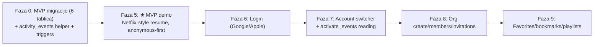
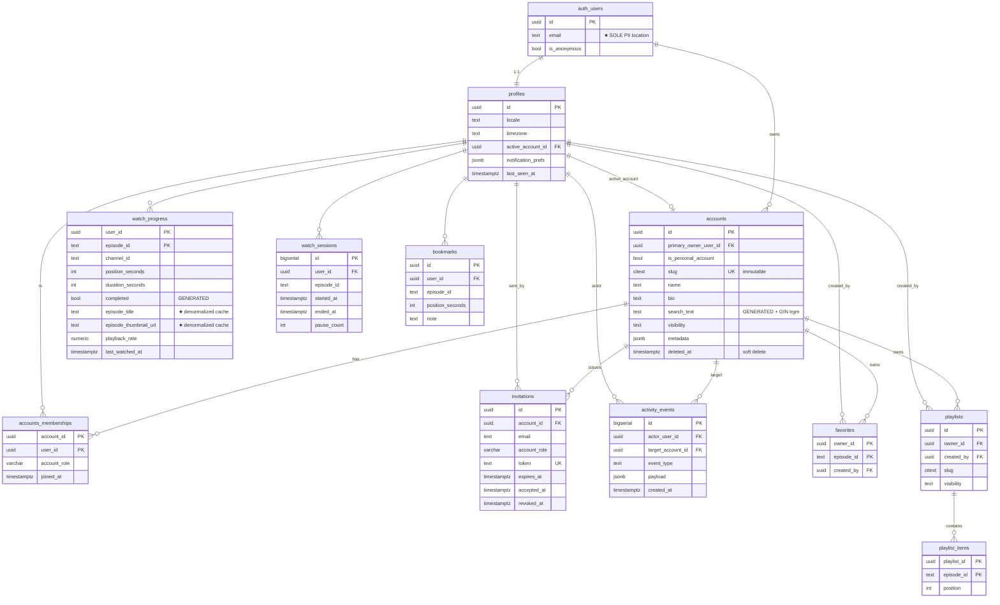
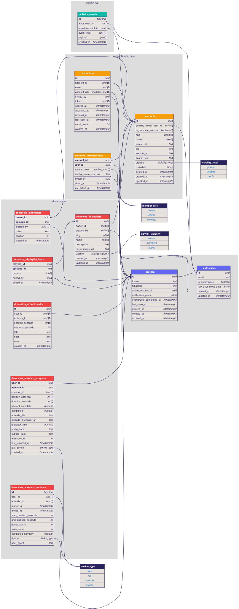
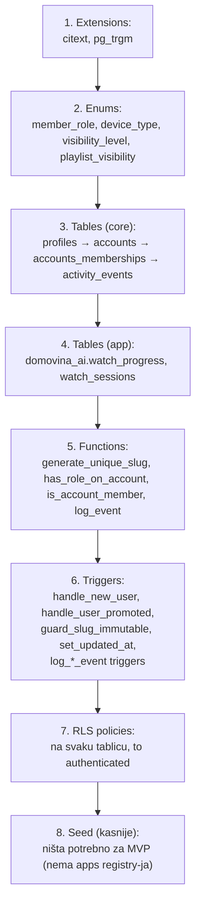

# Auth & Database Plan — DOMOVINA.ai (v3)

**Verzija:** v3 — arhitekturalna refinacija nakon "step back" review-a
**Datum:** 2026-05-20
**Predak:** [`auth-and-database-plan.md`](./auth-and-database-plan.md) (v2)

> Ovaj dokument **dopunjava** v2 plan, ne zamjenjuje. Sve što ovdje nije eksplicitno spomenuto (RLS policy pattern, security definer helperi, sequence dijagrami, Coolify deployment, indeksi za nepromijenjene tablice) ostaje **identično kao u v2**. Čitati ovaj v3 + selektivno gledati v2 za detalje koji nisu mijenjali.

---

## Sažetak — što se mijenja v2 → v3

| Promjena | Tip | Motivacija |
|---|---|---|
| Drop `apps` + `app_installations` | -2 tablice | Schema sama označava produkt; speculativno |
| Drop `role_permissions` | -1 tablica | 3 hardcoded role ne zahtijevaju decoupling |
| Drop `profiles.email`, `profiles.is_anonymous` mirror | -2 stupca | PII separation — sve PII samo u `auth.users` |
| Drop `playlists.forked_from_id` | -1 stupac | Speculativno — dodati kad bude fork UI |
| Add `activity_events` tablica | +1 tablica | Event sourcing seam za notifications/audit/feed |
| Add `watch_progress.episode_title`, `episode_thumbnail_url` | +2 stupca | Skida sekundarni CDN fetch za "Continue watching" |
| Add `accounts.search_text` GENERATED + GIN trgm | +1 stupac, +1 index | Instant fuzzy typeahead |
| Add 3 explicit architectural principles | doc | PII / slug / soft-delete jasnoća |

**Neto:** −6 stavki, +4 dodatka, +3 doc principa. Schema je manja i ciljanija, ali strateški pametnija.

---

## Architectural principles (novo u v3)

Ova tri principa idu **na vrh** doc-a kao odluka koja vodi sve daljnje odluke.

### Princip 1: PII isključivo u `auth.users`

> Sva osobna identifikacijska informacija (email, OAuth identifiers, telefon, raw user metadata iz providera) **lives only in `auth.users`**. Naše tablice drže FK i non-PII podatke (locale, timezone, role, preferences).

**Posljedice:**
- `profiles.email` i `profiles.is_anonymous` mirror se brišu
- Queries koriste `auth.email()` ili `(auth.jwt() ->> 'email')` umjesto `profiles.email`
- "Delete my data" (GDPR) = `DELETE FROM auth.users WHERE id = ?` → `ON DELETE CASCADE` riješi ostalo
- Jedan audit point, jedna lokacija za PII

**Izuzeci:** `invitations.email` je nužno (pozvani user možda još ne postoji u `auth.users`).

### Princip 2: Slug je immutable u v1

> `accounts.slug` se postavlja na create, **nikad ne mijenja** u v1. Nema redirect logike, nema slug history tablice.

**Posljedice:**
- Manje engineering surface (svaki resolver, share link, URL trivijalno radi)
- Kad korisnik želi promijeniti slug → traži support / kreira novi org
- Slug history (GitHub-style mutable s redirektima) možemo dodati u v2 ako značajan use case nastane

**Tehnička provedba:** trigger `BEFORE UPDATE` na `accounts` koji odbija promjenu `slug` (raise exception). Sigurnosna brava ne ovisi o klijent kodu.

### Princip 3: Soft-delete samo na `accounts`

> `deleted_at` postoji samo na `accounts` (i opcionalno `profiles`). Sve ostale tablice su hard-delete preko `ON DELETE CASCADE`.

**Posljedice:**
- Konzistentna mental model — nema "neke tablice imaju, neke nemaju"
- "What happened" history pitanja → odgovara `activity_events`, ne soft-delete redovi
- Cleanup cron može povremeno hard-delete soft-deleted accounte starije od 30 dana
- `RLS policies` na svim tablicama uključuju `... AND a.deleted_at IS NULL` filter

---

## Što se uklanja iz v2

### `apps` + `app_installations`

**Razlog drop:** Postgres schema (`domovina_ai`, `domovina_tv`, …) **je** boundary između produkata. Postojanje reda u `domovina_ai.watch_progress` već znači "user koristi taj app". Eksplicitan registar je redundantan.

Ako jednog dana zatreba per-app license / per-app settings → tablice se dodaju s direktnim use case-om.

### `role_permissions` tablica + `app_permissions` enum

**Razlog drop:** decoupling role→permission je MVP overhead. 3 hardcoded role-a (`owner` > `admin` > `member`) se prirodno nose helper funkcijom:

```sql
create function has_role_on_account(target uuid, min_role member_role default 'member')
returns boolean
language sql security definer set search_path = '' stable as $$
  select exists (
    select 1 from public.accounts_memberships m
    where m.account_id = target
      and m.user_id = (select auth.uid())
      and (
        min_role = 'member'
        or (min_role = 'admin' and m.account_role in ('admin','owner'))
        or (min_role = 'owner' and m.account_role = 'owner')
      )
  );
$$;
```

Custom roles ili per-org permission overrides → dodati `role_permissions` tablicu **kad** se konkretni use case pojavi.

### `profiles.email`, `profiles.is_anonymous`

**Razlog drop:** Princip 1 (PII). Vidi gore.

### `playlists.forked_from_id`

**Razlog drop:** premature feature. "Fork playlist" UI ne postoji u planu. Dodati stupac u trenutku kad UI počne raditi.

---

## Što se dodaje u v3

### Tablica `activity_events` — append-only stream

```sql
create table public.activity_events (
  id bigserial primary key,
  actor_user_id uuid references auth.users(id) on delete set null,
  target_account_id uuid references public.accounts(id) on delete cascade,
  event_type text not null,
  payload jsonb,
  created_at timestamptz default now()
);

create index ix_activity_account_recent on public.activity_events(target_account_id, created_at desc);
create index ix_activity_actor on public.activity_events(actor_user_id, created_at desc);
create index ix_activity_type on public.activity_events(event_type, created_at desc);
```

**Event types (početni vocabulary):**

| `event_type` | Kad se emit-a | Payload primjeri |
|---|---|---|
| `org.created` | INSERT u accounts (is_personal=false) | `{slug, name}` |
| `member.invited` | INSERT u invitations | `{email, role}` |
| `member.invite_accepted` | UPDATE invitations.accepted_at | `{invitation_id, role}` |
| `member.joined` | INSERT u accounts_memberships | `{user_id, role}` |
| `member.role_changed` | UPDATE accounts_memberships.account_role | `{user_id, old_role, new_role}` |
| `member.removed` | DELETE iz accounts_memberships | `{user_id, role}` |
| `account.deleted` | UPDATE accounts.deleted_at | `{reason?}` |
| `episode.completed` | watch_progress.completed flip na true | `{episode_id, duration}` |

**Helper funkcija:**

```sql
create function public.log_event(
  p_event_type text,
  p_target_account_id uuid,
  p_payload jsonb default '{}'::jsonb
) returns void
language sql security definer set search_path = '' as $$
  insert into public.activity_events (actor_user_id, target_account_id, event_type, payload)
  values ((select auth.uid()), p_target_account_id, p_event_type, p_payload);
$$;
```

**RLS:**

```sql
alter table public.activity_events enable row level security;

create policy "activity_read" on public.activity_events
  for select to authenticated
  using (
    actor_user_id = (select auth.uid())
    or public.is_account_member(target_account_id)
  );

-- Write samo preko log_event() (security definer), nema direct insert policy
```

**Use cases (lazy — pišemo eventove od dana 1, čitamo kad UI postoji):**
1. **Notifications feed** — "Ana joined your org" iz `event_type IN (...)` filtra
2. **Audit log** — kompletna povijest sensitive promjena
3. **What's new** — per-account aktivnost
4. **Recommendations** — anonimizirana watch completion data
5. **Forensika** — "kad je promijenjen role?" → query povijesti

**Strategija implementacije:** od dana 1 pisati eventove iz triggera (membership changes, role changes) i helper funkcija (invite flow). UI za čitanje implementirati kasnije kad notification feature dođe na red. Backlog događaja je gotov kad UI bude potreban.

### Stupci u `watch_progress` — denormalizirano caching

```sql
alter table domovina_ai.watch_progress add column episode_title text;
alter table domovina_ai.watch_progress add column episode_thumbnail_url text;
```

**Razlog:** "Continue watching" carousel mora prikazati title + thumbnail. Bez ovih stupaca → drugi async fetch po episode_id na CDN. S njima → single query iz Postgres-a.

**Sync strategija:** klijent piše title i thumbnail u sklopu istog upsert tick-a (već ima ih iz CDN data koje već fetched za reprodukciju).

**Stale risk:** ako se na CDN-u rename-a title, naš cache je stale do sljedećeg gledanja. Prihvatljivo — UI smije pokazati lagano stari title.

### Stupac `accounts.search_text` GENERATED + GIN trigram

```sql
alter table public.accounts add column search_text text generated always as (
  lower(name || ' ' || slug::text || ' ' || coalesce(bio, ''))
) stored;

create extension if not exists pg_trgm;

create index ix_accounts_search on public.accounts using gin (search_text gin_trgm_ops);
```

**Use case:** typeahead "find user/org by name" — fuzzy match na name, slug, bio kombinirano.

```sql
-- Brz fuzzy search:
select * from public.accounts
where search_text % 'domovin'   -- pg_trgm similarity operator
  and deleted_at is null
order by similarity(search_text, 'domovin') desc
limit 10;
```

GIN trigram index → sub-millisekundna pretraga čak na milijun redaka.

---

## Updated MVP scope (faze 0–5)

Sa svim v3 izmjenama, **MVP traži samo 6 tablica** (smanjeno od ~13 u v2 finalu):

```
public.profiles              (minimal: id, locale, timezone, active_account_id, prefs, last_seen_at)
public.accounts              (s search_text GENERATED, deleted_at)
public.accounts_memberships
public.activity_events       (lazy fill — eventovi se pišu od dana 1)

domovina_ai.watch_progress   (s episode_title/thumbnail denormalizirano)
domovina_ai.watch_sessions
```

Sve ostalo (`invitations`, `bookmarks`, `favorites`, `playlists`, `playlist_items`) ulazi u **kasnijim fazama** (6–10) kad UI feature traži tablicu.



Activity events se **emit-aju od dana 1** (Faza 0), ali notifications UI se čita **u Fazi 7+** kad postoji koncept "what changed since I was here".

---

## Unified ERD v3 (mermaid)



**Što je izgubljeno iz dijagrama vs v2:**
- ❌ `apps`, `app_installations`
- ❌ `role_permissions`
- ❌ `profiles.email`, `profiles.is_anonymous`
- ❌ `playlists.forked_from_id`

**Što je dobiveno:**
- ✅ `activity_events` (centralni event stream)
- ✅ `accounts.search_text` (GENERATED — vidi se u dijagramu)
- ✅ `watch_progress.episode_title/thumbnail_url`

---

## Rendered DBML diagram (v3)

Generirano iz `docs/schema-v3.dbml` preko `@softwaretechnik/dbml-renderer` (auto-render preko CI-a, vidi `.github/workflows/render-dbml-v3.yml`).



Za polished dark-theme dbdiagram.io render: paste `docs/schema-v3.dbml` na [dbdiagram.io](https://dbdiagram.io/d).

---

## Migration order (eksplicitno)

V3 dodaje formalni redoslijed za prvu migraciju:



Faze 6+ proširuju s `invitations`, `bookmarks`, `favorites`, `playlists`, `playlist_items` — svaka u zasebnoj migraciji.

---

## Što ostaje identično kao u v2

Sve sljedeće stvari iz [v2 doc-a](./auth-and-database-plan.md) ostaju **netaknute** i čitaju se odande:

- Tech stack obrazloženje (Supabase, self-hosted Coolify, Kong gateway na `api.domovina.ai`)
- Cloudflare/CDN razdvajanje (Pages + cdn.domovina.ai)
- Multi-app arhitektura (schema per product, public za identity)
- Anonymous sign-in flow + linkIdentity sequence diagrams
- Sve sequence diagrams (signup, login, org create, invite, leave, cross-device sync)
- RLS best practices pattern (`(select auth.uid())`, `to authenticated`, security definer s `set search_path = ''`)
- Index strategija za nepromijenjene tablice
- Coolify deploy checklist
- 2026 best-practice reference (Makerkit, Supabase docs)

V3 je **incrementalna refinacija** v2 — ne replacement.

---

## Otvorena pitanja prije implementacije v3

1. **`profiles.email` mirror drop** — confirmaj da je OK koristiti `auth.email()` u svim user-facing queries umjesto `profiles.email`. Ako neki frontend pattern jako traži email JOIN-iv u user data → diskusija.
2. **`activity_events` retention** — koliko dugo držimo eventove? Prijedlog: hot (zadnja 24 mj) + cold (arhivirani u Storage kao gzip JSON). Razmotriti u Fazi 7.
3. **Slug immutable disclaimer** — UI mora jasno reći "slug nije promjenjiv" na create dialogu. Ili zadržavamo opciju mutable (s manjim engineering cost-om jer trenutno nemamo redirekta)?
4. **`accounts.search_text` privacy** — GIN trigram indeksira `bio` polje. Ako `visibility='private'`, search ne smije vratiti rezultat za neč non-member-a. RLS to već riješi, ali konfirmiram principem.
