# Auth & Database Plan — DOMOVINA.ai

Plan uvođenja korisničkih računa i per-user state-a (watch progress, favoriti, bookmarkovi) u trenutno 100% anonimnu Flutter aplikaciju.

**Status:** prijedlog, čeka review prije implementacije.
**Datum:** 2026-05-17

---

## Ciljevi

1. **Resume capability** — korisnik nastavlja gledanje točno gdje je stao, na bilo kojem uređaju.
2. **Watch history** — povijest svega što je gledao, s timestampovima.
3. **Cross-device sync** — pozicija reprodukcije se sinkronizira u realtime između uređaja.
4. **Anonymous-first** — korisnik može koristiti app bez logina; tek kasnije se može povezati Google/Apple račun bez gubitka podataka.
5. **Favoriti i bookmarkovi** — spremanje epizoda i timestamp markera.

**Ne-cilj (faza 1):** komentari, social graph, recommendations engine. Schema mora dopustiti ekstenziju, ali se ne implementira sad.

---

## Tech stack odluka

**Self-hosted Supabase na Coolify serveru.**

### Zašto Supabase

- **Postgres** — pravi SQL, joini i agregati su besplatni. Za "continue watching" / "recently watched" / per-episode statistiku ovo je presudno; NoSQL baze ovo komplikuju.
- **Row Level Security (RLS)** — policy se piše jednom u SQL-u, klijent direktno radi `upsert`/`select` bez custom backenda. Sigurnosna granica je u DB, ne u app kodu.
- **Anonymous sign-in + linkIdentity** — user dobije UUID na prvi load i odmah se trackira. Kasnije pri loginu (Google/Apple) `user_id` ostaje isti → sav povijesni progress se zadrži. Točno match za trenutni "100% anonimno" UX.
- **Realtime** — Postgres logical replication preko WebSocketa, subscribe na promjene `watch_progress` reda za live cross-device sync.
- **Flutter SDK** (`supabase_flutter`) — first-class podrška, identično ponašanje na web/iOS/Android/macOS.
- **Self-hostable** — cijeli stack je open source docker-compose.

### Zašto self-hosted preko Coolify

- Coolify server već postoji za druge projekte → nema dodatnog troška.
- Supabase ima službeni Coolify template (one-click): Postgres + GoTrue (auth) + PostgREST (REST API) + Realtime + Storage + Studio (admin UI).
- Traefik reverse proxy + SSL automatski preko Coolify-a.
- Postgres backupi su built-in u Coolify (scheduled na S3/B2/lokalno).
- Nema vendor lock-ina; ako bude potrebno migrirati na cloud (Supabase Cloud, Neon, Render) — to je samo `pg_dump` + restore.

### Što ostaje na Cloudflare-u

Cloudflare Pages i dalje hosta Flutter web build. CDN (`cdn.domovina.ai`) i dalje servira sve per-episode statičke JSON-ove. Supabase pokriva **isključivo per-user state** — sve drugo ostaje statički.

---

## Arhitektura visoke razine

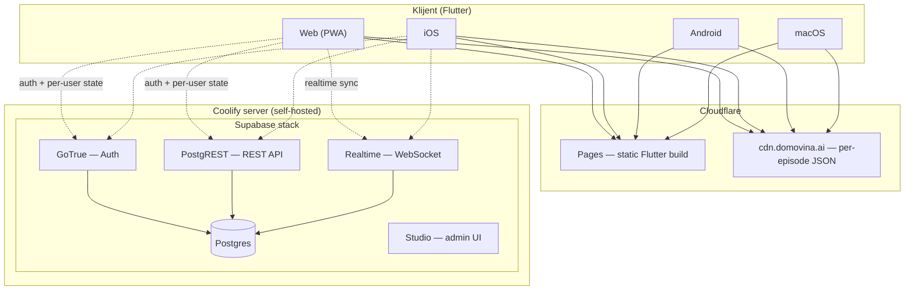

---

## ERD — Entity Relationship Diagram

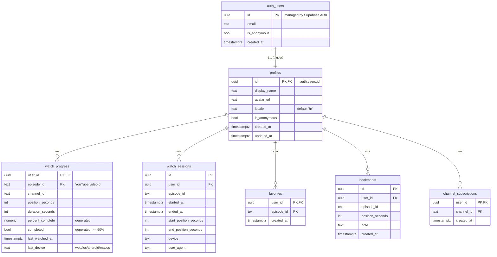

---

## Tablice — detaljno

### 1. `profiles`

Public profil korisnika, 1:1 sa `auth.users`. Auto-popunjen triggerom na signup.

| Stupac | Tip | Opis |
|--------|-----|------|
| `id` | `uuid` PK | Reference na `auth.users.id` |
| `display_name` | `text` | Ime korisnika (od OAuth providera ili manualno) |
| `avatar_url` | `text` | Avatar slika (od OAuth providera) |
| `locale` | `text` | Default `'hr'` |
| `is_anonymous` | `bool` | `true` dok korisnik nije linkao identitet |
| `created_at`, `updated_at` | `timestamptz` | Standard |

---

### 2. `watch_progress` ★

**Najvažnija tablica.** Jedan red po `(user, episode)`. Upsert na svaki tick (~5s) tokom reprodukcije.

| Stupac | Tip | Opis |
|--------|-----|------|
| `user_id` | `uuid` PK | FK na `profiles.id` |
| `episode_id` | `text` PK | YouTube videoId (canonical key u cijelom appu) |
| `channel_id` | `text` | Za grupiranje po kanalu |
| `position_seconds` | `int` | Trenutna pozicija u sekundama |
| `duration_seconds` | `int` | Ukupno trajanje epizode |
| `percent_complete` | `numeric` | **Generated column** — `100 * position / duration` |
| `completed` | `bool` | **Generated column** — `true` kad `percent >= 90%` |
| `last_watched_at` | `timestamptz` | Zadnji upsert (za "continue watching" sort) |
| `last_device` | `text` | `web` / `ios` / `android` / `macos` |

**Indeksi:**

```sql
PRIMARY KEY (user_id, episode_id)              -- O(1) lookup "gdje sam u X"
INDEX (user_id, last_watched_at DESC)          -- "Continue watching" carousel
INDEX (user_id, completed, last_watched_at DESC) -- razdvajanje aktivnih vs gledanih
```

---

### 3. `watch_sessions`

**Append-only log.** Insert na start/pause/end reprodukcije (NE svaki tick). Za analitiku, ne za UI resume.

| Stupac | Tip | Opis |
|--------|-----|------|
| `id` | `uuid` PK | `gen_random_uuid()` |
| `user_id` | `uuid` FK | |
| `episode_id` | `text` | |
| `started_at` | `timestamptz` | |
| `ended_at` | `timestamptz` | Null dok je sesija aktivna |
| `start_position_seconds` | `int` | Gdje je počeo gledati |
| `end_position_seconds` | `int` | Gdje je stao |
| `device` | `text` | |
| `user_agent` | `text` | |

**Indeksi:**

```sql
INDEX (user_id, started_at DESC)    -- per-user povijest
INDEX (episode_id, started_at DESC) -- "koliko ljudi je gledalo X"
```

---

### 4. `favorites`

| Stupac | Tip | Opis |
|--------|-----|------|
| `user_id` | `uuid` PK,FK | |
| `episode_id` | `text` PK | |
| `created_at` | `timestamptz` | |

---

### 5. `bookmarks`

Korisnikovi privatni markeri u epizodi (slično postojećoj public share-clip arhitekturi, ali per-user).

| Stupac | Tip | Opis |
|--------|-----|------|
| `id` | `uuid` PK | |
| `user_id` | `uuid` FK | |
| `episode_id` | `text` | |
| `position_seconds` | `int` | |
| `note` | `text` | Optional bilješka |
| `created_at` | `timestamptz` | |

---

### 6. `channel_subscriptions` (faza 2)

| Stupac | Tip | Opis |
|--------|-----|------|
| `user_id` | `uuid` PK,FK | |
| `channel_id` | `text` PK | |
| `created_at` | `timestamptz` | |

---

## Dvije razine trackinga — namjerno odvojene

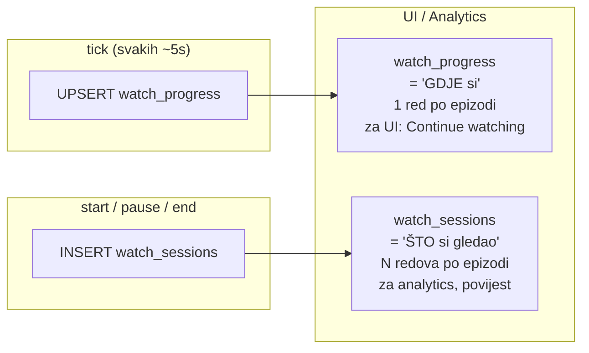

**Zašto razdvojeno:** ako sve guraš u `watch_sessions`, "continue watching" upit traži `DISTINCT ON` + agregat po milijun redaka. `watch_progress` je denormalizirano "trenutno stanje" — UI dohvaća jedan indeks-scan, O(broj epizoda po korisniku).

---

## User flow — od prvog posjeta do cross-device sync

### Stanja korisnika

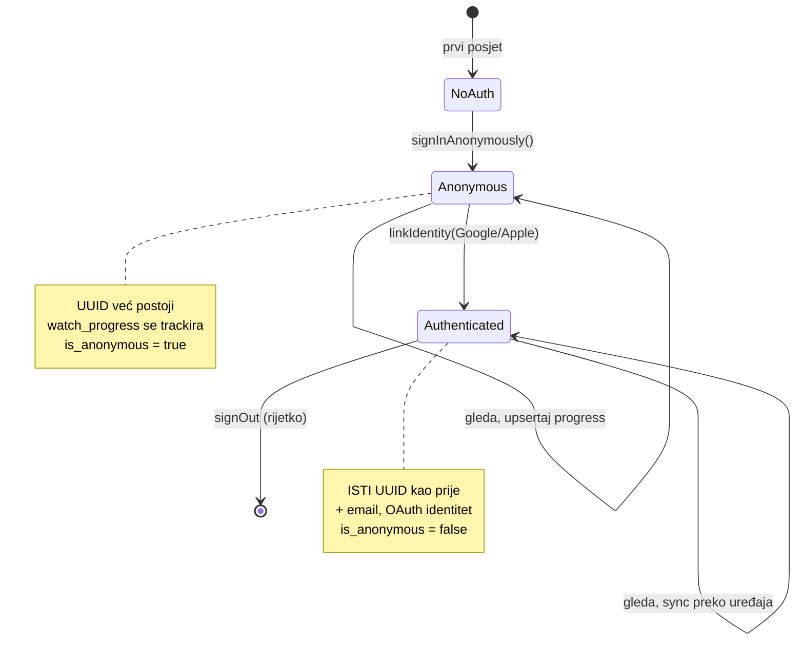

### Sekvenca — prvi posjet i početak gledanja

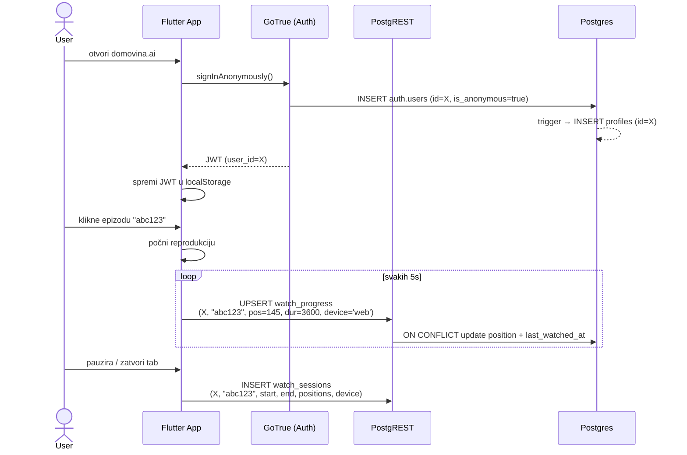

### Sekvenca — povratak korisnika

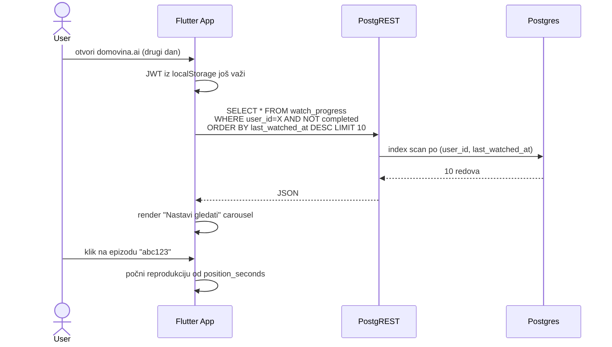

### Sekvenca — login (Google) bez gubitka podataka

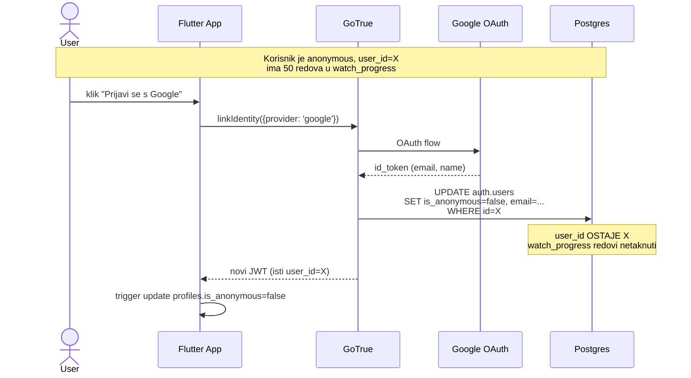

### Sekvenca — cross-device live sync

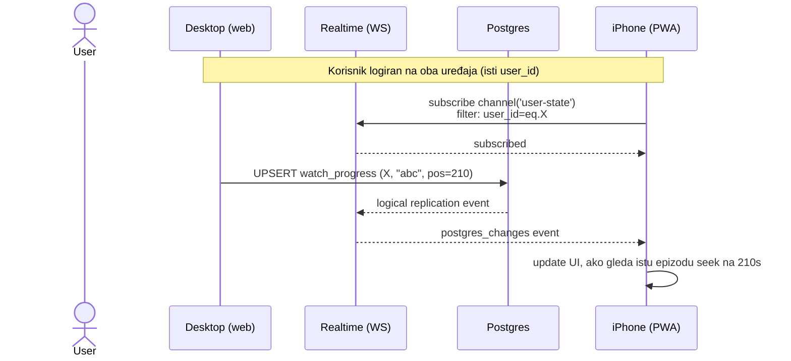

---

## Sigurnost — Row Level Security (RLS)

Klijent piše **direktno** u Postgres preko PostgREST-a, bez custom backend layera. Sigurnosna granica je u DB.

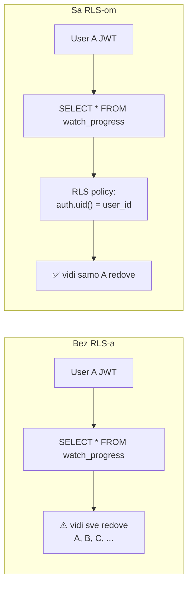

### Policy template (isti pattern za sve tablice)

```sql
alter table watch_progress enable row level security;

create policy "own_progress" on watch_progress
  for all
  using (auth.uid() = user_id)
  with check (auth.uid() = user_id);
```

`using` se primjenjuje na `SELECT`/`UPDATE`/`DELETE`, `with check` na `INSERT`/`UPDATE`. Identično za `favorites`, `bookmarks`, `watch_sessions`, `channel_subscriptions`, `profiles`.

---

## Realtime subscription pattern

```dart
// Flutter — listen na bilo koju promjenu user-ovog watch_progress
supabase
  .channel('user-state')
  .onPostgresChanges(
    event: PostgresChangeEvent.all,
    schema: 'public',
    table: 'watch_progress',
    filter: PostgresChangeFilter(
      type: PostgresChangeFilterType.eq,
      column: 'user_id',
      value: currentUserId,
    ),
    callback: (payload) {
      // payload.newRecord = updated row
      // ako trenutno gleda istu epizodu i pos se mijenja s drugog uređaja → seek
    },
  )
  .subscribe();
```

---

## Korisne view-ove za frontend

```sql
-- "Continue watching" — nedovršene epizode, sortirano po zadnjem gledanju
create view v_continue_watching as
select wp.*, /* join na CDN metadata u clientu */
from watch_progress wp
where not wp.completed
  and wp.position_seconds > 30  -- ne prikazuj ako je tek pokrenuo
order by wp.last_watched_at desc;

-- "Recently watched" (sve, uključujući završene)
create view v_recent as
select * from watch_progress
order by last_watched_at desc;
```

View-ovi naslijeđuju RLS od underlying tablice (Postgres 15+).

---

## Trigger — auto-create profile na signup

```sql
create function handle_new_user() returns trigger
language plpgsql security definer as $$
begin
  insert into profiles (id, is_anonymous)
  values (new.id, coalesce(new.is_anonymous, false));
  return new;
end;
$$;

create trigger on_auth_user_created
  after insert on auth.users
  for each row execute function handle_new_user();
```

---

## Coolify deployment — checklist

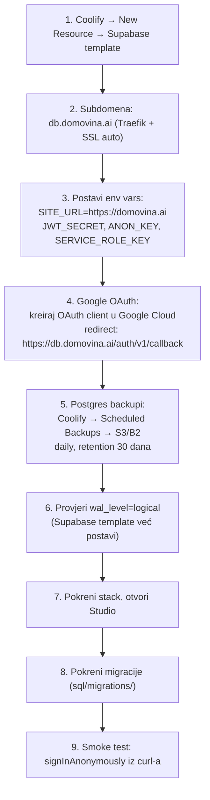

**Resource budget:** cijeli stack ~1.5–2GB RAM u idle modu. Provjeri da Coolify server ima dovoljno slobodnog memory-ja.

**Domain config:**
- `db.domovina.ai` → Supabase (PostgREST + GoTrue + Realtime)
- `studio.domovina.ai` → Supabase Studio (admin, restricted IP ili basic auth)
- `domovina.ai` → Cloudflare Pages (ostaje)

---

## Migration plan — korak po korak

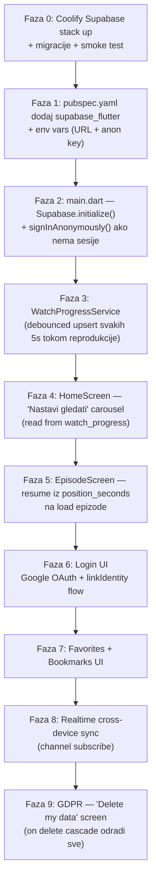

Svaka faza je samostalni deploy. Nakon Faze 5 imaš MVP "Netflix-style resume". Faze 6+ su nadogradnja.

---

## Otvorena pitanja prije Faze 0

1. **Auth provideri** — samo Google? + Apple (obavezno za iOS App Store kad bude native build)? Email magic link kao fallback?
2. **Tick frequency** — 5s je standard. Postavlja se i `debounce` da se ne piše svaka sekunda — provjeriti utjecaj na Postgres write load (procjena: 1 korisnik × 12 upserta/min = neproblematično čak i za tisuće aktivnih).
3. **Realtime cross-device** — implementirati odmah u Fazi 9 ili odgoditi? Bez nje cross-device i dalje radi (na otvaranje uređaja se učita zadnji `position_seconds`), samo nije live.
4. **Anonymous data retention** — koliko dugo držimo `watch_progress` za korisnike koji se nikad ne registriraju? Cron job za brisanje anonimnih starijih od X mjeseci?
5. **GDPR / delete account** — `on delete cascade` riješi tehnički. Treba UI flow + email potvrda.
6. **Domena** — `db.domovina.ai` ili `supabase.domovina.ai` ili `api.domovina.ai`?

---

## Reference

- Supabase docs: https://supabase.com/docs
- Supabase Flutter: https://supabase.com/docs/reference/dart
- Self-hosting Supabase: https://supabase.com/docs/guides/self-hosting/docker
- Coolify Supabase template: https://coolify.io/docs/services/supabase
- RLS guide: https://supabase.com/docs/guides/auth/row-level-security
- Anonymous + linkIdentity: https://supabase.com/docs/guides/auth/auth-anonymous
