# Auth & Database Plan — DOMOVINA.ai

Plan uvođenja korisničkih računa, organizacijskih struktura i per-user state-a (watch progress, favoriti, bookmarkovi) u trenutno 100% anonimnu Flutter aplikaciju.

**Status:** prijedlog, čeka review prije implementacije.
**Verzija:** v2 (multi-product + GitHub-style orgs, primjenjeni Supabase + Makerkit best practices)
**Datum:** 2026-05-18

---

## Ciljevi

### Domovina.ai (ovaj produkt — Netflix-style klon)

1. **Resume capability** — korisnik nastavlja gledanje točno gdje je stao, na bilo kojem uređaju.
2. **Watch history** — povijest svega što je gledao, s timestampovima.
3. **Cross-device sync** — pozicija reprodukcije se sinkronizira u realtime između uređaja.
4. **Anonymous-first** — korisnik može koristiti app bez logina; tek kasnije se može povezati Google/Apple račun bez gubitka podataka.
5. **Favoriti i bookmarkovi** — spremanje epizoda i timestamp markera.

### Cross-product (svi domovina.* produkti, sad i budući)

6. **Single Sign-On** — jedan identitet korisnika za sve domovina produkte (N frontendova, 1 auth backend).
7. **GitHub-style accounts** — svaki user dobije personal account (slug = username), može biti član 0..N organizacija.
8. **Organizacije s rolama** — `owner` / `admin` / `member`. Invite, accept, leave, transfer ownership.
9. **Shared identity, isolated data** — accounts su zajednički svim produktima; produkt-specifični podaci žive u odvojenim Postgres schemama.

**Ne-cilj (faza 1):** komentari, social graph, recommendations engine, billing/subscriptions per org. Schema mora dopustiti ekstenziju, ali se ne implementira sad.

---

## Tech stack odluka

**Self-hosted Supabase na Coolify serveru.**

### Zašto Supabase

- **Postgres** — pravi SQL, joini i agregati su besplatni. Za "continue watching", per-episode statistiku, org member listing — joini su esencijalni.
- **Row Level Security (RLS)** — policy se piše jednom u SQL-u, klijent direktno radi `upsert`/`select` bez custom backenda. Sigurnosna granica je u DB, ne u app kodu.
- **Anonymous sign-in + linkIdentity** — user dobije UUID na prvi load i odmah se trackira. Kasnije pri loginu (Google/Apple) `user_id` ostaje isti → sav povijesni progress se zadrži.
- **Realtime** — Postgres logical replication preko WebSocketa, subscribe na promjene `watch_progress` reda za live cross-device sync.
- **Flutter SDK** (`supabase_flutter`) — first-class podrška, identično ponašanje na web/iOS/Android/macOS.
- **Self-hostable** — cijeli stack je open source docker-compose.
- **Multi-frontend ready** — `additional_redirect_urls` u GoTrue-u dopušta N frontendova na istom auth tenantu.

### Zašto self-hosted preko Coolify

- Coolify server već postoji za druge projekte → nema dodatnog troška.
- Supabase ima službeni Coolify template (one-click): Postgres + GoTrue (auth) + PostgREST (REST API) + Realtime + Storage + Studio (admin UI).
- Traefik reverse proxy + SSL automatski.
- Postgres backupi su built-in u Coolify (scheduled na S3/B2/lokalno).
- Nema vendor lock-ina; migracija na Supabase Cloud, Neon, Render = `pg_dump` + restore.

### Što ostaje na Cloudflare-u

Cloudflare Pages hosta Flutter web build. CDN (`cdn.domovina.ai`) servira sve per-episode statičke JSON-ove. Supabase pokriva **isključivo identitet + per-user state** — sve drugo ostaje statički.

---

## Arhitektura visoke razine

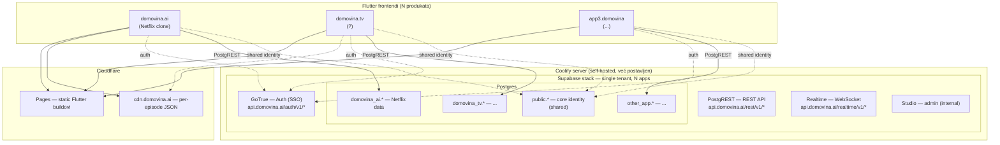

**Princip razdvajanja:**
- `public` schema = **core identitet** (accounts, profiles, memberships) — dijele svi produkti
- `domovina_ai`, `domovina_tv`, … = **per-produkt podaci** — izolirani po schemi
- PostgREST eksponira sheme po potrebi (config `db-schemas`)

---

## Core identity layer (`public` schema)

GitHub-inspired model: **unified `accounts` tablica** za usere i orgs, dijele globalni namespace slugova. Pattern preuzet iz [Makerkit production SaaS template-a](https://makerkit.dev/blog/tutorials/supabase-rls-best-practices) jer je battle-tested i pokriva sve scenarije bez tipskog enuma.

### ERD

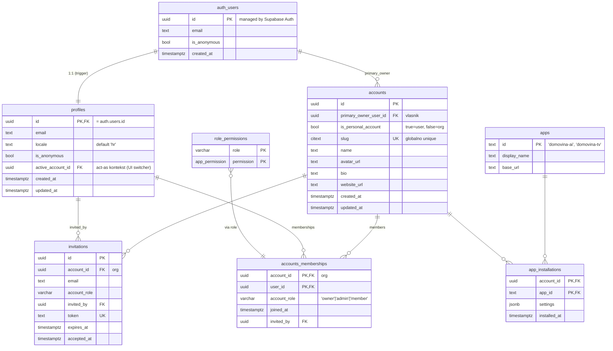

### Tablice — detaljno

#### `accounts` — unified user + org

| Stupac | Tip | Opis |
|--------|-----|------|
| `id` | `uuid` PK | `gen_random_uuid()` |
| `primary_owner_user_id` | `uuid` FK | Reference `auth.users.id`. Za personal: = user. Za org: kreator. |
| `is_personal_account` | `bool` | `true` za personal (1:1 s user), `false` za org. |
| `slug` | `citext` UK | Globalno jedinstven, case-insensitive (`Matija` == `matija`). |
| `name` | `text` | Display name (user full name ili org naziv). |
| `avatar_url`, `bio`, `website_url` | `text` | Public profil. |
| `created_at`, `updated_at` | `timestamptz` | |

**Constraints:**
```sql
constraint slug_format check (slug ~ '^[a-z0-9][a-z0-9-]{0,38}[a-z0-9]$'),  -- GitHub-style
constraint personal_uniqueness check (
  -- jedan user može imati samo jedan personal account
  not is_personal_account or (
    select count(*) from accounts a2
    where a2.primary_owner_user_id = primary_owner_user_id
      and a2.is_personal_account = true
  ) <= 1
)
```

**Slug pravila:** 1–40 znakova, mala slova + brojke + crtica, ne počinje/završava crticom. Identično GitHub-u.

---

#### `profiles` — user-specific data (1:1 s `auth.users`)

| Stupac | Tip | Opis |
|--------|-----|------|
| `id` | `uuid` PK,FK | = `auth.users.id` |
| `email` | `text` | Mirror iz auth.users (za brže queries) |
| `locale` | `text` | Default `'hr'` |
| `is_anonymous` | `bool` | `true` dok nije linkao identitet |
| `active_account_id` | `uuid` FK | Trenutni "acting as" account (UI switcher) |
| `created_at`, `updated_at` | `timestamptz` | |

**Napomena:** personal account se nalazi preko `accounts.primary_owner_user_id = profiles.id AND is_personal_account = true` — nema zasebnog FK-a jer bi to bila duplikat informacija.

---

#### `accounts_memberships` — user × org × role

| Stupac | Tip | Opis |
|--------|-----|------|
| `account_id` | `uuid` PK,FK | Mora biti org (`is_personal_account = false`) — check constraint. |
| `user_id` | `uuid` PK,FK | `profiles.id` |
| `account_role` | `varchar(50)` | `'owner'` / `'admin'` / `'member'` |
| `joined_at` | `timestamptz` | |
| `invited_by` | `uuid` FK | Tko je pozvao (može biti NULL za primary owner). |

**Indeksi (kritični za RLS performance):**
```sql
create index ix_accounts_memberships_user_id on accounts_memberships(user_id);
create index ix_accounts_memberships_account_id on accounts_memberships(account_id);
```

---

#### `invitations` — pending org invites

| Stupac | Tip | Opis |
|--------|-----|------|
| `id` | `uuid` PK | |
| `account_id` | `uuid` FK | Org koji poziva |
| `email` | `text` | Email pozvane osobe (user možda još ne postoji) |
| `account_role` | `varchar(50)` | Predefinirana rola |
| `invited_by` | `uuid` FK | `profiles.id` koji je poslao invite |
| `token` | `text` UK | Random token za invite link |
| `expires_at` | `timestamptz` | Default `now() + interval '7 days'` |
| `accepted_at` | `timestamptz` | Set na accept |

---

#### `role_permissions` — decoupling role name od permission set

```sql
create type app_permissions as enum (
  'members.manage',     -- invite, remove, change role
  'settings.manage',    -- update org name, avatar
  'billing.manage'      -- (kasnije) subscriptions
);
```

| Stupac | Tip | Opis |
|--------|-----|------|
| `role` | `varchar(50)` PK | `'owner'` / `'admin'` / `'member'` |
| `permission` | `app_permissions` PK | Iz enum-a |

**Seed:**
```sql
insert into role_permissions values
  ('owner', 'members.manage'),
  ('owner', 'settings.manage'),
  ('owner', 'billing.manage'),
  ('admin', 'members.manage'),
  ('admin', 'settings.manage');
-- 'member' nema permissions, samo read pristup
```

---

#### `apps` + `app_installations`

Track koji account ima instaliran koji produkt (za analitiku i per-app settings).

| Tablica | Stupci | Svrha |
|---------|--------|-------|
| `apps` | `id` PK (`'domovina-ai'`), `display_name`, `base_url` | Registar produkata |
| `app_installations` | `(account_id, app_id)` PK, `settings jsonb`, `installed_at` | Per-account per-app stanje |

---

## App-specific layer (`domovina_ai` schema)

### ERD

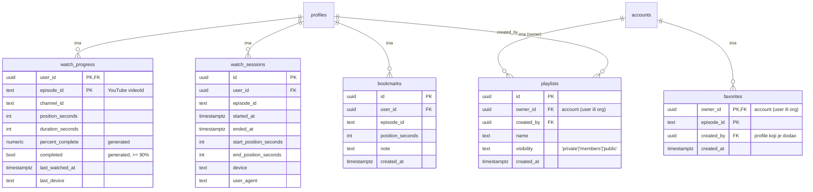

### Strategija ownership-a per tablica

| Tablica | Vlasnik | Obrazloženje |
|---------|---------|--------------|
| `watch_progress` | `user_id` | Resume pozicija je inherentno osobna, ne dijeli se. |
| `watch_sessions` | `user_id` | Povijest gledanja je osobna. |
| `bookmarks` | `user_id` | Privatni timestamp markeri. |
| `favorites` | `owner_id` (account) | User ima personal favorite; org može kuratirati listu. |
| `playlists` | `owner_id` (account) | Org dijeli kuriranu playlistu članovima. |

### `watch_progress` ★ — najvažnija tablica

Jedan red po `(user, episode)`. Upsert na svaki tick (~5s) tokom reprodukcije.

| Stupac | Tip | Opis |
|--------|-----|------|
| `user_id` | `uuid` PK,FK | → `public.profiles.id` |
| `episode_id` | `text` PK | YouTube videoId |
| `channel_id` | `text` | Za grupiranje po kanalu |
| `position_seconds` | `int` | Trenutna pozicija |
| `duration_seconds` | `int` | Ukupno trajanje |
| `percent_complete` | `numeric` | **Generated** — `100 * position / duration` |
| `completed` | `bool` | **Generated** — `true` kad `>= 90%` |
| `last_watched_at` | `timestamptz` | Za "continue watching" sort |
| `last_device` | `text` | `web` / `ios` / `android` / `macos` |

**Indeksi:**
```sql
primary key (user_id, episode_id)              -- O(1) lookup
create index on watch_progress (user_id, last_watched_at desc);  -- "Continue watching"
create index on watch_progress (user_id, completed, last_watched_at desc);
```

---

## Dvije razine trackinga — namjerno odvojene

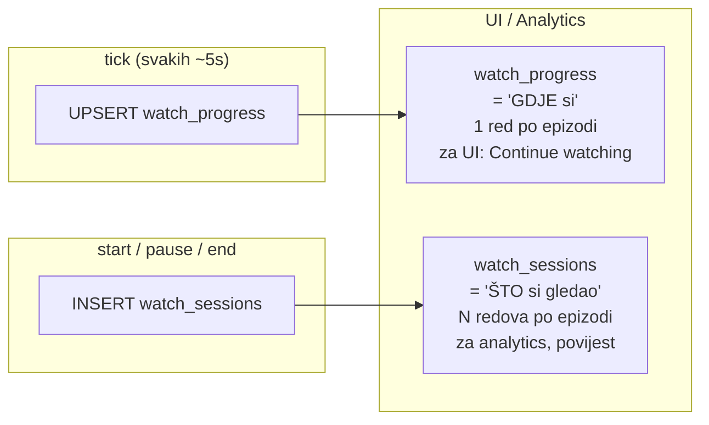

**Zašto razdvojeno:** ako sve guraš u `watch_sessions`, "continue watching" upit traži `DISTINCT ON` + agregat po milijun redaka. `watch_progress` je denormalizirano "trenutno stanje" — UI dohvaća jedan indeks-scan, O(broj epizoda po korisniku).

---

## User flows

### Stanja korisnika

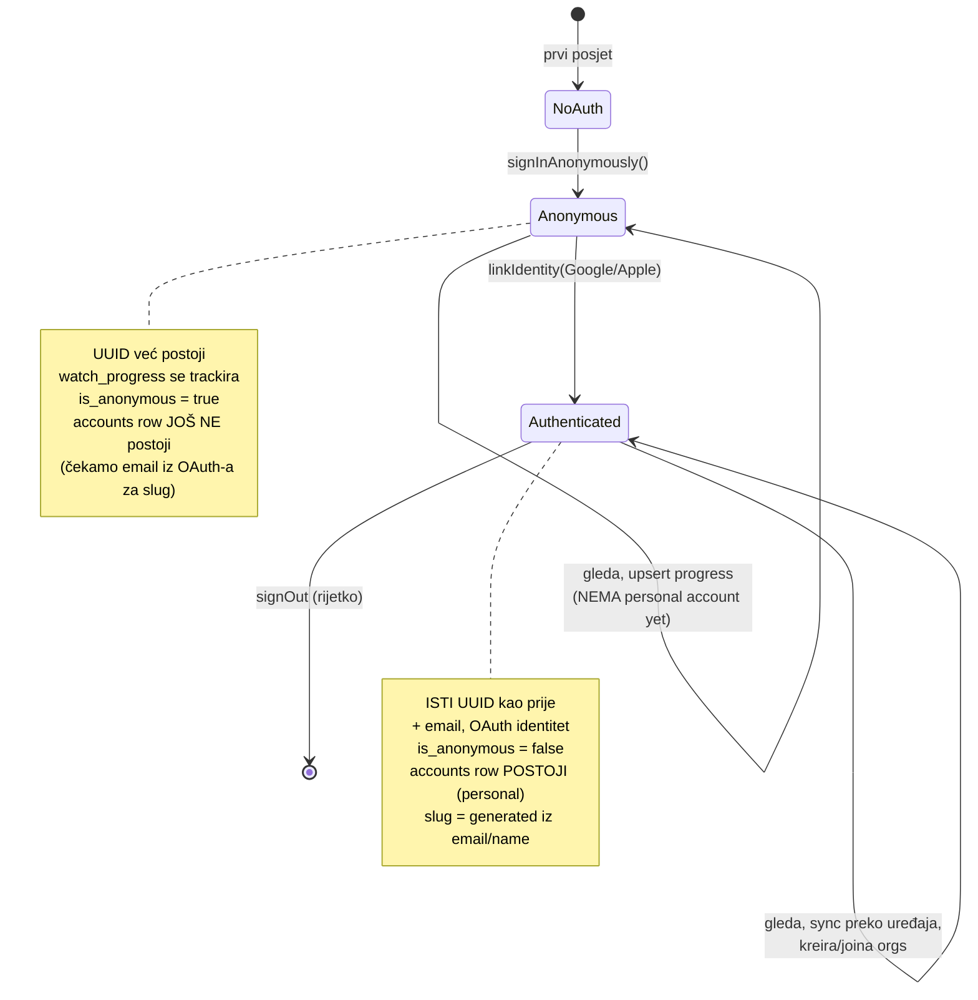

### Sekvenca — prvi posjet (anonymous)

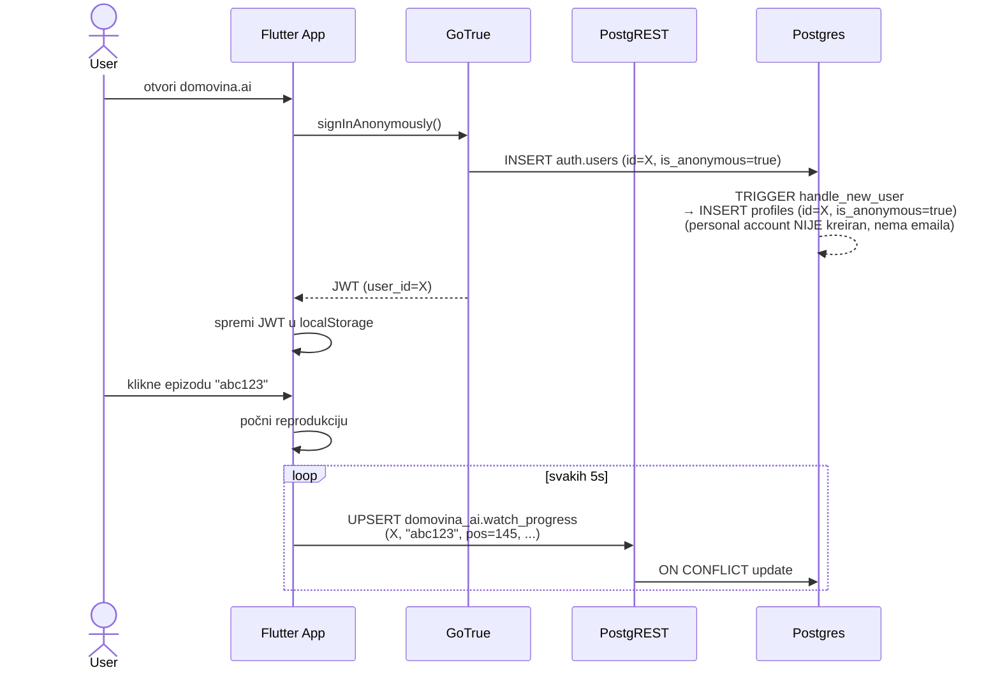

### Sekvenca — login + linkIdentity (kreiranje personal accounta)

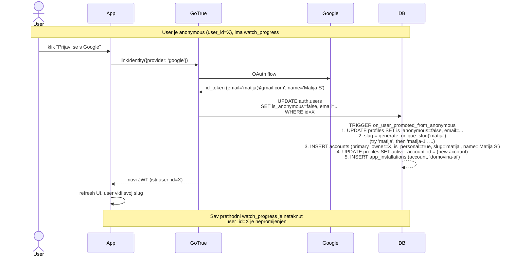

### Sekvenca — kreiranje organizacije

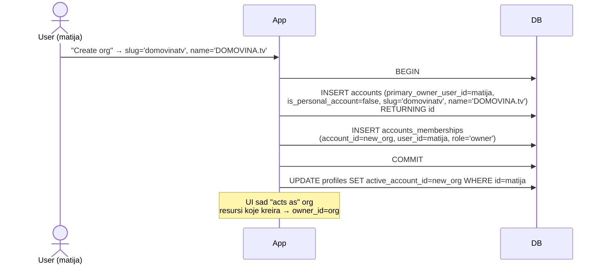

### Sekvenca — invite + accept

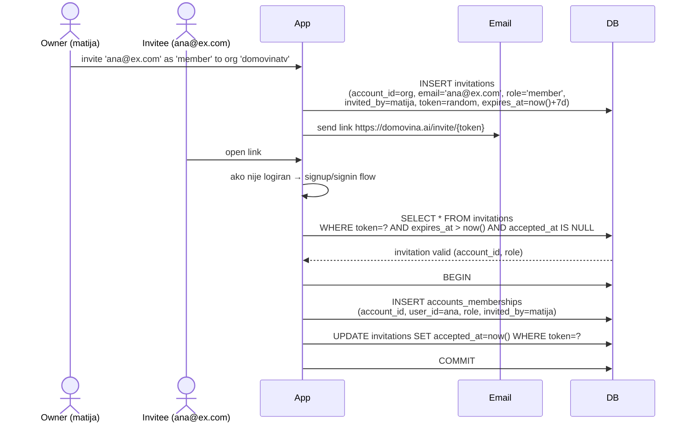

### Sekvenca — leave org (last owner guard)

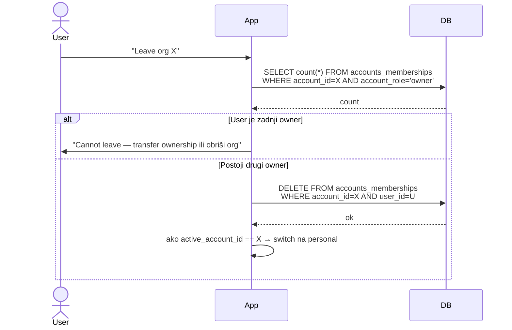

### Sekvenca — cross-device live sync (watch_progress)

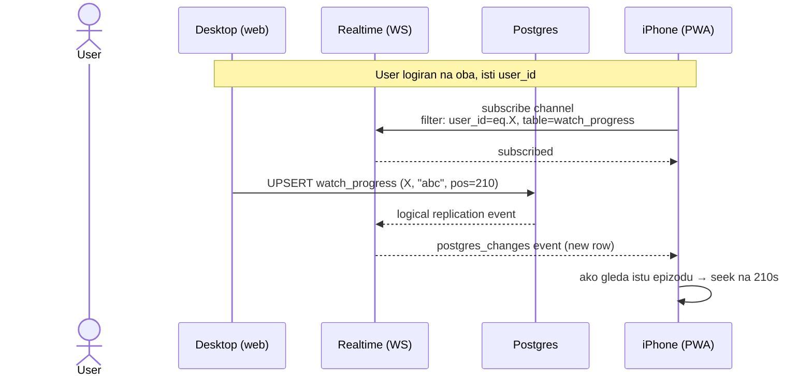

---

## Sigurnost — Row Level Security (RLS)

Klijent piše **direktno** u Postgres preko PostgREST-a, bez custom backend layera. Sigurnosna granica je u DB.

### Best practices iz Supabase produkcije

1. **`(select auth.uid())` umjesto `auth.uid()`** — Postgres tretira goli poziv kao volatile (poziv po redu); subquery wrapping omogućuje InitPlan caching kroz rows. **10–100× brže** na većim tablicama.
2. **`to authenticated`** u svakom policy-ju — eksplicitno ograniči na logirane.
3. **Security definer helper funkcije** s `set search_path = ''` i `stable` — prevent schema hijacking + Postgres caching.
4. **Indeksi na sve stupce koje policy čita** — bez ovoga je seq scan po milijun redaka.

### Helper funkcije (security definer)

```sql
-- Je li trenutni user vlasnik (personal account) ili u orgu
create function public.is_account_member(target_account uuid)
returns boolean
language sql
security definer
set search_path = ''
stable
as $$
  select exists (
    select 1 from public.accounts a
    where a.id = target_account
      and (
        a.primary_owner_user_id = (select auth.uid())
        or exists (
          select 1 from public.accounts_memberships m
          where m.account_id = target_account
            and m.user_id = (select auth.uid())
        )
      )
  );
$$;

-- Provjeri specifičnu rolu (s hierarhijom owner > admin > member)
create function public.has_role_on_account(
  target_account uuid,
  min_role varchar default 'member'
)
returns boolean
language sql
security definer
set search_path = ''
stable
as $$
  select exists (
    select 1 from public.accounts_memberships m
    where m.account_id = target_account
      and m.user_id = (select auth.uid())
      and (
        min_role = 'member'
        or (min_role = 'admin' and m.account_role in ('admin','owner'))
        or (min_role = 'owner' and m.account_role = 'owner')
      )
  );
$$;

-- Permission-based (decoupled od role name)
create function public.has_permission(
  target_account uuid,
  required_permission app_permissions
)
returns boolean
language sql
security definer
set search_path = ''
stable
as $$
  select exists (
    select 1
    from public.accounts_memberships m
    join public.role_permissions rp on rp.role = m.account_role
    where m.account_id = target_account
      and m.user_id = (select auth.uid())
      and rp.permission = required_permission
  );
$$;
```

### Policy primjeri

#### `watch_progress` — user-only

```sql
alter table domovina_ai.watch_progress enable row level security;

create policy "own_progress_select" on domovina_ai.watch_progress
  for select
  to authenticated
  using ((select auth.uid()) = user_id);

create policy "own_progress_write" on domovina_ai.watch_progress
  for all
  to authenticated
  using ((select auth.uid()) = user_id)
  with check ((select auth.uid()) = user_id);
```

#### `accounts` — vidi personal + orgs gdje si član

```sql
alter table public.accounts enable row level security;

create policy "accounts_read" on public.accounts
  for select
  to authenticated
  using (
    primary_owner_user_id = (select auth.uid())
    or public.is_account_member(id)
  );

create policy "accounts_update" on public.accounts
  for update
  to authenticated
  using (
    primary_owner_user_id = (select auth.uid())
    or public.has_role_on_account(id, 'admin')
  )
  with check (
    primary_owner_user_id = (select auth.uid())
    or public.has_role_on_account(id, 'admin')
  );

-- INSERT: user može kreirati account gdje je sam owner
create policy "accounts_insert" on public.accounts
  for insert
  to authenticated
  with check (primary_owner_user_id = (select auth.uid()));

-- DELETE: samo primary owner
create policy "accounts_delete" on public.accounts
  for delete
  to authenticated
  using (primary_owner_user_id = (select auth.uid()));
```

#### `accounts_memberships`

```sql
alter table public.accounts_memberships enable row level security;

-- Vidi članove orgs gdje si i sam član
create policy "memberships_read" on public.accounts_memberships
  for select
  to authenticated
  using (
    user_id = (select auth.uid())
    or public.is_account_member(account_id)
  );

-- Dodaj/ukloni: samo admin+ ima permission 'members.manage'
create policy "memberships_manage" on public.accounts_memberships
  for all
  to authenticated
  using (public.has_permission(account_id, 'members.manage'))
  with check (public.has_permission(account_id, 'members.manage'));
```

#### `favorites` — owner-based (user ili org)

```sql
alter table domovina_ai.favorites enable row level security;

create policy "favorites_read" on domovina_ai.favorites
  for select
  to authenticated
  using (public.is_account_member(owner_id));

create policy "favorites_write" on domovina_ai.favorites
  for all
  to authenticated
  using (
    -- personal: ja sam owner
    owner_id in (
      select id from public.accounts
      where primary_owner_user_id = (select auth.uid())
        and is_personal_account = true
    )
    -- ili admin orga
    or public.has_role_on_account(owner_id, 'admin')
  )
  with check (created_by = (select auth.uid()));
```

---

## Indeksi — checklist

Kritični za RLS performance. Bez njih = seq scan po cijeloj tablici za svaki request.

```sql
-- Core
create index ix_accounts_primary_owner on public.accounts(primary_owner_user_id);
create index ix_accounts_slug on public.accounts(slug);
create index ix_accounts_personal on public.accounts(primary_owner_user_id)
  where is_personal_account = true;

create index ix_memberships_user on public.accounts_memberships(user_id);
create index ix_memberships_account on public.accounts_memberships(account_id);

create index ix_invitations_token on public.invitations(token);
create index ix_invitations_email on public.invitations(email)
  where accepted_at is null;

-- Domovina.ai
create index ix_watch_progress_continue
  on domovina_ai.watch_progress(user_id, last_watched_at desc);
create index ix_watch_progress_completed
  on domovina_ai.watch_progress(user_id, completed, last_watched_at desc);

create index ix_watch_sessions_user on domovina_ai.watch_sessions(user_id, started_at desc);
create index ix_watch_sessions_episode on domovina_ai.watch_sessions(episode_id, started_at desc);

create index ix_bookmarks_user_episode on domovina_ai.bookmarks(user_id, episode_id, position_seconds);

create index ix_favorites_owner on domovina_ai.favorites(owner_id);
```

---

## Trigger — auto-create na signup i promotion

```sql
-- Helper: generiraj unique slug iz email/name (try base, base-1, base-2, ...)
create function public.generate_unique_slug(base_text text)
returns citext
language plpgsql
security definer
set search_path = ''
as $$
declare
  v_base citext;
  v_candidate citext;
  v_suffix int := 0;
begin
  -- normaliziraj: lowercase, ukloni @domain, zamijeni non-alphanum s '-'
  v_base := lower(regexp_replace(split_part(base_text, '@', 1), '[^a-z0-9]+', '-', 'g'));
  v_base := trim(both '-' from v_base);
  if length(v_base) < 1 then v_base := 'user'; end if;
  if length(v_base) > 38 then v_base := substring(v_base, 1, 38); end if;

  v_candidate := v_base;
  loop
    exit when not exists (select 1 from public.accounts where slug = v_candidate);
    v_suffix := v_suffix + 1;
    v_candidate := v_base || '-' || v_suffix::text;
  end loop;

  return v_candidate;
end;
$$;

-- Trigger 1: na svaki INSERT u auth.users → profile
create function public.handle_new_user()
returns trigger
language plpgsql
security definer
set search_path = ''
as $$
declare
  v_slug citext;
  v_account_id uuid;
begin
  -- 1. profile (uvijek)
  insert into public.profiles (id, email, is_anonymous)
  values (new.id, new.email, coalesce(new.is_anonymous, false));

  -- 2. personal account (samo ako NIJE anonymous — treba nam email/name)
  if not coalesce(new.is_anonymous, false) then
    v_slug := public.generate_unique_slug(coalesce(new.email, 'user'));
    insert into public.accounts (primary_owner_user_id, is_personal_account, slug, name)
    values (
      new.id, true, v_slug,
      coalesce(new.raw_user_meta_data->>'name', new.email, v_slug::text)
    )
    returning id into v_account_id;

    update public.profiles set active_account_id = v_account_id where id = new.id;
    insert into public.app_installations (account_id, app_id) values (v_account_id, 'domovina-ai');
  end if;

  return new;
end;
$$;

create trigger on_auth_user_created
  after insert on auth.users
  for each row execute function public.handle_new_user();

-- Trigger 2: na UPDATE auth.users kad anonymous postaje permanent → kreiraj personal account
create function public.handle_user_promoted()
returns trigger
language plpgsql
security definer
set search_path = ''
as $$
declare
  v_slug citext;
  v_account_id uuid;
begin
  -- okida samo kad is_anonymous prelazi s true na false
  if old.is_anonymous and not new.is_anonymous then
    v_slug := public.generate_unique_slug(coalesce(new.email, 'user'));
    insert into public.accounts (primary_owner_user_id, is_personal_account, slug, name)
    values (
      new.id, true, v_slug,
      coalesce(new.raw_user_meta_data->>'name', new.email, v_slug::text)
    )
    returning id into v_account_id;

    update public.profiles
      set is_anonymous = false, email = new.email, active_account_id = v_account_id
      where id = new.id;

    insert into public.app_installations (account_id, app_id) values (v_account_id, 'domovina-ai');
  end if;

  return new;
end;
$$;

create trigger on_auth_user_promoted
  after update of is_anonymous on auth.users
  for each row execute function public.handle_user_promoted();
```

---

## Korisne view-ove za frontend

```sql
-- "Continue watching" — nedovršene epizode, sortirano po zadnjem gledanju
create view domovina_ai.v_continue_watching as
select * from domovina_ai.watch_progress
where not completed
  and position_seconds > 30
order by last_watched_at desc;

-- Moji accounti (personal + svi orgs gdje sam član)
create view public.v_my_accounts as
select a.*, m.account_role
from public.accounts a
left join public.accounts_memberships m
  on m.account_id = a.id and m.user_id = (select auth.uid())
where a.primary_owner_user_id = (select auth.uid())
   or m.user_id = (select auth.uid())
order by a.is_personal_account desc, a.name;
```

View-ovi naslijeđuju RLS od underlying tablice (Postgres 15+).

---

## Realtime subscription pattern

```dart
// Flutter — listen na bilo koju promjenu user-ovog watch_progress
supabase
  .channel('user-state')
  .onPostgresChanges(
    event: PostgresChangeEvent.all,
    schema: 'domovina_ai',
    table: 'watch_progress',
    filter: PostgresChangeFilter(
      type: PostgresChangeFilterType.eq,
      column: 'user_id',
      value: currentUserId,
    ),
    callback: (payload) {
      // ako gleda istu epizodu i pos se mijenja s drugog uređaja → seek
    },
  )
  .subscribe();
```

---

## Coolify deployment

**Status:** ✅ Supabase stack je već deployan na Coolify-u, dostupan na `https://api.domovina.ai` (Kong gateway eksponira sve endpoint-e na jednoj domeni).

### Endpoint mapping (Kong gateway)

| Service | URL |
|---------|-----|
| GoTrue (Auth) | `https://api.domovina.ai/auth/v1/*` |
| PostgREST (REST) | `https://api.domovina.ai/rest/v1/*` |
| Realtime (WebSocket) | `wss://api.domovina.ai/realtime/v1/*` |
| Storage | `https://api.domovina.ai/storage/v1/*` |
| Studio (admin) | interni / IP-restricted |

### Što treba još konfigurirati prije Faze 0

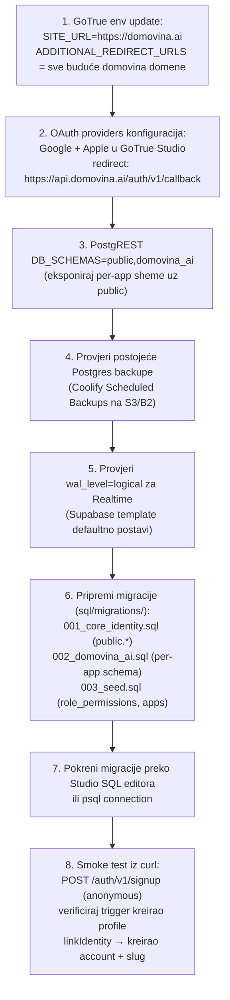

**Domain summary:**
- `api.domovina.ai` → **Supabase Kong gateway** (auth + REST + realtime + storage) — već postavljen
- `domovina.ai`, `domovina.tv`, ... → Cloudflare Pages (per-produkt frontend)
- `cdn.domovina.ai` → CDN za per-episode statičke JSON-ove (ostaje neizmijenjen)

---

## Migration plan — korak po korak

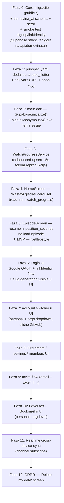

**Faze 0–5** = MVP koji rješava trenutni cilj (resume capability). **Faze 6+** = nadogradnja prema multi-product viziji.

**Važno:** core schema (Faza 0) se postavi **odmah s `accounts` + `accounts_memberships`** čak iako orgs UI ne postoji do Faze 8. Kasnije dodavanje tog sloja je bolan refactor postojećih FK-ova.

---

## Otvorena pitanja

1. **Auth provideri** — Google + Apple (obavezno za iOS App Store) + email magic link? Anonymous-only ostaje opcija da nikad ne forsiramo login.
2. **Tick frequency** — 5s default. Trade-off granularnost resume vs DB write load. Procjena: 1 user × 12 upserta/min = trivijalno za tisuće aktivnih.
3. **Drugi planirani produkti** — koji su konkretno? Ako znamo grubo, dizajniramo `apps` registar i installation flow. Ako ne, ostaje minimalno.
4. **Slug change story** — GitHub dopušta promjenu username-a uz redirect-e. Implementirati u v1 ili pustiti slug imutabilan?
5. **Anonymous data retention** — koliko držimo `watch_progress` za usere koji se nikad ne registriraju? Cron job za brisanje anonimnih starijih od X mjeseci?
6. **GDPR / delete account** — `on delete cascade` riješi tehnički. Treba UI flow + email potvrda. Što s orgs gdje je user zadnji owner?

---

## Reference

### Best practice izvori (provjereni u 2026)

- [Makerkit — Supabase RLS Best Practices (production patterns)](https://makerkit.dev/blog/tutorials/supabase-rls-best-practices) — core izvor za accounts/memberships pattern, security definer helpers, `(select auth.uid())` optimizacija
- [Supabase Docs — User Management](https://supabase.com/docs/guides/auth/managing-user-data) — službeni profiles + trigger pattern
- [Multi-Tenant Authentication with Supabase: A Production Implementation](https://medium.com/@kriryk/multi-tenant-authentication-with-supabase-a-production-implementation-0f6064f50d55)
- [Leanware — Best Practices for Supabase: Security, Scaling & Maintainability](https://www.leanware.co/insights/supabase-best-practices)
- [10 Real-World RLS Patterns for Supabase (SupaExplorer)](https://supaexplorer.com/dev-notes/10-real-world-rls-patterns-for-supabase-with-policy-snippets.html)
- [Row-Level Security in Supabase: Multi-Tenant SaaS from Day One](https://dev.to/issuecapture/row-level-security-in-supabase-multi-tenant-saas-from-day-one-4lon)

### Tooling

- [Supabase Flutter SDK](https://supabase.com/docs/reference/dart)
- [Self-hosting Supabase (Docker)](https://supabase.com/docs/guides/self-hosting/docker)
- [Coolify Supabase template](https://coolify.io/docs/services/supabase)
- [Supabase Anonymous + linkIdentity](https://supabase.com/docs/guides/auth/auth-anonymous)
- [Authorization via Row Level Security](https://supabase.com/features/row-level-security)
