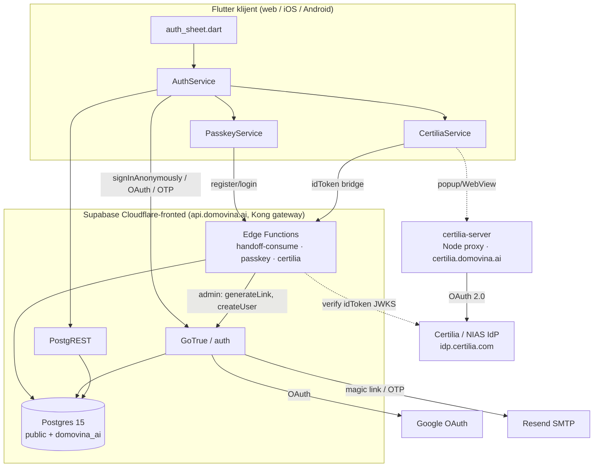
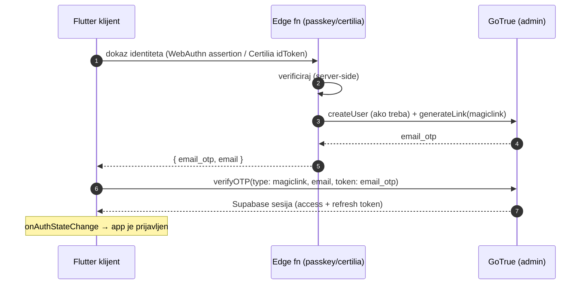
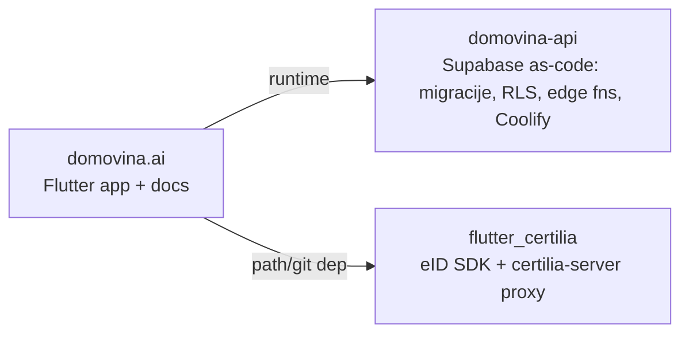
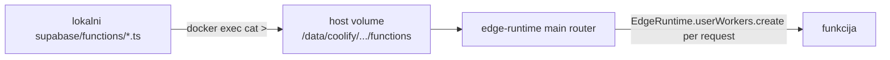
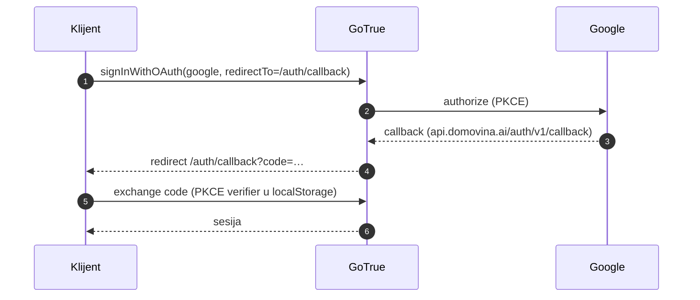
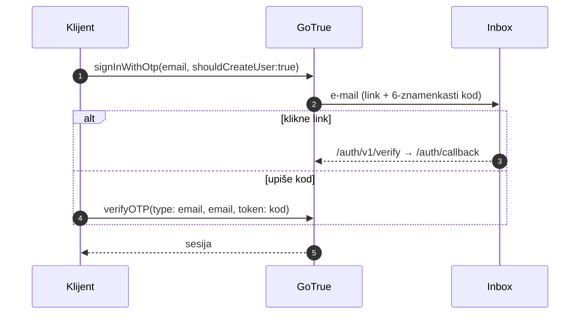
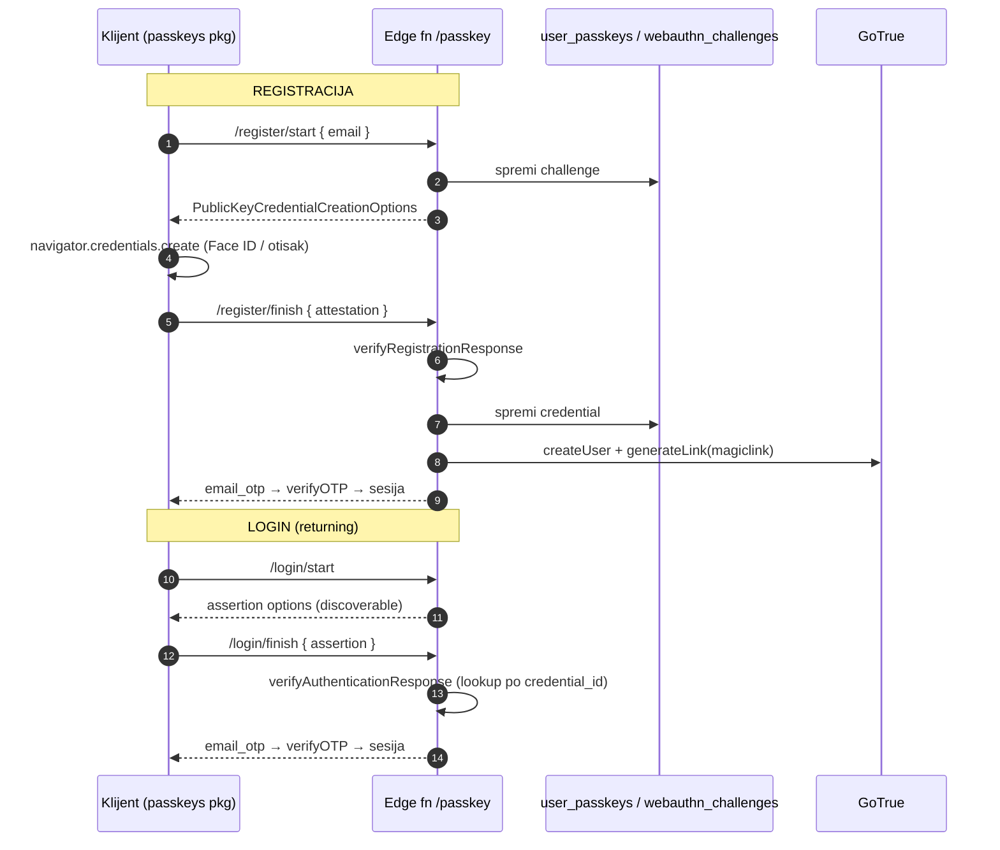
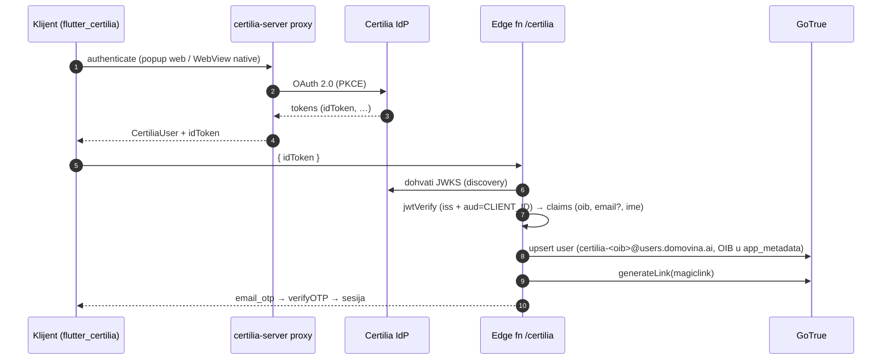
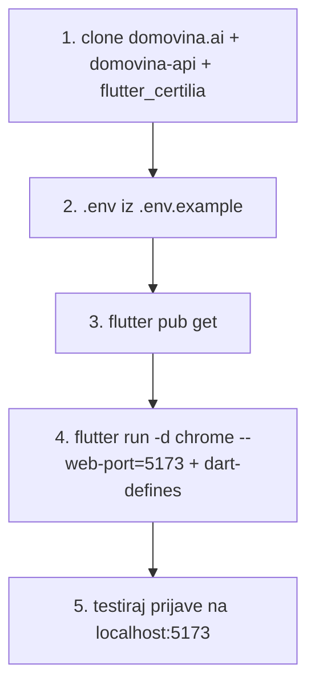
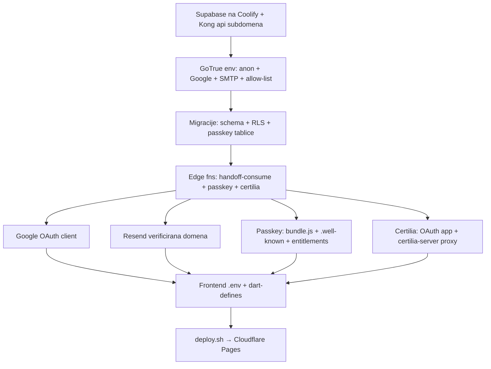

# Authentication — setup & replication guide

Korak-po-korak vodič za postavljanje cijelog auth sustava DOMOVINA.ai, bilo da
**(a)** repliciraš sve na vlastitoj infrastrukturi (open-source), ili **(b)**
postavljaš lokalni development environment kao novi developer u timu.

Pokriva 5 metoda prijave: **anonimna** (anonymous-first), **Google OAuth**,
**e-mail magic link + OTP**, **passkey (WebAuthn)** i **Certilia / NIAS eID**
(hrvatska e-Osobna).

> Povezani dokumenti: [`auth-and-database-plan-v3.md`](auth-and-database-plan-v3.md)
> (shema + RLS principi), [`supabase-implementation-guide.md`](supabase-implementation-guide.md)
> (backend↔frontend ugovor), [`backend-prompts/05-auth-providers.md`](backend-prompts/05-auth-providers.md)
> (GoTrue provider config).

---

## Sadržaj

1. [Arhitektura](#1-arhitektura)
2. [Preduvjeti](#2-preduvjeti)
3. [Repozitoriji](#3-repozitoriji)
4. [Dio A — Backend (Supabase / GoTrue na Coolify)](#dio-a--backend-supabase--gotrue-na-coolify)
5. [Dio B — Metode prijave (korak po korak + dijagrami)](#dio-b--metode-prijave)
6. [Dio C — Frontend (Flutter)](#dio-c--frontend-flutter)
7. [Dio D — Lokalni development environment](#dio-d--lokalni-development-environment)
8. [Dio E — Deploy u produkciju](#dio-e--deploy-u-produkciju)
9. [Gotchas / lessons learned](#9-gotchas--lessons-learned)
10. [Replikacijska checklista](#10-replikacijska-checklista)

---

## 1. Arhitektura

**1 backend → N frontends.** Jedan self-hosted Supabase servira sve DOMOVINA
produkte. Auth state je *uvijek* Supabase sesija (RLS po `auth.uid()`); svaka
"egzotična" metoda (passkey, Certilia) se na kraju **bridgea u Supabase sesiju**.



**Ključni princip — session bridge.** Passkey i Certilia ne mogu izravno
dati GoTrue sesiju. Backend (edge fn) izda **`email_otp`** preko
`admin.generateLink({type:'magiclink'})`, a klijent ga zamijeni za sesiju s
`verifyOTP(type: magiclink, email, token)`. Ovo zaobilazi PKCE/redirect
probleme (vidi [§9](#9-gotchas--lessons-learned)).



---

## 2. Preduvjeti

| Što | Za što |
|---|---|
| VPS s Dockerom + [Coolify](https://coolify.io) | self-hosted Supabase + Certilia proxy |
| Domena + subdomene (`api.`, `certilia.`) | Kong gateway, Certilia proxy |
| Cloudflare account (Pages + Tunnel/Zero Trust) | hosting web app + zaštita Studija |
| Flutter SDK `>=3.16`, Dart `>=3.2` | build/dev |
| Node.js **v22** (za `wrangler`) | Cloudflare Pages deploy |
| Google Cloud OAuth client | Google prijava |
| [Resend](https://resend.com) (ili drugi SMTP) + verificirana domena | magic link / OTP mailovi |
| Certilia OAuth app ([developer.certilia.com](https://developer.certilia.com)) | eID prijava |
| Apple Developer Team ID + Google Play signing | native passkey associated domains |

---

## 3. Repozitoriji



- **`domovina.ai`** — Flutter app (ovaj repo): klijent, UI, dart-defines, deploy skripta.
- **`domovina-api`** — backend as-code: `supabase/migrations/`, `supabase/functions/`, `scripts/db-migrate.sh`, Coolify/Tunnel config. Sve schema/RLS/edge promjene idu **ovdje**.
- **`flutter_certilia`** — zaseban SDK repo (eID): Flutter paket + uključeni `certilia-server` Node proxy.

---

## Dio A — Backend (Supabase / GoTrue na Coolify)

### A.1 Deploy self-hosted Supabase

1. U Coolify: novi resource → Supabase (Postgres 15). Postgres **NE** izlaži javno.
2. Kong gateway dobiva domenu `api.domovina.ai` (preko Cloudflare Tunnel; cloudflared se spaja **HTTP** na Traefik — `https://` bi napravio redirect loop).
3. Studio iza Cloudflare Zero Trust Access.

### A.2 GoTrue env (Coolify → Supabase service → Environment)

Sve metode se uključuju env varijablama; restart `auth` container nakon izmjene.

```bash
# Anonymous-first
GOTRUE_EXTERNAL_ANONYMOUS_USERS_ENABLED=true

# Site + redirect allow-list (HTTPS osim localhosta!)
GOTRUE_SITE_URL=https://domovina.ai
GOTRUE_URI_ALLOW_LIST=https://domovina.ai/**,https://www.domovina.ai/**,http://localhost:5173/**,http://localhost:3000/**,ai.domovina://auth/callback

# Dozvoli manual identity linking (anon → permanent)
GOTRUE_SECURITY_MANUAL_LINKING_ENABLED=true

# Google OAuth
GOTRUE_EXTERNAL_GOOGLE_ENABLED=true
GOTRUE_EXTERNAL_GOOGLE_CLIENT_ID=<google client id>
GOTRUE_EXTERNAL_GOOGLE_SECRET=<google secret>
GOTRUE_EXTERNAL_GOOGLE_REDIRECT_URI=https://api.domovina.ai/auth/v1/callback

# E-mail magic link / OTP (Resend SMTP)
GOTRUE_MAILER_AUTOCONFIRM=false
GOTRUE_SMTP_HOST=smtp.resend.com
GOTRUE_SMTP_PORT=465
GOTRUE_SMTP_USER=resend
GOTRUE_SMTP_PASS=<resend api key>
GOTRUE_SMTP_ADMIN_EMAIL=noreply@domovina.ai
GOTRUE_SMTP_SENDER_NAME=DOMOVINA.ai
```

> **`schemas`** mora uključivati `domovina_ai` (`PGRST_DB_SCHEMAS`) da PostgREST
> izloži per-product tablice (watch_progress, favorites, …).

### A.3 Migracije (schema, RLS, RPC, passkey tablice)

U `domovina-api` repu, transaction-safe apply preko SSH + `docker exec`:

```bash
cd domovina-api
./scripts/db-migrate.sh --dry-run   # pokaži pending
./scripts/db-migrate.sh             # backup → apply u transakciji → tracking
./scripts/db-status.sh              # lista applied migracija
```

Migracije uključuju (između ostalog) `…_passkeys.sql` — `public.user_passkeys` +
`public.webauthn_challenges` (RLS uključen, **zero client policies**, grant samo
`service_role`).

### A.4 Edge Functions (deploy)

Funkcije: `handoff-consume` (cross-device), `passkey` (WebAuthn ceremony),
`certilia` (eID bridge). Self-hosted edge-runtime **nema deploy skriptu** —
kopiraj u host volume + (po potrebi) restart:

```bash
C=supabase-edge-functions-<id>
FN=/home/deno/functions
# 1. kopiraj funkciju u volume (preko SSH + docker exec)
cat supabase/functions/passkey/index.ts | \
  ssh $HOST "docker exec -i $C sh -c 'mkdir -p $FN/passkey && cat > $FN/passkey/index.ts'"
# 2. _shared/cors.ts mora postojati u $FN/_shared/
# 3. router kreira worker po-requestu → nove fn datoteke se pokupe odmah
```

> **`verify_jwt`**: self-hosted `main` router radi *globalni* `VERIFY_JWT`
> (`config.toml` `verify_jwt` se ignorira). App uvijek nosi anon JWT pa svi
> pozivi prolaze; auth se *interno* provjerava gdje treba.



---

## Dio B — Metode prijave

### B.1 Anonymous-first

App pri startu radi `signInAnonymously()` ako nema sesije → svatko odmah ima
`auth.uid()` (watch_progress radi i bez prijave). Kasnija prijava **promovira**
anon → permanent + migrira podatke (`migrate_anon_data` RPC).

> **Gotcha:** NE radi anon sign-in kad URL nosi auth parametre (`/auth/callback`,
> `code`, `access_token`) — inače anon sesija pregazi sesiju koja stiže iz URL-a.

### B.2 Google OAuth



Setup: Google Cloud OAuth client → Authorized redirect URI
`https://api.domovina.ai/auth/v1/callback`, JS origin `https://domovina.ai`,
scopes `openid email profile`. Klijent prosljeđuje `redirectTo`
(`${origin}/auth/callback` na webu, `ai.domovina://auth/callback` na nativeu).

### B.3 E-mail magic link + OTP



Klijent nudi **oba**: magic link (klik) i ručni unos koda (`verifyOTP`). Kod je
pouzdaniji (radi i ako se link otvori na drugom uređaju). Vidi `auth_service.dart`
(`_promptForEmail` → `signInWithOtp` → `_promptForOtpAndVerify`).

### B.4 Passkey (WebAuthn)

GoTrue (v2.186) nema first-class passwordless passkey → **custom ceremonija** u
edge fn `passkey` (`@simplewebauthn/server@13`). Registracija + discoverable
login; session bridge preko `email_otp`.



Setup koraci:
1. **DB**: `…_passkeys.sql` migracija (user_passkeys + webauthn_challenges).
2. **Edge fn** `passkey` (RP ID = registrable domena, npr. `domovina.ai`;
   `localhost` za dev — derivira se iz `Origin` headera).
3. **Web JS bundle**: corbado `bundle.js` (`web/passkeys_bundle.js`) učitan
   **sinkrono** u `web/index.html` `<head>` prije `flutter_bootstrap.js`.
4. **`.well-known`** (za native + App Links) servirani iz `web/_worker.js`:
   `assetlinks.json` (Android SHA-256 fingerprint) + `apple-app-site-association`
   (`webcredentials:<domena>`, `<TeamID>.<bundleId>`).
5. **iOS**: `Runner.entitlements` → `com.apple.developer.associated-domains`
   = `webcredentials:domovina.ai`, `applinks:domovina.ai`.
6. **Flutter deps**: ovisi **direktno** o platform paketima
   (`passkeys_web/ios/android` + `passkeys_platform_interface`), NE o meta
   `passkeys` (ruši `--wasm`, vidi §9).

### B.5 Certilia / NIAS eID

Proxy-only SDK: `certilia-server` (Node) drži OAuth kredencijale; Flutter dobije
`CertiliaUser` + `idToken`. Edge fn `certilia` verificira idToken vs Certilia
JWKS i bridgea na Supabase sesiju (OIB-derived email, OIB u `app_metadata`).



Setup koraci:
1. **Certilia OAuth app** (`developer.certilia.com`): Web Application; grants
   *Authorization Code + Refresh Token*; redirect URI
   `https://certilia.domovina.ai/api/auth/callback`; scopes
   `openid profile eid email offline_access`; token auth `client_secret_post`;
   PKCE **S256**; ID token **RS256**.
2. **Deploy `certilia-server`** na Coolify (`certilia.domovina.ai`), base dir
   `certilia-server/`. Env: `CERTILIA_CLIENT_ID/SECRET`, `CERTILIA_BASE_URL=https://idp.certilia.com`,
   `CERTILIA_REDIRECT_URI=…/api/auth/callback`, `JWT_SECRET`/`SESSION_SECRET`
   (`openssl rand -hex 64`), `ALLOWED_ORIGINS=https://domovina.ai,http://localhost:5173`.
3. **Edge fn env** (na Supabase edge containeru): `CERTILIA_CLIENT_ID` (isti kao
   proxy — provjerava `aud`), `CERTILIA_ISSUER=https://idp.certilia.com`.
4. **Verify**: `curl https://certilia.domovina.ai/api/health`.

---

## Dio C — Frontend (Flutter)

- **`Supabase.initialize`** (`lib/main.dart`) — default `authFlowType` je PKCE;
  `detectSessionInUri` true. Anon sign-in se preskače na auth-callback URL-u.
- **`AuthService`** (`lib/services/auth_service.dart`) — jedinstveni state
  (`currentUser`/`isSignedIn`), `onAuthStateChange` listener, anon→permanent
  migracija, sve metode (`linkIdentity`, `signInWithPasskey`, `signInWithCertilia`).
- **Session bridge servisi** — `PasskeyService`, `CertiliaService`: dokaz →
  edge fn → `verifyOTP(type: magiclink)`.
- **UI** — `lib/onboarding/ui/auth_sheet.dart` + `auth_ui.dart` (premium brandirani
  tiles; logo + trikolora + editorial typography).

### Compile-time konfiguracija (`--dart-define`)

| Define | Default | Za što |
|---|---|---|
| `SUPABASE_URL` | — | Supabase/Kong endpoint |
| `SUPABASE_ANON_KEY` | — | javni anon JWT (embeda se u bundle) |
| `CERTILIA_SERVER_URL` | `https://certilia.domovina.ai` | Certilia proxy |

`.env` (gitignored) drži ove + Cloudflare deploy tokene; `deploy.sh` ih embeda
preko `--dart-define`.

---

## Dio D — Lokalni development environment



```bash
# 1. clone (sibling dirovi — flutter_certilia path dep je ../../stepanic/flutter_certilia)
git clone <domovina.ai>   && git clone <domovina-api>   && git clone <flutter_certilia>

# 2. .env (Cloudflare tokeni + Supabase + opcionalno Certilia)
cp .env.example .env   # popuni SUPABASE_URL, SUPABASE_ANON_KEY, CLOUDFLARE_*

# 3. deps
flutter pub get

# 4. pokreni (PORT 5173 je OBAVEZAN — u GoTrue allow-listi)
source .env && flutter run -d chrome --web-port=5173 \
  --dart-define=SUPABASE_URL="$SUPABASE_URL" \
  --dart-define=SUPABASE_ANON_KEY="$SUPABASE_ANON_KEY" \
  --dart-define=CERTILIA_SERVER_URL=https://certilia.domovina.ai
```

> **Zašto port 5173?** GoTrue prihvaća OAuth/magic-link redirect samo s origina
> iz `GOTRUE_URI_ALLOW_LIST` (dozvoljeni `5173` i `3000`). Na random portu se
> Google login otvori ali redirect natrag GoTrue odbije. Za drugi port dodaj
> `http://localhost:<port>` u allow-listu.
>
> **Passkey na localhostu**: RP ID = `localhost` (edge fn derivira iz Origina);
> Chrome to podržava. **Certilia na localhostu**: dodaj `http://localhost:5173`
> u proxy `ALLOWED_ORIGINS`.

---

## Dio E — Deploy u produkciju

```bash
# Frontend (Cloudflare Pages) — pub get → analyze → build web --wasm →
# wrangler pages deploy → cache purge → HTTP verify → auto-bump verzije
./scripts/deploy.sh
```

> **`wrangler` gotcha:** treba **Node v22** (ne v24). Ako `wrangler: command not
> found`: `export PATH="$HOME/.nvm/versions/node/v22.x/bin:$PATH"` prije `deploy.sh`.

- **Backend migracije**: `domovina-api/scripts/db-migrate.sh`.
- **Edge functions**: ručni copy u volume (vidi [A.4](#a4-edge-functions-deploy)).
- **`.well-known`**: servirano iz `web/_worker.js` (Flutter build zna preskočiti
  `.`-dirove → ne oslanjaj se na `web/.well-known/`).

---

## 9. Gotchas / lessons learned

| Problem | Uzrok | Rješenje |
|---|---|---|
| Passkey/Certilia login zaglavi na `/auth/callback` | Server-generiran magic-link redirect; PKCE klijent ne uhvati sesiju iz URL-a | **Bridge preko `email_otp` + `verifyOTP(type:magiclink)`** (ne otvaraj redirect link na webu) |
| Anon sesija pregazi pravu | `signInAnonymously()` se okine na callback loadu | Preskoči anon kad URL ima `code`/`access_token`/`/auth/callback` |
| Magic link "ne stiže" / "ništa se ne dogodi" | UI je popao bottom sheet **prije** async rada → `context` unmountan → rani izlaz | Ne popaj sheet prije operacije; SnackBar preko globalnog `ScaffoldMessengerKey` |
| `flutter build web --wasm` pukne: `dart:html not available` | Paket koristi `dart:html` (npr. meta `passkeys`→`ua_client_hints`, stari `flutter_certilia` web client) | Koristi `package:web`/`dart:js_interop`; passkeys preko platform paketa (ne meta); `flutter_secure_storage` ^10 |
| Stale `web_plugin_registrant.dart` nakon micanja paketa | build cache | `flutter clean` pa rebuild |
| Web passkey "SDK not loaded" → prozor se zatvori | corbado `bundle.js` nije učitan | self-host `web/passkeys_bundle.js`, sync `<script>` u `<head>` |
| GoTrue `verify_jwt` iz `config.toml` ignoriran | self-hosted `main` router radi globalni `VERIFY_JWT` | provjeri auth interno u funkciji (anon JWT ionako stiže) |
| Android App Links / passkey se ne verificiraju | `assetlinks.json` fingerprint placeholder | upiši pravi SHA-256 signing fingerprint |

---

## 10. Replikacijska checklista



- [ ] Supabase deployan, Postgres nije javan, Kong na `api.<domena>`
- [ ] GoTrue env: anon, Google, SMTP (Resend:465), `URI_ALLOW_LIST` (+ `localhost:5173`), manual linking
- [ ] `PGRST_DB_SCHEMAS` uključuje per-product schema
- [ ] Migracije applied (`db-status.sh`), uklj. passkey tablice
- [ ] Edge fns kopirane u volume; `_shared/cors.ts` prisutan
- [ ] Google OAuth client (redirect = `api/auth/v1/callback`)
- [ ] Resend SMTP test prolazi (direktni `curl smtps://` test)
- [ ] Passkey: `bundle.js` u index.html, `.well-known` servirani, iOS entitlements, Android fingerprint
- [ ] Certilia: OAuth app + `certilia-server` (`/api/health` 200) + edge env `CERTILIA_CLIENT_ID/ISSUER`
- [ ] Frontend `.env` + `--dart-define`; `flutter build web --wasm` prolazi
- [ ] `deploy.sh` (Node v22 za wrangler) → verify `https://<domena>/` 200
- [ ] E2E test svih 5 metoda na `localhost:5173`

---

_Zadnje ažurirano: 2026-05-29. Održavaj uz promjene auth flowa._
