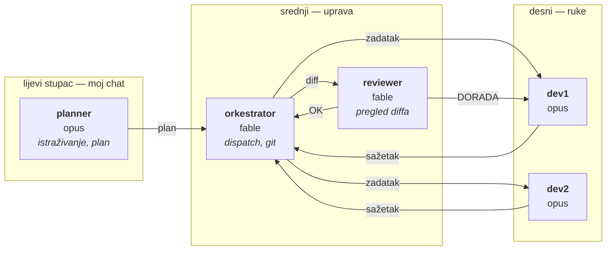
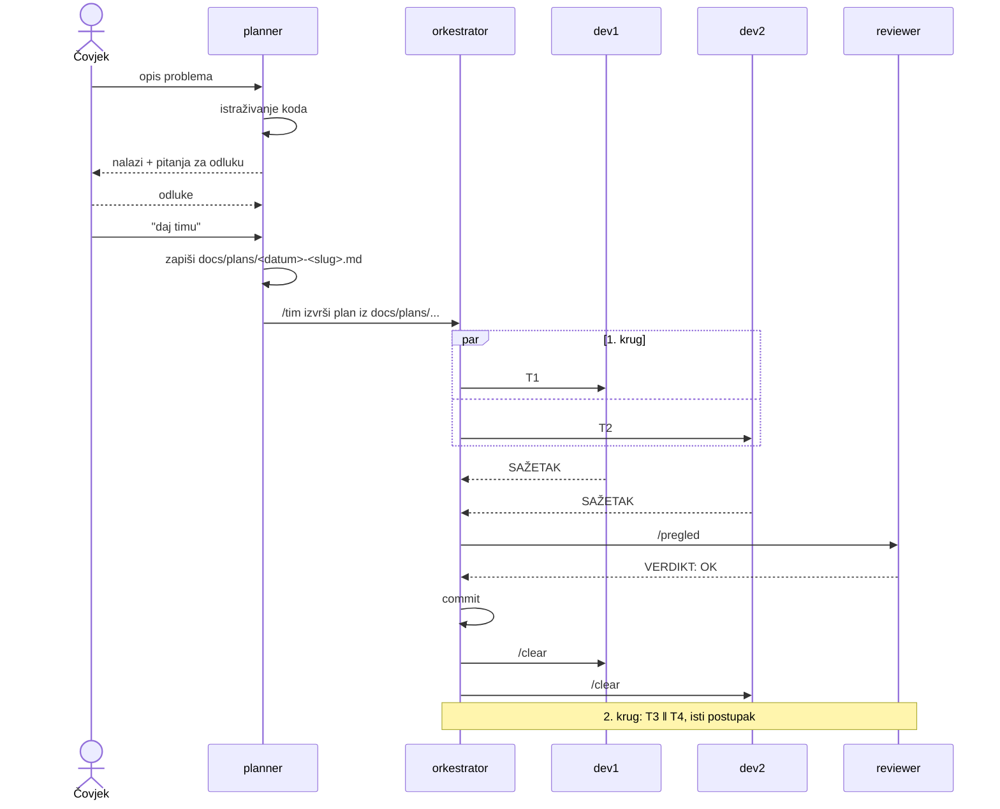
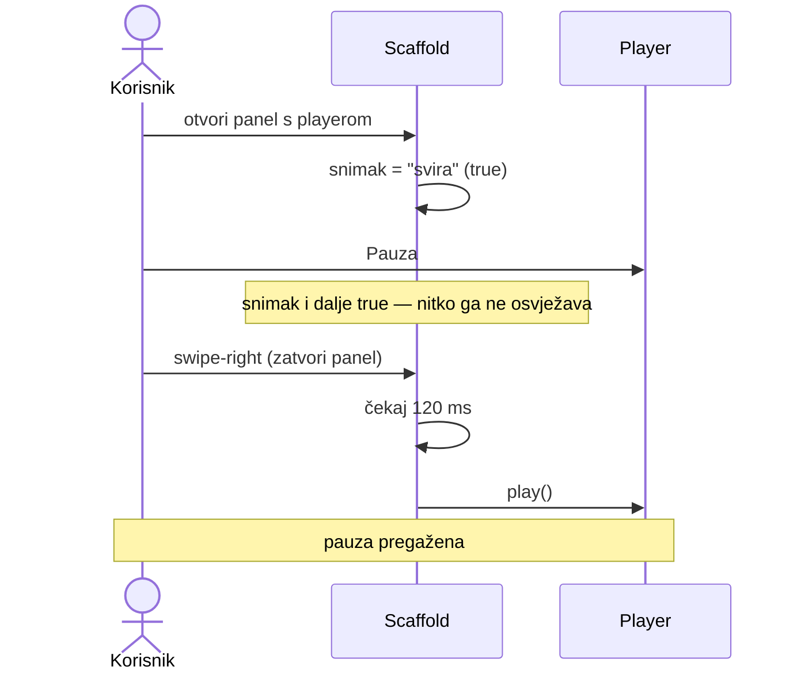
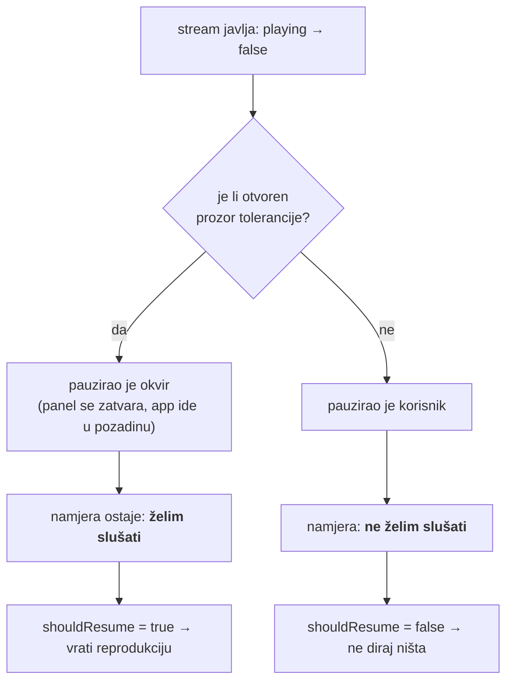
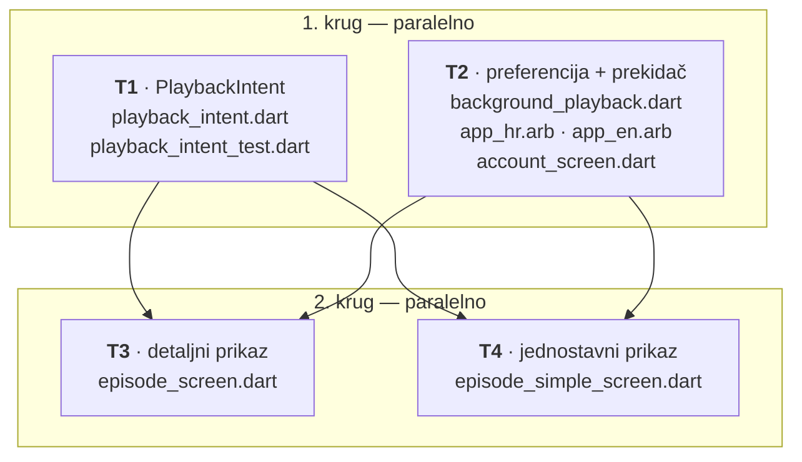

# Pet Claudeova u jednom tmux prozoru: kako smo popravili bug koji je pregazio korisnikovu pauzu

*25. srpnja 2026.*

Ovo je zapis jednog radnog popodneva na aplikaciji [DOMOVINA.ai](https://domovina.ai) —
od trenutka kada sam opisao problem, do trenutka kada je popravak bio u produkciji.
Posao nije radio jedan AI asistent, nego njih pet, svaki u svojem tmux panelu, sa
strogo podijeljenim ulogama. Zanima me je li takva podjela isplativa, pa sam cijeli
prolaz dokumentirao — uključujući ono što nije radilo.

Nije riječ o demonstraciji. Riječ je o stvarnom bugu, stvarnom planu, stvarnom
pregledu i stvarnom deployu.

---

## 1. Problem s jednom sesijom

Prije ovoga radio sam kako većina ljudi radi: otvoriš Claude Code, opišeš posao,
gledaš kako ga izvodi. To odlično funkcionira dok je posao malen.

Kada posao naraste, javljaju se tri pukotine:

1. **Planiranje i izvođenje bore se za isti kontekst.** Dok model piše kod, potiskuje
   iz konteksta ono zbog čega je taj kod takav. Nakon `/clear` znanje je izgubljeno.
2. **Nitko ne provjerava rezultat prije commita.** Model završi sažetkom koji sam
   napiše i sam potvrdi. Kada se pogreška otkrije, kontekst u kojem je nastala odavno
   je pometen.
3. **Nema paralelizma.** Dva neovisna zadatka izvode se jedan za drugim jer postoji
   samo jedan izvršitelj.

Zamisao je bila jednostavna: razdvojiti uloge na zasebne procese, kao u ljudskom timu.

---

## 2. Postava — pet panela

Jedan tmux session, pet Claude Code procesa, jedan čovjek koji tipka **samo u
jednom** od njih.



Podjela modela nije kozmetička, nego proizlazi iz cijene pogreške:

| Panel | Model | Obrazloženje |
|---|---|---|
| planner | **opus** | Kriva odluka u planu množi se s dva izvršitelja. |
| orkestrator | **fable** | Dispatch, čitanje sažetaka, git. Mehanika, ne dubina. |
| reviewer | **fable** | Usklađenost s planom, `flutter analyze`, očite pogreške. Za rizičan diff diže se na opus. |
| dev1, dev2 | **opus** | Pisanje koda. |

Dva pravila drže cijelu konstrukciju:

- **Nijedan agent ne smije pisati u planner panel.** Ondje čovjek tipka; poruka bi
  mu upala usred rečenice. Napredak umjesto toga ide u tmux statusnu traku.
- **Dev1 i dev2 dijele isti radni direktorij.** Nema zasebnih git worktreeova, pa
  izolaciju drži isključivo jedno pravilo iz plana: *popisi datoteka po zadatku moraju
  biti disjunktni*. To nije ukras nego ugovor.

---

## 3. Petlja



Ključan detalj je **redoslijed pregleda i commita**. Reviewer gleda diff *prije*
commita i *prije* `/clear`. Ako traži dorade, one padaju onom izvršitelju koji je kod
i napisao — dok mu je kontekst još živ. To je jedina izmjena u odnosu na raniju
postavu koja je stvarno promijenila ishode.

---

## 4. Posao: „feature koji je toliko agresivan da je bug"

Opis problema koji sam dao planneru glasio je otprilike ovako:

> Slušam podcast na mobitelu, stisnem Pauzu, pa swipe-rightom zatvorim bočni panel
> s playerom — i reprodukcija se **uvijek** nastavi.

Uz to sam tražio da postoji mogućnost reprodukcije u pozadini, ali **pod korisnikovom
kontrolom**, a ne kao trajno nametnuto ponašanje.

### 4.1. Što je istraživanje pronašlo

Planner nije krenuo pisati kod. Pročitao je oba ekrana epizode, servis za pozadinsku
reprodukciju, dijeljeni player wrapper i pomoćnik za nastavak reprodukcije. Pronašao je
**tri** mjesta koja pozivaju `play()` bez korisnikova traženja, a ne jedno:

| # | Okidač | Zaštita |
|---|---|---|
| A | zatvaranje bočnog panela | zastario snimak stanja → **puca** |
| B | odlazak aplikacije u pozadinu | **nikakva** — bezuvjetni `play()` |
| C | ulazak/izlazak iz punog zaslona | ispravna — stanje se hvata neposredno prije radnje |

Prijavljeni bug bio je slučaj **A**:



Snimak stanja uzimao se kada se panel **otvori** i nikada se nije osvježavao. Kod je
znao *da* je nešto pauzirano, ali ne i *tko* je pauzirao — pa je pretpostavljao da je
to bio okvir (Android uništi `SurfaceView` kada widget ode u pozadinu, pa media_kit
sam pauzira).

Slučaj **B** bio je zapravo veći: na mobilnoj aplikaciji pauziraš, stisneš tipku
*home*, a aplikacija te sama otpauzira u pozadini. Bez ikakve mogućnosti isključivanja.

### 4.2. Ograničenje koje je odredilo cijeli dizajn

Prvi nagon je omotati vlastite gumbe za Play/Pauzu i ondje bilježiti namjeru. To ne
radi. Naš player ima uključen `playAndPauseOnTap`, a uz to i ugrađene kontrole te
tipkovničke prečace — sve to interno zove `player.playOrPause()` i **ne daje nam
povratni poziv**. Omatanje naših gumba pokrilo bi manjinu putanja.

Jedini pouzdan izvor istine je stream stanja samog playera.

### 4.3. Rješenje: razdvoji bug od preferencije

Ovdje je planner napravio potez koji smatram najvrjednijim u cijelom prolazu —
razdvojio je dvije stvari koje sam ja u opisu problema pomiješao:

- **„Ne pregazi moju pauzu"** nije preferencija, nego **bug**. Nikakav prekidač to ne
  smije uvjetovati.
- **„Nastavi svirati kad zaključam zaslon"** jest prava **preferencija**, i to je
  prekidač.

Nakon te podjele pokazalo se da popravak buga rješava oko 90 % pritužbe i bez ijedne
nove postavke.

Servis `PlaybackIntent` odgovara na jedno pitanje — *želi li korisnik da ovo svira?*:



Prozor tolerancije otvara se pozivom `suppress()` **neposredno prije** poznate
tranzicije okvira. Unutar njega događaj „pauzirano" ne gasi namjeru; izvan njega je
gasi. Budući da servis sluša stream, media_kitove interne kontrole pokrivene su
besplatno.

Servis prima stream i funkciju za čitanje stanja umjesto samog objekta playera — pa se
može testirati bez media_kita, običnim `StreamController`om.

---

## 5. Plan kao ugovor o izolaciji

Prije pisanja plana planner mi je postavio tri pitanja s preporukama: gdje smjestiti
prekidač, koja je zadana vrijednost i što prekidač znači na webu. To je bilo ispravno
— sve tri odluke mijenjaju opseg posla, a nijedna se ne može izvesti iz koda.

Zatim je posao razrezan tako da se izvršitelji fizički ne mogu sudariti:



Tri odluke u planu vrijedi izdvojiti:

1. **Datoteke s prijevodima dira samo jedan zadatak.** Očekivao sam da će to biti
   glavno mjesto sudara — gotovo svaki zadatak sa sučeljem ih treba. Rješenje je bilo
   svesti ih na jedan zadatak, a ne pokušavati ih dijeliti.
2. **Ulazna točka aplikacije nije dodijeljena nikome.** Poziv za učitavanje nove
   preferencije morao je nekamo, ali `main.dart` bi bio zajednička datoteka dvaju
   paralelnih zadataka. Plan je propisao da se doda tek nakon oba kruga.
3. **Ono što nije provjereno označeno je s `PROVJERITI:`,** a ne pretpostavljeno.
   Dva takva mjesta: fira li povratni poziv za zatvaranje panela prije nego se sadržaj
   ukloni, i stiže li događaj životnog ciklusa prije nego Android ubije `SurfaceView`.
   Uz svaki je opisan i rezervni plan. Izvršitelj to tretira kao prvi korak zadatka,
   a ne kao činjenicu.

---

## 6. Izvođenje

Predaja je jedna linija — putanja, ne sadržaj:

```bash
./scripts/tim-send.sh orkestrator '/tim izvrši plan iz docs/plans/2026-07-25-background-playback-control.md'
```

Nakon toga nisam radio ništa. Tim je odradio oba kruga, reviewer je oba puta napisao
`VERDIKT: OK`, orkestrator je commitao.

Rezultat u brojkama:

| | |
|---|---|
| 1. krug (`870bb34`) | 10 datoteka, +699 / −2 |
| 2. krug (`e7e66ce`) | 4 datoteke, +149 / −51 |
| `PlaybackIntent` | 82 linije koda, 149 linija testa |
| Krugova pregleda | 2, oba `OK` iz prve |
| Sudara na datotekama | 0 |

Reviewer je usput razriješio i prvo `PROVJERITI` iz plana: potvrdio je u Flutterovu
izvornom kodu da se povratni poziv za zatvaranje panela okida na **početku** animacije,
prije nego se sadržaj ukloni — što znači da prozor tolerancije stigne na vrijeme.
Drugo `PROVJERITI` (utrka sa `SurfaceView`om na Androidu) ostavio je izričito
neriješenim, jer se ne može dokazati čitanjem koda.

To smatram ispravnim ponašanjem. Loš pregled bio bi onaj koji tvrdi da je provjerio i
ono što nije mogao.

---

## 7. Deploy

```
✨ Deployment complete!
Cache purged OK
https://domovina.ai/ -> HTTP 200
AASA /auth/* exclusion OK
=== Deployed v2.0.117 ===
```

Wasm prijevod 30,4 s, šest novih datoteka, ponovno preveden worker, pročišćen CDN i
dvije automatske provjere.

---

## 8. Što nije radilo

Najkorisniji dio svakog ovakvog zapisa.

### 8.1. tmux radi podudaranje po prefiksu

`tmux kill-session -t tim` neće javiti pogrešku ako session s tim točnim imenom ne
postoji — pogodit će **prvi koji počinje s „tim"**. Na stroju na kojem paralelno rade
timovi za više projekata to znači da možeš ugasiti tuđi tim.

Rješenje je znak jednakosti, koji traži točno podudaranje:

```bash
tmux kill-session -t "=$(./scripts/tim-status.sh session)"
```

Dodatna zamka: `set-option` i `rename-window` taj prefiks **ne** primaju, dok ga
`has-session`, `attach` i `kill-session` primaju i ondje je obavezan.

### 8.2. Lažna uzbuna: tekst koji nije bio tekst

Ovu sam zamku prvo pogrešno dijagnosticirao, pa je vrijedi ispričati s krivim
zaključkom uključenim.

U orkestratorovu ulaznom polju dvaput sam u ispisu panela vidio rečenicu koja ondje
stoji, a nije poslana — jednom onu koja je počinjala riječju „deployaj". Pomoćnik za
slanje upiše tekst pa zasebno pošalje Enter i **ne čisti liniju**, pa sam zaključio da
se moja poruka lijepi na zatečeni tekst i da je „deployaj" mogao izazvati drugi deploy.

Provjerio sam to umjesto da pretpostavim: poslao sam poruku i odmah pročitao panel.
Stigla je sama, bez ijednog traga zatečene rečenice. Isto i drugi put. Ono što sam
vidio nije bio utipkan tekst nego **prijedlog sljedećeg prompta koji sučelje samo
iscrtava** u ulaznom polju.

Prava pouka nije o slanju poruka, nego o **nadzoru agenata čitanjem njihova
terminala**: snimka panela spljošti nagovještaj i stvarni unos u isti niz znakova.
Ono što izgleda kao stanje često je samo prikaz. Ako se na temelju takve snimke
odlučuje, odluka se mora potvrditi nečim što nije snimka zaslona — u ovom slučaju
ishodom same poruke.

Ostatak opreza je stvaran, ali neispitan: skripta doista ne čisti liniju, pa bi se
tekst koji je čovjek *zaista* utipkao i ostavio neposlanim teoretski spojio s
porukom. Nemam dokaz da se to ikad dogodilo. `send-keys C-u` prije slanja košta ništa
i zatvara i taj slučaj.

### 8.3. Deploy ne zatvara za sobom

Skripta za deploy sama podiže broj verzije, ali je ne commita. Između deploya i ručnog
commita glavna grana ne bilježi što je zapravo u produkciji. Radilo je jer sam
primijetio — što znači da je kandidat za automatizaciju.

### 8.4. Usputno čišćenje izvan popisa datoteka

Jedan izvršitelj je usput počistio dva zatečena upozorenja statičke analize u datoteci
koja nije bila na njegovu popisu. Izmjena je bezopasna i analiza je nakon nje prvi put
posve čista — ali strogo gledano to je kršenje ugovora o izolaciji. Da se dogodilo u
prvom krugu, paralelno s nekim tko dira istu datoteku, bio bi to sudar.

Pouka: „bezopasno" i „izvan opsega" nisu suprotnosti. Pravilo mora biti izričito.

---

## 9. Isplati li se

**Da, kada:**

- posao se prirodno cijepa na dva ili više dijelova bez zajedničkih datoteka;
- promjena dira jezgru proizvoda, pa je neovisan pregled prije commita stvarno vrijedan;
- želiš planirati sljedeći posao dok se prethodni izvodi.

**Ne, kada:**

- posao je jedna datoteka i dvadeset linija — režija dispatcha i pregleda veća je od
  same izmjene;
- opseg još nije jasan. Tim izvodi plan; ako je plan mutan, dobiješ mutan rezultat
  brže i u dva primjerka.

Najveći dobitak nije paralelizam, nego **prisila da se napiše plan s popisom datoteka**.
Taj popis je istovremeno i mehanizam izolacije i provjera je li posao uopće shvaćen.
Kada se ne uspije napisati disjunktan popis, to je znak da posao još nije razumljiv —
i to saznanje dolazi *prije* nego je napisana ijedna linija koda.

---

## 10. Što je ostalo

Jedan dio provjere ne može odraditi nijedan model: matrica na stvarnom uređaju. Pauza
pa swipe-right, tipka *home* s uključenom i isključenom postavkom, zaključan zaslon na
iOS Safariju. Posebno onaj scenarij označen kao rizik — redoslijed događaja životnog
ciklusa i `SurfaceView`a na Androidu — jer se ne da dokazati čitanjem izvornog koda.

Tim je isporučio kod, testove, pregled i deploy. Nije isporučio dokaz da na Androidu
zvuk stvarno ne stane kada stisneš *home*. Tu razliku vrijedi držati na oku.
