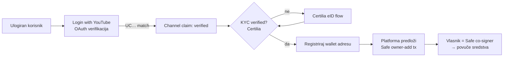
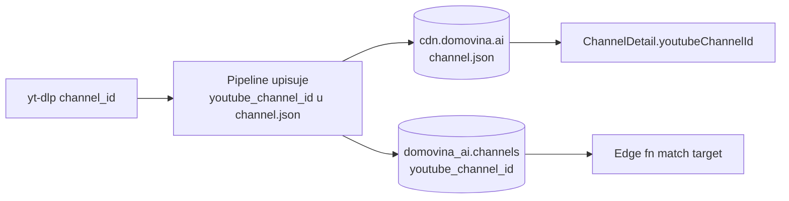
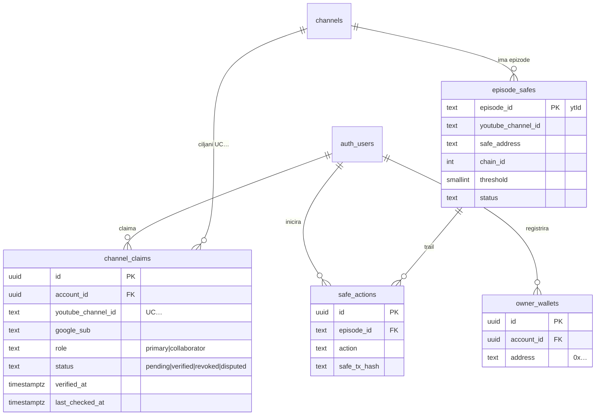
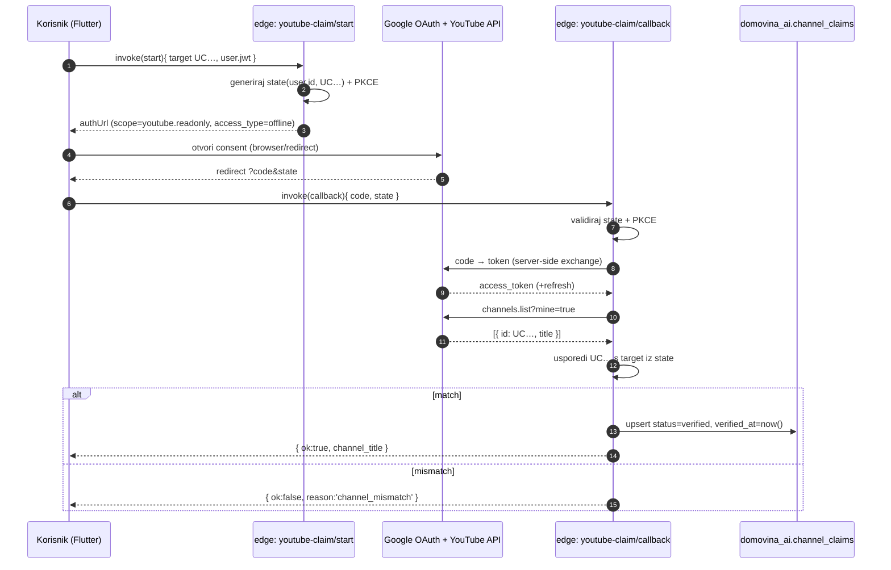
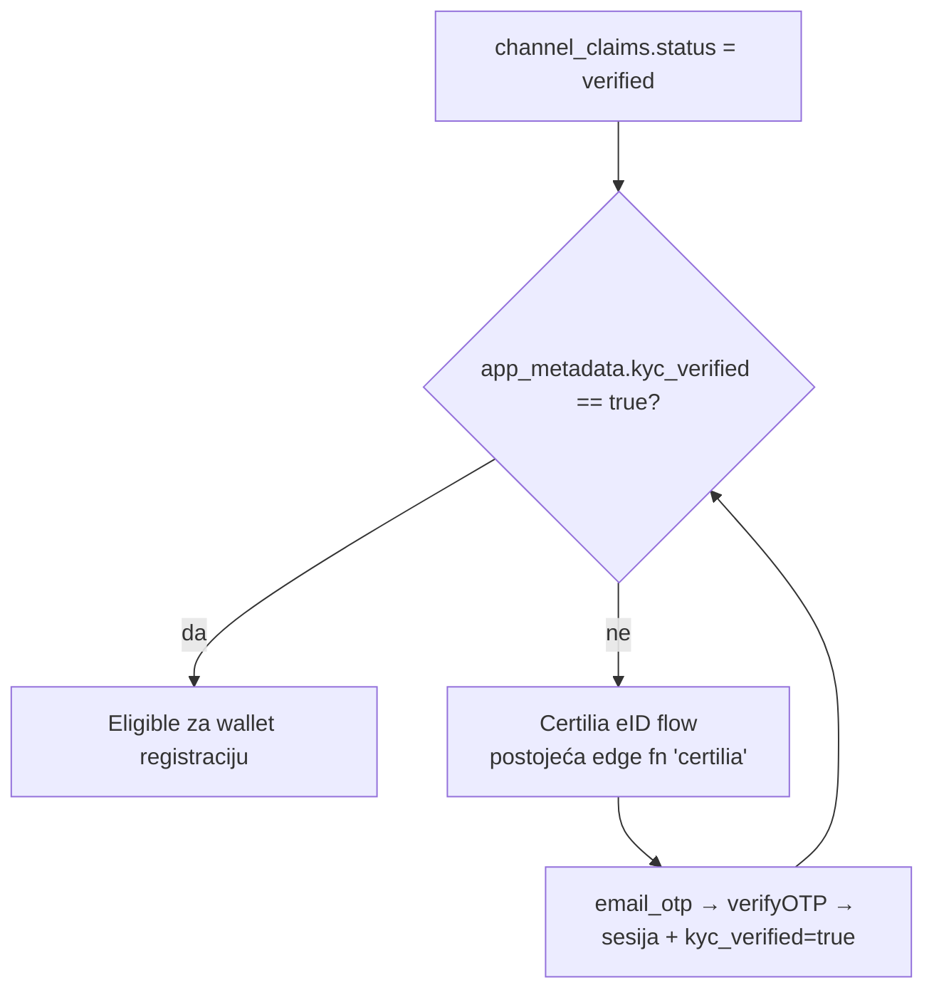
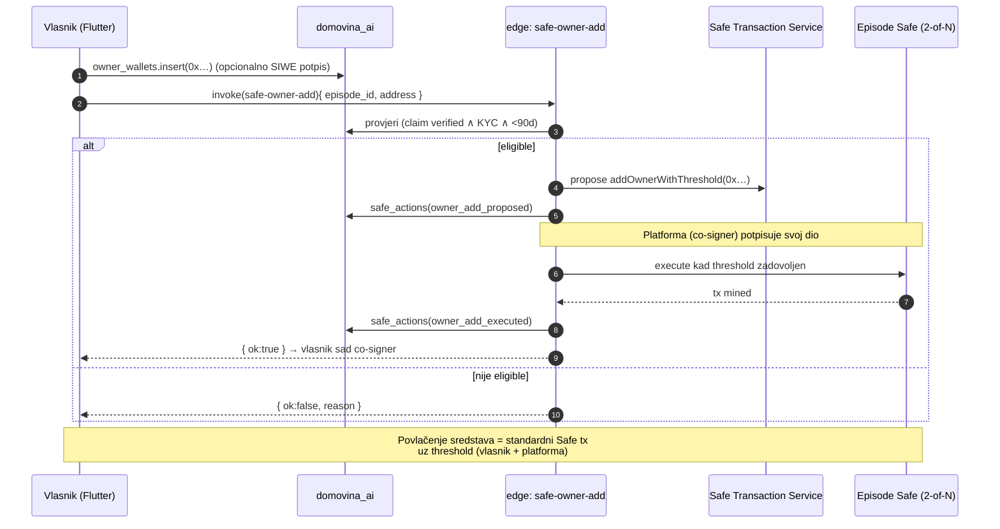
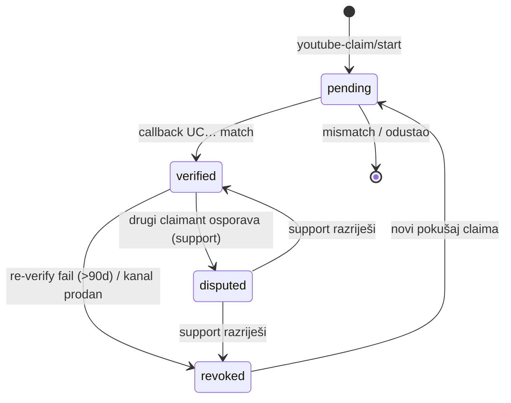

# Channel Ownership Claim & Safe Multisig Payout — DOMOVINA.ai

**Verzija:** v1 — inicijalni plan
**Datum:** 2026-05-30
**Povezani dokumenti:**
- [`auth-and-database-plan-v3.md`](./auth-and-database-plan-v3.md) — temelj schema/RLS/PII principa
- [`supabase-implementation-guide.md`](./supabase-implementation-guide.md) — frontend ↔ backend contract obrazac
- [`compliance/kyc-strategy-and-extensibility.md`](./compliance/kyc-strategy-and-extensibility.md) — KYC (Certilia) strategija
- [`authentication-setup-guide.md`](./authentication-setup-guide.md) — auth provideri, edge funkcije, session bridge

> **Svrha:** ovaj dokument je **single source of truth** za feature "vlasnik kanala / podcast epizode preuzima vlasništvo (claim) i kupi sredstva iz per-epizoda Safe Multisig walleta". Svaka implementacijska odluka (schema, edge funkcije, service sloj, sigurnost) referencira se na ovaj dokument.

---

## 1. Sažetak (TL;DR)

Vlasnik YouTube kanala dokaže da kontrolira `UC…` kanal preko **server-side YouTube OAuth verifikacije** (`channels.list?mine=true`). Nakon dokazanog vlasništva **i** Certilia KYC-a, postaje **co-signer per-epizoda Safe Multisig walleta** te može povući sredstva.



**Tri nezavisna gatea prije novca:** (1) vlasništvo kanala dokazano, (2) identitet (KYC) dokazan, (3) multisig threshold potpis. Nijedan se ne može zaobići s klijenta.

---

## 2. Donesene odluke

Ove četiri odluke su **zaključane** za v1 (preporučeni defaulti prihvaćeni):

| # | Odluka | Izbor v1 | Obrazloženje |
|---|---|---|---|
| D1 | **Granularnost claima** | **Po kanalu** (`UC…`). Epizode nasljeđuju vlasništvo. Safe ostaje per-epizoda. | YouTube vlasništvo je fundamentalno per-channel; `channels.list` ne zna za epizode. |
| D2 | **Više managera istog kanala** | **First-verified = primary.** Dodatni verificirani = `collaborator`. Sporovi → ručni `disputed` status (support). | Brand Account može imati više managera (`mine=true` ih sve vraća); ne želimo lockati legit ekipu, ali novac ide primarnom. |
| D3 | **Payout model** | **Vlasnik se dodaje kao Safe co-signer** (owner-add tx), threshold **2-of-N**. Platforma je trajni co-signer. | Pravi multisig — vlasnik drži svoj ključ, povlačenje uvijek traži threshold. Nema "platforma drži sve". |
| D4 | **Re-verifikacija** | **Da.** Ako je `verified_at` stariji od **90 dana**, claim mora proći re-verifikaciju prije payouta. | Kanal se može prodati/izgubiti; payout je trenutak najveće vrijednosti za napadača. |

---

## 3. Arhitekturalni principi (ovog featurea)

Nadograđuju principe iz [v3 plana](./auth-and-database-plan-v3.md).

### Princip A: Vlasništvo se dokazuje samo server-side
> Channel ID koji dolazi s klijenta **nije dokaz ničega**. Jedini izvor istine je `channels.list?mine=true` poziv koji **edge funkcija** napravi s tokenom dobivenim server-side code exchange-om. Klijent nikad ne vidi access token niti ga može podvaliti.

### Princip B: Money gate = (ownership ∧ KYC ∧ multisig)
> Tri ortogonalna uvjeta. Payout-eligibility je čisti `JOIN` između `channel_claims (verified)` i `kyc_verified=true`. On-chain threshold je treći, nezavisan sloj. Pad bilo kojeg = nema isplate.

### Princip C: PII i tajne ostaju izvan naših tablica (nasljeđuje v3 Princip 1)
> OAuth refresh token (ako ga uopće čuvamo) enkriptira se isto kao OIB u `identity_verifications`. `google_sub` je pseudonimni identifikator — OK za pohranu. Wallet adresa je javni podatak (on-chain), ali se veže na `account_id` pa je tretiramo kao osjetljivu metapodatkovnu vezu (RLS samo vlasnik + service-role).

### Princip D: YouTube OAuth je odvojen od login identiteta
> Verifikacijski OAuth flow **ne ide kroz GoTrue Google providera** — da ne clobbera login session ni GoTrue identity-linking po emailu. Vlastiti Google OAuth client, scope samo `youtube.readonly`, incremental authorization. Rezultat se veže na **već ulogiranog** korisnika (bilo kojim providerom).

---

## 4. Preduvjet — Faza 0: kanonski `UC…` channel ID

**Trenutno stanje (istraženo):** app nosi samo `ytId` (video), `youtubeChannelUrl` (handle/`/c/` URL) i interni slug (npr. `ad_deum_podcast`). **Nigdje nema pouzdanog `UC…` kanala** u runtime modelu. `PodcastInfo.channelId` dolazi iz yt-dlp-a (`json['channel_id']`) — to **jest** `UC…` na izvoru, ali se ne propagira konzistentno.

Bez stabilnog `UC…` nema čvrste verifikacije. Zato Faza 0:

1. **Pipeline** (`fetch.domovina.tv`): trajno upiši `youtube_channel_id` (`UC…`) u `channel.json` (izvor: yt-dlp `channel_id`).
2. **Backend**: `domovina_ai.channels` (ili ekvivalent) dobiva kolonu `youtube_channel_id TEXT` + index.
3. **Flutter**: `ChannelDetail` / `ChannelSummary` izlažu `youtubeChannelId`.
4. **Validacija**: `UC…` mora matchati `^UC[0-9A-Za-z_-]{22}$`.



---

## 5. Data model

### 5.1 Nove tablice

```sql
-- Claim vlasništva nad YouTube kanalom
create table domovina_ai.channel_claims (
  id                  uuid primary key default gen_random_uuid(),
  account_id          uuid not null references auth.users(id) on delete cascade,
  youtube_channel_id  text not null check (youtube_channel_id ~ '^UC[0-9A-Za-z_-]{22}$'),
  channel_title       text,
  google_sub          text not null,          -- Google account koji je dokazao vlasništvo
  role                text not null default 'primary'
                        check (role in ('primary','collaborator')),
  status              text not null default 'pending'
                        check (status in ('pending','verified','revoked','disputed')),
  method              text not null default 'youtube_oauth',
  verified_at         timestamptz,
  last_checked_at     timestamptz,            -- za 90-dnevnu re-verifikaciju (D4)
  created_at          timestamptz not null default now(),
  -- samo JEDAN primary po kanalu (D2); collaboratori neograničeno
  constraint one_primary_per_channel
    exclude (youtube_channel_id with =) where (role = 'primary' and status = 'verified')
);

-- Per-epizoda Safe Multisig
create table domovina_ai.episode_safes (
  episode_id          text primary key,        -- ytId epizode
  youtube_channel_id  text not null,           -- denormalizirano za payout JOIN
  safe_address        text not null,
  chain_id            integer not null,        -- npr. 8453 (Base), 100 (Gnosis)
  threshold           smallint not null default 2,
  status              text not null default 'active'
                        check (status in ('active','frozen','settled')),
  created_at          timestamptz not null default now()
);

-- Registrirana wallet adresa vlasnika (EOA za co-signer)
create table domovina_ai.owner_wallets (
  id            uuid primary key default gen_random_uuid(),
  account_id    uuid not null references auth.users(id) on delete cascade,
  address       text not null check (address ~ '^0x[0-9a-fA-F]{40}$'),
  verified_at   timestamptz,                  -- opcionalno: SIWE potpis
  created_at    timestamptz not null default now(),
  unique(account_id, address)
);

-- Audit trail za on-chain akcije (proposal/exec)
create table domovina_ai.safe_actions (
  id            uuid primary key default gen_random_uuid(),
  episode_id    text not null references domovina_ai.episode_safes(episode_id),
  account_id    uuid references auth.users(id),
  action        text not null,                -- 'owner_add_proposed','owner_add_executed','payout_proposed', ...
  safe_tx_hash  text,
  payload       jsonb,
  created_at    timestamptz not null default now()
);
```

### 5.2 ER dijagram



### 5.3 RLS (sažetak)

- `channel_claims`: `SELECT/INSERT` vlasnik (`account_id = auth.uid()`); `UPDATE status/verified_at` **samo service-role** (edge fn). Korisnik nikad sam ne postavlja `verified`.
- `episode_safes`: `SELECT` javno (read-only metapodaci); `INSERT/UPDATE` service-role.
- `owner_wallets`: full CRUD samo vlasnik.
- `safe_actions`: `SELECT` vlasnik povezane epizode; `INSERT` service-role.

---

## 6. Tok 1 — YouTube ownership verifikacija

Obrazac 1:1 prema postojećem Certilia flowu (start/callback edge funkcije).



**Sigurnosne točke (vidi §9):** code exchange isključivo server-side; `state` vezan na ulogiranog korisnika i ciljani `UC…`; PKCE; `mine=true` pokriva delegirane managere (Brand Account) — prihvatljivo po D2.

### Zašto odvojen OAuth, a ne GoTrue Google?
GoTrue Google login ne nosi `youtube.readonly` scope i auto-linka identitete po emailu (rizik clobbera). Verifikacija je **akcija nad postojećim računom**, ne login. Zato vlastiti OAuth client + incremental authorization (Princip D).

---

## 7. Tok 2 — KYC gate (Certilia)



KYC se **ne duplicira** — koristi se postojeći `kyc_verified` flag iz `auth.users.app_metadata` (vidi [kyc-strategy](./compliance/kyc-strategy-and-extensibility.md)). Payout-eligibility = `verified claim` ∧ `kyc_verified` ∧ (`verified_at` mlađi od 90 dana, inače re-verify D4).

---

## 8. Tok 3 — Safe Multisig payout



**Napomena:** on-chain dio (Safe Transaction Service integracija, koji chain, tko plaća gas) je zaseban implementacijski radni paket — ovaj dokument definira **interface** (`episode_safes`, `owner_wallets`, `safe_actions`, edge fn `safe-owner-add`), ne konkretni SDK. Crypto sloja u kodu trenutno **nema** (istraženo).

---

## 9. Lifecycle stanja claima



---

## 10. Edge funkcije (nove)

Sve u git source-u, deploy preko `deploy-functions.sh` (postojeći obrazac).

| Funkcija | Ulaz | Izlaz | Uloga |
|---|---|---|---|
| `youtube-claim/start` | `target UC…` (+ JWT) | `authUrl` | Generira OAuth URL, `state`+PKCE vezan na usera |
| `youtube-claim/callback` | `code`, `state` | `{ok, channel_title}` | Server-side exchange + `channels.list?mine=true` + match + upsert claim |
| `youtube-claim/reverify` | `claim_id` | `{ok}` | D4: ponovi `channels.list` ako `verified_at` > 90d |
| `safe-owner-add` | `episode_id`, `address` | `{ok, safe_tx_hash}` | Eligibility check + Safe owner-add proposal/exec |

---

## 11. Flutter service sloj

Novi `lib/services/channel_ownership_service.dart` po uzoru na `favorites_service` / `handoff_service`:

```dart
// schema-qualified read + edge function invoke (postojeći obrazac)
final claim = await client.schema('domovina_ai')
    .from('channel_claims')
    .select()
    .eq('youtube_channel_id', ucId)
    .maybeSingle();

final res = await client.functions.invoke('youtube-claim/start',
    body: {'channelId': ucId});
// → otvori res['authUrl'] (web: redirect; native: in-app browser → deep link)
```

- Web: redirect + `state` callback ruta (kao OAuth deep links setup).
- Native: `ai.domovina://` scheme callback (postojeći deep-link handling).
- Wallet registracija: novi mali `wallet_service.dart` (`owner_wallets` CRUD + opcionalni SIWE potpis).

---

## 12. Sigurnosna razmatranja

| Rizik | Mitigacija |
|---|---|
| Klijent podvali channel ID | Verifikacija isključivo server-side preko `channels.list?mine=true` (Princip A) |
| OAuth code interception / replay | PKCE + `state` vezan na `user.id`+`UC…`, jednokratan, kratak TTL |
| Token leak | Access token nikad ne napušta edge fn; refresh token enkriptiran kao OIB |
| Kanal prodan nakon claima | 90-dnevna re-verifikacija prije payouta (D4); `revoked` stanje |
| Self-payout bez identiteta | KYC gate (Certilia) prije wallet registracije |
| Jednostrano povlačenje | 2-of-N multisig — platforma uvijek co-signer |
| Otimanje primary uloge | `exclude` constraint (jedan verified primary po kanalu) + `disputed` flow |
| Phishing lažnog consent ekrana | Flow uvijek kroz našu `start` edge fn; korisnik vidi Google-ov pravi consent |

---

## 13. Fazni rollout

| Faza | Sadržaj | Ovisnost |
|---|---|---|
| **0** | Kanonski `UC…` u pipeline → `channel.json` → DB → Flutter model | — |
| **1** | `youtube-claim/start` + `/callback`, `channel_claims` tablica + RLS, Flutter claim UI | 0 |
| **2** | KYC gate wiring (reuse Certilia), eligibility view | 1 |
| **3** | `episode_safes` + `owner_wallets` + wallet registracija UI | 2 |
| **4** | `safe-owner-add` edge fn + Safe Transaction Service integracija (on-chain) | 3 |
| **5** | `reverify` (D4) + `disputed` admin flow + `safe_actions` audit UI | 4 |

---

## 14. Otvorena pitanja (za kasnije, ne blokiraju v1)

1. **Koji chain** za Safe? (Base / Gnosis Chain / Optimism) — gas i ekosistem.
2. **Tko plaća gas** za owner-add i payout? (platforma sponzorira vs vlasnik).
3. **Punjenje Safe-a** — odakle sredstva po epizodi dolaze (revenue share model)? Izvan opsega ovog dokumenta.
4. **SIWE** (Sign-In with Ethereum) za dokazivanje vlasništva wallet adrese — nice-to-have ili obavezno prije owner-add?
5. **Collaborator payout split** (D2) — dijele li collaboratori sredstva ili samo primary povlači?

---

---

## 15. Status implementacije

**Flutter klijent — IMPLEMENTIRANO** (ovaj repo):

| Faza | Klijentski artefakt | Status |
|---|---|---|
| 0 | `ChannelDetail/ChannelSummary.youtubeChannelId`, `PodcastInfo.youtubeChannelId`, `kYoutubeChannelIdPattern`+`canonicalUcId()` | ✅ |
| 1 | `models/channel_claim.dart`, `services/channel_ownership_service.dart` (start/callback/reverify/myClaims) | ✅ |
| 2 | `models/payout_eligibility.dart` (ownership∧KYC∧svježina) | ✅ |
| 3 | `models/owner_wallet.dart`, `services/wallet_service.dart` | ✅ |
| 4 | `models/episode_safe.dart`, `services/safe_service.dart` (requestOwnerAdd) | ✅ |
| 5 | `screens/ownership/channel_ownership_screen.dart` (claim flow + callback + Moji kanali), 3 go_router rute, ulazi iz channel SliverAppBar + account_chip popup | ✅ |
| — | `test/channel_ownership_test.dart` (18 testova: UC parsing, D4, eligibility, EVM) | ✅ |

**Backend — SPEC SPREMAN, ČEKA IMPLEMENTACIJU** (`domovina-api` repo):
- SQL migracije + 2 edge funkcije (`youtube-claim`, `safe-owner-add`) →
  [`backend-prompts/09-channel-ownership.md`](./backend-prompts/09-channel-ownership.md).
- Dok backend nije gore, klijentski pozivi vraćaju kontrolirane greške
  (FunctionException → mapirane HR poruke), UI ne puca.

**Pipeline — ČEKA** (`fetch.domovina.tv` repo):
- Faza 0 preduvjet: upis `youtube_channel_id` (`UC…`) u `channel.json`.
  Dok ga nema, "Preuzmi vlasništvo" akcija je skrivena (fallback na
  `/channel/UC…` URL parsing radi za kanale koji ga već imaju u URL-u).

---

> **Status:** Flutter klijent kompletan (Faze 0–5). Backend i pipeline koraci
> dokumentirani kao deklarativni prompti. Promjene odluka (D1–D4) zahtijevaju
> update ovog dokumenta — on je single source of truth.
