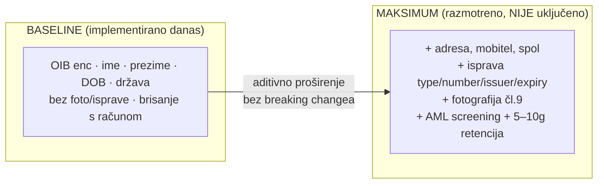
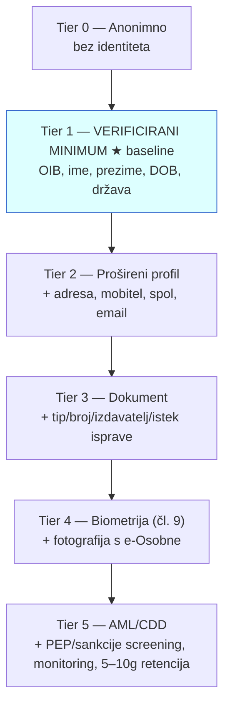
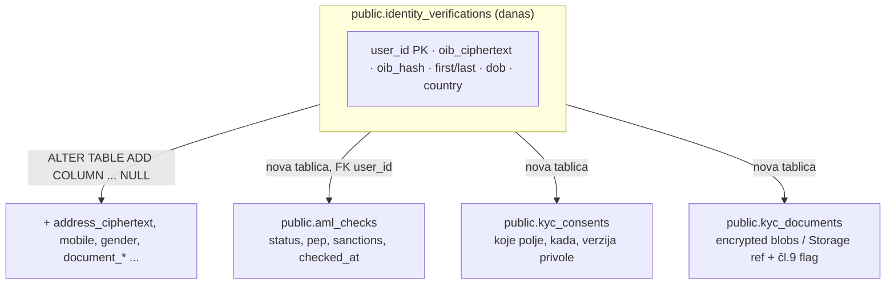
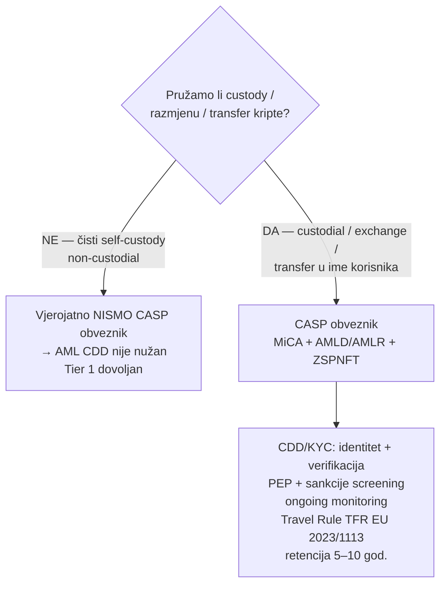
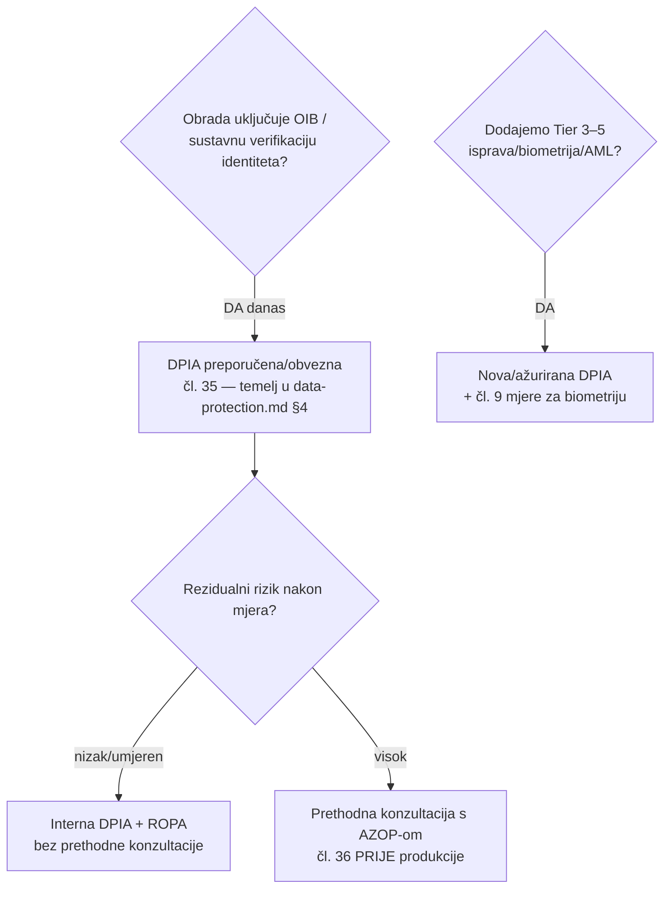
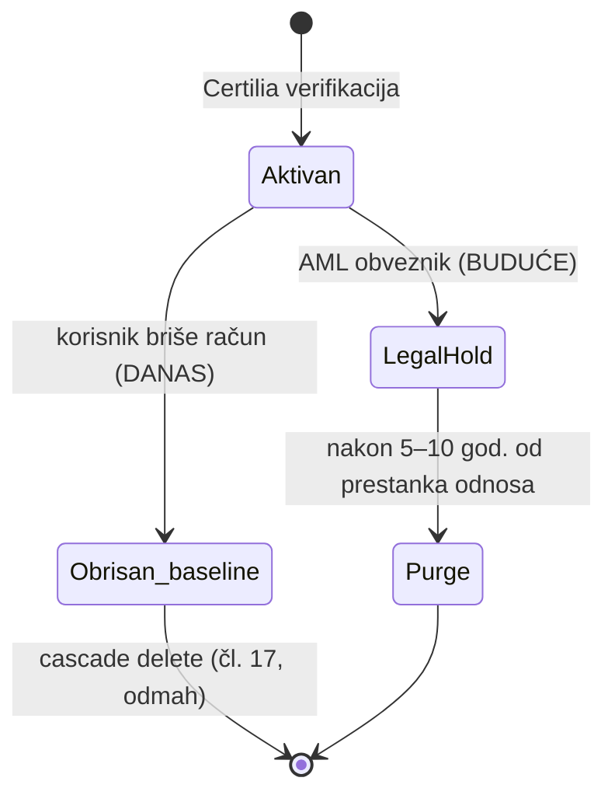

# KYC strategija, opseg i proširivost — odluke i roadmap

Ovaj dokument hvata **punu širinu** KYC-a koju smo razmotrili (uključujući
najširi mogući opseg radi budućeg **AML**-a i self-custody walleta), što je
**odabrano kao baseline danas**, i **kako jednostavno + backward-kompatibilno
proširiti** kad zahtjevi narastu. Služi kao trajna referenca: *"od 2026-05-29
znamo da smo sve ovo razmotrili i svjesno odabrali minimum, uz dizajn koji se
širi bez breaking changea."*

> **NACRT / inženjerski okvir — nije pravni savjet.** AML i AZOP/DPIA dijelovi su
> prijedlozi za raspravu s odvjetnikom/DPO-om. Vidi [`README.md`](README.md).
> Tehnička implementacija: [`data-protection.md`](data-protection.md) §2,
> [`../authentication-setup-guide.md`](../authentication-setup-guide.md) §B.5.

---

## Sadržaj
1. [TL;DR — baseline vs maksimum](#1-tldr--baseline-vs-maksimum)
2. [Spektar KYC opsega](#2-spektar-kyc-opsega)
3. [Matrica podataka (Certilia → DB)](#3-matrica-podataka-certilia--db)
4. [Backward-kompatibilan model proširenja](#4-backward-kompatibilan-model-proširenja)
5. [AML / self-custody wallet](#5-aml--self-custody-wallet)
6. [AZOP / DPIA odluke](#6-azop--dpia-odluke)
7. [Retencija — lifecycle](#7-retencija--lifecycle)
8. [Decision log](#8-decision-log)

---

## 1. TL;DR — baseline vs maksimum

**Odabrano (2026-05-29):** verificirani minimum + pgcrypto + brisanje s računom.
**Razlog:** GDPR minimizacija (čl. 5(1)(c)) — najniži rizik, ali identitet je i
dalje pravno verificiran (Certilia je provjerila ispravu). Sve šire opcije su
**dizajnirane da se mogu dodati kasnije bez migracije koja ruši postojeće**.

## 2. Spektar KYC opsega

Svaki viši tier **povećava regulatorni teret** (consent, DPIA, čl. 9 mjere, AML
obveze). Penjemo se tek kad konkretna funkcija to zahtijeva.

## 3. Matrica podataka (Certilia → DB)

Certilia forma nudi sva polja; mi biramo. "Status" = trenutno stanje.

| Certilia polje | Tier | Osjetljivost | Status danas | Kako uključiti |
|---|---|---|---|---|
| OIB / `pin` | 1 | nacionalni ID (visoka) | ✅ enc (pgcrypto) | — |
| First/Last name | 1 | osnovna | ✅ | — |
| Birthdate | 1 | osnovna | ✅ | — |
| Country | 1 | niska | ✅ | — |
| Email | 2 | osnovna | ⚠️ samo ako Certilia vrati (kao login email) | dodati u mandatory |
| Mobile | 2 | osnovna | ❌ | nullable kolona + claim |
| Address | 2 | umjerena | ❌ | nullable (razmisli enc) + claim |
| Gender | 2 | umjerena | ❌ | nullable kolona + claim |
| Document type/number/issuer/expiry | 3 | visoka | ❌ | enc kolone + claim + DPIA update |
| Photo | 4 | **čl. 9 biometrija** | ❌ (namjerno) | poseban režim: eksplicitni consent, DPIA, čl. 9 mjere |
| Organization | 2 | niska | ❌ | nullable kolona |

## 4. Backward-kompatibilan model proširenja

**Ključni princip:** sve nadogradnje su **aditivne** — postojeći redovi, RPC-evi
i klijent nastavljaju raditi.

**Pravila proširenja (da ostane backward-compatible):**
1. **Nove kolone uvijek `NULL`-able** (ili s defaultom) → stari redovi validni, stari INSERT-i rade.
2. **RPC `upsert_identity_verification`**: dodaj nove parametre **s `DEFAULT`** na kraju (npr. `p_address text default null`) → postojeći pozivi (imenovani argumenti) rade nepromijenjeno. Alternativa: `…_v2` RPC, stari ostaje.
3. **Enkripcija novih osjetljivih polja** istim `pgcrypto` obrascem (`*_ciphertext bytea`); ključ ostaje u env-u.
4. **Edge fn**: čita više claimova samo ako su prisutni (`payload.x ?? null`) → ne lomi se ako Certilia ne vrati polje.
5. **RLS ostaje service-role-only**; klijent dobiva širi subset preko **nove verzije** `my_identity_status()` (ili dodatnih ključeva u jsonb-u — aditivno).
6. **Retencija**: prelazak s `cascade delete` na soft-delete + purge job je aditivan (dodaj `deleted_at` + scheduled `pg_cron`).
7. **`raw_claims`**: ako ikad zatreba puni audit, dodaj `extended_ciphertext bytea` (enc cijeli claim set) — i dalje minimizacija na razini pristupa.

> Posljedica: **danas ne plaćamo cijenu širine, ali smo je omogućili.** Prelazak
> Tier 1 → Tier 3/5 je serija `ADD COLUMN`/nova tablica + nekoliko redaka u edge
> fn-u, bez izmjene postojećih ugovora.

## 5. AML / self-custody wallet

> Najširi razlog za KYC. **Pravna primjenjivost ovisi o tome jesmo li "obveznik".**

**Bitna distinkcija:** *self-custody* (korisnik sam drži ključeve, mi ne držimo
sredstva ni ne izvršavamo transakcije) općenito **ne** čini DOMOVINA-u CASP
obveznikom → tada je Tier 1 (verificirana osoba) dovoljan i AML CDD nije obveza.
Čim se uvede **custody, razmjena ili transfer u ime korisnika**, postaje se
obveznik (MiCA + AML okvir + hrvatski ZSPNFT) i aktivira se puni CDD.

**Što AML (Tier 5) dodaje kad/ako postanemo obveznik:**
- **CDD/KYC**: već imamo verificirani identitet (Certilia eID = jaka verifikacija);
  dodati screening (PEP, sankcijske liste), risk scoring.
- **Ongoing monitoring** transakcija + sumnjive transakcije (prijava Ureda/FIU).
- **Retencija 5 god.** (moguće do 10) nakon prestanka odnosa — **mijenja** našu
  "briši s računom" politiku u legal-hold (vidi §7).
- **Travel Rule** za transfere ≥ prag.
- Nova tablica `aml_checks` + audit (vidi §4 dijagram).

**Implikacija na danas:** baseline (Tier 1) je **savršena polazna točka** za AML —
identitet je već pravno verificiran; AML sloj je aditivan (screening + retencija +
monitoring), ne zahtijeva ponovni onboarding korisnika.

## 6. AZOP / DPIA odluke

**Stav danas (Tier 1):** DPIA temelj postoji u `data-protection.md §4`; rezidualni
rizik je nizak zbog enkripcije + minimizacije + service-role pristupa →
vjerojatno **bez prethodne konzultacije**, ali DPO to formalno potvrđuje.

**Trigeri za novu/ažuriranu DPIA + moguću AZOP konzultaciju:**
- uvođenje **fotografije** (čl. 9 biometrija) — gotovo sigurno visok rizik;
- uvođenje **podataka o ispravi** (Tier 3);
- **AML monitoring + profiliranje** (sustavno praćenje → visok rizik);
- bilo koji **prijenos izvan EU** novih kategorija.

**AZOP napomene:** pod GDPR-om nema općeg registra obrada (ukinuto), ali:
ROPA (čl. 30) mora postojati i biti dostupan na zahtjev; DPIA (35) za visok
rizik; prethodna konzultacija (36) ako mjere ne spuste rizik; prijava povrede
(33) u 72 h. Sve pokriveno u `data-protection.md`.

## 7. Retencija — lifecycle

**Danas:** brisanje računa → trenutni cascade delete KYC-a (pravo na zaborav).
**Ako AML:** prelazak na *legal-hold* — KYC se zadržava zakonski određeno
razdoblje i nakon brisanja računa (pravo na zaborav je ograničeno čl. 17(3)(b)
zbog zakonske obveze). Implementacija: soft-delete `deleted_at` + `pg_cron` purge
nakon roka. **Aditivno** — ne dira baseline shemu.

## 8. Decision log

| Datum | Odluka | Razlog | Reverzibilno? |
|---|---|---|---|
| 2026-05-29 | KYC opseg = **Tier 1** (verificirani minimum) | GDPR minimizacija; identitet ipak verificiran | da — aditivno na više tierove |
| 2026-05-29 | **Bez fotografije** (čl. 9) | izbjeći biometrijske obveze dok nisu nužne | da — uz DPIA + čl. 9 mjere |
| 2026-05-29 | **pgcrypto** enkripcija OIB-a, ključ u env | breach mitigation, "reguliran" standard | da |
| 2026-05-29 | **Brisanje s računom** (ne fiksna retencija) | nema AML obveze (self-custody) danas | da — prelazak na legal-hold kad/ako AML |
| 2026-05-29 | **sub-derived** synthetic email (ne OIB) | spriječiti OIB plaintext u auth.users.email | da |

---

_Zadnje ažurirano: 2026-05-29. Vlasnik: ‹DPO / voditelj obrade›. Ažurirati pri
svakoj promjeni tiera ili uvođenju walleta/AML-a._
