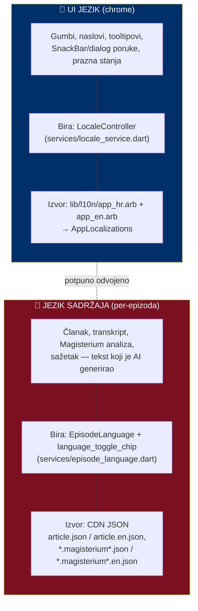
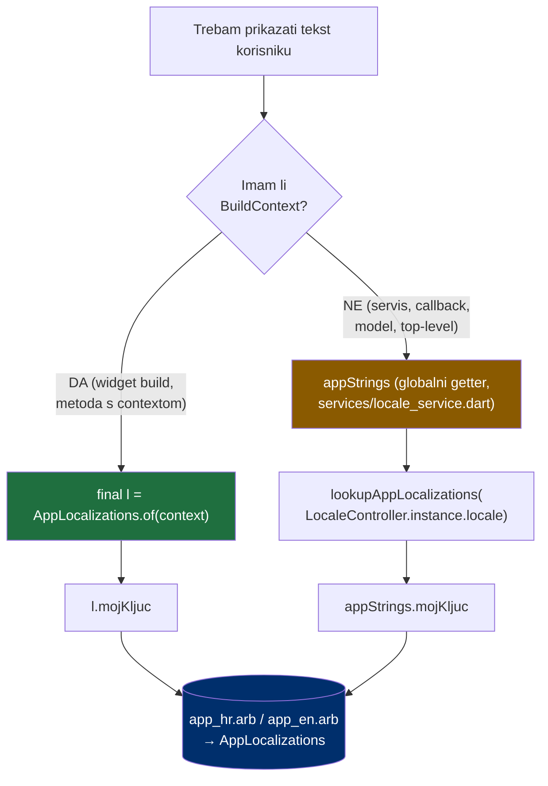
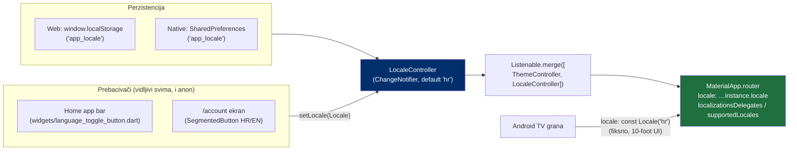
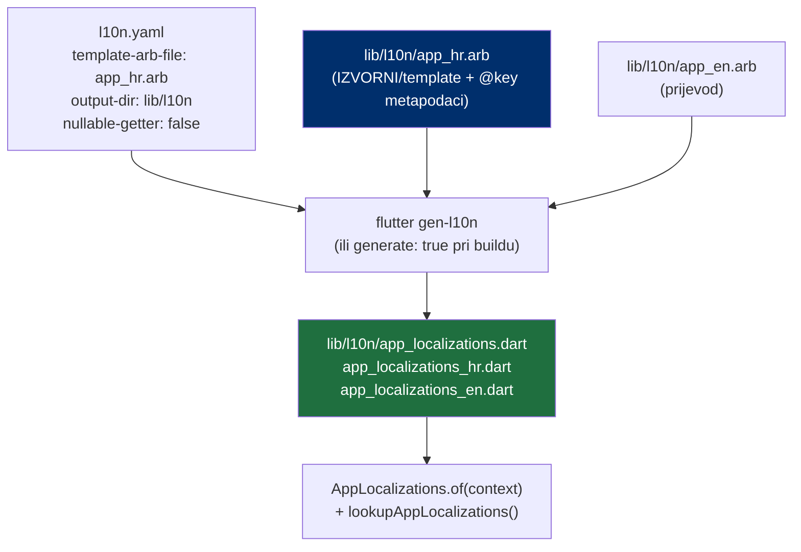
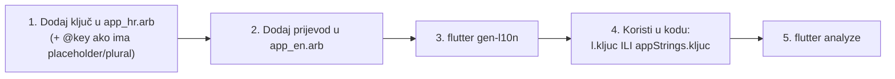
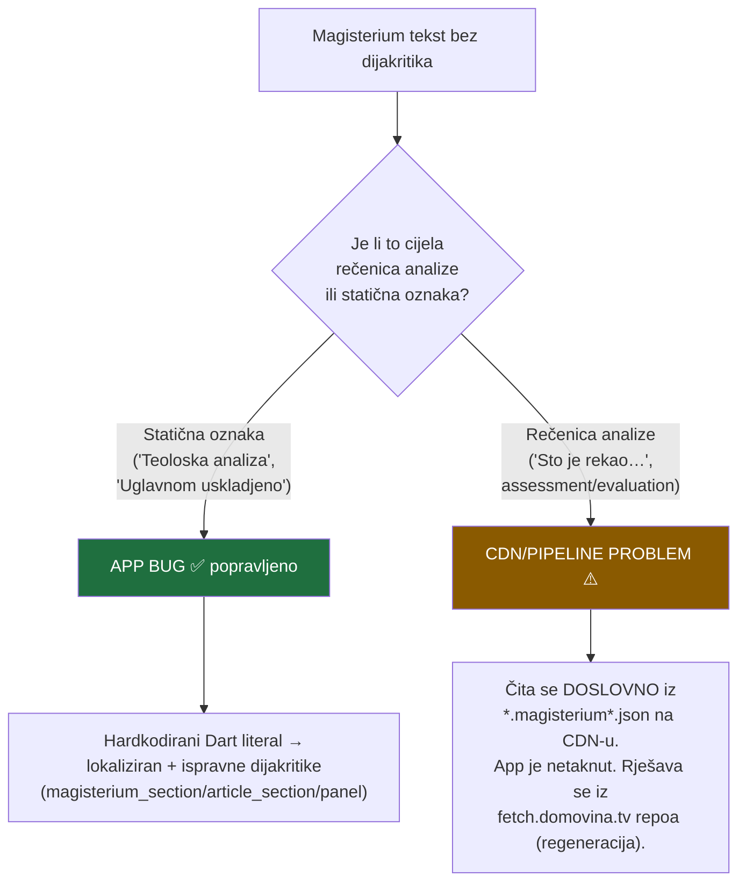
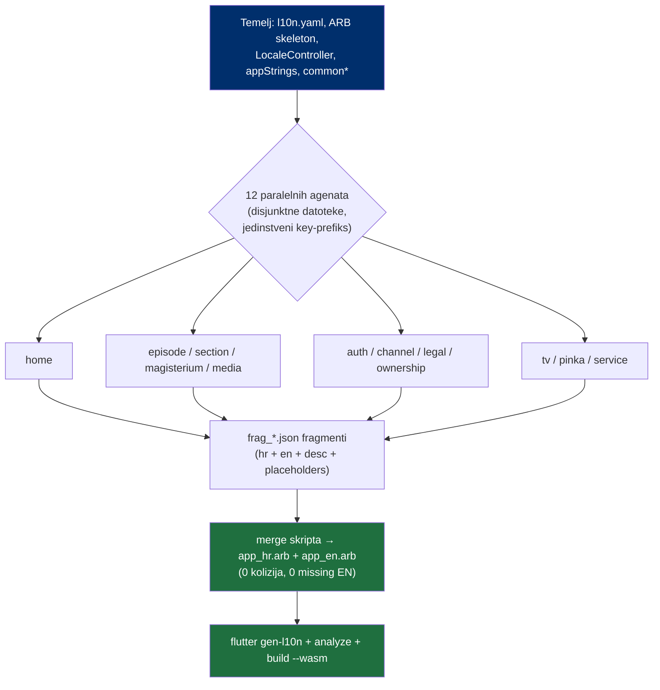

# Internationalization & Localization (i18n)

> Kako DOMOVINA.ai lokalizira korisničko sučelje. Hrvatski je izvorni jezik,
> engleski drugi. Sustav je uveden 2026-07 punom ekstrakcijom ~756 stringova
> kroz ~50 datoteka na Flutter `gen-l10n` (ARB).
>
> Sažeta verzija pravila živi u `CLAUDE.md` (sekcija "Internationalization");
> ovaj dokument je puna referenca s dijagramima.

---

## 1. Dva jezika, dva sustava — UI jezik ≠ jezik sadržaja

Najvažniji koncept. Aplikacija ima **dva neovisna** jezična sloja koja se lako
pobrkaju:



| | UI jezik (chrome) | Jezik sadržaja (per-epizoda) |
|---|---|---|
| **Što** | Gumbi, oznake, poruke | AI-generirani članak/Magisterium/sažetak |
| **Kontroler** | `LocaleController` | `EpisodeLanguage` + `LanguageToggleChip` |
| **Izvor teksta** | ARB (`app_*.arb`) | CDN JSON (`*.json` / `*.en.json`) |
| **Doseg** | Cijela aplikacija | Jedan ekran epizode |
| **Lokalizira se kroz ARB?** | **DA** | **NE** — `pickLang(...)` bira CDN varijantu |

> **Pravilo**: CDN/model tekst se NIKAD ne lokalizira kroz ARB. U ARB idu samo
> **hardkodirani** Dart literali. Ako je rečenica došla s `cdn.domovina.ai`,
> to nije app string.

---

## 2. Razrješavanje stringa (string resolution)

Kako kod dođe do prevedenog teksta — ovisi ima li `BuildContext`:



- **U widgetu** (ima context): `AppLocalizations.of(context)`. Prati `Localizations`
  scope; ispravno reagira na promjenu jezika.
- **Bez contexta** (servisi, modeli, async callbackovi): globalni `appStrings`
  getter. Interno `lookupAppLocalizations(LocaleController.instance.locale)` —
  ne treba widget tree.

```dart
// widget
final l = AppLocalizations.of(context);
return Text(l.homeSearchTooltip);

// servis / bez contexta
import '.../services/locale_service.dart';
throw AuthFailure(appStrings.serviceSignInFailed);
```

---

## 3. Odabir i perzistencija jezika



- `main.dart` poziva `LocaleController.instance.init()` prije `runApp` (uz
  `ThemeController.init()`).
- Mobile/web `MaterialApp.router` sluša `Listenable.merge([Theme, Locale])` pa se
  rebuilda na promjenu jezika; `locale: LocaleController.instance.locale`.
- **Android TV** je fiksno `Locale('hr')` (jedno tržište, 10-foot UI) — i dalje
  prolazi delegate da EN postoji u buildu.
- **Default**: hrvatski (novi korisnik bez spremljene vrijednosti).
- **Imena jezika u prebacivačima su endonimi** ("Hrvatski"/"English") — NAMJERNO
  neprevedena, da ih korisnik prepozna neovisno o aktivnom jeziku. NISU u ARB-u.

---

## 4. Konfiguracija i datoteke



| Datoteka | Uloga |
|---|---|
| `l10n.yaml` | Konfiguracija gen-l10n |
| `lib/l10n/app_hr.arb` | **Izvorni** jezik + `@key` metapodaci (description, placeholders, ICU plural) |
| `lib/l10n/app_en.arb` | Engleski prijevod (samo vrijednosti) |
| `lib/l10n/app_localizations*.dart` | **Generirano** — ne uređuj ručno |
| `lib/services/locale_service.dart` | `LocaleController` + `appStrings` getter |
| `pubspec.yaml` | `flutter_localizations`, `intl: any`, `generate: true` |

---

## 5. Konvencija imenovanja ključeva (key prefixes)

Svaki ključ ima prefiks područja. Time se izbjegava kolizija i lako se grupira.
(Tijekom inicijalne migracije svaki je paralelni agent imao svoj prefiks → 0
kolizija pri spajanju 756 ključeva.)

```mermaid
mindmap
  root((ARB ključevi))
    common*
      "dijeljeno: Odustani, Zatvori,<br/>Pokušaj ponovno, Greška…"
    home*
    episode*
    section*
      "članak/sažetak/poglavlja/govornici"
    magisterium*
    media*
      "video/player/favorit/tema"
    auth*
      "account + onboarding + prijava"
    channel*
      "kanal/pretraga/paywall/booking"
    legal*
    ownership*
    tv*
    pinka*
    service*
      "servisne poruke (appStrings)"
```

- `common*` — stringovi dijeljeni kroz aplikaciju; provjeri postoji li prije nego
  dodaš novi.
- ICU plural za brojive imenice (hrvatski **one/few/other**), npr.
  `{count, plural, one{...} few{...} other{...}}`.
- Placeholderi: `{name}`, `{count}`, `{date}` — definirani u `@key.placeholders`.

---

## 6. Kako dodati novi string (recept)



1. **Uvijek prvo HR** (izvorni jezik), pa EN.
2. Prefiks po području; `common*` ako je dijeljeno.
3. `flutter gen-l10n` (ili samo build — `generate: true`).
4. Widget → `AppLocalizations.of(context)`; bez contexta → `appStrings`.

---

## 7. Registar i lektura (brand voice)

> **Pravilo (ton)**: aplikacija oslovljava korisnika **neformalno „ti"** — topao,
> izravan glas, usklađen s pinka SDK-om. **Iznimka**: outreach poruke trećim
> stranama (npr. `ownershipInviteMessage` — poruka vlasniku kanala kojeg ne
> poznaješ) i pravni/formalni tekst → tu je „Vi" ispravno. Ne miješaj registar
> unutar istog konteksta.

> **Pravilo (lektor)**: svaki user-facing string ima ispravne dijakritike
> (č/ć/š/ž/đ), gramatiku i pravopis po **Hrvatskom pravopisu IHJJ**
> ("sažetci", "pogreške", "adresa e-pošte" ne "email adresa"). Deanglicizacija gdje
> postoji prirodna hrvatska riječ ("ocjena" ne "score"). **Bez ALL-CAPS u ARB
> vrijednostima** — vizualni caps radi se u kodu preko `.toUpperCase()` na već
> lokaliziranom stringu. Hrvatski navodnici „…".

---

## 8. Magisterium dijakritike — analiza uzroka

Korisnik je prijavio Magisterium rečenice bez dijakritika ("Sto je rekao…").
Uzrok je **dvojak** i kritično ih je razlikovati:



- **App-side (popravljeno ovdje)**: statične oznake bile su pisane bez dijakritika
  → sada lokalizirane i ispravne ("Teološka analiza", "Usklađenost s katoličkim
  naukom i Svetim pismom", "Uglavnom usklađeno"…).
- **CDN-side (NIJE app bug)**: same rečenice analize (`assessment`, `enrichment`,
  `concerns`, `evaluation`, `score_interpretation`) dolaze s CDN-a preko
  `pickLang(...)`. Popravak = regeneracija pipeline-a iz `fetch.domovina.tv`
  (Magisterium = MCP-only; vidi feedback pravilo o radu iz fetch repoa).

---

## 9. Proces inicijalne migracije (povijesno)

Migracija ~756 stringova izvedena je paralelno, fan-out po području, da se izbjegne
ručni serijski rad i konflikti:



Ključ uspjeha: **jedinstveni prefiks po agentu** (nema kolizije ključeva) +
**disjunktni skupovi datoteka** (nema konflikta editova) + **fragment-datoteke**
umjesto dijeljenog ARB-a (nema race na zapisivanju). Spajanje je deterministička
skripta.

---

## 10. Poznati TODO-ovi

- **Datumi (mjeseci/dani)**: `widgets/founder_booking.dart` koristi ručne hrvatske
  nizove naziva (`_hrWeekdayShort`, `_hrMonthsGen`). Za pravu lokalizaciju datuma
  treba `intl` `DateFormat` s locale podrškom (bilo je van opsega string-ekstrakcije).
- **CDN Magisterium/članci**: lokalizacija sadržaja je odvojen pipeline posao
  (`fetch.domovina.tv`), ne app.
- **Pretvaranje preostalih ALL-CAPS dizajna**: gdje dizajn traži velika slova,
  vrijednost ostaje normal-case u ARB-u, a `.toUpperCase()` se primjenjuje u kodu.

---

## 11. Brza referenca

```dart
// 1. Widget s contextom
final l = AppLocalizations.of(context);
Text(l.homeSearchTooltip);
Text(l.commonRetry);
Text(l.sectionAgeDays(daysCount));            // ICU plural

// 2. Bez contexta (servis/model/callback)
import '.../services/locale_service.dart';
SnackBar(content: Text(appStrings.serviceSignedInAs(name)));

// 3. Promjena jezika
LocaleController.instance.setLocale(const Locale('en'));
LocaleController.instance.toggle();           // HR ↔ EN

// 4. Regeneracija nakon uređivanja ARB-a
//    flutter gen-l10n   (ili samo flutter build — generate: true)
```
