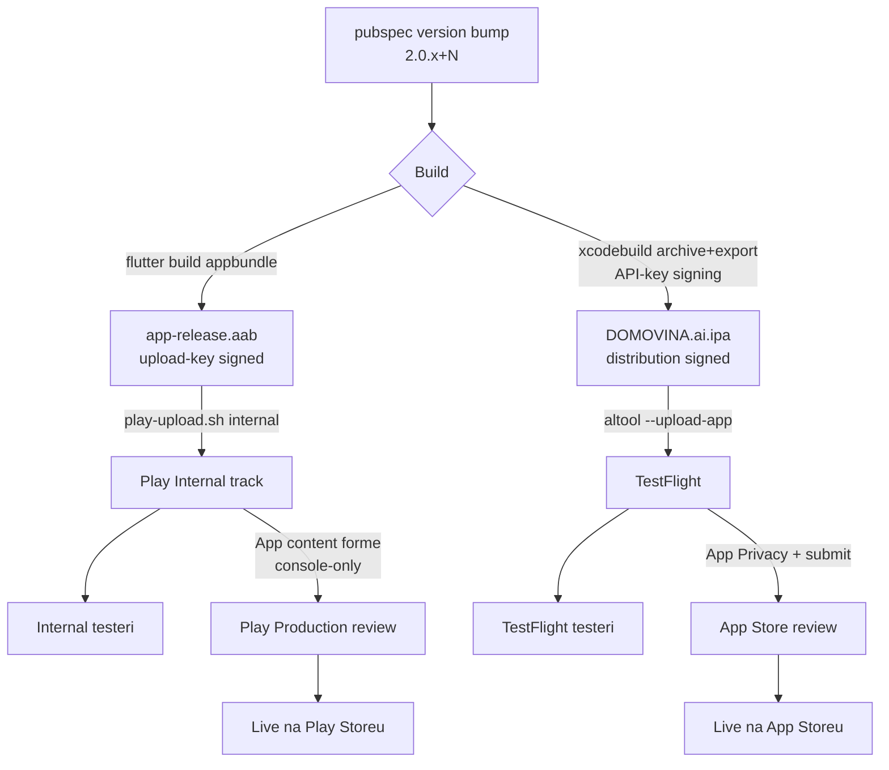
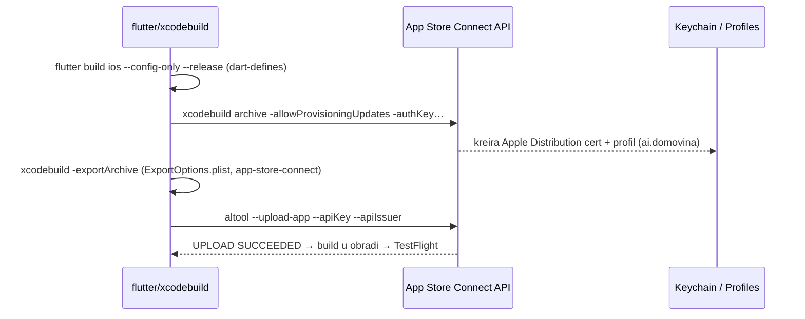
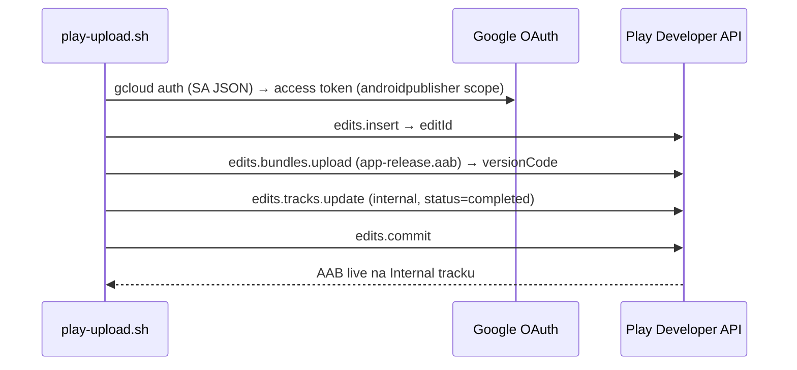
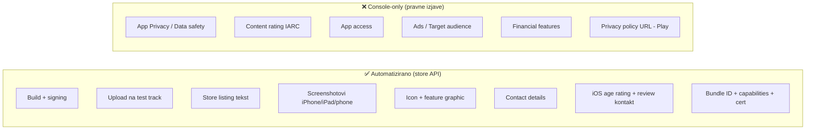
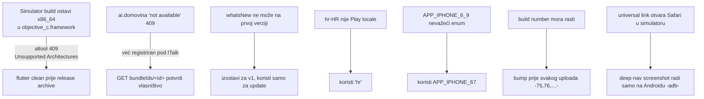

# Mobile Release Pipeline — App Store + Google Play

Kompletan pipeline za build i objavu DOMOVINA.ai mobilne aplikacije na
**App Store (TestFlight → Production)** i **Google Play (Internal → Production)**,
maksimalno automatiziran preko store API-ja. Brzi runbook s komandama je u
[`release-mobile.md`](release-mobile.md); ovaj dokument objašnjava arhitekturu,
tokove i zamke.

## Identifikatori

| Stavka | Vrijednost |
|---|---|
| Bundle / Application ID | `ai.domovina` |
| Apple Team | `6SCK58757K` (ITalk d.o.o.) |
| App Store app id | `6781716801` |
| ASC API key id / issuer | `25KYCN22QD` / `69a6de85-…` (.p8 u `~/.appstoreconnect/private_keys/`) |
| Android upload keystore | `android/upload-keystore.jks`, alias `upload` (gitignored) |
| Play service account | `play-publisher@domovina-production.iam.gserviceaccount.com` (JSON u `~/.config/play-publisher/`) |
| GCP projekt | `domovina-production` (androidpublisher API enabled) |

> Tajne (`.p8`, keystore, `key.properties`, SA JSON) **nikad** ne idu u repo.

## Tok cijelog releasea

## iOS: signing + upload (zašto NE `flutter build ipa`)

ITalk team nema certifikat u keychainu niti je Apple ID prijavljen u Xcode,
pa automatsko potpisivanje kroz `flutter build ipa` **pada na exportu**. Umjesto
toga vozimo `xcodebuild` direktno s **App Store Connect API key** autentikacijom
(`-allowProvisioningUpdates`), koji programatski kreira distribution cert +
App Store provisioning profil i registrira capabilitye.

**Preduvjeti koji su jednom riješeni preko ASC REST API-ja** (`asc-token.rb` + curl):
registracija bundle ID-a `ai.domovina`, uključen `ASSOCIATED_DOMAINS` capability
(za `applinks:domovina.ai`), kreiran App Review kontakt, age rating 4+,
listing metadata, screenshotovi.

## Android: upload preko Play Developer API

## Što je automatizirano vs. console-only

Store **API-ji ne izlažu** policy/compliance izjave (i Apple i Google ih drže
ručnima jer su pravne). Preporučeni odgovori su u [`release-mobile.md`](release-mobile.md).

## Screenshotovi

- **Izvor**: debug build na iOS Simulatoru (iPhone 16 Pro Max 6.9" = 1320×2868,
  PT-iPad13-181 = 2064×2752) i fizičkoj Motoroli edge 30 ultra (1080×2400) preko `adb`.
- **Display type enumi (ASC API)**: 6.9"/6.7" iPhone = `APP_IPHONE_67` (NE `APP_IPHONE_6_9`),
  iPad 13" = `APP_IPAD_PRO_3GEN_129`.
- **Upload**: `asc-upload-screenshot.rb` (reserve → PUT binary → commit s md5) za iOS;
  `edits.../phoneScreenshots` za Android.
- **Kurirani setovi**: `store-assets/{ios-iphone,ios-ipad,android,play-graphics}/`.
- **Clean status bar**: iOS `simctl status_bar override`, Android systemui demo mode.
- **PII**: izbjegavati login/account ekrane koji otkrivaju email; koristiti logged-out stanje.

## Zamke (naučeno)

- **iOS rebuild uvijek**: `flutter clean` → `--config-only` → `xcodebuild archive` →
  `-exportArchive` → `altool`. Ne miješati sa simulator buildovima bez clean-a.
- **Build number**: TestFlight i Play odbijaju ponovljeni `versionCode`/build; uvijek bump.
- **App supports iPad** (`TARGETED_DEVICE_FAMILY = "1,2"`) → iPad screenshotovi su
  **obavezni** za App Store; Android tablet je opcionalan.

## Skripte

| Skripta | Što radi |
|---|---|
| `scripts/build-mobile-release.sh [android\|ios\|all]` | release AAB/IPA s dart-defines iz `.env`; iOS ide kroz `flutter clean` → `--config-only` → `xcodebuild archive`/`-exportArchive` s ASC API key (ne `flutter build ipa`) |
| `scripts/play-upload.sh [internal\|production]` | upload AAB na Play track (SA auth); release name čita iz pubspec-a |
| `scripts/testflight-upload.sh` | upload IPA na TestFlight (`altool` + ASC API key) |
| `scripts/play-promote.sh <vc> [track] [notes-hr]` | promocija VEĆ uploadanog versionCodea na production (bez re-uploada; re-upload istog vc-a pada) |

## Production promocija (programski — radi otkad su console forme jednom ispunjene)

- **Android**: `./scripts/play-promote.sh 96 production "Novosti: …"` — edits.insert →
  tracks.update(production, postojeći versionCode, releaseNotes `hr`) → commit.
  Google review krene automatski.
- **iOS** (ASC REST, sve preko `asc-token.rb` JWT-a):
  1. `POST /v1/appStoreVersions` (`versionString`, rel. app) → `PREPARE_FOR_SUBMISSION`
     (lokalizacije se naslijede s prethodne verzije).
  2. `PATCH /v1/appStoreVersionLocalizations/<locId>` s `whatsNew` (obavezno za update).
  3. Pričekaj `processingState=VALID` builda, pa
     `PATCH /v1/appStoreVersions/<id>/relationships/build`.
  4. `POST /v1/reviewSubmissions` (platform IOS) → `POST /v1/reviewSubmissionItems`
     (rel. appStoreVersion) → `PATCH reviewSubmissions submitted=true` → `WAITING_FOR_REVIEW`.
  - `ITSAppUsesNonExemptEncryption=false` u Info.plist → nema export-compliance prompta.
| `scripts/asc-token.rb` | mint ASC API JWT (ES256) |
| `scripts/asc-upload-screenshot.rb <locId> <displayType> <png>` | upload iOS screenshota |
