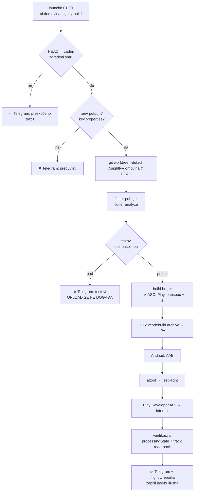

# Nightly store build — TestFlight + Play internal, svaku noć

Dopuna `docs/mobile-release-pipeline.md`: ondje je **ručni** put (build → upload →
promocija), ovdje je **automatski noćni** koji taj put vozi sam u 01:00 kad ima
novih commitova, i javlja ishod u Telegram grupu.

Cilj nije objava. Cilj je da na oba storea **uvijek stoji svjež, provjeren build**
spreman za promociju, i da se pokvareni build otkrije isto jutro, a ne dva tjedna
kasnije kad ga zatrebaš.



## Zašto baš ovako

**Odvojeni git worktree.** Nightly nikad ne gradi iz tvog radnog direktorija.
U 01:00 ondje lako leži nedovršen WIP, a `flutter clean` iz iOS grane bi ti
usput obrisao artefakte. Worktree je detached na HEAD shi u
`../.nightly-domovina`, s `.env` i `android/key.properties` simlinkanim iz
glavnog repoa. Čisti se s `git clean -fd` **bez `-x`**, pa ignorirani artefakti
(`build/`, `.dart_tool/`, Pods) prežive i sljedeći build je topao.

**Build broj se računa, ne bumpa.** `BUILD_NUMBER = max(ASC, Play, pubspec) + 1`,
proslijeđen kroz `--build-number` (`Info.plist` već koristi
`$(FLUTTER_BUILD_NUMBER)`). Zato:
- pubspec.yaml se **ne mijenja i ne commita** — nightly nema pisanja u git,
- kolizija s već uploadanim buildom je nemoguća (Play odbija ponovljeni
  `versionCode`, TestFlight ponovljeni build),
- `deploy.sh` i dalje bumpa verziju za web kako je bumpao; nightly se samo
  penje iznad onoga što na storeovima stvarno postoji.

Ime verzije ostaje ono iz pubspeca. Dva nightlyja s istim imenom verzije su u
redu — razlikuju se build brojem.

**Zamka koja je ovo skoro pojela:** `xcodebuild -exportArchive` po defaultu ima
`manageAppVersionAndBuildNumber = true` — pri App Store distribuciji **sam pita
App Store Connect i prepiše `CFBundleVersion` na „zadnji + 1"**. Izmjereno
2026-08-13 izolirano: ista arhiva ima 158, izvezena IPA 159, bez ijednog traga u
`.xcdistributionlogs`. Dok se to ne isključi, iOS broj dolazi od Applea a Android
od nas — i razilaze se čim Play prestigne ASC. `ios/ExportOptions.plist` zato
eksplicitno postavlja `manageAppVersionAndBuildNumber = false`.

**Rule: nightly gradi iz HEAD-a, pa izmjene skripti vrijede tek nakon commita.**
Worktree je `git checkout --detach <sha>` — necommitane promjene u
`scripts/build-mobile-release.sh` (ili bilo čemu drugom) nightly jednostavno ne
vidi. Ovo je namjerno (build mora biti reproducibilan iz gita), ali zna zbuniti:
mijenjaš skriptu, a ponašanje se ne mijenja.

**Testovi su tvrda vrata, s eksplicitnim baselineom.** Pad testa → nema uploada.
Ali dva testa padaju i na čistom mainu, pa bi „sve mora biti zeleno" značilo da
se nikad ništa ne uploada. Popis izuzetih je u `.nightly/test-baseline.txt`
(jedini praćeni fajl u `.nightly/`). Nightly ih **svejedno vrti** i ako prorade,
javi 🎉 da ih makneš — inače baseline tiho trune i pokriva prave regresije.

**Verifikacija nakon uploada.** HTTP 200 na uploadu ne znači da je build dobar:
Apple obrađuje asinkrono i ITMS-90xxx odbijenice stižu tek minutama kasnije.
Nightly zato do 45 minuta (`NIGHTLY_TF_POLL_MIN`) polla `processingState` za taj
build broj i tek onda javlja ✅ ili ⚠️. Prozor je bio 20 min i to je bilo premalo —
izmjereno 2026-08-13: build 159 se ni 25 minuta nakon uploada još nije pojavio u
`/v1/builds`. „Još se obrađuje" NIJE greška, samo Appleov red čekanja. Za Play čita natrag internal track i provjeri da je
`versionCode` stvarno ondje.

## Datoteke

| Putanja | Uloga |
|---|---|
| `scripts/nightly-build.sh` | orkestrator (guard → worktree → vrata → build → upload → verifikacija → Telegram) |
| `scripts/store-status.rb` | stanje oba storea; `--json` za skriptu, `--max-build` za build broj |
| `scripts/telegram-notify.rb` | slanje u grupu (chunking, retry, supergroup migracija, **redakcija tajni**) |
| `scripts/telegram-chatid.rb` | jednokratno otkrivanje `chat_id`-a |
| `launchd/ai.domovina.nightly-build.plist` | raspored 01:00 |
| `.nightly/test-baseline.txt` | poznati crveni testovi, izuzeti iz vrata (praćen u gitu) |
| `.nightly/logs/`, `.nightly/reports/`, `.nightly/last-built-sha` | lokalno stanje (ignorirano) |

## Ručno pokretanje

```bash
./scripts/nightly-build.sh --force --skip-upload   # cijeli put bez diranja storeova
./scripts/nightly-build.sh --force                 # pravi run
./scripts/nightly-build.sh --no-telegram           # bez notifikacije
./scripts/store-status.rb                          # gdje su storeovi sada
```

## Instalacija launchd agenta

```bash
cp launchd/ai.domovina.nightly-build.plist ~/Library/LaunchAgents/
launchctl bootstrap gui/$(id -u) ~/Library/LaunchAgents/ai.domovina.nightly-build.plist
launchctl print gui/$(id -u)/ai.domovina.nightly-build | head -20   # provjera
launchctl kickstart -k gui/$(id -u)/ai.domovina.nightly-build       # ručni okid
launchctl bootout gui/$(id -u)/ai.domovina.nightly-build            # gašenje
```

**Rule**: mora biti **LaunchAgent** (`gui/$(id -u)`), nikad LaunchDaemon.
`xcodebuild` potpisivanje traži otključan login keychain, a njega ima samo
korisnikova Aqua sesija. Daemon bi vidio zaključan keychain i visio.

**Rule**: `ProgramArguments[0]` je `/opt/homebrew/bin/bash`. `/bin/bash` je 3.2 i
nema `mapfile`; skripta se doduše sama re-execa na brew bash, ali plist to radi
eksplicitno da se ne oslanjamo na dva mehanizma.

Mac mini je na `sleep 0` / `displaysleep 0` (`pmset -g custom`) pa se raspored u
01:00 ispali pouzdano. Ako se to ikad promijeni, launchd će job pokrenuti tek
kad se stroj probudi — a ne u 01:00.

## Telegram

Grupa je **javna**, pa `telegram-notify.rb` prije slanja **redigira**: svaku
vrijednost iz `.env` dulju od 8 znakova, JWT-olike nizove, desnu stranu svakog
`--dart-define=KEY=VALUE` i bot tokene u URL-ovima. To je važno jer poruka o padu
nosi zadnjih ~1800 znakova build loga, a `flutter build … --dart-define=…` zna
završiti u ispisu greške.

**Rule**: sve što ide u Telegram mora proći kroz `telegram-notify.rb`. Ne slati
`curl`-om izravno na Bot API iz drugih skripti — zaobišao bi redakciju.

Preneseno iz `ms-toptal-projects/tools/job-watch/src/notify.js`:
- **supergroup migracija** — grupa promoviranjem u supergrupu dobije **novi**
  `chat_id`, a stari zauvijek vraća 400. Odgovor nosi `migrate_to_chat_id`;
  slijedimo ga i zapišemo u `.env`.
- **chunking na 3800** znakova (Telegram hard limit 4096), lom po recima.
- **retry** na 429/5xx uz `retry_after`.
- **poruka i na prazan dan** — 💤 „nema novih commitova" se šalje namjerno:
  njezin izostanak je jedini signal da je launchd crknuo.

Notifikacija je non-fatal: ako Telegram padne, build i upload i dalje vrijede.

## Disk je preduvjet, ne detalj

Nightly prije svega provjeri prostor i padne odmah s jasnom porukom ako ga nema.
Razlog je izmjeren 2026-08-13: boot volumen je bio na ~3 GiB slobodno i Android
build je pao nakon 3 minute uz

```
Failed to release lock on Build Output Cleanup Cache
Could not add entry ':shared_preferences_android:compileReleaseKotlin' to cache executionHistory.bin
[!] Gradle does not have execution permission.   ← Flutterova KRIVA dijagnoza
```

Nigdje ne piše „nema mjesta na disku". Bez preflighta bi se to svaku noć javljalo
kao misteriozan Gradle lock problem.

Pragovi (env-podesivi): `NIGHTLY_MIN_FREE_BOOT_GB` (default 20),
`NIGHTLY_MIN_FREE_DD_GB` (default 15).

**DerivedData je na vanjskom disku** — `IDECustomDerivedDataLocation` pokazuje na
`/Volumes/DOMOVINA2TB/xcode_temp_files/DerivedData/` (exFAT). Preflight provjeri i
da je taj volumen montiran, jer nakon reboota ili odspajanja `xcodebuild` padne s
2000 redaka ispisa koji nikad ne kažu „nema diska".

Najveći potrošači na ovom stroju (mjereno 2026-08-13): `~/Library/Containers/com.docker.docker`
30 GB (Docker.raw, od čega je reclaimable samo ~3 GB jer 19 kontejnera aktivno radi),
`~/.gradle` 14 GB, `~/fvm/versions` 5,8 GB (četiri Flutter SDK-a).

### Build artefakti idu u APFS sparsebundle na vanjskom disku

**Rule: NIKAD ne stavljati cache s puno sitnih datoteka izravno na
`/Volumes/DOMOVINA2TB`.** Taj exFAT ima **alokacijski blok od 524 288 bajtova** —
svaka datoteka, ma kako mala, zauzme pola megabajta. Izmjereno 2026-08-13:
Gradle home od 14 GB u 156 394 datoteke narastao je pri kopiranju na **41 GB** i
pojeo 44 GB slobodnog prostora prije nego je prekinut.

Rješenje je isti obrazac koji projekt već koristi za Android emulator: APFS
kontejner *unutar* exFAT diska.

```
/Volumes/DOMOVINA2TB/domovina_ai_build_files/DOMOVINA_BUILD.sparsebundle   (200 GB max, sparse)
  └── montiran na /Volumes/DOMOVINA_BUILD   (APFS, blok 4096 B)
        ├── gradle/         ← GRADLE_USER_HOME; ~/.gradle je simlink ovamo
        └── derived-data/   ← BUILD_DERIVED_DATA za xcodebuild
```

Kontejner se montira na dva načina, oba potrebna:
- `launchd/ai.domovina.build-volume.plist` (RunAtLoad) — da nakon reboota
  `~/.gradle` simlink ne bude slomljen za **interaktivne** Gradle buildove;
- sam nightly ga u preflightu montira ako nije montiran — da ne ovisi o tome je
  li se netko prijavio.

**Xcode DerivedData**: globalni `IDECustomDerivedDataLocation` i dalje pokazuje na
goli exFAT (`/Volumes/DOMOVINA2TB/xcode_temp_files/DerivedData`, zatečeno 66 GB
zauzeća uz veliki dio otpada na 512 KB blokove). Nightly ga **ne dira** — koristi
vlastiti `-derivedDataPath` unutar sparsebundlea. Bez toga Xcode svakoj putanji
projekta radi novi `Runner-<hash>`, pa bi worktree svaku noć ostavljao naslage.
GC prag: kad na kontejneru padne ispod `NIGHTLY_DD_GC_GB` (default 60), nightly
obriše svoj DerivedData prije builda.

## Poznate zamke

- **Prvi run mora biti nadziran.** `Apple Distribution: ITalk d.o.o. (6SCK58757K)`
  je u keychainu kao certifikat, ali ga `security find-identity` ne izlistava —
  privatni ključ nije lokalan, pa potpisivanje ovisi o `-allowProvisioningUpdates`
  koji u build-timeu razgovara s Appleom. Ako to ikad zatraži keychain dopuštenje,
  job visi na **nevidljivom** promptu. Zato prvi put pokreni preko
  `launchctl kickstart` dok gledaš ekran, ne pusti ga naslijepo u 01:00.
  Watchdog (`timeout`) svejedno prekine korak nakon zadanih minuta.
- **TestFlight buildovi istječu nakon 90 dana** i svaki upload šalje mail
  testerima ako grupa ima auto-distribuciju. Za nightly grupu je **isključi** —
  inače 30 mailova mjesečno.
- **Nightly ne promovira ništa na produkciju.** To je i dalje svjesna ručna
  radnja (`scripts/play-promote.sh` + ASC koraci iz `mobile-release-pipeline.md`).
- **`last-built-sha` se zapisuje samo na uspjeh** — pao build se sljedeću noć
  pokušava ponovno umjesto da bude preskočen kao „već obrađen".
