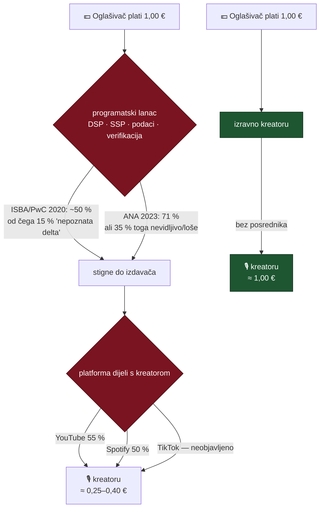

# Oglasni prostor: tržište, presedani i usporedba s postojećim platformama

> Referentni dokument uz plan
> [`plans/2026-08-26-p2p-oglasni-prostor.md`](plans/2026-08-26-p2p-oglasni-prostor.md).
> Istraženo 2026-08-26.
>
> **Kako čitati brojke.** Svaka je označena kao **SLUŽBENO** (objavljeno na
> stranici same platforme, uz poveznicu) ili **IZVJEŠTENO** (medij, agregator,
> analitičar). Gdje nešto nije potvrđeno, piše da nije — §7 je popis rupa.
> Ovo nije pravni savjet; §5 nosi popis pitanja za odvjetnika.

---

## 1. Zašto ovo pitanje uopće ima odgovor

Uobičajena rečenica je „YouTube uzima najveći dio kolača". Ona je **netočna u
obrnutom smjeru nego što se misli**: YouTube nije najgori dio lanca. Najveći
gubitak događa se **prije** nego platforma uopće podijeli išta s kreatorom.

**ISBA/PwC (UK, 2020.)**: do izdavača stigne **~50 %** potrošnje oglašivača na
premium kraju tržišta; **15 %** je „nepoznata delta" — novac koji se ne može
pripisati **nijednoj** identificiranoj strani u lancu.
[AOP sažetak](https://www.ukaop.org/hub/isba-programmatic-supply-chain-transparency-study-by-pwc-with-the-aop) ·
[Marketing Week](https://www.marketingweek.com/programmatic-supply-chain-transparency/)

**ANA (SAD, prosinac 2023.)**, 123 M$ potrošnje i 35,5 mlrd prikaza: **71 %**
stigne do izdavača, ali od toga **35 % otpada** na nevidljivo/nemjerljivo, pa je
stvarno radno oglašavanje („TrueAdSpend") **36 %** izvorne kune.
[ANA](https://www.ana.net/content/show/id/media-programmatic-transparency)

Složiš li dva učinka, kreator na platformi vidi **negdje između 25 i 40 lipa po
oglašivačevoj kuni**. Izravan posao nema taj lanac uopće.

> **Oprez (naša vlastita brojka)**: raspon „25–40 lipa" je *naš izračun* iz gornja
> dva izvora, nije citat. ISBA studija II (2023.) navodno je pokazala poboljšanje,
> ali točan novi postotak nije potvrđen — primarni PDF vraća 403.

---

## 2. Side-by-side: što dobiva svaka strana

### 2.1 Kreator

| | YouTube | Meta (FB/IG) | TikTok | LinkedIn | Spotify | **DOMOVINA.ai** |
|---|---|---|---|---|---|---|
| Objavljena podjela | **55 / 45** duga forma; **45 / 55** Shorts — *SLUŽBENO* | „55/45" svugdje u tisku, ali **nije na Metinoj živoj stranici** — *IZVJEŠTENO* | **nema objavljene podjele**; neproziran RPM (TikTok to sam priznaje) | **nema programa**; BrandLink dijeli s ~30 pozvanih, postotak **nije objavljen** | **50 / 50** — *SLUŽBENO*, najtransparentnija od svih | **100 / 0** na primarnoj prodaji |
| Tko plaća platformu | kreator, na svaku kunu | kreator | kreator | — | kreator | **samo preprodavatelj**, 15 % razlike |
| Tipičan RPM/CPM | ~1–5 $, do 8–11 $ u financijama — *IZVJEŠTENO* | 0,01–0,06 $ / 1000 (Reels) — *IZVJEŠTENO* | 0,40–1,00 $ / 1000, u padu 2026. — *IZVJEŠTENO* | — | — | cijena je **za posjed trenutka**, ne za prikaz |
| Prag i isplata | 100 $, ~30–45 dana | | RH **vjerojatno isključena** iz Creator Rewards | nedostupno | | postojeća SEPA/EURe šina |
| Zna li tko ga oglašava | **ne** | **ne** | **ne** | — | **ne** | **da**, poimence |
| Može li odbiti oglašivača | samo grube kategorije | ne | ne | — | ne | **da, veto po brandu i kategoriji** |
| Retroaktivna monetizacija starog kataloga | praktički ne | ne | ne | — | DAI da | **da — 3.047 h je inventar od danas** |

Za usporedbu, izravna monetizacija bez oglašivača: **Patreon ~10 %** naknade
(*SLUŽBENO*), Substack ~10 % (*IZVJEŠTENO*) — kreator zadrži ~87–90 %. Razlog je
isti kao kod nas: nema oglašivača ni lanca, samo izravno plaćanje.

**Dokumentirani gubitak kontrole**, jer to nije teoretski rizik:

- YouTubeova **žuta ikona** („ograničeni oglasi") reže prihod procijenjeno
  50–100 %; YouTube je 2026. dodao **ljudsku provjeru upravo zato** što je
  automat pretjerano označavao. *IZVJEŠTENO* —
  [Tubefilter](https://www.tubefilter.com/2025/03/11/youtube-human-review-yellow-icon-monetization/)
- TikTok Pulse: kreatorica sa **713 000 pratitelja** zaradila **1,85 $ ukupno
  kroz pet mjeseci**, uz naslovnu „podjelu 50/50". *IZVJEŠTENO* —
  [Fortune](https://www.fortune.com/2023/01/23/creators-report-extremely-low-earnings-from-tiktoks-ad-revenue-sharing-initiative)
- 2026.: raširene prijave da RPM-ovi TikTok Creator Rewardsa „propadaju" nakon
  promjene vlasništva, bez najave i bez utjecaja kreatora. *IZVJEŠTENO*

### 2.2 Brand

| | Programatski oglas na platformi | **Sponzorski trenutak** |
|---|---|---|
| Što kupuje | prikaze prema profilu korisnika | **imenovani trenutak u imenovanom sadržaju** |
| Kontekst | „podcast o poduzetništvu" | „devet minuta o tome kako mali poduzetnik dolazi do kapitala", s transkriptom kao dokazom |
| Trajanje učinka | impresija nestaje | **placement ostaje na evergreen imovini** |
| Stari sadržaj | mrtav | **kupljiv** |
| Odnos s kreatorom | nikakav | postoji |
| Koliko od uloženog radi | ~36 % (ANA TrueAdSpend) | nema lanca |
| Izlaz iz posla | potrošen budžet | **otkup vraća uloženo + udio** (§4.3 plana) |
| Transparentnost oznake | DSA čl. 26 obveza | ista obveza, ali **mi je koristimo kao značajku** |

### 2.3 Slušatelj

Jedini redak koji nas zanima: **ništa ga ne prekida.** Ovdje treba biti pošten —
istraživanje o toleranciji nije jednoznačno u našu korist:

- IPG-ovo istraživanje pokazuje da je **pre-roll ocijenjen kao NAJMANJE
  ometajući** format (samo 17 % osjetilo prekid), suprotno intuiciji.
  [Campaign](https://www.campaignlive.com/article/pre-roll-ads-least-interruptive-finds-ipg-study/1430658)
- Kombinacija gumba za preskakanje **i** odbrojavanja pouzdano **povećava**
  iritaciju.
  [ScienceDirect](https://www.sciencedirect.com/science/article/abs/pii/S1094996819300519)
- U našu korist: mladi gledatelji preskaču otvorene prekide, ali **bolje pamte
  brand kad je suptilno integriran u sadržaj**.
- **Rupa**: nema javnog empirijskog istraživanja o toleranciji na „presented by"
  znak naspram pre-rolla. Ako to želimo tvrditi, moramo izmjeriti sami.

---

## 3. Što na tržištu postoji, a što ne postoji

### 3.1 Postoji: DAI, i retroaktivna monetizacija je norma

Dinamičko umetanje oglasa (DAI/SSAI) čini, prema IAB-u, **preko 90 % prihoda od
podcast oglašavanja**. Svi veliki hostovi (Megaphone/Spotify, Acast, ART19,
Triton/Omny, Audioboom, Podbean) umeću oglas u trenutku zahtjeva, pa epizoda od
prije dvije godine monetizira jednako kao nova. Katalog se **prodaje s popustom**
(jedan agregator navodi ~40–46 % ispod host-read cijene — jedan izvor, uzeti
samo kao smjer).

**Zamka koju mi izbjegavamo strukturno**: DAI pomiče vremensku os epizode i time
**razbija timestampove transkripta i poglavlja** — otvoren problem u Podcasting
2.0 zajednici, s predloženim ali neusvojenim VAST rješenjem. Naš format ne dira
medijsku datoteku.

### 3.2 Postoji: kontekstualno ocjenjivanje — ali **epizode**, ne trenutka

- **Sounder** — kupio ga Triton Digital (2024.).
- **Barometer** — završio unutar The Trade Deska.
- Oboje rade brand-suitability nad ASR transkriptom, mapirano na **IAB Content
  Taxonomy** + **GARM** okvir.
- **GARM kao organizacija je raspušten u kolovozu 2024.** nakon tužbe X-a protiv
  WFA-e; taksonomija živi dalje kao de facto standard bez upravitelja.

### 3.3 NE postoji: proizvod koji bira **točan trenutak**

Ovo je najvažniji nalaz cijelog istraživanja i temelj cijele teze:

> Nije pronađen nijedan proizvod koji bira **točan semantički trenutak** unutar
> epizode za oglas. Ta sposobnost ne postoji. Tražila bi spajanje kontekstualnog
> signala (§3.2) s detekcijom prijelomnih točaka (§3.4), a to nitko ne radi.

### 3.4 NE postoji: pametno rezanje reklamnih pauza

Svi proizvodi u prodaji (Spreaker, Podbean) rade **isključivo detekciju tišine** —
traže stanku, ne promjenu teme. Postoji patentna literatura o kombiniranju
transkripta i tišine, ali nitko to ne isporučuje za audio podcaste.

**Zaključak §3.3 + §3.4**: presjek koji nitko ne pokriva je točno ono na čemu mi
već sjedimo — dijarizirani transkript, sekcije s ključnim riječima i entitetima,
i vremenska sidra, za 3.047 sati sadržaja.

### 3.5 Nenametljivi formati u playeru — tanka i uglavnom neuspješna kategorija

| format | status |
|---|---|
| YouTube InVideo overlay | **ugašen 6.4.2023.** — YouTube ga je maknuo |
| Amazon Inspire (shoppable feed) | **ugašen veljača 2025.** |
| Twitch side-by-side (stream se smanji, oglas svira **mutiran** pokraj) | **u testiranju**, reakcije „uglavnom pozitivne"; nije potvrđeno da se zove „Brand Trials" |
| Twitch pause-screen oglasi | živi |
| Firework | jedini aktivni dobavljač shoppable overlaya |
| VPAID | mrtav od 2020. → **VAST 4.x + OMID + SIMID** je stack koji vrijedi ciljati ako ikad idemo prema standardu |

**Što iz ovoga slijedi za nas**: činjenica da je YouTube ugasio overlay ne znači
da format ne radi — znači da **ne radi na CPM ekonomiji u ogromnom mjerilu**, gdje
overlay zarađuje manje po prikazu od pre-rolla. Mi ne prodajemo prikaze nego
posjed trenutka, pa nas ta ekonomija ne obvezuje. Ali to je hipoteza koju pilot
mora provjeriti, a ne pretpostavka na koju se smijemo osloniti.

### 3.6 Cijene: za Hrvatsku i Adriju **javnih podataka nema**

| tržište | host-read | programatski |
|---|---|---|
| SAD | 25–45 $ CPM | 8–25 $ CPM |
| UK | 25–45 £ mid-roll | jeftinije |
| Njemačka | 80–100+ € (vrh Europe) | |
| Španjolska | 30–40 € (dno) | |
| **Hrvatska / Adria** | **ništa nije pronađeno** | **ništa** |

Podjele mreža: **Acast uzima 50 %**, **Podcorn 10 %** (otvoreno tržište, samo
host-read), **Libsyn Ads 50–70 % kreatoru** ovisno o mjerilu.

Odsutnost hrvatskih podataka je **stvarna rupa u planu**, ne detalj: prvi cjenik
u pilotu bit će pogađanje. Zato §8 plana pilot vrednuje mehanizmom, ne prihodom.

### 3.7 Mjerenje se konsolidiralo u Spotifyjev vrt

Podsights i Chartable — neovisni sloj atribucije — kupio je Spotify (2022.), a
**Chartable je ugašen u prosincu 2024.** Što mala platforma realno može ponuditi
Lidlu ili IKEA-i:

1. Brojanje po **IAB Podcast Measurement v2.2** (preuzimanje = cijela datoteka
   ILI ≥ 60 s byte-range) — to je prag vjerodostojnosti koji medijske agencije
   traže.
2. **Točan broj isporuka** — mi crtamo znak u vlastitom playeru, pa ne
   procjenjujemo nego znamo.
3. Promo kod / vanity URL kao jeftin prvi signal.
4. Standardni PCA izvještaj (prikazi, jedinstveni, frekvencija, uređaji, po danu).
5. **Izvan dosega**: pixel atribucija preko domena i brand-lift ankete.

---

## 4. Dizajn tržišta: zašto ljestvica, a ne Harberger ni aukcija

### 4.1 Šest mehanizama

| mehanizam | za | protiv |
|---|---|---|
| **Rastuća (engleska) aukcija** | pravo otkrivanje cijene | traži više istovremenih ponuđača; naše tržište je plitko |
| **Zapečaćena druga cijena / GSP** (Googleov model) | teorijski poticajno kompatibilna za jedan slot | GSP **nije** istinoljubiv za više slotova; ne preslikava se na „otkup već prodanog" |
| **Prva cijena** | industrija je 2019. prešla na nju | *lekcija*: header bidding je razbio ekonomiju druge cijene jer su posrednici manipulirali podnim cijenama — svaka varijanta druge cijene koju ne kontroliramo s kraja na kraj je rizična |
| **Ljestvica („uvijek na prodaju" uz množitelj)** | **naš izbor** — deterministična, javna, objašnjiva SMB oglašivaču, fee čisto na razlici | množitelj je proizvoljan i treba ga štimati; nema pravog otkrivanja cijene |
| **Opcije / ročnice na inventar** | pravo trgovanje | ovo je doslovno NYIAX, vidi §4.3 |
| **Prvokup (ROFR)** | štiti uloženo sadašnjeg sponzora; standardan pravni institut | usporava preraspodjelu; može se zloupotrijebiti za otkrivanje cijene bez plaćanja ako rok nije kratak i obvezujuć |

Odabir u planu je **ljestvica + ROFR**, jer prva rješava „uvijek kupljivo, cijena
raste", a druga rješava jedinu bol koju prva stvara.

### 4.2 Zašto Harberger ispada

Postoje stvarne izvedbe (*This Artwork Is Always On Sale*, Wildcards, Geo Web),
ali oglasne su samo hackathonske (Billboard Protocol). Dokumentirani načini
puknuća — griefing prije početka kampanje, samoprocjena kao protivnička igra bez
točnog odgovora na plitkom tržištu, i trajna nelagoda vlasnika — svaki je
zasebno dovoljan da brand ne kupi.

### 4.3 NYIAX — najdublji i najporazniji presedan

Nasdaqom podržana burza (2017.) za trgovanje **zajamčenim budućim ugovorima o
oglasnom prostoru** — isti model, na razini burze. Iz njihovog **S-1 (2023.)**:
prihod **ispod 1 M$ godišnje**, gubitak **6–13,5 M$ godišnje**, „going concern"
upozorenje, i **1–3 protustranke = 44–91 %** potraživanja i obveza.

**Što iz toga slijedi**: pretpostavi **blizu nule prihoda od sekundarnog tržišta
kroz dulje vrijeme** i nemoj graditi financijski plan na njemu. Fee-na-preprodaji
je **razlikovna i povjerenju usmjerena odluka**, ne plan prihoda.

#### Epilog: NYIAX je prodan 19.8.2026. — i to je važnija priča od S-1

Provjereno 26.8.2026., tjedan dana nakon zatvaranja. **Datavault AI** (Nasdaq:
DVLT) preuzeo je NYIAX. Definitivni ugovor 18./19.3.2026., zatvaranje
**19.8.2026.**
[Datavault IR](https://ir.datavaultsite.com/news-events/press-releases/detail/489/datavault-ai-completes-acquisition-of-nyiax-adding-institutional-grade-exchange-technology-to-its-digital-asset-and-real-world-asset-tokenization-platform)

**Uvjeti — sve u dionicama, ne u gotovini:**

| | |
|---|---|
| Naknada | **74.800.629 dionica DVLT** + ~**494.859 $** gotovine (samo neakreditiranim ulagačima) |
| Omjer zamjene | ~1,41 DVLT po dionici NYIAX-a |
| Earn-out | do **13 mil.** dodatnih dionica uz „qualifying trading market transaction" u 12 mjeseci |
| Tečaj DVLT | ~**0,63 $** krajem ožujka 2026. → ~**0,31 $** 25.8.2026. |

Iz toga slijedi vrijednost naknade od **~47 M$ na dan najave** i **~23 M$ na dan
zatvaranja** — *naš izračun iz broja dionica i tečaja, nije objavljena brojka.*
Cijena nije objavljena ni u jednom priopćenju.

**Tko je kupac**, jer to mijenja čitanje cijene. Datavault AI u Q2 2026.:
prihod 6,7 M$ (+287 % g/g), **neto gubitak 88 M$**; u prvom polugodištu 10,1 M$
prihoda uz **141 M$ gubitka**; operativni odljev 80 M$ u šest mjeseci; na kraju
**1,4 M$ gotovine** uz 49 M$ u Bitcoinu; **vlastito „going concern" upozorenje**;
tečaj ispod Nasdaqovog praga od 1 $; broj dionica s ~855 mil. na ~1 mlrd nakon
transakcije, uz **više od 9× razrjeđenja u godinu dana**.

> **Zaključak koji se ne smije preskočiti**: ovo **nije** izlaz iz snage. Društvo
> koje devet godina nije uspjelo pokrenuti likvidnost apsorbirano je **papirom**
> društva koje i samo ima upozorenje o nastavku poslovanja. Presedan iz §4.3 time
> nije oslabljen nego **potvrđen** — samo sada zna i kako je završio.

**Ali kupljeno je nešto konkretno, i to je najkorisniji dio nalaza.** Priopćenje
imenuje **četiri izdana američka patenta** (US 10.607.291; 11.410.236;
11.861.707; 12.198.193) plus jednu prijavu, uz exchange infrastrukturu i
podružnicu Collective Audience. Dakle vrijednost nije bila u tržištu nego u
**IP-u i tehnologiji**.

### 4.3.1 Patentni rizik — nov nalaz, i uredno se izbjegava

`US10607291B2` („Systems and methods for electronic continuous trading of variant
inventories", prioritet 8.12.2017.) je **suvlasništvo Nasdaq Technology AB i
NYIAX-a**. Nezavisni zahtjevi pokrivaju **motor za uparivanje** (*matching
engine*) nad bazom naloga s „unitary-valued" i „set-valued" atributima, po
pravilima uparivanja.
[Google Patents](https://patents.google.com/patent/US10607291B2/en)

Dvije stvari koje iz toga slijede, i obje idu nama u prilog:

1. **Ono što je patentirano je knjiga naloga — a mi je namjerno ne gradimo.**
   Naša ljestvica je **bilateralna i deterministička**: nema naloga, nema
   uparivanja, nema knjige. Ista odluka koja nas u §5.1 čuva od MiCA-ine
   definicije „trgovinske platforme" čuva nas i ovdje. Konvergencija dvaju
   neovisnih razloga za isti dizajn je jak signal da je dizajn dobar.
2. **Teritorij.** To su **američki** patenti. Na stranici obitelji vidi se
   australska prijava, a **nijedan EP** (europski) član nije naveden. Američki
   patent ne doseže Hrvatsku.

**[TREBA PROVJERITI]** prije faze 3: ima li ijedan od preostala tri patenta
(11.410.236; 11.861.707; 12.198.193) **EP člana obitelji** koji vrijedi u
Hrvatskoj. To je posao za patentnog zastupnika, ne za pretragu — i jeftin je u
odnosu na trošak da se otkrije poslije.

### 4.4 Ostali presedani tokenizacije oglasa

| projekt | ishod |
|---|---|
| **AdEx** | napustio oglašavanje, pivotirao u „Ambire" (identitet/DeFi) |
| **Brave / BAT** | jedini trajni pobjednik po broju korisnika, ali 2026. roadmap ide iz tokenizacije pažnje prema plaćanjima AI agenata |
| **Adshares, Papyrus, Rebel AI** | bez trakcije |
| **Million Dollar Homepage (2005.)** | **najbolji ne-kripto presedan da inventar nosi sekundarnu premiju** — zadnji pikseli preprodani po **38× nominale** |
| **ERC-4907** (najam NFT-a: vlasnik ≠ korisnik, vremenski omeđeno pravo) | tehnički **odličan** pristanak uz „sponzor dobiva pravo korištenja, ne vlasništvo", ali bez ijedne oglasne primjene — dokazan samo u gamingu |

### 4.5 „Platforma uzima 0 % primarne prodaje" — ima li presedan

- **Ima, ali samo u ulaznicama.** StubHub model: naknada gotovo isključivo na
  preprodaji. Desetljećima dokazano, ali u drugoj klasi imovine.
- **Nema u kreatorskoj ekonomiji.** Bandcamp, Patreon i Gumroad naplaćuju na
  **svaku** transakciju. Naš model je u toj skupini **strukturno nov**.
- **OpenSea (2022.–2024.) je upozorenje**: naknada na sekundarnom je krhka čim je
  protokol otvoren i kompozabilan — Blur i LooksRare su je zaobišli nudeći 0 %.
  Zaključak je **ne graditi otvoreni protokol**, nego držati mehanizam zatvorenim
  i svojim.
- Ulaznice uspijevaju zbog dva uvjeta koja mi **nemamo**: golem višak primarne
  potražnje i milijuni transakcija. Naš višak potražnje je **hipoteza dok ne bude
  izmjeren**.

---

## 5. Pravni okvir

### 5.1 MiCA (Uredba (EU) 2023/1114) — najskuplja nepoznanica

Izuzeće za jedinstvene nezamjenjive tokene je **uže nego što izgleda**:

1. **Udjeli u jedinstvenom tokenu nikad nisu izuzeti** — svaka frakcionalizacija
   je u opsegu.
2. **Izdavanje „u velikim serijama ili kolekcijama" je indikator zamjenjivosti** —
   predložak koji minta po jedan token po epizodi kroz stotine epizoda je točno
   taj obrazac.
3. **Sam jedinstveni identifikator nije dovoljan** — gleda se sadržaj (jesu li
   prava ekonomski zamjenjiva), ne oblik.

[CMS: NFTs under MiCAR](https://cms.law/en/int/publication/legal-experts-on-markets-in-crypto-assets-mica-regulation/nfts-under-micar-are-they-regulated-or-not)

**CASP autorizacija**: „upravljanje trgovinskom platformom" je *multilateralni*
sustav koji spaja **više** trećestranih interesa kupnje i prodaje po vlastitim
pravilima. Bilateralna ljestvica (jedan sadašnji sponzor, jedan izazivač, bez
knjige naloga) je **znatno slabiji** činjenični obrazac — ali ako su tokeni
uopće u opsegu, i naš mehanizam bi se dao pročitati kao spajanje interesa po
našim pravilima. Od 30.12.2024. autorizacija se traži **prije** početka
djelatnosti.

**Zato plan drži faze 1–3 potpuno off-chain.** Bez kripto-imovine nema ni MiCA
pitanja.

### 5.2 DSA (Uredba (EU) 2022/2065) čl. 26 — vrijedi za nas već danas

Obvezuje **sve** internetske platforme; status VLOP-a samo dodaje obveze
(repozitorij oglasa čl. 39, procjena sistemskih rizika) i **ne postavlja donji
prag**. Za svaki oglas, u stvarnom vremenu: da je oglas, u čije ime, **tko je
platio**, i glavni parametri ciljanja.

- **Čl. 26(3)**: oglasi na temelju profiliranja posebnim kategorijama podataka
  (rasa, politika, vjera, zdravlje, spolna orijentacija) su **zabranjeni bez
  iznimke pristanka** — stroži od samog GDPR-a.
- **Čl. 28(2)**: zabrana profiliranog oglašavanja maloljetnicima.

**Posljedica na UI**: oznaka nosi ime stvarnog plaćatelja i **mijenja se istog
trena po otkupu**. Kontekstualno ciljanje (mi ciljamo *sadržaj*, ne osobu) čini
ovu obvezu lakom — to je dodatni argument za cijeli model.

### 5.3 AVMSD + Zakon o elektroničkim medijima

- **Sponzorstvo** = doprinos financiranju programa radi promicanja imena/žiga;
  **plasman proizvoda** = uključivanje proizvoda uz plaćanje.
- **Plasman proizvoda je zabranjen** u informativnim, aktualno-političkim,
  potrošačkim, **vjerskim** i dječjim programima. Za naš katalog to nije rubni
  slučaj — velik dio kanala je vjerski ili informativni.
- Gdje se koristi, ne smije utjecati na uredničku neovisnost, poticati kupnju ni
  biti neopravdano istaknut; traži se **jasna identifikacija na početku i kraju**.
- Način i trajanje sponzorske oznake propisuje **AEM podzakonskim aktom** —
  taj tekst **nije potvrđen** u ovom istraživanju.

**Ova dva režima se zbrajaju**: sponzorirani segment treba **i** ZEM
identifikaciju **i** DSA čl. 26 oznaku.

### 5.4 Porez i PDV

- **Čl. 44 Direktive o PDV-u**: B2B usluge oglašavanja oporezuju se **gdje je
  poslovni kupac**, ne gdje je pružatelj.
- **Prijenos porezne obveze** (čl. 194/196) kod prodaje oglasnog prostora
  poslovnom kupcu iz druge članice — standardno, dobro utabano.
- **Paušalni obrt** može poslovati bez PDV-a do praga od **60 000 € godišnje**.
- **Novo i nestandardno je fakturiranje tročlanog toka otkupa** (istisnuti
  oglašivač, novi oglašivač, naknada platforme). To **nije** obični platformski
  provizijski obrazac i traži izričitu potvrdu knjigovođe.

### 5.5 Preprodaja — regulatorni smjer vrijedi pratiti

EU **nema** jedinstvenu regulaciju cijene preprodaje ulaznica; to je pravo
članica (Francuska strogi limiti za kulturu, Njemačka kazne za transparentnost,
Španjolska integrirana preprodaja). **UK je u studenom 2025. potvrdio da će
zakonski ograničiti preprodaju na nominalnu cijenu, bez marže.** Nema naznake da
bi se to proširilo na B2B oglasni prostor, ali kapica na maržu je **živa
regulatorna ideja u Europi upravo sada**, ne hipoteza.

### 5.6 Popis za odvjetnika (pet točaka)

1. Bi li naš predložak slot-tokena bio čitan kao „velika serija" po MiCA-i.
2. Aktivira li **bilateralna** ljestvica koju platforma provodi definiciju
   „trgovinske platforme" — provjeriti ESMA Q&A i Level 2 iz 2025./2026.
3. Važeći tekst AEM podzakonskog akta o trajanju i mjestu sponzorske oznake.
4. PDV i fakturiranje **tročlanog toka otkupa** — ne pretpostavljati da
   nasljeđuje Gumroad/Patreon obrazac.
5. Periodična provjera: širi li se ideja kapice na maržu iz preprodaje ulaznica
   prema B2B oglasnom prostoru.
6. **Sloboda djelovanja (FTO) prema NYIAX/Nasdaq patentima** — imaju li
   `US 11.410.236`, `11.861.707` i `12.198.193` EP člana obitelji koji vrijedi u
   Hrvatskoj (§4.3.1). Ovo je posao za patentnog zastupnika i traži ga se prije
   faze 3, ne prije pilota.

---

## 6. Sažetak teze u pet redaka

1. Najveći gubitak nije platformina podjela nego **lanac prije nje** (ISBA ~50 %,
   ANA TrueAdSpend 36 %).
2. **Nitko ne prodaje trenutak.** Kontekstualni dobavljači staju na epizodi,
   rezači pauza rade detekciju tišine. Presjek je prazan, a mi na njemu sjedimo.
3. **Retroaktivnost je dokazana norma** (DAI > 90 % prihoda industrije), a naših
   3.047 sati je inventar od danas.
4. **Harberger ne, ljestvica + prvokup da** — jer brand ne kupuje prostor koji mu
   se može oteti isti dan po cijeni koju nije odredio.
5. **Sekundarno tržište nije plan prihoda nego obećanje** — NYIAX je s Nasdaqovom
   tehnologijom šest godina pokušavao i nije uspio pokrenuti likvidnost.

---

## 7. Rupe — što NIJE potvrđeno

Ovaj popis postoji da se za godinu dana ne bi citiralo kao činjenica.

| tvrdnja | status |
|---|---|
| ISBA/PwC studija II (2023.) — točan novi postotak „nepoznate delte" | primarni PDF vraća 403; potvrđeno samo „poboljšalo se" |
| Metina **živa** službena podjela 55/45 | nije nađena na Metinoj stranici; svugdje drugdje da |
| LinkedIn BrandLink stvarni postotak | **nije objavljen**; „~50 %" je analitičarev zaključak iz starog posla s izdavačima |
| Popis zemalja TikTok Creator Rewardsa | potvrđene samo US/UK/DE/FR/JP/KR/BR/MX; **isključenost Hrvatske je vjerojatna, ne potvrđena** |
| Twitch službena stranica s podjelom 50/50 i 70/30 | stranica nedostupna u sesiji; IZVJEŠTENO |
| Substack živa stranica s cijenama | vraća 404 |
| CPM za Hrvatsku / Adriju | **ne postoji javno** |
| Dokumentirana isplata bilo kojeg hrvatskog kreatora | **nije nađena nijedna** |
| Tolerancija na sponzorski znak vs. pre-roll | **nema javnog empirijskog istraživanja** |
| CPM kataloga ~40–46 % ispod host-read | jedan agregator, nepotkrijepljeno drugdje |
| Twitch „Brand Trials" kao naziv proizvoda | naziv nije potvrđen; format jest |
| **Cijena NYIAX akvizicije** | **nije objavljena ni u jednom priopćenju**; ~23–47 M$ je NAŠ izračun iz broja dionica × tečaj, ne citat |
| **EP članovi obitelji triju NYIAX patenata** | provjeren samo `US10607291B2` (nema navedenog EP-a); ostala tri nisu provjerena |

**Rule (vrijedi za ovaj dokument)**: prije nego se ijedna brojka odavde upotrijebi
u ponudi brandu, pitch decku ili store listingu — provjeri je li u tablici §7.
Ako jest, ili je potvrdi iz primarnog izvora, ili je izbaci.
