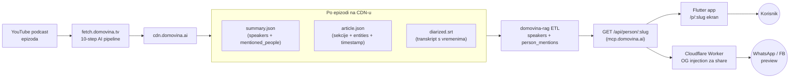
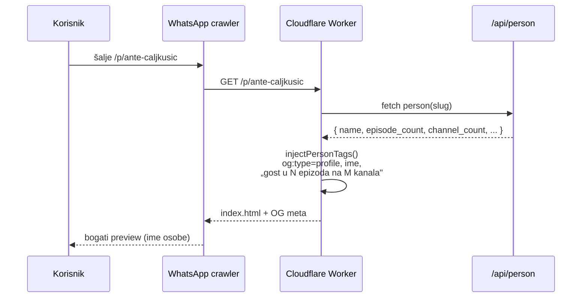
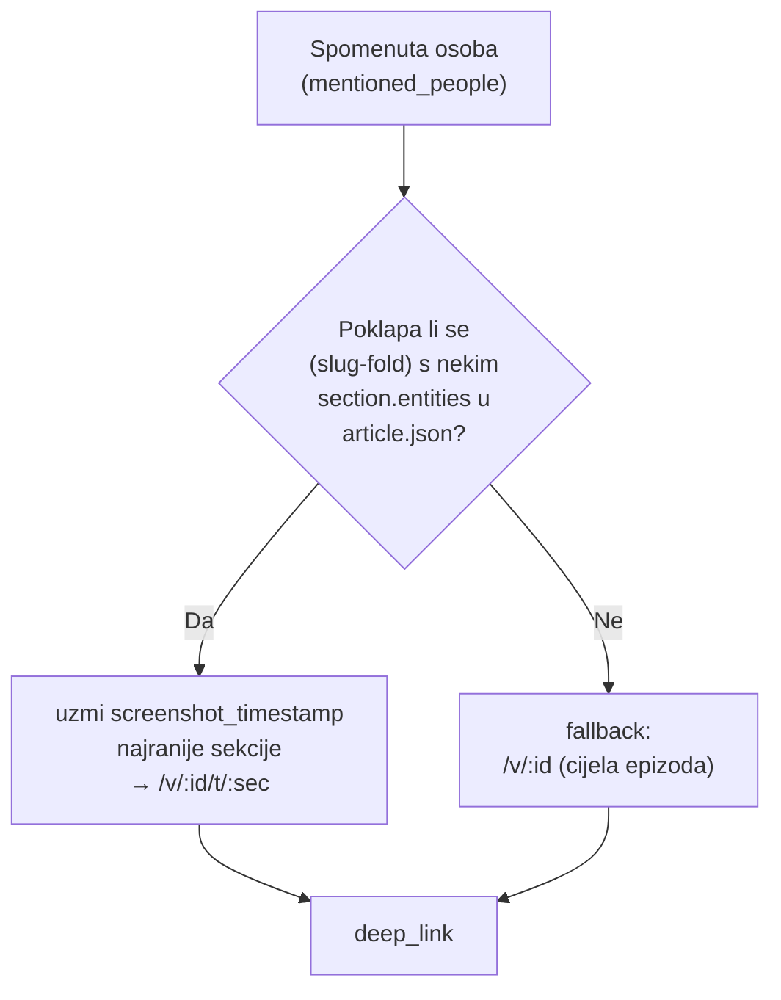
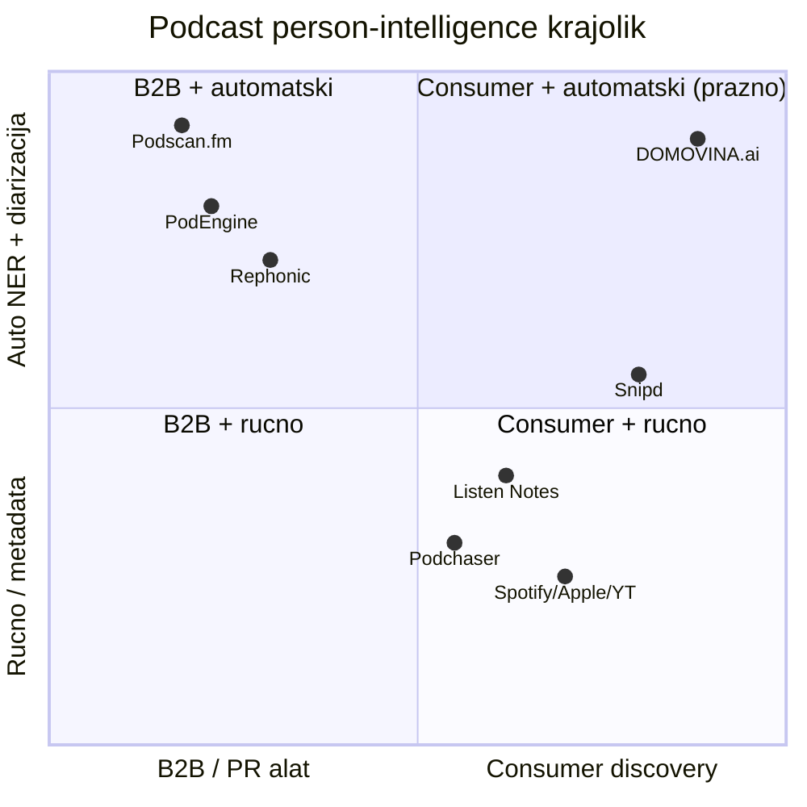
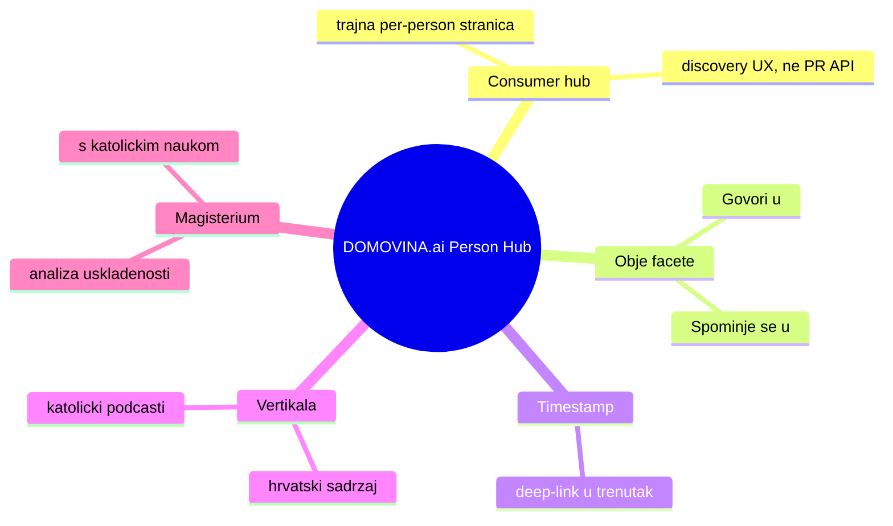

# Person Hub — feature, arhitektura i konkurentski krajolik

> Interni izvor istine za **landing page i blogpostove** o Person Hub featureu
> (`/p/:slug`). Sažima znanje iz razvoja + činjenični web-research (3 subagenta,
> 2026-07-04). Marketinške tvrdnje: koristi **samo** ono iz sekcije
> [„Što smijemo tvrditi"](#što-smijemo-tvrditi-a-što-ne).

---

## 1. Što je Person Hub

Entity-centric sloj **iznad** kanala. Umjesto „kanal → epizode", gradi
**profil osobe** na ruti `/p/:slug` (npr. [`/p/ante-caljkusic`](https://domovina.ai/p/ante-caljkusic))
koji **dinamički** (živi upit, ne statična playlista) agregira sav sadržaj vezan
uz tu osobu **kroz sve kanale/podcaste** odjednom.

Ključna inovacija je razlikovanje **dviju faceta** iste osobe:

| Faceta | Značenje | Izvor podatka |
|---|---|---|
| **Govori u** | Osoba je diariziran **govornik** u epizodi | `summary.json` → diariziran speaker |
| **Spominje se u** | Osoba se **spominje** u govoru, ali ne nastupa | `summary.json` → `mentioned_people` |

Na desktopu se prikazuju kao dva odvojena stupca; na mobitelu kao dvije sekcije.

---

## 2. Arhitektura toka podataka

Sve živi na CDN-u i računa se u backendu (`domovina-rag`); Flutter i Cloudflare
Worker su samo prezentacija.



**Slug je primarni ključ** i koristi se DOSLOVNO (s crticama). Normalizacija imena
mora biti identična na svim slojevima (ASCII-fold: `č/ć→c`, `š→s`, `ž→z`, `đ→d`),
inače dolazi do mismatcha — npr. ASR često napiše „Vanessa Mi**ć**" umjesto
„Mi**č**", pa se poklapanje radi tek nakon folda.

---

## 3. Dvije facete: „govori" vs „spominje se"

```mermaid
flowchart TD
  EP["Epizoda"] --> SUM["summary.json"]

  SUM --> SPK["diarizirani<br/>govornici"]
  SUM --> MEN["mentioned_people<br/>(spomenute osobe)"]

  SPK --> E1["episodes[]<br/>→ „Govori u""]
  MEN --> PM["person_mentions<br/>(minus oni koji već govore)"]
  PM --> E2["mentions[]<br/>→ „Spominje se u""]

  E1 --> HUB["/p/:slug profil"]
  E2 --> HUB

  classDef speak fill:#0a6,stroke:#053,color:#fff
  classDef mention fill:#c60,stroke:#630,color:#fff
  class SPK,E1 speak
  class MEN,PM,E2 mention
```

Pravilo dedupliciranja: ako osoba u epizodi **i govori i spominje se**, epizoda
ide samo u „Govori u" (govor ima prednost). Tako korisnik ne vidi dupli unos.

---

## 4. Share / Open Graph sloj

Kad se `/p/:slug` podijeli na WhatsApp/Facebook, Cloudflare Worker **prije** nego
crawler dobije odgovor injecta osobno-specifične OG tagove (ime + broj epizoda i
kanala, hrvatski plural), umjesto generičkog domovina.ai preview-a.



Isti pristup već postoji za epizode (`/v/:id`, `/v/:id/t/:sec`) — Person Hub je
dodao `profile`-tip granu. Generički homepage tagovi lektorirani na ispravan
hrvatski (dijakritike + IHJJ pravopis: „sažetci", „usklađenost").

---

## 5. Timestamp deep-link na spomen (mehanizam)

Cilj: klik na „spominje se u" ne otvara samo epizodu, nego **skoči na točan
trenutak** gdje se osoba spominje (`/v/:id/t/:sec`). Frontend to već podržava
(`PersonEpisode.routePath`) — posao je isključivo u backendu.



**Pokrivenost je djelomična, namjerno.** `article.json` sekcije nose
`entities[] + screenshot_timestamp` — isti podatak koji timestamp-share već
koristi. Za spomene koji se poklope sa sekcijskim entitetom dobiva se pravi
timestamp; ostali padaju na cijelu epizodu. Na testnoj epizodi riješilo se ~6/8.
Puna pokrivenost (svaki spomen) tražila bi pravi NER + entity-linking nad
transkriptom, a hrvatski ASR mangling imena ograničava recall.

---

## 6. Konkurentski krajolik

Činjenični web-research (3 subagenta): **radi li itko cross-podcast per-osoba
agregat s obje facete (govori + spominje) i timestampom?**

### 6.1 Najbliži presedani

| Tko | Ima | Nema (naš jaz) |
|---|---|---|
| **Podscan.fm** | Auto-NER + diarizacija nad 4.6M podcasta; role-polja `as_host/as_guest/as_mention`; per-mention timestamp + audio deep-link | B2B/PR **API**, ne consumer profil-stranica; engleski; bez doktrinarnog sloja |
| **SPoRC** (ACL 2025) | Akademski korpus koji klasificira **Host/Guest/Neither** (Neither = spomenut, ne nastupa) nad 550K+ epizoda | Istraživački dataset, ne proizvod |
| **Podchaser** | Trajna per-person „Creator" stranica s kreditima/nastupima | Ručno unešeno (moderacija); spomeni samo kao odvojen alert, ne faceta |
| **Snipd** | Consumer app, guest-stranice, follow-a-guest | **Namjerno maknuli** detekciju spomena ne-gostiju |
| **PodEngine / Rephonic / TVEyes / Critical Mention / Meltwater** | Govori+spomeni signali + alertovi, ponegdje timestamp | PR/media-monitoring (plaćeno), ne browsable consumer hub |
| **Listen Notes / Spotify / Apple / YouTube** | Pretraga / plitko ručno tagiranje gosta, episode-scoped | Svjesno izbjegavaju pravu cross-show person entitet-stranicu |

**Hrvatski/regionalni sadržaj: nula pokrivenosti kod svih.**

### 6.2 Pozicioniranje



Gornji-desni kvadrant (**consumer × automatski**) je efektivno prazan — tu sjedi
DOMOVINA.ai.

### 6.3 Zašto smo unikatni (spoj kojeg nitko nema odjednom)



---

## Što smijemo tvrditi (a što ne)

Kalibrirano prema evidenciji — da tvrdnja bude neoboriva.

✅ **SMIJEMO:**
> „Jedini **consumer** proizvod koji na profilu osobe spaja gdje ona **govori** i
> gdje se **spominje** kroz sve podcaste — s deep-linkom u točan trenutak, za
> **hrvatski** sadržaj, uz analizu usklađenosti s katoličkim naukom
> (**Magisterium**)."

❌ **NE SMIJEMO:**
> „Prvi na svijetu koji **detektira spomene osoba** u podcastima" / „prva
> **tehnologija** te vrste" — to obaraju **Podscan.fm** (komercijalno) i **SPoRC**
> (akademski). Motor (NER + diarizacija + govori-vs-spominje) je presedan.

**TL;DR:** tehnika je presedan; **spoj** (consumer entity-hub × obje facete ×
timestamp × HR katolički vertikal × Magisterium) praktički nema ekvivalenta — to
je prava, obranjiva inovacija.

---

*Zadnje ažurirano: 2026-07-04. Izvor: razvoj Person Hub featurea + web-research
(Podscan.fm, Podchaser, Snipd, Rephonic, TVEyes, PodEngine, SPoRC/ACL 2025,
Spotify Podcast Dataset, Listen Notes). Verificiraj tvrdnje prije objave.*
