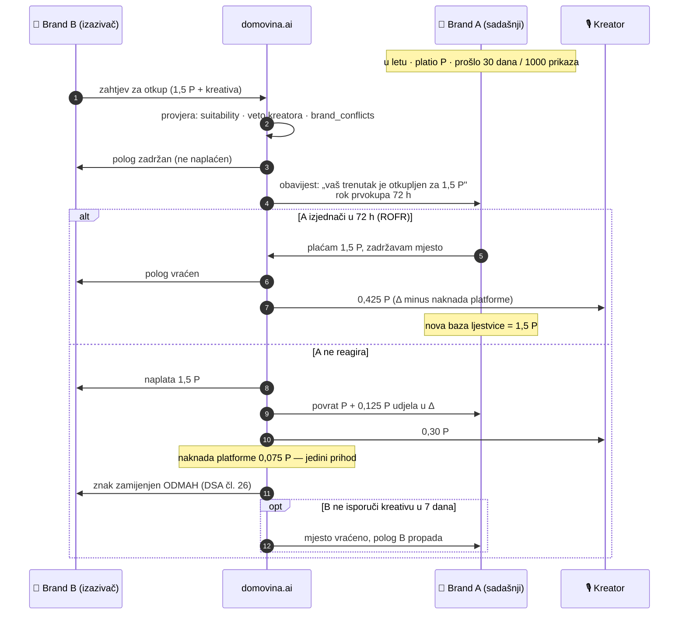
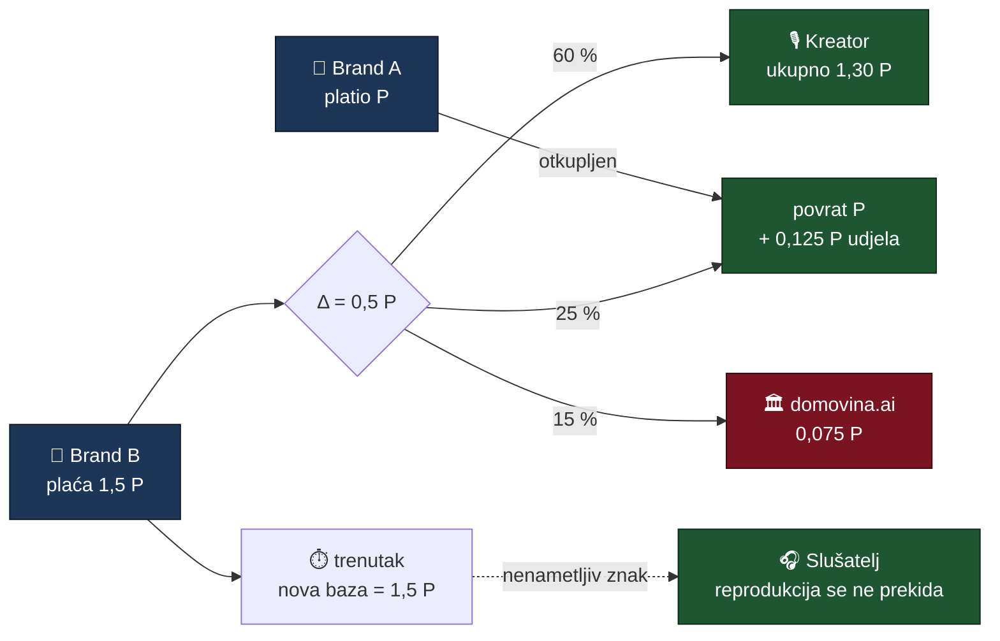
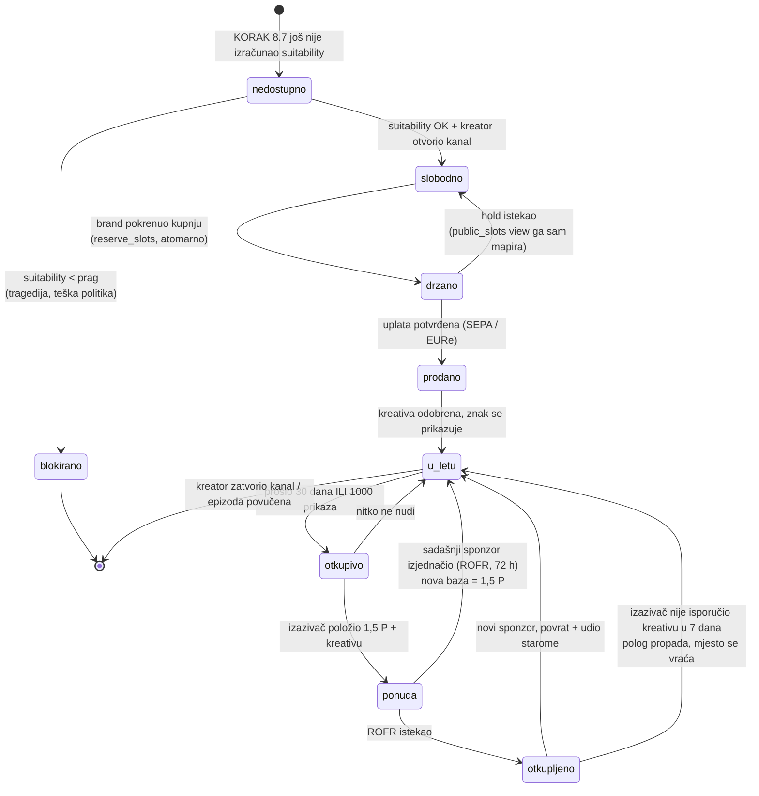
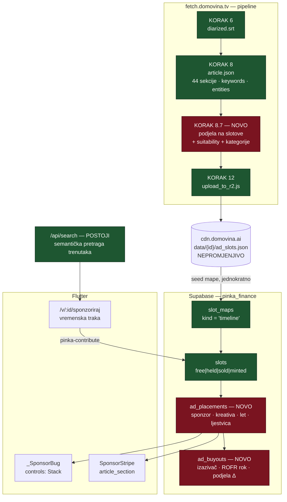

# P2P oglasni prostor — sponzorski trenuci u epizodi

> Status: **plan, nije predano timu.** Ovo je dizajn mehanizma i UI-ja, s
> mjerenjima nad produkcijskim podacima. Prije predaje trebaju odgovori na
> §10 (otvorena pitanja) i pravna potvrda iz
> [`oglasni-prostor-trziste-i-usporedba.md`](../oglasni-prostor-trziste-i-usporedba.md) §5.
>
> Pilot: **`domovina_tv`**, uz postojeći „Podrži" feature na istom ekranu.

Cilj u jednoj rečenici: brand kupuje **točan trenutak u točnoj epizodi**,
kreator dobiva **100 % primarne prodaje**, platforma ne uzima ništa dok se
prostor ne **preproda** — a slušatelja se ne prekida ni sekunde.

---

## 1. Što već imamo (i zašto je ovo izvedivo, a ne sanjarenje)

Tri sustava koja bi ovaj feature inače morao izgraditi od nule **već postoje u
produkciji**.

### 1.1 Semantička segmentacija epizode — postoji, i finija je nego što treba

Pipeline već za svaku epizodu proizvodi `article.json` s vremenski usidrenim
sekcijama. Mjereno nad produkcijskim CDN-om
(`node scripts/audit-ad-slot-inventory.mjs --sample 14`, 2026-08-26):

```
Platforma: 48 kanala · 3188 epizoda · 3047 h · 921.880 pratitelja (YouTube)

Sekcija po epizodi:      min 6 · medijan 20 · max 32
Razmak između sidara:    p10 100 s · medijan 180 s · p90 383 s
Procjena inventara:      ~61.000 sekcija · 25.504 slota pri 8/epizoda
```

Svaka sekcija (`PodcastSection`, `podcast_article.dart:77-102`) nosi:

| polje | čemu služi oglašavanju |
|---|---|
| `screenshotTimestamp` | **sidro sekcije** — de facto početak segmenta (`article_section.dart:132-153`) |
| `subtitle` | ljudski čitljiv naziv trenutka („Kako mali poduzetnik u Hrvatskoj skuplja kapital?") |
| `keywords` (5/sekcija) | **kontekstualni profil** za uparivanje s brandom |
| `entities` | spomenute organizacije/ljudi — netipizirani stringovi |
| `content` | tekst u koji ide sponzorska traka |

Uz to `outline.json` daje grublju podjelu (`iterations`, ~35 min) i finiju
(`chapters`, medijan ~73 s), a `diarized.srt` → `SpeakerTimeline` daje tko govori
u kojoj sekundi.

**Ono što NE postoji**: tipizirane entitete (organizacija vs osoba vs proizvod),
ocjenu brand-suitabilityja, i mapiranje na kontekstualnu taksonomiju. To je
jedini novi pipeline korak (§3.4).

### 1.2 Sloj mjesta s atomarnim holdom — postoji, i namjerno je generički

`pinka_finance` shema već rješava točno ovaj razred problema. Iz
`lib/pinka_sdk/src/models/pinka_slot.dart`:

> Backend sloj je namjerno generički: grid i seat-mapa su isti problem
> (fiksan skup jedinstveno identificiranih mjesta s atomarnim holdom preko
> asinkrone uplate), pa ih dijeli isti model.

**Sponzorski trenutak je treća vrsta iste mape.** `slot_maps.kind` je danas
`grid | seatmap`; dodaje se `timeline`. Ono što se time nasljeđuje besplatno:

- `reserve_slots` (`20260722120000_pinka_slots.sql:450`) — sortira ključeve prije
  `UPDATE` da izbjegne deadlock, i `raise 'slot_taken:%'` ruši cijelu transakciju
  zajedno s doprinosom. Dvije agencije ne mogu kupiti isti trenutak.
- Istek holda **bez crona** — `public_slots` view mapira istekli `held` u `free`
  (`:211`), pa klijent nikad ne vidi zombija.
- `PinkaSlot` već ima `tokenId` (nepromjenjiv), `onchainTokenAddress` i stanje
  `minted` — tokenizacija je u modelu predviđena, samo neiskorištena.
- View skriva `display_name`/`message` dok je slot `held` — inače bi besplatna
  rezervacija bila vektor za oglašavanje bez plaćanja. **Za oglase je to pravilo
  još važnije nego za zid podrške.**

### 1.3 Naplata i namira — postoji, s jednim stvarnim blokatorom

`pinka-contribute` edge funkcija radi: verify user → `create_contribution`
(atomarno rezervira slotove) → `POST mpt.domovina.ai/api/intents` → `attach_intent`
→ vrati EPC/QR. Dvije šine: **SEPA** (nalog + QR, polling statusa) i **on-chain
EURe na Gnosisu** (`pinka_config.dart:12-31`, EURe `0x420CA0…3430`, chainId 100).
Sukob slota vraća **409**.

**Blokator**: isplata kreatoru ide preko Safe 2-of-N multisiga gdje je platforma
trajni su-potpisnik, i **on-chain dio je stubban** —
`supabase/functions/safe-owner-add/index.ts:5-6`: *„On-chain dio (Safe Transaction
Service, gas) je stubban; ovdje je interface + audit log + eligibility gate."*
Backend migracija i dvije edge funkcije nisu deployane na produkciju.

Za pilot na `domovina_tv` to nije blokator (kreator sam sam sebi), ali **jest**
blokator za drugi kanal. Vidi §9.

### 1.4 Površina u playeru — postoji točno jedna prava točka umetanja

`EpisodeVideo` prosljeđuje media_kitu `controls:` builder koji vraća `Stack`
(`episode_video.dart:541-575`) s ovim Z-redom:

```
_SubtitleOverlay   (Positioned.fill + IgnorePointer)   ← naši titlovi, ne media_kitovi
AdaptiveVideoControls(state)
UnmuteOverlay      (Positioned.fill)
SeekUndoPill       (Positioned(bottom: 72))
```

To je **jedino mjesto koje preživi media_kitovu fullscreen rutu**, i pokriva sva
tri poziva `EpisodeVideo(` odjednom (`episode_video.dart:309` rotirani
fullscreen, `video_panel.dart:217`, `episode_simple_screen.dart:1029`).

**Zamka**: audio-only epizode uopće ne instanciraju `EpisodeVideo`
(`video_panel.dart:209`, `episode_simple_screen.dart:1010`) — trebaju drugu
točku umetanja nad `AudioPoster`. Isto pravilo koje je već zapisano za
`playback_controls.dart` vrijedi i ovdje.

### 1.5 Kampanja po epizodi — postoji

`PinkaService.campaignForEpisode(youtubeId)` i `SupportEpisodePanel` već
vežu novčani objekt uz `youtube_id`. Oglasna kampanja epizode je isti oblik.

### 1.6 Čega nema

- Nikakvog pojma oglasa/sponzora u `lib/` (grep nad `oglas|sponzor|reklam|advert`
  vraća samo YouTube embed komentare i dokumentaciju).
- Tipiziranih entiteta i brand-safety ocjene.
- Registra brandova, njihovih kategorija i kreativa.
- Mjerenja izloženosti po slotu (postoji `watch_progress_service`, ali per-epizoda).

---

## 2. Zašto ovo uopće ima smisla za brand koji ima YouTube

Puna usporedba s brojkama i izvorima je u
[`oglasni-prostor-trziste-i-usporedba.md`](../oglasni-prostor-trziste-i-usporedba.md).
Ovdje samo teza koja drži cijeli dizajn:

**Ne prodajemo doseg. Prodajemo kontekst, trajnost i dokazivost.**

`domovina_tv` ima 7 epizoda i 28 pratitelja. Nijedan Lidl neće platiti CPM za to,
i plan koji se pretvara da hoće je mrtav prije početka. Ono što `domovina_tv`
ima, a YouTube kanal s milijun pregleda nema:

1. **Trenutak se može imenovati.** Ne „predroll na podcastu o poduzetništvu",
   nego „devet minuta u kojima se raspravlja o tome kako mali poduzetnik u
   Hrvatskoj dolazi do kapitala" — s naslovom, ključnim riječima i transkriptom
   kao dokazom.
2. **Placement je trajan, ne impresija.** Epizoda i njen članak su evergreen
   imovina koja se čita i mjesecima poslije. Sponzorstvo trenutka ostaje
   zalijepljeno za tu imovinu.
3. **Retroaktivno.** 3.047 sati već obrađenog kataloga je inventar **od danas**.
   Na YouTubeu je epizoda od prije godinu dana mrtva; ovdje je kupljiva.
4. **Brand zna kome plaća.** Kreator zna tko ga sponzorira. Odnos postoji.
   Na YouTubeu ne postoji ni u jednom smjeru.
5. **Ne prekida.** Ovo je jedina stavka koja je dobra za *slušatelja* — i zato
   je jedina koja dugoročno štiti sve ostale.

---

## 3. Podjela epizode na N sponzorskih trenutaka

Ovo je pitanje koje si izričito postavio, pa ide s mjerenjem, a ne s procjenom.

### 3.1 Zašto sekcije nisu odmah slotovi

Sekcije su semantički točne, ali **nisu ujednačene**: 6 do 32 po epizodi, razmak
između sidara p10 100 s do p90 383 s. Cjenik nad takvom mrežom nema smisla — u
jednoj epizodi „slot" bi bio 100 s, u drugoj 7 minuta.

Slot zato **nije** sekcija. Slot je **1..n uzastopnih sekcija**, spojenih do
ciljanog trajanja. Granica slota nikad ne siječe sekciju.

### 3.2 Algoritam (v0, prototip radi nad produkcijskim podacima)

`scripts/propose-ad-slots.mjs` je izvedba; pravila:

1. Granica slota nikad ne siječe sekciju.
2. `N = clamp(round(trajanje / 360 s), 4, 12)` — cilj ~6 min po slotu.
3. Prvih 180 s je zasebna zona `otvaranje` (najveća pažnja, najskuplje).
4. Zadnji slot je zona `zatvaranje`.
5. Kontekst slota = unija `keywords` + `entities` njegovih sekcija.

Stvarni izlaz za pilot-epizodu (`node scripts/propose-ad-slots.mjs WRE248YCIeI`):

```
WRE248YCIeI · #005 Marijana Šarolić Robić (CroStartup): EU-INC
trajanje 01:44:07 · 44 sekcija → 11 slotova (cilj 12)

[ 0] 00:00:33–00:03:40   3min  otvaranje   1 sek ·  5 kw
     Iz volonterskog entuzijazma u 'sobe u kojima se odlučuje'
[ 1] 00:03:40–00:14:50  11min  tijelo      6 sek · 29 kw
     Kako je EU Inc uopće nastao: Draghijev izvještaj
[ 3] 00:24:35–00:35:00  10min  tijelo      5 sek · 24 kw
     Kako mali poduzetnik u Hrvatskoj skuplja kapital?
     kw: tržište kapitala · IPO · sekundarno tržište · OPG · financijska pismenost
[ 4] 00:35:00–00:46:10  11min  tijelo      6 sek · 30 kw
     Firmu možete osnovati online – i tada počinju klasične greške
     kw: start.gov.hr · online osnivanje firme · Zakon o trgovačkim društvima
…
Trajanje slota: min 3min · max 12min
```

Slot 3 i 4 su doslovno mjesta na koja banka, fintech ili knjigovodstveni servis
želi svoj znak. To se ne može kupiti nigdje drugdje.

Provjereno i na rubnim slučajevima: epizoda sa **6** sekcija (`nOCD7LosCxc`)
daje 6 slotova od 2–11 min; epizoda od 30 min (`iBJ0rSIt0ZE`) daje 5 slotova
od 4–8 min. Algoritam ne puca, ali §10.1 pita treba li donja granica trajanja.

### 3.3 Nepromjenjivost mape — pravilo koje mora biti u kodu

**Rule: kad je `slot_map` za epizodu jednom objavljen, on je nepromjenjiv.**

Pipeline se re-runa (novi model, bolji prijepis, ispravak). Ako bi re-run
resegmentirao epizodu, `slot_key` prodanog trenutka bi pokazivao na drugi
sadržaj — brand bi platio raspravu o kapitalu, a dobio pozdrav na kraju. To je
isti razred greške kao `pipeline` zastavice koje lažu o fazi obrade.

Izvedba: `ad_slots.json` nosi `map_version` i `frozen_at`. Pipeline korak
**preskače** epizodu koja već ima objavljenu mapu, osim uz izričit
`--resegment` koji zahtijeva da nijedan slot nije `sold`.

### 3.4 Novi pipeline korak (KORAK 8.7)

Ide **poslije KORAKA 8** (`generate_article_gemini.js` — treba `article.json`) i
**prije KORAKA 12** (`upload_to_r2.js`). Piše `data/{id}/ad_slots.json`.

Traži novu granu u `appKeyFor` switchu (`upload_to_r2.js:64-76`) i getter u
`CdnConfig`.

Što korak radi povrh mehaničke podjele iz §3.2:

| izlaz | zašto |
|---|---|
| `context_categories[]` | mapiranje ključnih riječi na kontekstualnu taksonomiju (financije, dom, hrana, auto…) — po tome brand pretražuje |
| `entities_typed[]` | organizacija / osoba / proizvod / mjesto — danas su svi netipizirani stringovi |
| `suitability` | ocjena prikladnosti (0–100) + razlozi; slot o tragediji, nesreći ili teškoj politici **nije na prodaju** |
| `brand_conflicts[]` | ako se u slotu spominje konkurent ili se o brandu govori negativno — slot se ne smije prodati tom brandu |
| `mood` | ton segmenta; utječe na to koji format kreative je prikladan |

Model: isti swappable backend kao KORAK 7/8 (`--gemini-backend vertex|cli|claude`).

**Rule (suitability se MJERI, ne pretpostavlja)**: izostanak crvene zastavice
nije dokaz prikladnosti. Slot bez izračunate ocjene ide u `blocked`, ne u `free` —
isti razlog zbog kojeg `EpisodeStatus.fromPipeline` odbija tvrditi fazu iz samih
`false` vrijednosti.

---
## 4. Mehanizam: primarna prodaja, otkup, i gdje platforma zarađuje

### 4.1 Odbačeno: Harberger tax

Prva ideja za „tko plati više, otkupljuje" je Harbergerov porez (Posner & Weyl,
*Radical Markets*): vlasnik sam objavi cijenu, plaća stalni porez na tu cijenu, i
bilo tko ga po njoj može istisnuti. Postoje stvarne izvedbe (*This Artwork Is
Always On Sale*, Wildcards, Geo Web), ali **nijedna produkcijska za oglasni
prostor** — samo hackathon projekti.

Tri dokumentirana načina na koja puca, i sva tri su fatalna za brand:

1. **Griefing** — konkurent ti otkupi mjesto neposredno prije nego kampanja
   krene, isključivo da te izbaci.
2. **Samoprocjena je igra bez točnog odgovora** na plitkom tržištu — a naše
   tržište je definicijski plitko.
3. **Trajna nelagoda** — marketing odjel ne kupuje nešto što može nestati svake
   sekunde, i ne može objasniti nabavi stalni porez na oglasni prostor.

Harbergera zato **ne radimo**. Ono što iz njega zadržavamo je jedina stvar koja
je i bila privlačna: **prostor je uvijek kupljiv, i cijena mu raste**.

### 4.2 Odabrano: ljestvica otkupa + pravo prvokupa

**Ljestvica (markup ladder)**: otkupna cijena = zadnje plaćena cijena × `k`
(zadano `k = 1,5`, kreator ga bira u rasponu 1,25–3,0). Nema poreza, nema
samoprocjene, nema aukcije. Cijena je javna i deterministička.

**Pravo prvokupa (ROFR)**: prije nego otkup prođe, sadašnji sponzor ima **72 h**
da izjednači i zadrži mjesto. Posuđeno iz prakse (nekretnine, cap table, sportski
slobodni agenti) i rješava točno onu bol koju plitko tržište stvara — brand je
uložio u kreativu i prepoznatljivost, ne želi je izgubiti zbog jedne ponude.

**Zajamčeni minimalni let**: otkup se **ne može aktivirati** prije nego sadašnji
sponzor odradi `max(30 dana, 1000 izmjerenih prikaza slota)`. Bez ovog jamstva
primarno tržište je mrtvo — nitko ne kupuje nešto što se može oteti isti dan.



### 4.3 Podjela novca — zašto su sve četiri strane na dobitku

Neka je `P` primarna cijena, `k = 1,5`, dakle otkup je `1,5 P`, a razlika
`Δ = 0,5 P`.

| | dobiva | ukupno u odnosu na uloženo |
|---|---|---|
| **Kreator** (primarno) | `P` | — |
| **Kreator** (iz Δ, 60 %) | `0,30 P` | **1,30 P** |
| **Brand A** (istisnuti) — povrat | `P` | |
| **Brand A** — udio u Δ (25 %) | `0,125 P` | **1,125 P** + odrađena izloženost |
| **Platforma** — udio u Δ (15 %) | `0,075 P` | **jedini prihod platforme** |
| **Brand B** (novi) | trenutak | plaća `1,5 P`, nova baza ljestvice |

Ključ cijelog dizajna je **redak Brand A**: istisnuti brand ne gubi — dobiva
natrag sve što je platio, **plus zaradu**, a izloženost koju je dotad imao je
bila besplatna. Zato je kupnja primarnog slota racionalna i za brand koji zna da
bi ga netko mogao nadmašiti. To je ono što ljestvicu čini cirkularnom, a ne
nultom sumom.

Slušatelj je peta strana i jedini razlog zbog kojeg cijelo ovo ima pravo
postojati: **ništa ga ne prekida**.



### 4.4 Zaštite koje mehanizam mora imati od prvog dana

| rizik | zaštita |
|---|---|
| Otkup radi gašenja konkurenta (griefing) | Otkupljivač mora imati **odobrenu kreativu prije** otkupa. Ne isporuči li je u 7 dana, slot se vraća prethodnom sponzoru, a polog propada. |
| Dogovorena niska primarna cijena da baza ljestvice bude niska | **Podna cijena po zoni** koju kreator ne može podbiti + `k` omeđen na 1,25–3,0. |
| Kreator proda trenutak brandu kojem se u tom trenutku ruga | `brand_conflicts[]` iz KORAKA 8.7 + **veto u oba smjera** (§5.3). |
| Platforma broji vlastite prikaze i po njima naplaćuje | **Ne naplaćujemo po prikazu.** Cijena je za *posjed trenutka kroz vrijeme*, prikazi su dokaz isporuke, ne osnovica. Time nestaje cijeli sukob interesa. |
| Cjenkanje oko toga tko je „vlasnik" nakon otkupa | Zapis o vlasništvu je javan i vremenski označen (§6.3). |
| Tuđi patent nad mehanizmom | NYIAX/Nasdaq patenti pokrivaju **motor za uparivanje i knjigu naloga**. Naša ljestvica je bilateralna i deterministička — nema naloga ni uparivanja. Isti dizajn koji nas čuva od MiCA-e čuva nas i ovdje. FTO provjera prije faze 3. |

### 4.5 Tokenizacija — da, ali ne sada, i ovo je razlog

Tražio si tokenizaciju svake epizode. Mehanizam koji si opisao — otkup, sekundarno
tržište, fee samo na preprodaji, cirkularni tok — **radi u cijelosti bez ijednog
tokena**. Tokeni mu ne dodaju funkciju; dodaju pravnu izloženost i pretpostavljaju
likvidnost koju nemamo. Tri nalaza:

1. **NYIAX** je Nasdaqom podržana burza za trgovanje ugovorima o oglasnom
   prostoru — doslovno ovaj model, na razini burze. Vlastiti S-1 (2023.) pokazuje
   prihod ispod 1 M$ godišnje uz 6–13,5 M$ gubitka, „going concern" upozorenje i
   1–3 protustranke koje čine 44–91 % potraživanja. Šest godina, Nasdaqova
   tehnologija, i likvidnost se nije pojavila. **Epilog (19.8.2026.)**: NYIAX je
   preuzet od Datavault AI-ja, **u cijelosti u dionicama**, od kupca koji i sam
   ima upozorenje o nastavku poslovanja — i kupljeni su **patenti**, ne tržište.
   Puna razrada i **patentni rizik** koji iz toga slijedi:
   [§4.3 i §4.3.1 istraživanja](../oglasni-prostor-trziste-i-usporedba.md).
2. **MiCA** (Uredba 2023/1114) izuzima jedinstvene nezamjenjive tokene, **ali**
   izdavanje „u velikim serijama" je *indikator zamjenjivosti*, a sam jedinstveni
   identifikator nije dovoljan za izuzeće. Predložak koji minta jedan token po
   epizodi kroz stotine epizoda je točno taj obrazac. Uz to, upravljanje
   sekundarnim tržištem može aktivirati CASP autorizaciju.
3. **OpenSea** pokazuje da je fee-na-sekundarnom krhak čim postoji otvoreni
   protokol koji netko može zaobići. Naš mehanizam zato ostaje **zatvoren i naš**,
   ne javni pametni ugovor.

**Odluka**: faze 1–3 su isključivo off-chain. `token_id` ostaje ono što u
`PinkaSlot` modelu već jest — stabilan, nepromjenjiv identifikator — a korisniku
se prikazuje kao **„vlasnički list trenutka"**, javan i provjerljiv zapis, ne kao
token. Namira i dalje ide postojećom EURe/SEPA šinom.

**Okidač za fazu 4** (on-chain, ERC-4907 pravo korištenja umjesto vlasništva):
tek kad postoji **stvarna prekomjerna potražnja** — mjereno listom čekanja na
primarnom tržištu i barem 20 izvršenih otkupa — i tek nakon pravne potvrde iz
[§5 istraživanja](../oglasni-prostor-trziste-i-usporedba.md#5-pravni-okvir).

### 4.6 Životni ciklus trenutka



---

## 5. UI — gdje se to sve vidi

### 5.1 Slušatelj: znak koji se ne pravi da je sadržaj

Točka umetnja je **`controls:` Stack u `episode_video.dart:541-575`** — jedina
koja preživi media_kitov fullscreen i pokriva sva tri poziva odjednom.

```
_SubtitleOverlay          ← ostaje najdonje
AdaptiveVideoControls
_SponsorBug               ← NOVO, Positioned(right: 12, bottom: 84)
UnmuteOverlay
SeekUndoPill
```

Ponašanje:

| trenutak | što se vidi |
|---|---|
| ulazak u slot + 6 s | znak klizne u donji desni kut: logo + „Sponzor ovog dijela" |
| + 8 s | skupi se u pilulu od 28 dp — samo znak, bez teksta |
| do kraja slota | pilula ostaje (obećanje brandu: **stalna vidljivost**) |
| tap | `showModalBottomSheet` sa sponzorskom karticom — **reprodukcija se ne pauzira** |

Pravila koja se ne pregovaraju:

- **Nikad zvuk, nikad pauza, nikad preko lica govornika** (donji desni kut je
  najsigurniji; kad su titlovi aktivni, znak se diže iznad njihovog reda).
- **Najviše jedan sponzor u kadru.**
- Postojeće pravilo iz CLAUDE.md („modal SAMO kad ga je korisnik svojim tapom
  pozvao") je zadovoljeno — sheet otvara korisnikov tap, ne mi.
- **Audio-only epizode zaobilaze `EpisodeVideo`** (`video_panel.dart:209`,
  `episode_simple_screen.dart:1010`) → druga točka umetanja nad `AudioPoster`.

**Zašto vjerujemo da ovaj format prolazi kod slušatelja**: istraživanje ovdje ima
rupu koju treba priznati. YouTube je **ugasio** overlay oglase 6.4.2023., a
javnog empirijskog istraživanja o toleranciji na „presented by" znak naspram
pre-rolla **nema**. Ono što postoji ide nam u prilog posredno: mladi gledatelji
preskaču otvorene prekide, ali **bolje pamte brand kad je suptilno integriran u
sadržaj**. Ovo mjerimo sami u pilotu (§9), ne tvrdimo unaprijed.

### 5.2 Slušatelj: traka u tekstu

`SponsorStripe` unutar `article_section.dart`, na sekcijama koje pripadaju slotu.
Mora izgledati kao **oglas, a ne kao članak** — obrub, prigušena podloga, oznaka
„Sponzorirano", ime plaćatelja. To nije estetska odluka nego pravna (§8).

Uz to: mala točkica znaka uz poglavlja u `table_of_contents.dart`.

### 5.3 Kreator: `/c/:slug/oglasavanje`

Sestrinski ekran postojećem `/c/:slug/doniraj`. Isti jezik, isti sloj mjesta.

- Prekidač **„Otvori epizode za sponzorstva"** (po kanalu, pa po epizodi).
- Cjenik po zoni — s prijedlogom, jer kreator nema pojma što naplatiti.
- Multiplikator ljestvice `k` (1,25–3,0).
- **Veto**: popis brandova i kategorija koje ovaj kanal ne prima. Ovo je
  značajka koju nijedna od šest pregledanih platformi ne daje kreatoru.
- Prihod: primarno + iz otkupa, po epizodi, s brojem preprodaja.

### 5.4 Brand: vremenska traka umjesto mreže

`slot_maps.kind = 'timeline'` — treća vrsta iste mape (grid → seatmap → timeline).
Ruta `/v/:id/sponzoriraj`.

```
┌─ #005 EU-INC · 1 h 44 min ─────────────────────────────────────────┐
│ ▓▓▓░░░░░░░░│░░░░░░░│▒▒▒▒▒▒▒│░░░░░░░│░░░░░░░│▓▓▓▓▓▓▓│░░░░░░│▒▒▒▒▒│  │
│  0    3min      14min    24min   35min   46min   54min  …  1:44  │
│  ▓ prodano   ▒ drži se   ░ slobodno                               │
└────────────────────────────────────────────────────────────────────┘

  [3]  00:24:35 – 00:35:00 · 10 min · tijelo                  45 €
       „Kako mali poduzetnik u Hrvatskoj skuplja kapital?"
       tržište kapitala · IPO · sekundarno tržište · OPG
       ▸ izvadak iz transkripta (dokaz konteksta)
       ▸ dosad odgledano: 312 prikaza slota
       [ Kupi za 45 € ]

  [4]  00:35:00 – 00:46:10 · 11 min · tijelo         PRODANO  30 €
       „Firmu možete osnovati online – i tada počinju greške"
       sponzor: ▪ Fina · u letu 12 dana · otkupivo za 45 €
       [ Otkupi za 45 € ]   ⓘ sadašnji sponzor ima 72 h prvokupa
```

**Najjača stvar koju brand ovdje dobiva postoji već danas**: semantička pretraga
(`/api/search`, RAG) preko **cijelog kataloga od 3.047 sati**. Brand ne bira
podcast — brand traži *temu* i dobije popis trenutaka kroz sve kanale:

> „financiranje malih poduzeća" → 34 trenutka u 19 epizoda, 11 slobodnih

To je funkcija koju, prema istraživanju, **ne nudi nitko**. Kontekstualni
dobavljači (Sounder → Triton 2024., Barometer → The Trade Desk) ocjenjuju
**epizodu**, ne trenutak; alati za rezanje reklamnih pauza rade **detekciju
tišine**, ne teme. Presjek ta dva svijeta nitko ne pokriva, a mi na njemu već
sjedimo.

### 5.5 Kupovni tok — postojeći, netaknut

Nema nove naplate. `pinka-contribute` → `create_contribution` (atomarno rezervira
slotove) → `mpt.domovina.ai/api/intents` → SEPA nalog + QR **ili** EURe na
Gnosisu. Sukob slota je već HTTP **409**.

Jedina izmjena: `kind = 'timeline'` mapa i novi tip doprinosa.

---
## 6. Podaci i backend

### 6.1 Cjelina, od pipelinea do znaka u playeru



### 6.2 `ad_slots.json` (CDN, nepromjenjivo)

```jsonc
{
  "version": "1.0",
  "map_version": 1,          // raste SAMO uz --resegment i samo ako nema sold slota
  "frozen_at": "2026-08-26T10:00:00Z",
  "youtube_id": "WRE248YCIeI",
  "duration_seconds": 6247,
  "slots": [{
    "slot_key": "t:1475",     // sekunda početka — stabilan ključ
    "index": 3,
    "start": 1475, "end": 2100,
    "zone": "tijelo",
    "title": "Kako mali poduzetnik u Hrvatskoj skuplja kapital?",
    "keywords": ["tržište kapitala", "IPO", "sekundarno tržište", "OPG"],
    "entities_typed": [{ "name": "HANFA", "type": "organization" }],
    "context_categories": ["finance/investing", "business/smb"],
    "suitability": { "score": 88, "reasons": [] },
    "brand_conflicts": [],
    "evidence": "…izvadak iz transkripta kao dokaz konteksta…"
  }]
}
```

### 6.3 Migracije (`domovina-api`)

Konvencija repoa je `YYYYMMDDHHMMSS_snake_case.sql`, u tri odvojene datoteke
shema → rls → rpcs, gdje je vremenska komponenta ručno birana za redoslijed.

| datoteka | sadržaj |
|---|---|
| `2026…120000_ad_marketplace_schema.sql` | `slot_maps.kind` dopuni `'timeline'`; `ad_placements`, `ad_buyouts`, `ad_creatives`, `advertisers`, `channel_ad_settings` (veto, `k`, podne cijene) |
| `2026…120100_ad_marketplace_rls.sql` | select-only za `anon`/`authenticated` nad javnim viewom; **nula policyja nad novčanim tablicama** |
| `2026…120200_ad_marketplace_rpcs.sql` | `place_ad`, `request_buyout`, `exercise_rofr`, `settle_buyout` — sve `security definer set search_path = ''`, `revoke … from public, anon, authenticated`, `grant … to service_role` |

Javni view `public_ad_placements` mora, po uzoru na `public_slots`:

- skrivati sve o sponzoru dok je slot `held` (inače je besplatna rezervacija
  vektor za oglašavanje bez plaćanja — pravilo koje već postoji za zid podrške i
  za oglase vrijedi dvostruko);
- sam mapirati istekli hold u `free`, bez crona.

**Rule (migracije koje diraju novac idu kroz playbook)**: prije primjene obavezno
`domovina-api/docs/migration-testing-playbook.md` — prod dump → scratch Postgres → utrka.
`pinka_finance` **nije** u automatskom backupu.

### 6.4 Mjerenje izloženosti

Nema DAI-ja, nema stitchinga, nema VAST-a. Mi crtamo znak u vlastitom playeru, pa
prikaz slota znamo **točno**: `player.stream.position` prelazi `[start, end)` uz
živ, nemutiran, vidljiv player.

Usput smo time izbjegli poznati problem cijele industrije: DAI pomiče vremensku
os epizode i **razbija timestampove transkripta i poglavlja** — otvoren problem u
Podcasting 2.0 zajednici. Naš format ne dira medijsku datoteku, pa ne može ni
pomaknuti sidra.

**Rule**: prikaz slota se broji, ali se po njemu **NE naplaćuje** (§4.4).
Objavljujemo sirove brojke; osnovica ostaje posjed trenutka kroz vrijeme.

---

## 7. Usklađenost — dva odvojena režima koja se zbrajaju

Ovo nije formalnost i mijenja UI, pa ide u plan, a ne u fusnotu. Detalji i izvori:
[`oglasni-prostor-trziste-i-usporedba.md` §5](../oglasni-prostor-trziste-i-usporedba.md).

1. **DSA čl. 26** (Uredba 2022/2065) obvezuje **svaku** internetsku platformu, ne
   samo VLOP-ove — status VLOP-a samo *dodaje* obveze, ne postavlja prag ispod
   kojeg čl. 26 prestaje vrijediti. Za svaki prikazani oglas, u stvarnom vremenu:
   da je oglas, u čije ime, **tko je platio**, i parametri ciljanja.
   → **Posljedica za UI**: oznaka mora nositi ime stvarnog plaćatelja i
   **promijeniti se istog trena po izvršenom otkupu**, bez zaostajanja.
   Čl. 26(3) zabranjuje oglase na temelju profiliranja posebnim kategorijama
   podataka **bez iznimke pristanka**; čl. 28(2) zabranjuje profilirano
   oglašavanje maloljetnicima. Mi ne ciljamo pojedinca — ciljamo *sadržaj* — što
   ovu obvezu čini lakom, i to je još jedan argument za kontekstualni model.
2. **AVMSD + Zakon o elektroničkim medijima** traže identifikaciju sponzorstva i
   zabranjuju plasman proizvoda u informativnim, vjerskim i dječjim programima.
   Za naš katalog to **nije rubni slučaj** — dobar dio kanala je vjerski ili
   informativni. → `suitability` iz KORAKA 8.7 mora nositi i tu klasifikaciju, a
   ne samo ton.

Oba režima vrijede istovremeno: DSA oznaka **i** ZEM identifikacija sponzora.

**Nepotvrđeno, treba odvjetnik** (pet točaka, popis u istraživanju §5.6): tekst
važećeg AEM podzakonskog akta o trajanju i mjestu sponzorske oznake; MiCA
„velika serija"; MiCA „trgovinska platforma" za bilateralnu ljestvicu; PDV i
fakturiranje tročlanog toka otkupa; hrvatski porezni tretman prihoda kreatora.

---

## 8. Pilot na `domovina_tv` — što točno dokazujemo

**Iskreno o brojkama**: `domovina_tv` ima **7 epizoda, 13,4 h i 28 pratitelja**.
Nijedan Lidl ne kupuje doseg od 28 ljudi. Plan koji se pretvara da hoće je mrtav
prije početka.

Pilot zato **ne dokazuje potražnju** — dokazuje **mehanizam**:

| pitanje | kako se mjeri | prag uspjeha |
|---|---|---|
| Je li podjela na trenutke razumljiva čovjeku koji kupuje? | 5 razgovora s lokalnim tvrtkama nad `/v/:id/sponzoriraj` | 4 od 5 sama pokažu slot koji žele |
| Smeta li znak slušatelju? | usporedba `watch_progress` prije/poslije + izravno pitanje | nema pada u dovršenosti |
| Radi li atomarnost pod utrkom? | dvije sesije kupuju isti slot | 409, nula duplih prodaja |
| Radi li ljestvica i ROFR? | scenarij s dva prijateljska sponzora | povrat + udio sjednu točno |
| Radi li isplata kreatoru? | **na pilotu trivijalno — kreator sam sebi** | vidi rizik ispod |

**Blokator za drugi kanal**: isplata ide preko Safe 2-of-N gdje je platforma
trajni su-potpisnik, a on-chain dio je **stubban** i nije deployan
(`safe-owner-add/index.ts:5-6`). Dok to ne proradi, „kreator dobiva 100 %" je
istina na papiru, ne u praksi. **Pilot to smije zaobići jer si ti i kreator i
platforma; drugi kanal ne smije.**

Prvi sponzori nisu Lidl i IKEA nego lokalne tvrtke po simboličnim cijenama —
isti put kojim je krenuo zid podrške. Lidl i IKEA su razgovor za trenutak kad
mehanizam radi kroz cijeli katalog od 3.047 sati, jer tek tada postoji ponuda
koja ih zanima: **kontekst kroz 48 kanala, a ne doseg jednog**.

---

## 9. Faze

| faza | opseg | ovisi o |
|---|---|---|
| **0. Segmentacija** | KORAK 8.7, `ad_slots.json` za `domovina_tv`, `--resegment` zaštita. Bez UI-ja, bez novca. | ničemu |
| **1. Izlog** | `slot_maps.kind='timeline'`, `/v/:id/sponzoriraj` (samo čitanje), semantička pretraga trenutaka nad postojećim `/api/search`. | 0 |
| **2. Primarna prodaja** | `ad_placements`, kupnja kroz `pinka-contribute`, `_SponsorBug` + `SponsorStripe` + DSA/ZEM oznake, kreatorski ekran s vetom. | 1 |
| **3. Otkup** | `ad_buyouts`, ljestvica, ROFR, zajamčeni let, podjela Δ, obavijesti istisnutom brandu. **Prva faza u kojoj platforma išta zarađuje.** | 2 |
| **4. Katalog** | Otvaranje ostalim kanalima. **Traži da Safe isplata proradi.** | 3 + Safe |
| **5. (opcija) On-chain** | ERC-4907 pravo korištenja. **Samo uz dokazanu prekomjernu potražnju i pravnu potvrdu.** | 4 + odvjetnik |

Faze 0–1 nemaju pravni rizik i mogu krenuti odmah. Faza 2 je prva koja traži
riješenu DSA/ZEM oznaku. Faza 3 je prva koja traži poreznu potvrdu.

---

## 10. Otvorena pitanja za tebe

1. **Donja granica trajanja slota.** Algoritam na epizodi sa 6 sekcija daje slot
   od 2 min i slot od 11 min. Je li slot od 2 min uopće na prodaju, ili se spaja
   sa susjednim? (Prijedlog: minimum 4 min, kraći se spajaju u zatvaranje.)
2. **Ekskluzivnost.** Smije li jedna epizoda imati 11 različitih sponzora
   istovremeno, ili ograničavamo na npr. 3 po epizodi da ne izgleda kao Times
   Square? (Prijedlog: najviše 3 u letu istovremeno, ostali slotovi ostaju
   slobodni ali nevidljivi.)
3. **Plus pretplatnici.** Vide li sponzorske znakove? (Prijedlog: **da** —
   drukčije se ruši obećanje brandu o stalnoj vidljivosti, a znak ionako ne
   prekida. Ali to treba biti svjesna odluka jer prodajemo Plus kao „podrška bez
   reklama"… provjeri kako je paywall copy formuliran prije nego se ovo objavi.)
4. **Podjela Δ.** 60/25/15 (kreator/istisnuti/platforma) je moj prijedlog, nije
   izračunat ni iz čega. Koji broj želiš?
5. **Tko odobrava kreativu?** Ti ručno u fazi 2, ili kreator svaki za svoj kanal?
6. **OG slika i dijeljenje.** Ide li sponzorski znak u `og-share.jpg`? (Prijedlog:
   **ne** — dijeljena slika je urednički artefakt i ne želimo da tuđi brand
   izlazi na tuđe timeline bez njihovog pristanka.)
7. **Ime značajke prema van.** „Sponzorski trenuci"? „Trenuci"? Zid podrške ima
   svoje ime, ovo bi trebalo imati svoje — i namjerno **ne** zvučati kao „oglasi".

---

## 11. Grubi opseg (za kasniju predaju)

- **Faza 0**: 1 nova pipeline skripta + grana u `upload_to_r2.js` + `CdnConfig`
  getter. Prototip već postoji (`scripts/propose-ad-slots.mjs`).
- **Faza 1**: 1 model, 1 servis, 1 ekran, ~25 ARB ključeva (novi prefiks
  `sponsor*`), proširenje `slot_maps.kind`.
- **Faza 2**: 3 migracije, 2 edge funkcije, 2 widgeta u 4 pozivne točke (od kojih
  jedna audio-only), kreatorski ekran, ~60 ARB ključeva.
- **Faza 3**: 2 migracije, 4 RPC-a, notifikacije, ~30 ARB ključeva.

Sve ARB ključeve piše **hrvatski kao izvorni**, uz „ti" registar prema slušatelju
i kreatoru, a **„Vi" prema brandu** — brand je treća strana i outreach kontekst,
isto pravilo kao `ownershipInviteMessage`.
