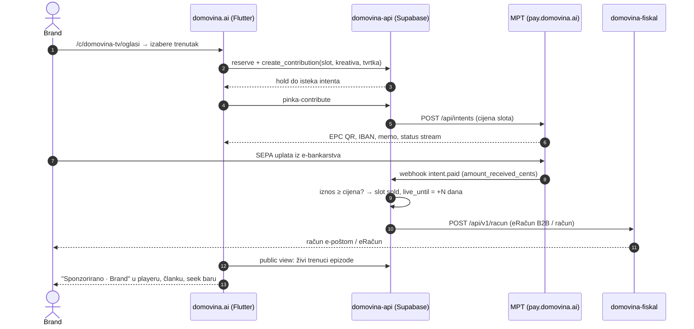

# MVP: samoposlužni sponzorski trenuci na kanalu `domovina_tv`

*Status: plan, 6.10.2026. Nadovezuje se na
[`2026-08-26-p2p-oglasni-prostor.md`](2026-08-26-p2p-oglasni-prostor.md)
(mehanizam) i [`../oglasni-prostor-trziste-i-usporedba.md`](../oglasni-prostor-trziste-i-usporedba.md)
(pravni okvir).*

**Cilj MVP-a**: brand sam, bez razgovora s nama, na `/c/domovina-tv` izabere
trenutak u epizodi, upiše kreativu i podatke tvrtke, plati preko MPT intenta
(SEPA, EPC QR) i — kad uplata sjedne — oglas je **automatski živ**, a račun
**automatski izdan**. Čovjek ne dira ništa osim ako želi povući oglas.

Prvi kanal je naš vlastiti, pa je kreator = platforma: nema isplate trećem,
nema provizije za odvajanje. Prodaja drugim kreatorima je Faza 2 (§6).

> Repo je JAVAN. Imena kupaca, cijene iz pregovora i tijek razgovora ne pišu se
> ovdje — idu u privatni `bizops-automation`.

---

## 0. Tok



---

## 1. Što imamo (izmjereno 6.10.2026.)

**Kanal**: `/c/domovina-tv` → `domovina_tv`, 7 epizoda, sve s člankom.

```bash
curl -s "https://cdn.domovina.ai/channels/data/domovina_tv.json?v=$(date +%s)" \
  | python3 -c "import json,sys; print(len(json.load(sys.stdin)['videos']))"
node scripts/propose-ad-slots.mjs <ytId> --json   # granice trenutaka
```

**Kockice koje se uzimaju kakve jesu:**

| Komad | Gdje | Uloga u MVP-u |
|---|---|---|
| `reserve_slots`, `create_contribution(p_slot_keys)`, holdovi, 409 na konflikt | `domovina-api`, migracija `pinka_slots` | rezervacija trenutka, atomarno |
| `attach_intent` (hold = trajanje intenta, max 24 h) | isto | trenutak je zaključan dok brand plaća |
| `pinka-contribute` → `POST mpt.domovina.ai/api/intents` | `domovina-api/supabase/functions` | kreira MPT intent, vraća EPC QR |
| `pinka-webhook` → `mark_contribution_paid` → `claim_slots_for_contribution` | isto | uplata → slot `sold` |
| `contribution_status` poll + MPT SSE | isto + MPT | checkout panel zna kad je plaćeno |
| `public_slots` view (ime/poruka tek kad je `sold`) | isto | javni prikaz kupca |
| `message_hidden` + `set_contribution_message_hidden` | isto | povlačenje kreative bez deploya |
| `PinkaClient.contribute(slotKeys:)`, `waitForPaid`, SEPA panel | `lib/pinka_sdk/` | checkout UI već postoji |
| `SponsorsInVideo` obrazac (traka u playeru, oznaka u sekciji po vremenu, pojas na seek baru) | `lib/widgets/sponsors_in_video_section.dart` | predložak za prikaz — **kopira se, ne dijeli** |
| `POST /api/v1/racun`, `ERACUN_B2B` preko doku, PDF + e-pošta, idempotencija; KPD 73.12.13 u šifrarniku | `domovina-fiskal` | račun nakon uplate |

---

## 2. Što treba napraviti — MVP

### 2.1 domovina-api (backend)

1. **`timeline` vrsta karte.** `slot_kind` danas dopušta samo `grid`/`seatmap`.
   Migracija: nova vrijednost + `start_sec int`, `end_sec int` na `slots`
   (`pos_x`/`pos_y` su `smallint ≤ 500`, nisu sekunde). Jedna karta po epizodi:
   kampanja `domovina_tv` × `campaign_subjects` → epizoda. Provjeriti
   `unique(campaign_id)` na `slot_maps` — ako ostaje, treba kampanja po epizodi.
2. **Cijena i trajanje po slotu.** `slot_zones` već nose cijenu; dodati
   `run_days` (koliko dugo kupljeni trenutak traje). Uz `sold` dodati
   `live_from`, `live_until`; cron vraća istekle u `free`. Bez toga je slot
   prodan zauvijek.
3. **Provjera iznosa — obavezno.** `mark_contribution_paid` zapisuje
   `amount_received_cents`, ali ga **ne uspoređuje** s cijenom slota, a ni MPT
   to ne radi. Uplata od 1 € bi zauzela trenutak. Pravilo: `received < price` →
   contribution `underpaid`, slot se ne dodjeljuje, alarm.
4. **Kreativa i podaci tvrtke na contributionu.** Postoje `display_name` i
   `message`; `link_url` klijent šalje, ali kolona ne postoji. Dodati:
   `link_url`, `logo_path` (Supabase Storage, upload prije plaćanja),
   `buyer_company`, `buyer_oib`, `buyer_vat_id`, `buyer_email`,
   `buyer_address`, `buyer_reference` (PO broj, opcionalno).
   Validacija: duljine, URL samo `https`, logo ≤ 200 kB PNG/JPG/WebP,
   `sanitize_ugc` kao kod eventa.
5. **Javni view za prikaz.** `public_slots` proširiti (ili novi
   `public_live_moments`) na `start_sec`, `end_sec`, `link_url`, `logo_url`,
   samo za `sold` ∧ `now() ∈ [live_from, live_until)` ∧ `not message_hidden`.
6. **Račun nakon uplate.** U `pinka-webhook` na `intent.paid` (nakon uspješnog
   claima) poziv `domovina-fiskal` `POST /api/v1/racun`:
   - `buyer_oib` postoji → `ERACUN_B2B` pa `/posalji-eracun`;
   - inače → račun kupcu bez OIB-a (vrsta po savjetu knjigovođe, §5 P3).
   - `Idempotency-Key` = id contributiona (webhook se ponavlja do ~47 h).
   - Neuspjeh fiskala ne smije srušiti webhook → zapis `invoice_state` +
     retry cron.
7. **Moderacija.** Samoposluga znači da kreativa ide uživo bez odobrenja. Zato:
   e-pošta vlasniku kanala pri svakoj prodaji s linkom za povlačenje
   (`message_hidden`), i obvezna kvačica u checkoutu „prihvaćam uvjete
   oglašavanja" (popis zabranjenog sadržaja). Povrat novca za odbijenu kreativu
   je u MVP-u **ručan** (MPT nema refund API) — piše u uvjetima.

### 2.2 domovina.ai (ovaj repo)

| Komad | Opis |
|---|---|
| **Izlog** `/c/domovina-tv/oglasi` i `/v/:id/sponzoriraj` | Popis epizoda → karta trenutaka (vremenska traka, slobodno/zauzeto/do kada), uz svaki trenutak naslov sekcije članka koja u njega pada i „Poslušaj". Nove rute u `lib/router/app_router.dart` **i** u matcherima `web/_worker.js` (OG). |
| **Checkout** | Forma: tvrtka, OIB/VAT ID, adresa, e-pošta za račun, PO broj (opcionalno); kreativa: naziv, URL, logo, jedna rečenica; pregled kako će izgledati; kvačica uvjeta. Zatim postojeći SEPA panel (`PinkaClient.contribute`) s EPC QR-om. Prikaz isteka holda. |
| **Prikaz plaćenog trenutka** | Zaseban sloj `SponsoredMoment` (model + `DataService` dohvat iz public viewa). Traka „Sponzorirano · {brand}" u playeru na **tri** mjesta (video traka, `video_panel.dart`, `_PlayerTab`), oznaka u sekciji članka sidrena **vremenom**, pojas na seek baru u boji različitoj od autorovih sponzora. Poveznica s `rel="sponsored"`. |
| **ARB** | „Sponzorirano", „Plaća: {brand}", tekstovi checkouta i uvjeta — HR i EN, registar „ti" za UI, uvjeti formalno. DSA čl. 26: vidi se **tko je platio**. |
| **Mjerenje** | `impression` (pozicija ušla u `[start,end)`, jednom po sesiji), `play_through`, `click` → insert-only tablica. Prikazuje se kupcu na stranici potvrde („Tvoj trenutak: N prikaza"), ne naplaćuje se. |
| **Testovi** | Ugovor `SponsoredMoment` ↔ view, layout trake (širinski budžet), `no_emoji_in_strings`. |

Pravilo iz CLAUDE.md: plaćeni trenutak **nije** `SponsorsInVideo`. Tamo je
„Uz podršku" (autorov sponzor, zahvala), ovdje „Sponzorirano" s imenom
platitelja. Odvojen izvor, odvojen widget.

### 2.3 pay.domovina.ai (MPT)

Ništa obavezno za MVP — `domovina_tv` ide kroz postojeći ITalk tenant i
`pinka-webhook`. Što treba znati i kasnije popraviti:

- **TTL ≤ 24 h.** Marketing koji plaća iz poslovnog e-bankarstva obično stigne
  isti dan; kasna uplata postaje `payment.late` i `mark_contribution_paid`
  je prihvaća ako je slot još slobodan. Hold slota prati intent (`attach_intent`).
- **Memo `mpt:0x…?sid=`** u korporativnom nalogu — ako ga knjigovodstvo kupca
  prepiše, uplata se ne spari. Checkout mora jasno reći „opis plaćanja kopiraj
  doslovno". Kasnije: HR poziv na broj (HUB3) u API-ju.
- **Odredište uplate**: EURe završi u whitelistanom Safeu. Za prihod od
  oglašavanja to je knjigovodstveno pitanje (§5 P2).

### 2.4 domovina-fiskal

1. Produkcijski tenant prodajne pravne osobe (`backend/scripts/dodaj-tenant.sh
   --okolina prod`), poslovni prostor + naplatni uređaj za „oglasi".
2. Kataloška stavka: „Sponzorski trenutak u podcast epizodi", KPD 73.12.13,
   PDV 25 %, jedinica `C62`.
3. **Produkcijski doku token** — bez njega nema B2B eRačuna (obvezan od
   1.1.2026.). Tvrdi blokator.
4. Automatsko slanje eRačuna je zaseban poziv (`/posalji-eracun`) — webhook ga
   mora zvati.
5. Kasnije (ne MVP): odobrenje 381 za povrat, eIzvještavanje o naplati (rok
   20. u mjesecu), cron za doku status.

---

## 3. Sadržaj karte (prije puštanja)

- Trenuci po epizodi iz `propose-ad-slots.mjs` (≈360 s, 4–12 po epizodi), ručno
  pregledani i upisani kao seed migracija.
- **Sve epizode su u ponudi.** Prva verzija ovog plana isključivala je obje
  epizode s katoličkom udrugom i #004 s političkom strankom — to je bilo
  pretjerano oprezno, ne zakonska zabrana:
  - ZEM/AVMSD zabrana *plasmana proizvoda* u vjerskom programu ne pogađa nas:
    mi prodajemo označeno **sponzorstvo** pokraj sadržaja, ne proizvod unutar
    razgovora. Sponzorstvo vjerskog programa je dopušteno.
  - ZEM/AVMSD zabrana *sponzoriranja* aktualno-političkog programa vrijedi samo
    ako smo pružatelj audiovizualne medijske usluge na zahtjev po ZEM-u — to je
    otvoreno pitanje za pravnika (P4), ne činjenica.
  - Uredba (EU) 2024/900 o političkom oglašavanju **ne** pogađa logo tvrtke
    pokraj intervjua s političarem — to nije poruka političkog aktera ni
    poruka za političkog aktera.
- **Brand bira sam**: u izlogu oznaka teme epizode (vjera, politika, posao…) i
  filtar „ne prikazuj me uz …". Sigurnost branda je odluka kupca, ne zabrana.
- Cijena i `run_days` po zoni — prvi cjenik je pogađanje (nema javnih podataka
  za HR podcaste); niska cijena i kratko trajanje daju brže otkrivanje cijene.

---

## 4. Definicija gotovog

- [ ] Brand bez naše pomoći: izlog → trenutak → forma → EPC QR → uplata
- [ ] Uplata manja od cijene **ne** dodjeljuje slot
- [ ] Nakon uplate oglas živ na webu, iOS-u, Androidu, uključujući audio-only putanju
- [ ] eRačun (s OIB-om) ili račun (bez) stigao kupcu automatski, idempotentno
- [ ] Vlasnik dobio e-poštu i jednim klikom može povući kreativu
- [ ] Po isteku `run_days` trenutak se sam vrati u `free`
- [ ] Kupac vidi broj prikaza i klikova
- [ ] Ruta ima OG u workeru, pokrivena `test-social-tags.mjs`

---

## 5. Otvorene odluke

| # | Pitanje | Blokira |
|---|---|---|
| P1 | Pravna osoba koja prodaje i izdaje račun; PDV status | fiskal tenant, uvjeti |
| P2 | Knjigovođa: prihod od oglasa naplaćen kao EURe u Safe — evidencija, tečaj, datum naplate | go-live |
| P3 | Knjigovođa: vrsta računa kad kupac nema OIB (fiskalizacija bezgotovinskog B2C) | 2.1/6 |
| P4 | Pravnik: jesmo li pružatelj AVM usluge na zahtjev po ZEM-u (o tome ovisi smije li se sponzorirati aktualno-politička epizoda), tekst oznake, uvjeti oglašavanja (zabranjeni sadržaj, povrat) | go-live |
| P5 | Cijena i `run_days` po zoni | seed |
| P6 | Ekskluzivnost: smije li ista epizoda nositi dva konkurentska branda | seed |

---

## 6. Faza 2 — prodaja drugim kreatorima (nakon MVP-a)

| Pitanje | Stanje | Smjer |
|---|---|---|
| Tko je prodavatelj brandu (kreator ili platforma) | neodlučeno | porezni savjetnik **prije** koda |
| Isplata kreatoru | `safe-owner-add` vraća `0xstub…` | pravi Safe TX service; MPT target = kreatorov Safe (whitelist) |
| Provizija platforme | ne-custodial model je ne može zadržati | platforma fakturira proviziju kreatoru zasebno (fiskal to može) |
| Buyout ×1,5 / 72 h prvokupa | samo plan | `ad_buyouts` + RPC-ovi; refund API u MPT-u; eRačun 381; FTO patenata |
| Kreatorovo sučelje `/c/:slug/oglasavanje` | nema | cjenik, veto, prihod; claim kanala već postoji |
| Kreator kao fiskal tenant | moguće | onboarding (doku račun, certifikat), ne kod |
