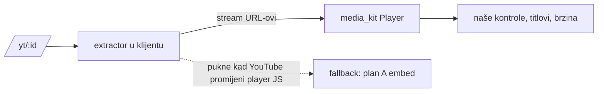

# YouTube bez reklama — plan B (NIJE odobren)

**Status 6.10.2026.**: zapisano, nije implementirano. Implementiran je plan A:
`/yt/:videoId` (`lib/screens/youtube_watch/`) pušta bilo koji YouTube video
kroz službeni youtube-nocookie embed i nudi gumb na obrađenu epizodu kad ona
postoji. Reklame u planu A ostaju.

Plan B je u sukobu s pravilom iz `CLAUDE.md` („YouTube embed = službeni
youtube-nocookie iframe — NIKAD ad-stripping ili stream extraction"). Pokrenuti
se smije tek kad vlasnik projekta to pravilo izričito promijeni.

## Cilj

Korisnik u domovina.ai (iOS, Android, web) gleda bilo koji YouTube video bez
reklama i bez YouTubeovog sučelja (preporuke, end screen, kartice, naslovna
traka), u našem playeru i s našim kontrolama (`widgets/playback_controls.dart`).

## Zašto to ne može ići u postojeću aplikaciju

| Rizik | Posljedica |
|---|---|
| Apple App Review 5.2.3 (preuzimanje/reprodukcija medija treće strane bez dozvole) | odbijen build, a u ponovljenom slučaju i rizik za developer račun |
| Google Play: pravila o ometanju tuđih oglasa i o YouTube sadržaju | uklanjanje aplikacije, strike na računu |
| YouTube ToS i API ToS | blokada IP-ova, a uz YouTube Data API i opoziv ključa |
| Poslovni model | domovina.ai gradi preuzimanje kanala i Pinka podršku kreatorima; brisanje njihovih reklama ide protiv toga |

Na istom developer računu su RevenueCat pretplate, nightly TestFlight/Play
pipeline i Android TV aplikacija. Gubitak računa nije samo gubitak ove
funkcije.

Točne formulacije pravila treba provjeriti u trenutku odluke; ovdje su
zapisane po sjećanju, ne citirane.

## Tehničke varijante

### B1 — native izvlačenje streamova + media_kit (NewPipe model)

- Dart: `youtube_explode_dart`. Alternativa je NewPipeExtractor (Java) preko
  platform channela, samo za Android.
- Prednost: postojeći player, kontrole i pozadinska reprodukcija rade bez
  promjena.
- Održavanje: YouTube od 2025. traži PO token i prelazi na SABR streaming, pa
  ekstraktori pucaju svakih nekoliko tjedana. Treba automatski fallback na plan
  A i dnevni smoke test (jedan poznati video, provjera da se stream otvara).
- Web: ne radi. Stream URL-ovi su vezani uz IP koji ih je zatražio i nemaju
  CORS.

### B2 — WebView s blokerom sadržaja

- Učitati `m.youtube.com/watch?v=<id>` u WebView, blokirati oglasne domene i
  sakriti YouTube UI ubrizganim CSS/JS-om.
- iOS: `WKContentRuleList`. Android: `shouldInterceptRequest`.
- Lošije od B1: oglasi na YouTubeu dolaze sve češće iz istog streama
  (server-side insertion), pa mrežni bloker postaje nemoćan; CSS selektori se
  mijenjaju često.

### B3 — web preko vlastitog proxyja (Invidious/Piped model)

- Server izvlači streamove i proxira bajtove pregledniku.
- Jedini put za web, jer cross-origin iframe ne možemo mijenjati (vidi
  `docs/web-delivery-and-rendering.md` §6).
- Cijena: sav video promet ide preko nas; Google blokira IP-ove poznatih
  proxyja; i dalje treba PO token. Ne bi išao na Cloudflare Workers (ToS za
  proxiranje videa), nego na vlastiti server.

## Preporuka ako se plan B ikad pokrene

1. **Odvojena aplikacija, ne domovina.ai.** Drugi package ID, drugi brand,
   distribucija izvan trgovina (APK s weba / F-Droid). domovina.ai i developer
   računi ostaju čisti.
2. Varijanta B1 za Android, uz obavezni fallback na službeni embed.
3. Web (B3) tek ako se dokaže potražnja, jer je jedini dio s trajnim
   troškom infrastrukture.
4. Prije starta: dnevni smoke test ekstraktora u CI-ju i alarm u Telegram (kroz
   `scripts/telegram-notify.rb`), jer će kvar biti redovit, ne iznimka.

## Legitimna alternativa koja već postoji

Epizode koje obradi fetch pipeline idu s našeg CDN-a (`video_h264.mp4`), bez
reklama i kroz naš player. Realne poluge:

- skratiti vrijeme do `mediaReady` (backlog je bio 14–25 dana,
  `node scripts/audit-episode-stages.mjs`);
- dodati višu rezoluciju od sadašnjih 360p (dual-encode u pipelineu).

Gumb „Otvori obrađenu epizodu" na `/yt/:id` je most između plana A i te
alternative.
