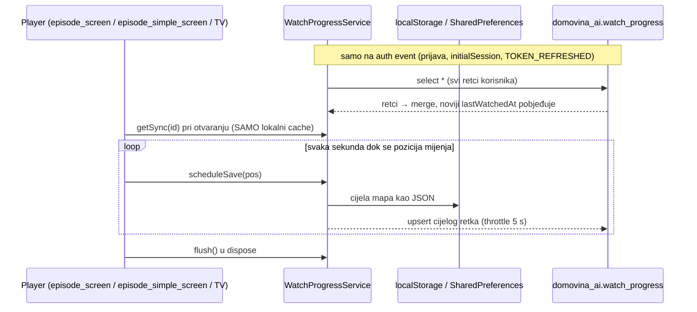

# Nastavi gledati — sinkronizacija pozicije između uređaja (plan)

Status: **plan, ništa nije implementirano.** Analiza napravljena 8.10.2026. nad
`main` (v2.0.172) i `domovina-api` migracijama; brojke iz produkcijske baze
izmjerene istog dana (naredbe u §6).

## TL;DR

Prijavljen korisnik na dva uređaja ne nastavlja gdje je stao jer (1) uređaj sa
zastarjelim lokalnim cacheom **pregazi** noviju poziciju na backendu, (2)
pobjednika spajanja bira **sat uređaja**, a (3) svaki slučajni swipe po traci
upiše se u roku od 5 s. Usput klijent piše ~720 upserta po satu gledanja, a
hidracija povlači cijelu tablicu korisnika na svaki auth event.

Popravak je u tri faze: (1) svjež dohvat pri otvaranju + delta pull na fokus +
serverski `updated_at` + „pozicija se piše tek kad je stvarna", (2) rjeđe i
lakše pisanje (~120/h, HOT updatei), (3) „Započeto" kao automatski bookmark i
chip „Nastavi s drugog uređaja".

## 1. Kako danas radi



- `lib/services/watch_progress_service.dart` — lokalna mapa `_byEpisode`,
  `scheduleSave` (lokalno odmah, remote throttle 5 s), `hydrateFromSupabase`
  (povuče sve retke, merge po `lastWatchedAt`), `migrateToSupabase` (jednokratni
  backfill po korisniku).
- Resume čita **samo** `getSync` — `lib/screens/episode_screen.dart`
  (`_initVideo`), `lib/screens/episode_simple_screen.dart`,
  `lib/screens/tv/tv_episode_screen.dart`, `lib/screens/tv/tv_episode_reader_screen.dart`.
- Hidraciju okida jedino `AuthService._setUser` → `_runMigrations`
  (`lib/services/auth_service.dart`), za **svaki** auth event s ne-anonimnim
  korisnikom — uključujući osvježavanje tokena.
- Rail „Nastavi slušati" (`lib/screens/home/home_screen.dart`,
  `lib/screens/tv/tv_home_screen.dart`) čita samo lokalni `continueWatching()`.
  `continueWatchingRemote()` (view `v_continue_watching`) nitko ne zove.
- `lib/services/player_resume.dart` — `openAndResume` čeka duration pa seeka
  (libmpv inače odbaci rani seek). Ovo radi i ne dira se.

Backend (`domovina-api/supabase/migrations/`):

- `20260520120200_domovina_ai_schema.sql` — `watch_progress`, PK
  `(user_id, episode_id)`; `percent_complete` i `completed` (≥ 90 %) su
  generirani iz pozicije; indeksi `ix_wp_continue (user_id, last_watched_at desc)`
  i `ix_wp_completed (user_id, completed, last_watched_at desc)`;
  `last_device` je enum (`web`, `ios`, `android`, `macos`). `watch_count`, `playback_rate`,
  `audio_track`, `subtitle_track` postoje, a klijent ih ne piše.
  `watch_sessions` postoji, a klijent u nju ne piše.
- `20260520120300_triggers_functions.sql` — `trg_log_completion`: prijelaz
  `completed` false → true upisuje `episode.completed` u `public.activity_events`.
- `20260520120400_rls_policies.sql` — vlasnik čita/piše svoje retke.

## 2. Zašto nastavak na drugom uređaju ne radi

### 2.1 Zastarjeli uređaj briše noviju poziciju (gubitak podataka)

Nema povlačenja pri povratku appa u prvi plan / fokusu taba. Scenarij:
mobitel stane na 40:00 → laptop je od jučer otvoren s 12:00 u mapi → otvori
epizodu, krene od 12:00 → nakon 5 s upsert 12:05 sa svježim
`last_watched_at` → 40:00 je nepovratno izgubljen, i na backendu i (pri sljedećoj
hidraciji) na mobitelu.

Isto bez dva uređaja: deep link na `/v/<id>` otvara player prije nego što
fire-and-forget hidracija iz `_runMigrations` završi — `getSync` vrati staro ili
ništa, video krene od 0 i prvi upsert pregazi pravu poziciju.

### 2.2 Pobjednika bira sat uređaja

`lastWatchedAt = DateTime.now()` na klijentu je i vrijednost u bazi i kriterij
merga. Izmjereno 8.10.2026.: **13 redaka s `last_device = android` ima
`last_watched_at` u budućnosti**, najdalji 2026-10-28 (20 dana unaprijed) —
vjerojatno TV box s krivim satom. Ti reci pobjeđuju svaki merge dok ih vrijeme
ne sustigne.

### 2.3 Slučajni skok se odmah sprema

Svaka promjena sekunde ide u `scheduleSave`, uključujući ručni skok. Swipe do
95 % → za ≤ 5 s u bazi → `completed = true` (generirano) → sljedeće otvaranje
kreće od 0 (rewatch konvencija), epizoda nestaje iz raila, a okidač upiše lažni
`episode.completed`. `SeekUndo` (`lib/services/seek_undo.dart`) već prepoznaje
ručni skok i nudi Undo, ali spremanje progresa za njega ne zna.

### 2.4 Manji kvarovi

- Web: zatvaranje taba ne zove `dispose`, nema `pagehide` flusha → zadnjih do 5 s
  se izgubi. Native force-quit: lokalni zapis je fire-and-forget.
- `last_device` enum ne razlikuje dva web uređaja (laptop vs. iPhone Safari).

## 3. Opterećenje backenda danas

| Što | Danas |
|---|---|
| Pisanje dok svira | upsert cijelog retka svakih 5 s ≈ **720/h po gledatelju** (s naslovom i URL-om sličice svaki put) |
| HOT updatei | **32 od 51 527** — `last_watched_at` je u dva sekundarna indeksa, pa svaki update piše i u indekse |
| Hidracija | `select *` svih redaka korisnika na svaki auth event, uključujući `TOKEN_REFRESHED` (~1×/h) |
| Šum | **507 od 1 362** retka ima `position_seconds <= 30` („otvorio pa izašao") |
| Lokalno | cijela mapa serijalizirana u localStorage svake sekunde |

Apsolutno je to malo (1 362 retka, 480 korisnika), ali raste linearno s
gledanjem, i baš je pisanje ono što uzrokuje kvar iz §2.1.

## 4. Plan

### Faza 1 — zaustaviti gubitak podataka

1. **Svjež dohvat pri otvaranju epizode.** Prije seeka jedan `select` po PK
   `(user_id, episode_id)` s timeoutom ~800 ms; ako ne stigne, lokalna vrijednost.
   Uzima se novija od lokalne i remote po **serverskom** `updated_at`. Cijena:
   jedno PK čitanje po otvaranju epizode.
2. **Delta pull na fokus.** Na `AppLifecycleState.resumed` / `visibilitychange`
   → visible, najviše jednom u minuti: `where updated_at > :kursor`, kursor je
   najveći serverski `updated_at` koji smo vidjeli. U pravilu 0 redaka. Puni
   `hydrateFromSupabase` ostaje samo za prvu prijavu na uređaju i **ne** okida se
   na `TOKEN_REFRESHED`.
3. **Vrijeme postavlja server.** Novi stupac `updated_at timestamptz not null
   default now()` koji puni RPC `domovina_ai.save_watch_progress(...)`
   (`security invoker`, RLS ostaje), nikad klijent. `last_watched_at` klijenta se
   više ne koristi za merge. Jednokratno: `update … set last_watched_at =
   least(last_watched_at, now())`.
4. **Pozicija se piše tek kad je stvarna.**
   - nema remote pisanja dok sesija ne odsvira ≥ 30 s (miče i šum iz §3);
   - nakon ručnog skoka pisanje čeka dok pozicija ne stoji ≥ 10 s, tj. dok
     `SeekUndo` prozor ne istekne — swipe + Undo nikad ne dođe do baze;
   - `completed` prestaje biti generiran iz pozicije: postavlja ga RPC kad
     klijent javi stvarni kraj (`completed` event playera) ili ≥ 90 % dosegnuto
     reprodukcijom, ne skokom. `trg_log_completion` tada okida samo na pravi kraj.

Promjene: jedna migracija u `domovina-api` (stupac, RPC, popravak redaka,
`completed` kao običan stupac), `watch_progress_service.dart`, četiri resume
mjesta iz §1, `AuthService._runMigrations`.

### Faza 2 — manje i lakše pisanje

5. **Ritam:** svakih 30 s dok svira + na pauzu + kad se skok smiri + na odlazak u
   pozadinu / `dispose`. Web: `pagehide` šalje zadnju poziciju kroz
   `fetch(..., keepalive: true)` s bearer tokenom (`sendBeacon` ne može nositi
   `Authorization`). ≈ 120/h umjesto 720/h.
6. **HOT updatei:** obrisati `ix_wp_continue` i `ix_wp_completed`,
   `fillfactor = 70`. Korisnik ima stotine redaka — PK prefiks `user_id` +
   sortiranje u memoriji je dovoljno, i za delta pull. Bez indeksiranih stupaca
   koji se mijenjaju update postaje HOT.
7. **Lakši payload:** naslov, sličica i kanal samo pri prvom zapisu (RPC ih
   `coalesce`-a), dalje samo `episode_id`, pozicija, trajanje, uređaj.
8. **Lokalno:** localStorage zapis najviše svakih 5 s + na pauzu/pozadinu, ne
   svake sekunde.
9. **ID uređaja po instalaciji** (nasumičan, u local prefs) u `last_device_id`
   uz postojeći enum — potreban za chip iz faze 3.

### Faza 3 — automatski bookmark i handoff

10. **„Započeto" kao puni popis** (ruta po uzoru na `/favorites`): retci s
    pozicijom > 30 s i bez `completed`, iz istog lokalnog cachea — nula dodatnih
    upita. „Ukloni s popisa" postavlja `hidden_at` (pozicija ostaje za resume).
    Rail „Nastavi slušati" i popis dijele isti filtar.
11. **„Nastavi s drugog uređaja"**: kad delta pull nađe epizodu koju je
    korisnik u zadnjih ~30 min gledao na drugom `last_device_id`, trajni chip
    („Naslov · 40:00") na naslovnici. Po pravilu iz CLAUDE.md: persistent
    surface, nikad modal, nikad preko reprodukcije.

### Namjerno odbačeno

- **Supabase Realtime** — websocket po klijentu za nešto što delta pull na fokus
  rješava gotovo jednako, uz stalan teret blizu nule.
- **Compare-and-set s verzijom retka** (odbij zapis ako je red u međuvremenu
  promijenio drugi uređaj) — faza 1 (svjež dohvat + 30 s prag) pokriva
  realne slučajeve; CAS ostaje opcija ako se istovremeno gledanje na dva uređaja
  pokaže kao problem.
- **„Najdalja pozicija pobjeđuje"** — kriva semantika: korisnik koji se namjerno
  vrati unatrag mora nastaviti odande.

## 5. Kako provjeriti da radi (kad se implementira)

- Dva preglednika, isti račun: A stane na 40:00, B ima epizodu otvorenu od ranije
  na 12:00 → fokus na B → otvori epizodu → mora krenuti od ~40:00, a red u bazi
  ne smije pasti na 12:xx.
- Swipe do kraja pa Undo unutar prozora → `select position_seconds, completed`
  nepromijenjen, nema novog `episode.completed`.
- Uređaj s satom +1 dan → njegov zapis ne smije pobijediti noviji s drugog
  uređaja.
- `pg_stat_user_tables` za `watch_progress`: `n_tup_hot_upd / n_tup_upd` blizu 1.

## 6. Reprodukcija brojki

Na produkcijskoj bazi (psql u `supabase-db` kontejneru):

```sql
-- 1362 | 480 | … : retci, korisnici
select count(*), count(distinct user_id) from domovina_ai.watch_progress;

-- 13 redaka u budućnosti, svi android, max 2026-10-28 (mjereno 8.10.2026.)
select last_device, count(*), max(last_watched_at)
  from domovina_ai.watch_progress
 where last_watched_at > now() + interval '5 minutes'
 group by 1;

-- 51527 updatea, 32 HOT
select n_tup_upd, n_tup_hot_upd
  from pg_stat_user_tables where relname = 'watch_progress';

-- 507 redaka s <= 30 s
select count(*) filter (where position_seconds <= 30)
  from domovina_ai.watch_progress;
```
