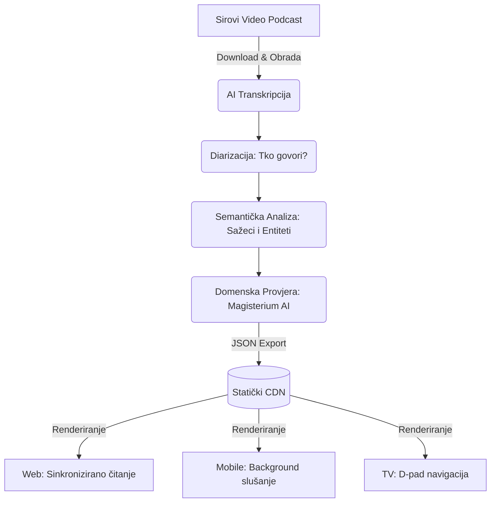

# Podcasterium – Analiza Codebasea i Usporedba (YouTube vs Netflix)

Ovaj izvještaj donosi detaljnu analizu funkcionalnosti prisutnih u analiziranom repozitoriju (`domovina.ai`) s ciljem rebrandinga i adaptacije u **Podcasterium** – specijalizirani alat za gledanje, čitanje i analizu podcasta.

---

## 1. Analiza Funkcionalnosti (Trenutni Codebase)

Pregledom koda (oslanjajući se na `README.md`, `CLAUDE.md`, strukturu foldera te `pubspec.yaml`), arhitektura platforme otkriva vrlo moćan alat skrojen za "deep-dive" u video sadržaj. Platforma je izgrađena koristeći **Flutter** (optimizirana za Web preko WASM-a, te Mobile i Android TV).

### Arhitektura Sustava (Pipeline)

**Ključne funkcionalnosti Podcasteriuma na temelju koda:**
1. **Sinkronizirano Gledanje i Čitanje:**
   - Postoje komponente poput `article_section.dart` i `video_panel.dart` koje omogućuju korisniku da podcast istovremeno gleda i čita u formi strukturiranog članka s poglavljima (`chapters_section.dart`), a ne samo kao neuredni "zid teksta" ili sirovi transkript.
2. **Diarizacija (Prepoznavanje govornika):**
   - Implementiran je `speaker_timeline.dart` (čita se iz `diarized.srt`), što znači da aplikacija točno zna tko govori u kojem trenutku.
3. **Izdvajanje i Navigacija po Entitetima:**
   - Postoji napredni sustav za praćenje osoba, mjesta i organizacija (`entities_section.dart`). Preko "Person Hub-a" omogućeno je skakanje točno na dijelove epizode gdje određena osoba govori ili se samo spominje.
4. **Domenska AI Analiza (Fact-checking / Alignment):**
   - Kod trenutno koristi _Magisterium AI_ za teološku analizu (`magisterium_section.dart`). U Podcasteriumu se ovo lako može adaptirati u **prilagođeni AI Fact-checker** koji provjerava izjave izgovorene u podcastu u odnosu na znanstvene radove, povijesne činjenice ili specifičnu stručnu literaturu.
5. **Napredne Kontrole i UX:**
   - Prilagođen "Seek-Undo" (poništavanje slučajnog premotavanja), kontrola brzine reprodukcije, te rješavanje kompleksnih problema "muted autoplay-a" na web preglednicima.
   - Background playback podrška za mobilne uređaje (slušanje podcasta dok je zaslon ugašen).
6. **Cross-Platform uz Leanback (TV) Podršku:**
   - Kod nativno rješava navigaciju putem daljinskog upravljača za Android TV platforme (`tv_episode_screen.dart`), stavljajući ga uz bok Netflixovom TV iskustvu.

---

## 2. Podcasterium vs. YouTube vs. Netflix (Side-by-Side)

Iako sve tri platforme barataju video sadržajem, njihova arhitektura i namjera drastično se razlikuju.

| Značajka | Podcasterium (Ovaj Codebase) | YouTube | Netflix |
| :--- | :--- | :--- | :--- |
| **Svrha** | Edukacija, analitika, "Deep-Dive" u podcast. | Zadržavanje pažnje, masovna UGC konzumacija. | Premium zabava, "Binge-watching". |
| **Model Sadržaja** | Video oplemenjen strukturiranim tekstom i AI analizom. | Pretežno Video (tekst i opis su sekundarni). | Samo Video (s titlovima). |
| **Način Konzumacije** | Čitanje i gledanje. Navigacija po govorniku i temi. | Oslanjanje na vremensku traku i vizualne elemente. | Linearno gledanje epizodu po epizodu. |
| **Prepoznavanje Entiteta** | Visoko: Kliknibilni tagovi osoba koje se spominju/govore. | Nisko: Ovisno o tome što autor ručno stavi u opis. | Nisko: Samo imena glumaca/redatelja. |
| **Korisnička distrakcija** | Minimalna: Sučelje dizajnirano isključivo za duboki fokus. | Ogromna: Preporuke sa strane, Shorts, clickbait. | Niska do srednja (guranje novih serija nakon odjavne špice). |
| **AI Integracija** | Duboka: Sažeci po sekcijama, provjera činjenica/ocjena kvalitete. | Površna: Automatski titlovi (često loši). | Nema: Samo preporuke na temelju povijesti gledanja. |
| **Iskustvo na TV-u** | Posebno TV sučelje s punom podrškom za daljinski upravljač. | Odlično TV sučelje, ali izrazito "teško" za čitanje. | Zlatni standard za TV interfejs. |

---

## 3. Prednosti i Nedostaci (Pros / Cons Analiza)

### 🟢 Podcasterium (AI Podcast Čitač/Gledatelj)
**Pros (Prednosti):**
- **Produktivnost i ušteda vremena:** Čitanje strukturiranog članka uz video drastično ubrzava konzumaciju sadržaja u usporedbi s linearnim slušanjem.
- **Bogata navigacija:** Mogućnost pronalaska specifičnog odgovora u podcastu od 3 sata samo klikom na ime gosta ili entitet.
- **Kognitivni mir:** Nema algoritamskog feeda koji pokušava omesti korisnika s trenutnog zadatka.
- **Multimodalnost:** Podržava web platformu za čitanje na poslu, ali nudi i TV iskustvo i background-audio iskustvo za mobitel.

**Cons (Nedostaci):**
- **Složeni Backend Pipeline:** Za svaku novu epizodu potreban je složen "iza-kulisa" proces (transkripcija -> diarizacija -> AI generiranje članaka -> dohvaćanje entiteta). Ovo je računski i financijski skupo.
- **Uži doseg publike:** Alat je idealan za studente, istraživače, novinare i entuzijaste, ali vjerojatno nije privlačan prosječnom korisniku koji želi samo da nešto "svira u pozadini".

### 🔴 YouTube
**Pros (Prednosti):**
- Apsolutna dominacija u količini i dostupnosti sadržaja. Svi podcasti su već tamo.
- Besprijekorna infrastruktura isporuke videa bez troškova za korisnika.

**Cons (Nedostaci):**
- Sustav je optimiziran za *attention economy* – ne želi da korisnik analizira video, već da klikne na idući predloženi video s provokativnim naslovom.
- Čitanje transkripata na YouTubeu je izrazito bolno iskustvo, gotovo nemoguće za ozbiljan rad.

### 🔴 Netflix
**Pros (Prednosti):**
- Fokusirano, uranjajuće, *premium* iskustvo uz vrhunsku kvalitetu reprodukcije.
- Izvanredno prilagođeno svim uređajima na svijetu.

**Cons (Nedostaci):**
- "Walled garden" – nemoguće je uvesti korisnički sadržaj (ne možete gledati Joea Rogana ili Lexa Fridmana na Netflixu).
- Nula podrške za produktivnost; nemoguće je pretraživati izrečene misli ili čitati sadržaj.

---

## 4. Zaključni Report

Trenutni *codebase* (`domovina.ai`) pruža **izvanredan tehnički temelj** za izgradnju **Podcasteriuma**. On već rješava najteže probleme multimodalnih aplikacija u Flutteru (video integracija na webu, sinkronizacija titlova s videom, background sviranje zvuka na mobitelu, te TV layout).

Podcasterium se na tržištu ne bi trebao pozicionirati kao konkurent YouTubeu, već kao njegov **pametni nadograđivač (enhancer)** ili kao potpuno nova kategorija alata – *Podcast Book Reader*. Dok vas YouTube mami na *binge-watching* svega i svačega (slično Netflixu, ali u UGC sferi), Podcasterium se ponaša kao interaktivna knjiga. On pretvara nestrukturirani 3-satni razgovor u pretraživ, čitljiv, indeksiran i analitički provjeren udžbenik, ostavljajući pritom i izvorni audiovizualni format korisniku na dohvat ruke. 

**Preporuka za daljnji razvoj (u smjeru Podcasteriuma):**
1. **Generalizacija AI Fact-Checkera:** Postojeći `magisterium_section.dart` valja apstrahirati u univerzalni modul za domensku provjeru (kako bi se mogao koristiti za npr. tehnološke podcaste, političke debate, medicinske teme).
2. **Poboljšani Onboarding:** Osigurati da korisnik odmah razumije da se podcast *može i čitati* (ističući `article_section.dart`).
3. **Optimizacija Pipelinea:** Fokusirati backend resurse isključivo na visokokvalitetne podcaste koji najviše profitiraju od deep-dive analitike (poput Hubermana, Fridmana, stručnih panela).
