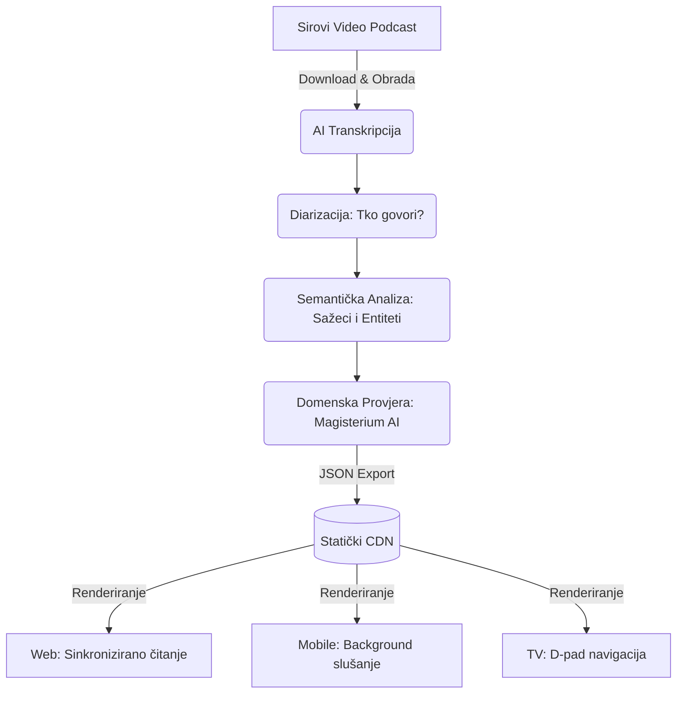

# Podcasterium – Analiza Codebasea i Usporedba (YouTube vs Netflix)

Ovaj izvještaj donosi detaljnu analizu funkcionalnosti prisutnih u analiziranom repozitoriju (`domovina.ai`) s ciljem rebrandinga i adaptacije u **Podcasterium** – specijalizirani alat za gledanje, čitanje i analizu podcasta.

---

## 1. Analiza Funkcionalnosti (Trenutni Codebase)

Pregledom koda (oslanjajući se na `README.md`, `CLAUDE.md`, strukturu foldera te `pubspec.yaml`), arhitektura platforme otkriva vrlo moćan alat skrojen za "deep-dive" u video sadržaj. Platforma je izgrađena koristeći **Flutter** (optimizirana za Web preko WASM-a, te Mobile i Android TV).

### Arhitektura Sustava (Pipeline)

### Iscrpni tehnički pregled i arhitektura (Exhaustive Codebase Analysis)

Dubinska analiza `lib/` direktorija otkriva zapanjujuću razinu inženjeringa koja uvelike nadilazi jednostavan video player. Codebase predstavlja sazrelu platformu prepunu integracija. Ovdje je iscrpan pregled ključnih podsustava:

**1. Hibridni Video-Tekst Model (Sinkronizirano Gledanje i Čitanje)**
Aplikacija upravlja složenim stanjem preko `media_kit` (v2.0.1) wrappera (`widgets/episode_video.dart`). Interakcija između videa i teksta ostvaruje se kroz `video_panel.dart` i `article_section.dart`. Tekst nije običan transkript, već interaktivni HTML/Markdown s omogućenim podvlačenjem (`em_highlight_text.dart`). Implementirani su napredni servisi poput `seek_undo.dart` koji detektiraju manuelne "skokove" u playeru i omogućuju poništavanje akcije, te `playback_speed.dart` za preciznu kontrolu.

**2. Autentifikacija, e-Građani i Passkeys**
Osim standardnog OAuth login-a, codebase ima implementaciju najmodernijih standarda:
- **Passkeys (`services/passkey_service.dart`):** Biometrijska prijava bez lozinki na svim podržanim uređajima.
- **Certilia/NIAS eID (`services/certilia_service.dart`):** Kod ukazuje na integraciju s hrvatskim e-Građani sustavom (`flutter_certilia` lokalni paket), što Podcasterium potencijalno čini jedinim podcast playerom s high-trust autentifikacijom (važno za premium / zaštićene sadržaje ili glasanja).

**3. Pinka SDK (On-chain financiranje i Web3 integracija)**
Codebase sadrži cijeli custom SDK (`lib/pinka_sdk/`) posvećen mikro-transakcijama i podršci kreatorima.
- Sustav komunicira s on-chain mehanizmima (`pinka_onchain.dart`, `pinka_onchain_confirm.dart`) i digitalnim novčanicima (`wallet/pinka_wallet.dart`).
- Korisnici mogu ostaviti javni "Contribution" ili sponzorirati "Slot" (`pinka_slot.dart`) direktno kroz aplikaciju. 
- Vizualizacija podrške rješava se preko predivnih UI elemenata poput zidova sponzora (`pinka_grid_wall.dart` i `pinka_support_card.dart`).

**4. Napredno pretraživanje (MeiliSearch)**
U `services/meili_client.dart` i `screens/search/meili_search_screen.dart` nalazi se implementacija MeiliSearch engine-a. Za razliku od YouTube-a koji traži samo naslove, ovaj RAG-like sustav traži ključne riječi *unutar samih izgovorenih rečenica* svih podcasta, indeksirajući sekunde u kojima su riječi izgovorene.

**5. Ekstrakcija Entiteta i "Person Hub" Ekosustav**
Aplikacija parsira `diarized.srt` i spaja lica i glasove preko `models/person_hub.dart`. UI u `screens/person/person_screen.dart` agregira sve podcaste u kojima je određena osoba *gostovala* (govorila) i sve epizode u kojima je samo *spomenuta*, tvoreći moćan istraživački alat s automatskim prebacivanjem na točnu minutu (`services/person_service.dart`).

**6. Monetizacija, Paywall i Vlasništvo Kanala**
Postoji robusna integracija za klasične pretplate putem Apple/Google storeova (`services/revenue_cat/revenue_cat_service_native.dart`). Moduli poput `screens/subscribe/paywall_screen.dart` i `upgrade_trigger.dart` rješavaju korisničko putovanje kroz pretplatu. 
Također, jedinstven je koncept preuzimanja vlasništva nad sadržajem (`screens/ownership/channel_ownership_screen.dart`), gdje stvarni vlasnici YouTube kanala mogu "claimati" svoj sadržaj na platformi.

**7. Glasanje (Voting System)**
Iznenađujući pronalazak u `screens/voting/voting_screen.dart` i `models/vote_round.dart` ukazuje na to da platforma podržava interaktivna glasanja za vrijeme ili nakon emisija, sa *streak* flagovima i gamifikacijom (`screens/voting/widgets/streak_flags.dart`). 

**8. Ekstremna Cross-Platform TV i Background optimizacija**
- **Mobile Background (`services/background_audio.dart`):** Kontinuirano slušanje s ugašenim zaslonom.
- **Handoff (`services/handoff_service.dart`):** Glatki prijenos sesije između mobilnog uređaja i weba.
- **Android TV (`screens/tv/tv_home_screen.dart`):** Zaseban *Leanback* UI specijaliziran za D-Pad navigaciju (`widgets/tv_row_traversal.dart`), TV boot splash (`tv_boot_splash.dart`) i TV specifične čitače epizoda (`tv_episode_reader_screen.dart`).

**Zaključno o arhitekturi:** Ovo nije MVP (Minimum Viable Product). Radi se o izrazito naprednoj full-stack aplikaciji s elementima Weba3 (Pinka), naprednog Searcha (Meili), High-trust Logina (Certilia) i moćnog AI video-tekst procesiranja.

---

## 2. Podcasterium vs. YouTube vs. Netflix (Side-by-Side)

Iako sve tri platforme barataju video sadržajem, njihova arhitektura i namjera drastično se razlikuju.

| Značajka | Podcasterium (Ovaj Codebase) | YouTube | Netflix |
| :--- | :--- | :--- | :--- |
| **Svrha** | Edukacija, analitika, "Deep-Dive" u podcast. | Zadržavanje pažnje, masovna UGC konzumacija. | Premium zabava, "Binge-watching". |
| **Model Sadržaja** | Video oplemenjen strukturiranim tekstom i AI analizom. | Pretežno Video (tekst i opis su sekundarni). | Samo Video (s titlovima). |
| **Način Konzumacije** | Čitanje i gledanje. Navigacija po govorniku i temi. | Oslanjanje na vremensku traku i vizualne elemente. | Linearno gledanje epizodu po epizodu. |
| **Prepoznavanje Entiteta** | Visoko: Kliknibilni tagovi osoba koje se spominju/govore. | Nisko: Ovisno o tome što autor ručno stavi u opis. | Nisko: Samo imena glumaca/redatelja. |
| **Korisnička distrakcija** | Minimalna: Sučelje dizajnirano isključivo za duboki fokus. | Ogromna: Preporuke sa strane, Shorts, clickbait. | Niska do srednja (guranje novih serija nakon odjavne špice). |
| **AI Integracija** | Duboka: Sažeci po sekcijama, provjera činjenica/ocjena kvalitete. | Površna: Automatski titlovi (često loši). | Nema: Samo preporuke na temelju povijesti gledanja. |
| **Iskustvo na TV-u** | Posebno TV sučelje s punom podrškom za daljinski upravljač. | Odlično TV sučelje, ali izrazito "teško" za čitanje. | Zlatni standard za TV interfejs. |

---

## 3. Prednosti i Nedostaci (Pros / Cons Analiza)

### 🟢 Podcasterium (AI Podcast Čitač/Gledatelj)
**Pros (Prednosti):**
- **Produktivnost i ušteda vremena:** Čitanje strukturiranog članka uz video drastično ubrzava konzumaciju sadržaja u usporedbi s linearnim slušanjem.
- **Bogata navigacija:** Mogućnost pronalaska specifičnog odgovora u podcastu od 3 sata samo klikom na ime gosta ili entitet.
- **Kognitivni mir:** Nema algoritamskog feeda koji pokušava omesti korisnika s trenutnog zadatka.
- **Multimodalnost:** Podržava web platformu za čitanje na poslu, ali nudi i TV iskustvo i background-audio iskustvo za mobitel.

**Cons (Nedostaci):**
- **Složeni Backend Pipeline:** Za svaku novu epizodu potreban je složen "iza-kulisa" proces (transkripcija -> diarizacija -> AI generiranje članaka -> dohvaćanje entiteta). Ovo je računski i financijski skupo.
- **Uži doseg publike:** Alat je idealan za studente, istraživače, novinare i entuzijaste, ali vjerojatno nije privlačan prosječnom korisniku koji želi samo da nešto "svira u pozadini".

### 🔴 YouTube
**Pros (Prednosti):**
- Apsolutna dominacija u količini i dostupnosti sadržaja. Svi podcasti su već tamo.
- Besprijekorna infrastruktura isporuke videa bez troškova za korisnika.

**Cons (Nedostaci):**
- Sustav je optimiziran za *attention economy* – ne želi da korisnik analizira video, već da klikne na idući predloženi video s provokativnim naslovom.
- Čitanje transkripata na YouTubeu je izrazito bolno iskustvo, gotovo nemoguće za ozbiljan rad.

### 🔴 Netflix
**Pros (Prednosti):**
- Fokusirano, uranjajuće, *premium* iskustvo uz vrhunsku kvalitetu reprodukcije.
- Izvanredno prilagođeno svim uređajima na svijetu.

**Cons (Nedostaci):**
- "Walled garden" – nemoguće je uvesti korisnički sadržaj (ne možete gledati Joea Rogana ili Lexa Fridmana na Netflixu).
- Nula podrške za produktivnost; nemoguće je pretraživati izrečene misli ili čitati sadržaj.

---

## 4. Zaključni Report

Trenutni *codebase* (`domovina.ai`) pruža **izvanredan tehnički temelj** za izgradnju **Podcasteriuma**. On već rješava najteže probleme multimodalnih aplikacija u Flutteru (video integracija na webu, sinkronizacija titlova s videom, background sviranje zvuka na mobitelu, te TV layout).

Podcasterium se na tržištu ne bi trebao pozicionirati kao konkurent YouTubeu, već kao njegov **pametni nadograđivač (enhancer)** ili kao potpuno nova kategorija alata – *Podcast Book Reader*. Dok vas YouTube mami na *binge-watching* svega i svačega (slično Netflixu, ali u UGC sferi), Podcasterium se ponaša kao interaktivna knjiga. On pretvara nestrukturirani 3-satni razgovor u pretraživ, čitljiv, indeksiran i analitički provjeren udžbenik, ostavljajući pritom i izvorni audiovizualni format korisniku na dohvat ruke. 

**Preporuka za daljnji razvoj (u smjeru Podcasteriuma):**
1. **Generalizacija AI Fact-Checkera:** Postojeći `magisterium_section.dart` valja apstrahirati u univerzalni modul za domensku provjeru (kako bi se mogao koristiti za npr. tehnološke podcaste, političke debate, medicinske teme).
2. **Poboljšani Onboarding:** Osigurati da korisnik odmah razumije da se podcast *može i čitati* (ističući `article_section.dart`).
3. **Optimizacija Pipelinea:** Fokusirati backend resurse isključivo na visokokvalitetne podcaste koji najviše profitiraju od deep-dive analitike (poput Hubermana, Fridmana, stručnih panela).
