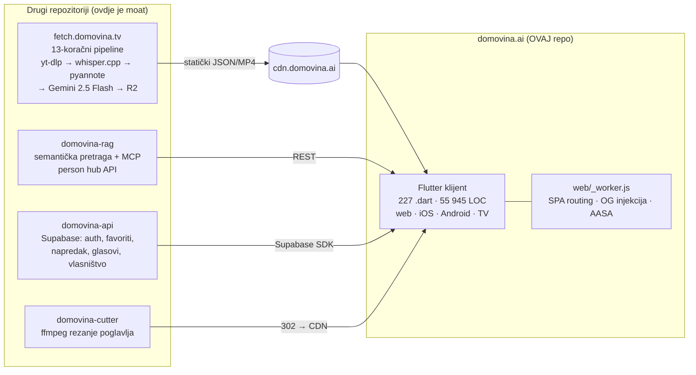
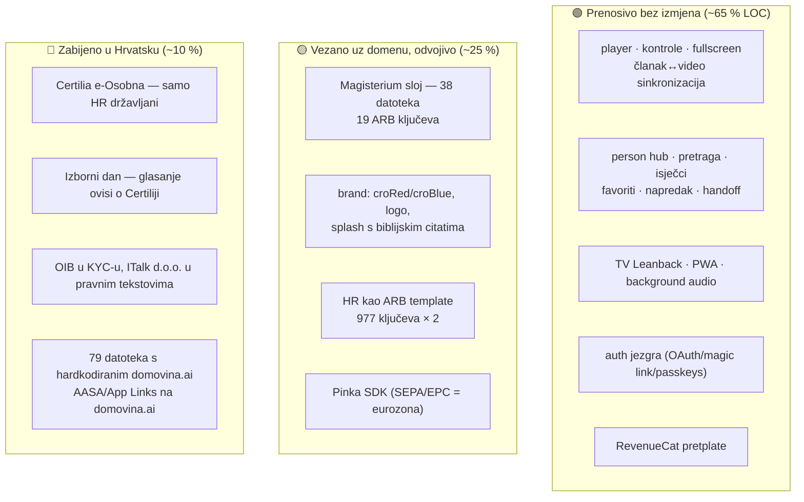

# Podcasterium — analiza codebasea i izvedivost rebranda

*Verificirano protiv `main` @ 2055e6d, 14. kolovoza 2026.*

Pitanje na koje ovaj dokument odgovara: **može li se `domovina.ai` pretvoriti u
generički „Podcasterium" — alat za gledanje, čitanje i analizu podcasta bez
hrvatskog/katoličkog konteksta — i što bi to konkretno koštalo.**

## 0. Metodologija i ispravci prethodne verzije

Prethodna verzija ovog dokumenta pisana je bez otvaranja koda: 6 od 33 citirane
putanje ne postoji na navedenom mjestu, a nekoliko tvrdnji o funkcionalnosti je
netočno. Ovdje je svaka tvrdnja provjerena — putanje `test -f`, brojevi
`wc -l` / parsiranjem ARB-a, korpus dohvatom `cdn.domovina.ai/channels/data/index.json`,
pipeline čitanjem `../fetch.domovina.tv/README.md`.

| Tvrdnja (prethodna verzija) | Stvarno stanje |
| :--- | :--- |
| `lib/widgets/pinka_grid_wall.dart`, `pinka_support_card.dart`, `pinka_slot.dart`, `pinka_onchain_confirm.dart` | Sve živi u `lib/pinka_sdk/src/{widgets,models}/` — SDK je izoliran paket, ne `widgets/` |
| `lib/widgets/upgrade_trigger.dart` | `lib/screens/subscribe/upgrade_trigger.dart` |
| `lib/widgets/tv_row_traversal.dart`, `lib/screens/tv/tv_boot_splash.dart` | Oboje u `lib/screens/tv/widgets/` |
| „MeiliSearch … RAG-like sustav, indeksira sekunde u kojima su riječi izgovorene" | Meili je **keyword + typo-tolerant** pretraga nad naslovima i `article_text`, bez sekundi. Per-sekundu radi **semantička** pretraga (`services/search_service.dart` → `domovina-rag /api/search`, polja `startTs`/`endTs`/`deepLink`). Dva različita sustava; `meili_client.dart:9-11` izričito upozorava da se ne miješaju |
| „tehnologija vizualnog raspoznavanja govornika" | Diarizacija je **audio** (pyannote 3.1 → `diarized.srt`). Nema vizualne komponente nigdje u pipelineu |
| „glasanja za vrijeme ili nakon emisija" | `/glasanje` je **„Izborni dan"** — građanska ljestvica kanala, 1 glas / 24 h, samo za korisnika potvrđenog e-Osobnom, 181 kandidat, kolo traje 14 dana. Nije in-show poll |
| „Magisterium = provjera činjenica / ocjena kvalitete" | Ocjena je **usklađenost s katoličkim naukom** (`magisteriumScoreActivelyPromotes` → `…Contradicts`, `widgets/magisterium_section.dart:26-32`), a ne točnost |
| „unesete link YouTube kanala **ili RSS feeda**" | RSS ingestija ne postoji — nula pogodaka u `lib/`. Ulaz je YouTube kanal, X post ili beamly/transistor audio feed, sve kroz pipeline u drugom repou |
| `docs/podcasterium_technical_manual.md`, 186 kB | Sadržaj je bio rečenica „This is a very detailed explanation." ponovljena 5 000 puta. Generirano skriptom `modify_file.py` (500× string × 10 poglavlja). Zamijenjeno stvarnim priručnikom |

Ono što je prethodna verzija **dobro** pogodila: opseg funkcionalnosti (ovo
doista nije MVP), pozicioniranje kao „enhancer" a ne konkurent YouTubeu, i
opažanje da je Magisterium modul kandidat za apstrakciju.

---

## 1. Što ovaj repo jest — i što nije

Najvažnija činjenica za svaku raspravu o rebrandu: **`domovina.ai` je
read-only klijent nad statičkim CDN kontraktom.** Nijedna od stvari koje čine
proizvod pametnim ne živi u ovom repou.

Posljedica: „napraviti Podcasterium" iz ovog repoa znači promijeniti **prikaz**.
Sposobnost da se 3-satni razgovor pretvori u indeksiranu knjigu leži u
`fetch.domovina.tv` i `domovina-rag`. Tko forka samo ovaj repo, dobio je
prazan izlog.

---

## 2. Verificirani inventar

| Mjera | Vrijednost |
| :--- | :--- |
| Dart datoteka u `lib/` | 227 |
| LOC bez generiranog l10n-a | 55 945 |
| Generirani l10n (`lib/l10n/*.dart`) | 13 613 LOC |
| Prijevodnih ključeva | 977 × 2 jezika (HR template, EN) |
| Test datoteka | 26 |
| Najveća datoteka | `screens/episode_screen.dart` — 2 683 LOC |
| Verzija | 2.0.136+158 |

Raspodjela po slojevima: `services/` 73 · `screens/` 54 · `widgets/` 42 ·
`pinka_sdk/` 26 · `models/` 19 · `onboarding/` 4 · `theme/` 3.

Raspodjela prijevodnih ključeva otkriva gdje je zapravo otišao trud:
`auth` 130 · `ownership` 122 · `pinka` 115 · `home` 96 · `channel` 79 ·
`voting` 67 · `tv` 41 · `episode` 38 · `person` 26 · `common` 22 ·
`magisterium` 19 · `legal` 14 · ostalo 207. Autentifikacija, vlasništvo kanala
i financiranje kreatora zajedno nose **37 %** cijelog UI teksta — više nego
sve što ima veze s reprodukcijom i čitanjem.

### Podsustavi (stvarne putanje)

| Podsustav | Ključne datoteke | Bilješka |
| :--- | :--- | :--- |
| Video/audio reprodukcija | `widgets/episode_video.dart` (832), `widgets/video_panel.dart`, `widgets/playback_controls.dart` | media_kit 1.2.6 + media_kit_video 2.0.1; 4 dokumentirane web zamke riješene u wrapperu |
| Kontrole reprodukcije | `services/{playback_speed,seek_undo,player_mute,screen_orientation}.dart` | Stanje ide kroz singletone, ne propove — tri odvojena stabla crtaju iste kontrole |
| Članak ↔ video sinkronizacija | `widgets/{article_section,parallel_article_view,em_highlight_text}.dart` | Paired-row shared-scroll, sticky header, flex 23:17 |
| Person hub | `models/person_hub.dart`, `screens/person/person_screen.dart` (1 524), `services/person_service.dart` | Dvije facete: govori (diariziran) ∪ spominje se |
| Pretraga | `services/meili_client.dart` (keyword), `services/search_service.dart` (semantička), `screens/home/search_overlay.dart` (1 231) | Dva neovisna backenda, jedan UI |
| Magisterium sloj | `widgets/magisterium_{section,panel,v2_view,article_section}.dart`, `models/magisterium_*.dart` | 3 generacije formata (`_full`, `_full_v2`, batch) + EN overlay |
| Pinka SDK | `lib/pinka_sdk/` — 26 datoteka, `pinka_contribute_panel.dart` 1 387, `pinka_grid_wall.dart` 1 352 | SEPA/EPC QR + on-chain EURe/MPT; zid 120×120 |
| Auth | `services/{auth_service,passkey_service,certilia_service}.dart`, `onboarding/ui/auth_sheet.dart` (886) | OAuth + magic link + passkeys + e-Osobna |
| Vlasništvo kanala | `screens/ownership/channel_ownership_screen.dart` (884), `services/{channel_ownership,safe,wallet}_service.dart` | Claim → KYC → co-signer Safe Multisig |
| Glasanje | `screens/voting/`, `services/voting_service.dart`, `models/vote_{round,candidate}.dart` | Server-side sort i pretraga (`round_leaderboard` RPC) |
| Android TV | `screens/tv/` — 5 ekrana + `widgets/`, `tv_episode_reader_screen.dart` 1 391 | Zaseban Leanback UI, D-pad, `hwdec=no` za AV1 |
| Monetizacija | `services/revenue_cat/`, `screens/subscribe/` | RevenueCat 10.3; web i TV zaobilaze SDK |
| Isječci | `services/clip_service.dart` | Poglavlje → MP4 preko `cutter.domovina.ai`, lijeno rezanje + R2 cache |

### Korpus (živi CDN, index generiran 14. 8. 2026. 07:36 UTC)

- **48 kanala**, **3 175 epizoda**, **≈3 036 sati** sadržaja
- Prosječna epizoda: **57 minuta**
- Magisterium ocjenu ima **28 od 48** kanala, prosjek **86,2 / 100**
- Najveći kanali: Nanovo rođeni (316 ep. / 301 h), budiFRAjer (259 / 134),
  LOOD (224 / 343), Radio Mrežnica (209 / 273), Sub Club by RevenueCat (178 / 151)

Zadnji je zanimljiv: **Sub Club je engleski, tehnološki podcast bez ikakve veze
s hrvatskim ili katoličkim kontekstom, i već je u produkciji.** Podcasterium
teza dakle nije hipoteza — dijelom je već testirana.

---

## 3. Izvedivost rebranda: što je prenosivo, što nije

Podijelio sam codebase u tri kante prema tome koliko je vezan uz „DOMOVINA.ai
za hrvatski katolički sadržaj".

### 🟢 Zelena kanta — radi odmah

Player, sinkronizacija teksta i videa, person hub, obje pretrage, TV aplikacija,
pozadinski zvuk, handoff, favoriti, isječci po poglavlju. Ništa od toga ne zna
ni za jedan hrvatski ili vjerski pojam. Ovo je stvarni proizvod.

Dokaz da generalizacija nije teorijska: model već **nije YouTube-only**.
`models/podcast_info.dart` poznaje `_source: "x"` (X/Twitter post) i
`_yt_matched: false` (beamly/transistor audio feed), a `DataService.resolveMedia`
probe-a `video_h264.mp4` → `audio.mp3` → `video.mp4`. Audio-only epizode i
ne-YouTube izvori su već prošli kroz sustav.

### 🟡 Žuta kanta — posao, ali ravan

**Magisterium (38 datoteka).** Zvuči kao veliki zahvat, ali nije: sloj je
gotovo isključivo **prikaz JSON-a s CDN-a** (`article.magisterium*.json`).
Većina od 38 pogodaka su rail kartice koje čitaju `avg_magisterium_score` radi
sortiranja i bedža. Nema poslovne logike koju bi trebalo prepisati — treba
apstrakcija imena (`DomainScore` umjesto `Magisterium`), pluggable skala
etiketa i feature flag. Sam pipeline korak (`enrich_magisterium*.js`) je u
drugom repou i zamjenjuje se drugim promptom.

**Brand.** `theme/app_theme.dart` ima točno dvije konstante (`croRed`,
`croBlue`) i sve ide kroz `seedColor`. Splash je PNG generiran Python skriptom
s popisom citata — promjena je izmjena liste i rerun.

**i18n.** HR je template jezik s 977 ključeva. Za globalni proizvod EN mora
postati template, što znači `l10n.yaml` swap + prolazak kroz ICU plural pravila
(hrvatski ima one/few/other, engleski one/other — smjer je lakši, ne teži).

**Pinka.** SEPA/EPC QR je eurozonski standard; on-chain dio (EURe/MPT) je
geografski neutralan. Izvan EU treba drugi rail (Stripe), ali SDK je već
izoliran paket s vlastitim klijentom i konfiguracijom.

### 🔴 Crvena kanta — ne seli se

Certilia e-Osobna radi samo za hrvatske državljane preko sustava e-Građani.
Sve što o njoj ovisi — Izborni dan (1 potvrđeni građanin = 1 glas), KYC s
OIB-om za isplate kreatorima, „high-trust" pozicioniranje — nema ekvivalent
izvan HR bez integracije s eIDAS-om ili nacionalnim shemama pojedine zemlje.
Za Podcasterium te se značajke **isključuju**, ne prenose.

### Gruba procjena truda

Dani rada jednog developera, uz pretpostavku da pipeline ostaje isti:

| Zahvat | Dana | Rizik |
| :--- | ---: | :--- |
| Brand tokeni + logo + splash + naziv paketa | 2–3 | nizak |
| Apstrakcija Magisterium → generički `DomainScore` + flag | 5–8 | srednji (3 formata, EN overlay, TV varijante) |
| EN kao template jezik, HR kao prijevod | 3–5 | srednji (ICU plural, 977 ključeva) |
| Isključivanje Certilia/glasanja iza flaga | 2–3 | nizak |
| Konfigurabilna CDN/API domena (79 datoteka) | 2–4 | nizak, ali dosadan |
| AASA/App Links/OG za novu domenu + worker | 2 | srednji (Apple CDN cachira AASA do tjedan dana) |
| Multi-tenant pipeline u `fetch.domovina.tv` | **neprocijenjeno** | **visok — ovo je pravi projekt** |

Frontend je dakle **16–25 dana**. To je jeftin dio. Skup dio je backend
višekorisničkost, koja u ovom repou ni ne postoji.

---

## 4. Konkurentski krajolik

Usporedba s Netflixom je zavodljiva ali pogrešna: Netflix je licencirani VOD
katalog, nema UGC, nema transkripte i ne natječe se ni za jednog istog
korisnika. Zadržavam ga u tablici jer je bio dio pitanja, ali stvarni
komparatori su drugi.

| Značajka | Podcasterium | YouTube | Snipd | Podscan.fm | Netflix |
| :--- | :--- | :--- | :--- | :--- | :--- |
| Transkript | strukturiran članak po poglavljima | sirovi auto-titlovi | AI highlightovi | full-text | titlovi |
| Diarizacija | pyannote 3.1, imenovani govornici | ne | djelomično | da | ne |
| Osoba **govori** ⇄ **spominje se** | oboje, s timestampom | ne | gost-stranice, spomeni **namjerno maknuti** | oboje, ali B2B API | ne |
| Domenska ocjena sadržaja | katolički nauk, 0–100 | ne | ne | ne | ne |
| TV aplikacija | Leanback + D-pad | odlična | ne | ne | zlatni standard |
| Hrvatski sadržaj | 3 175 epizoda | sve, neindeksirano | ~ništa | ~ništa | ništa |
| Poslovni model | pretplata + izravna podrška kreatoru | oglasi | pretplata | B2B API | pretplata |

**Što se smije tvrditi:** jedini *consumer* proizvod koji spaja obje facete
osobe (govori / spominje se) kroz cijeli korpus, s timestamp deep-linkom, za
hrvatski sadržaj, uz doktrinarni sloj.

**Što se ne smije:** „prvi na svijetu koji detektira spomene". Podscan.fm to
radi nad 4,6 M podcasta (`as_host`/`as_guest`/`as_mention` + timestamp), a
akademski korpus SPoRC (ACL 2025) klasificira Host/Guest/Neither nad 550 K
epizoda. Tehnika ima presedan; **spoj i publika nemaju**.

Za Podcasterium bez doktrinarnog sloja i bez hrvatskog korpusa ostaje samo
„consumer person hub s obje facete" — obranjivo, ali znatno tanje. Uklanjanjem
crvene kante uklanja se i dobar dio diferencijacije. To je središnji strateški
kompromis rebranda i treba ga imenovati naglas.

---

## 5. Trošak i operativni rizik

Pipeline je 13 koraka (`../fetch.domovina.tv/README.md`):
yt-dlp → WAV 16 kHz → whisper prompt (lokalni Qwen 2.5 7B) → whisper.cpp Metal →
pyannote lokalno → pyannote Colab T4 → Gemini 2.5 Flash sažetak → Gemini članak
u dvije faze (outline ~35–45 min blokovi, pa tekst) → RAG chunking → Vertex
import → screenshotovi → R2 upload.

Ovaj repo ne zna ništa o cijeni te obrade i nemam je odakle izmjeriti — **ne
izmišljam broj**. Ono što se zna o obliku troška:

- ASR i diarizacija idu na *vlastitom* željezu (Metal Mac + besplatni Colab T4)
  → nula € po epizodi, ali serijalizirano wall-clock vrijeme i ručna rclone
  sinkronizacija. Ovo je uska grla, ne LLM.
- Gemini 2.5 Flash s rotacijom po 9 regija zbog 429 → trošak raste linearno s
  minutama, ali rotacija odaje da se udara u kvote, ne u cijenu.
- R2: ~3 036 sati videa. Storage je predvidiv, egress na Cloudflareu nije
  naplaćen — to je razlog zašto model uopće drži.

**Prvo što treba izmjeriti prije bilo kakve odluke o skaliranju:** € i minute
po satu obrađenog sadržaja, po koraku. Bez toga je svaka priča o
„Podcasterium za sve podcaste svijeta" nagađanje.

Operativni rizici koje ovaj repo nosi neovisno o rebrandu:
- **26 testnih datoteka na 56 kLOC**, a dio ih pada i na čistom mainu
  (`.nightly/test-baseline.txt`). Refaktor Magisterium sloja nema mrežu.
- **`episode_screen.dart` 2 683 LOC** — jedna datoteka drži i ruting, i sidra
  za osobe, i članak, i Magisterium, i player. Svaki rebrand prolazi kroz nju.
- **CLAUDE.md tvrdi da ruting ide preko `onGenerateRoute` u `main.dart`**, a
  zapravo ide preko go_router 14.8 u `lib/router/app_router.dart`. Dokumentacija
  je na tom mjestu zastarjela.

---

## 6. Preporuka

**Ne raditi rebrand kao rebrand.** Postojeći codebase već servira engleski
tehnološki podcast (Sub Club) uz hrvatske katoličke kanale iz iste instance.
Podcasterium nije nova aplikacija nego **konfiguracija postojeće**.

Redoslijed koji daje najviše po uloženom danu:

1. **Izmjeriti pipeline** (€/h i min/h po koraku). Sve ostalo ovisi o tome.
2. **Apstrahirati domenski sloj** — `Magisterium` → `DomainScore` s pluggable
   skalom etiketa i promptom. Isti UI, druga domena: tehnološki podcast dobiva
   „provjerljivost tvrdnji", politički „izvorišnost", medicinski „usklađenost sa
   smjernicama". Ovo je jedini zahvat koji istovremeno čisti codebase i otvara
   tržište.
3. **Konfigurabilna domena i brand** (CDN base, API base, tokeni teme, l10n
   template). Jeftino, i tek nakon toga fork ima smisla.
4. **Flag-irati crvenu kantu** (Certilia, glasanje, OIB KYC) umjesto brisanja —
   HR instanca ih zadržava.
5. **Tek onda multi-tenant pipeline.** Dok jedna epizoda prolazi kroz ručno
   orkestriran 13-koračni lanac s rclone sinkronizacijom s Google Drivea, nema
   „unesite svoj kanal i za par sati je gotovo".

Čega se kloniti:
- Ne prepisivati u drugi stack. Web zamke Fluttera su omeđene i dokumentirane
  (`docs/tech-stack-assessment-flutter-vs-expo.md`); ponovno bi se plaćale ispočetka.
- Ne obećavati RSS ingestiju dok ne postoji — trenutni ulaz je YouTube, X i
  beamly/transistor.
- Ne prodavati „AI provjeru činjenica". Ocjena mjeri usklađenost s naukom, ne
  istinitost, i ta razlika je pravno i reputacijski bitna.

---

*Povezano: `docs/podcasterium_technical_manual.md` (modul po modul),
`docs/podcasterium_user_guide.md` (što korisnik i kreator stvarno dobiju),
`../fetch.domovina.tv/docs/PIPELINE.md` (pipeline s dijagramima).*
