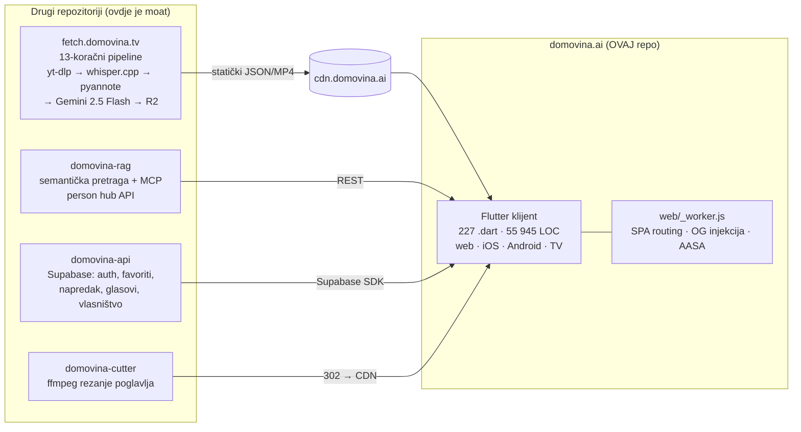
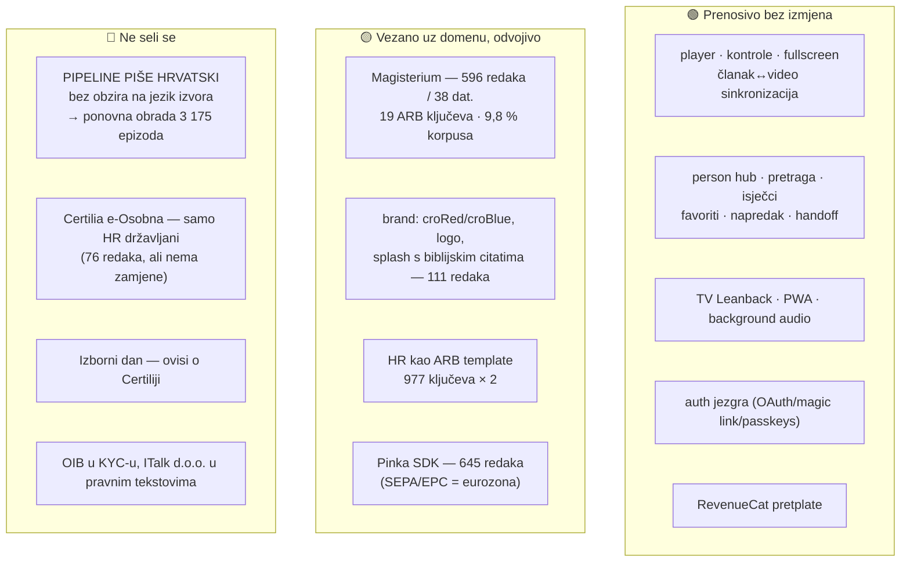

# Podcasterium — analiza codebasea i izvedivost rebranda

*Verificirano protiv `main` @ 7de73ea, 14. kolovoza 2026. — druga iteracija,
uz ispravke vlastitih tvrdnji iz prve (vidi §2 „Ispravak", §3 i §7).*

Pitanje na koje ovaj dokument odgovara: **može li se `domovina.ai` pretvoriti u
generički „Podcasterium" — alat za gledanje, čitanje i analizu podcasta bez
hrvatskog/katoličkog konteksta — i što bi to konkretno koštalo.**

## 0. Metodologija i ispravci prethodne verzije

Prethodna verzija ovog dokumenta pisana je bez otvaranja koda: 6 od 33 citirane
putanje ne postoji na navedenom mjestu, a nekoliko tvrdnji o funkcionalnosti je
netočno. Ovdje je svaka tvrdnja provjerena — putanje `test -f`, brojevi
`wc -l` / parsiranjem ARB-a, korpus dohvatom `cdn.domovina.ai/channels/data/index.json`,
pipeline čitanjem `../fetch.domovina.tv/README.md`.

<!-- doc-refs:ignore-start — tablica NAMJERNO citira krive putanje iz prethodne verzije -->
| Tvrdnja (prethodna verzija) | Stvarno stanje |
| :--- | :--- |
| `lib/widgets/pinka_grid_wall.dart`, `pinka_support_card.dart`, `pinka_slot.dart`, `pinka_onchain_confirm.dart` | Sve živi u `lib/pinka_sdk/src/{widgets,models}/` — SDK je izoliran paket, ne `widgets/` |
| `lib/widgets/upgrade_trigger.dart` | `lib/screens/subscribe/upgrade_trigger.dart` |
| `lib/widgets/tv_row_traversal.dart`, `lib/screens/tv/tv_boot_splash.dart` | Oboje u `lib/screens/tv/widgets/` |
| „MeiliSearch … RAG-like sustav, indeksira sekunde u kojima su riječi izgovorene" | Meili je **keyword + typo-tolerant** pretraga nad naslovima i `article_text`, bez sekundi. Per-sekundu radi **semantička** pretraga (`services/search_service.dart` → `domovina-rag /api/search`, polja `startTs`/`endTs`/`deepLink`). Dva različita sustava; `meili_client.dart:9-11` izričito upozorava da se ne miješaju |
| „tehnologija vizualnog raspoznavanja govornika" | Diarizacija je **audio** (pyannote 3.1 → `diarized.srt`). Nema vizualne komponente nigdje u pipelineu |
| „glasanja za vrijeme ili nakon emisija" | `/glasanje` je **„Izborni dan"** — građanska ljestvica kanala, 1 glas / 24 h, samo za korisnika potvrđenog e-Osobnom, 181 kandidat, kolo traje 14 dana. Nije in-show poll |
| „Magisterium = provjera činjenica / ocjena kvalitete" | Ocjena je **usklađenost s katoličkim naukom** (`magisteriumScoreActivelyPromotes` → `…Contradicts`, `widgets/magisterium_section.dart:26-32`), a ne točnost |
| „unesete link YouTube kanala **ili RSS feeda**" | RSS ingestija ne postoji — nula pogodaka u `lib/`. Ulaz je YouTube kanal, X post ili beamly/transistor audio feed, sve kroz pipeline u drugom repou |
| `docs/podcasterium_technical_manual.md`, 186 kB | Sadržaj je bio rečenica „This is a very detailed explanation." ponovljena 5 000 puta. Generirano skriptom `modify_file.py` (500× string × 10 poglavlja). Zamijenjeno stvarnim priručnikom |

<!-- doc-refs:ignore-end -->

Ono što je prethodna verzija **dobro** pogodila: opseg funkcionalnosti (ovo
doista nije MVP), pozicioniranje kao „enhancer" a ne konkurent YouTubeu, i
opažanje da je Magisterium modul kandidat za apstrakciju.

---

## 1. Što ovaj repo jest — i što nije

Najvažnija činjenica za svaku raspravu o rebrandu: **`domovina.ai` je
read-only klijent nad statičkim CDN kontraktom.** Nijedna od stvari koje čine
proizvod pametnim ne živi u ovom repou.



Posljedica: „napraviti Podcasterium" iz ovog repoa znači promijeniti **prikaz**.
Sposobnost da se 3-satni razgovor pretvori u indeksiranu knjigu leži u
`fetch.domovina.tv` i `domovina-rag`. Tko forka samo ovaj repo, dobio je
prazan izlog.

---

## 2. Verificirani inventar

| Mjera | Vrijednost |
| :--- | :--- |
| Dart datoteka u `lib/` | 227 |
| LOC bez generiranog l10n-a | 55 945 |
| Generirani l10n (`lib/l10n/*.dart`) | 13 613 LOC |
| Prijevodnih ključeva | 977 × 2 jezika (HR template, EN) |
| Test datoteka | 26 |
| Najveća datoteka | `screens/episode_screen.dart` — 2 683 LOC |
| Verzija | 2.0.136+158 |

Raspodjela po slojevima: `services/` 73 · `screens/` 54 · `widgets/` 42 ·
`pinka_sdk/` 26 · `models/` 19 · `onboarding/` 4 · `theme/` 3.

Raspodjela prijevodnih ključeva otkriva gdje je zapravo otišao trud:
`auth` 130 · `ownership` 122 · `pinka` 115 · `home` 96 · `channel` 79 ·
`voting` 67 · `tv` 41 · `episode` 38 · `person` 26 · `common` 22 ·
`magisterium` 19 · `legal` 14 · ostalo 207. Autentifikacija, vlasništvo kanala
i financiranje kreatora zajedno nose **37 %** cijelog UI teksta — više nego
sve što ima veze s reprodukcijom i čitanjem.

### Podsustavi (stvarne putanje)

| Podsustav | Ključne datoteke | Bilješka |
| :--- | :--- | :--- |
| Video/audio reprodukcija | `widgets/episode_video.dart` (832), `widgets/video_panel.dart`, `widgets/playback_controls.dart` | media_kit 1.2.6 + media_kit_video 2.0.1; 4 dokumentirane web zamke riješene u wrapperu |
| Kontrole reprodukcije | `services/{playback_speed,seek_undo,player_mute,screen_orientation}.dart` | Stanje ide kroz singletone, ne propove — tri odvojena stabla crtaju iste kontrole |
| Članak ↔ video sinkronizacija | `widgets/{article_section,parallel_article_view,em_highlight_text}.dart` | Paired-row shared-scroll, sticky header, flex 23:17 |
| Person hub | `models/person_hub.dart`, `screens/person/person_screen.dart` (1 524), `services/person_service.dart` | Dvije facete: govori (diariziran) ∪ spominje se |
| Pretraga | `services/meili_client.dart` (keyword), `services/search_service.dart` (semantička), `screens/home/search_overlay.dart` (1 231) | Dva neovisna backenda, jedan UI |
| Magisterium sloj | `widgets/magisterium_{section,panel,v2_view,article_section}.dart`, `models/magisterium_*.dart` | 3 generacije formata (`_full`, `_full_v2`, batch) + EN overlay |
| Pinka SDK | `lib/pinka_sdk/` — 26 datoteka, `pinka_contribute_panel.dart` 1 387, `pinka_grid_wall.dart` 1 352 | SEPA/EPC QR + on-chain EURe/MPT; zid 120×120 |
| Auth | `services/{auth_service,passkey_service,certilia_service}.dart`, `onboarding/ui/auth_sheet.dart` (886) | OAuth + magic link + passkeys + e-Osobna |
| Vlasništvo kanala | `screens/ownership/channel_ownership_screen.dart` (884), `services/{channel_ownership,safe,wallet}_service.dart` | Claim → KYC → co-signer Safe Multisig |
| Glasanje | `screens/voting/`, `services/voting_service.dart`, `models/vote_{round,candidate}.dart` | Server-side sort i pretraga (`round_leaderboard` RPC) |
| Android TV | `screens/tv/` — 5 ekrana + `widgets/`, `tv_episode_reader_screen.dart` 1 391 | Zaseban Leanback UI, D-pad, `hwdec=no` za AV1 |
| Monetizacija | `services/revenue_cat/`, `screens/subscribe/` | RevenueCat 10.3; web i TV zaobilaze SDK |
| Isječci | `services/clip_service.dart` | Poglavlje → MP4 preko `cutter.domovina.ai`, lijeno rezanje + R2 cache |

### Korpus (živi CDN, index generiran 14. 8. 2026. 07:36 UTC)

**48 kanala**, **3 175 epizoda**, **≈3 036 sati**, prosječna epizoda **57 minuta**.

Pokrivenost obradom, izbrojana iz `pipeline` objekta svake epizode u svih 48
kanalskih JSON-ova (ne procjena — vidi §7 za naredbu):

| Korak | Epizoda | Udio |
| :--- | ---: | ---: |
| transkript | 3 160 | 99,5 % |
| diarizacija | 3 160 | 99,5 % |
| sažetak | 3 160 | 99,5 % |
| **članak** | **3 160** | **99,5 %** |
| **Magisterium ocjena** | **311** | **9,8 %** |
| EN prijevod | 40 | 1,3 % |
| EN članak | 40 | 1,3 % |

Dvije brojke mijenjaju sliku:

**Magisterium pokriva manje od desetine korpusa** (311 epizoda, 28 od 48
kanala, prosjek 86,2/100). Sloj koji izgleda kao srž identiteta zapravo je
tanak namaz preko malog dijela sadržaja. Za rebrand je to dobra vijest — nema
se što masovno migrirati — ali i trezveno o pozicioniranju: „AI analiza
usklađenosti" danas vrijedi za 1 od 10 epizoda.

**Engleski postoji za 40 epizoda (1,3 %).** Korpus je praktički jednojezičan.

### Ispravak: što Sub Club zapravo dokazuje

U prvoj verziji ovog dokumenta napisao sam da je Sub Club (RevenueCat, 178
epizoda) engleski tehnološki podcast u produkciji, pa da je Podcasterium teza
„dijelom testirana". **Provjerio sam sadržaj i to je bilo prebrzo.**

Epizoda `jzlPf100vy4`: naslov `"Make Ugly Ads to Grow Your App – Yuliya Lennox"`,
ali `title_hr` je hrvatski prijevod, `abstract` je hrvatski
(„U epizodi podcasta Sub Club domaćin David Barnard razgovara s…"), a `topics`
su hrvatski („marketing aplikacija", „ružni oglasi i kreativno testiranje").

Dakle: **pipeline prima bilo koji jezik, ali piše na hrvatskom.** Engleski
audio → hrvatski članak. To nije bug, to je bila namjera za hrvatsku publiku —
ali je za Podcasterium **najveća prepreka koju sam u prvoj verziji potpuno
promašio**. Globalni proizvod traži članak na jeziku izvora, što je promjena
prompta u `generate_article_gemini.js` plus ponovna obrada **cijelog** korpusa,
a ne prevođenje sučelja.

Engleskih izvornih kanala ima ~4 (Sub Club 178, Launched 115, Catholic Futurist
19, Founder Talks 7) — oko 10 % epizoda, sve s hrvatskim izlazom.

---

## 3. Izvedivost rebranda: što je prenosivo, što nije

Podijelio sam codebase u tri kante prema tome koliko je vezan uz „DOMOVINA.ai
za hrvatski katolički sadržaj".

**Prvo mjerenje, prije podjele.** U prvoj verziji ovog dokumenta napisao sam
raspodjelu „~65 % / ~25 % / ~10 % LOC". **Taj broj nisam bio izmjerio** — i kad
sam ga pokušao izmjeriti, ispalo je da je metrika loša: svaka datoteka koja
igdje spomene `magisterium` završi u „žutoj" kanti iako je 95 % njenog koda
generičko (`home_feed.dart` spominje ga zbog jednog bedža, `app_router.dart`
zbog jedne rute). Podjela po datotekama daje bilo koji rezultat koji poželiš.

Poštena mjera je koliko **redaka** uopće spominje domenske pojmove:

| Pojam | Redaka | % svih 55 945 | Datoteka |
| :--- | ---: | ---: | ---: |
| `pinka` | 645 | 1,15 % | 36 |
| `magisterium` | 596 | 1,07 % | 38 |
| `glasanje` / `vote` | 536 | 0,96 % | 13 |
| `domovina` | 207 | 0,37 % | 79 |
| `croRed` / `croBlue` | 111 | 0,20 % | 39 |
| `certilia` | 76 | 0,14 % | 9 |
| `OIB` | 2 | 0,00 % | 1 |

Ukupno **~2 170 redaka, 3,9 % codebasea** (uz preklapanja). Aplikacija je
dakle **gotovo domenski neutralna** — znatno neutralnija nego što sam u prvoj
verziji tvrdio. Zaključak koji iz toga slijedi je obrnut od očekivanog:
**problem nije kod, nego korpus i jezik pipeline izlaza.**



Crvena kanta je mala u kodu (`certilia` 76 redaka) a velika u posljedicama —
zato je mjerenje redaka nužno, ali nije dovoljno. Najveća stavka u njoj
**uopće nije u ovom repou**: jezik pipeline izlaza.

### 🟢 Zelena kanta — radi odmah

Player, sinkronizacija teksta i videa, person hub, obje pretrage, TV aplikacija,
pozadinski zvuk, handoff, favoriti, isječci po poglavlju. Ništa od toga ne zna
ni za jedan hrvatski ili vjerski pojam. Ovo je stvarni proizvod.

Dokaz da generalizacija nije teorijska: model već **nije YouTube-only**.
`models/podcast_info.dart` poznaje `_source: "x"` (X/Twitter post) i
`_yt_matched: false` (beamly/transistor audio feed), a `DataService.resolveMedia`
probe-a `video_h264.mp4` → `audio.mp3` → `video.mp4`. Audio-only epizode i
ne-YouTube izvori su već prošli kroz sustav.

### 🟡 Žuta kanta — posao, ali ravan

**Magisterium (596 redaka, 38 datoteka).** U prvoj verziji napisao sam „nema
poslovne logike, sve je prikaz". **To je netočno i ispravljam.** Ocjena je
ugrađena u dva algoritma:

- `screens/home/home_feed.dart` — izbor istaknute epizode je 4-slojni:
  Tier 1 `hasMagisterium && score ≥ 70 && ≤ 14 dana`, Tier 2 isto bez datuma,
  Tier 3 bilo koja s Magisterijem. Naslovnica dakle bira **iz 9,8 % korpusa**.
- `screens/home/sort_mode.dart` — `ChannelSortMode.magisterium` je jedan od
  načina sortiranja kanala.

Ostatak jest prikaz (bedževi na karticama, panel na epizodi). Zahvat je dakle
apstrakcija imena (`DomainScore`) + pluggable skala + **zamjena kriterija
rangiranja**, ne samo preimenovanje. Pipeline korak (`enrich_magisterium*.js`)
je u drugom repou i mijenja se promptom.

Usput, nalaz vrijedan neovisno o rebrandu: naslovnica bira hero iz manje od
desetine kataloga. Ako Magisterium pokrivenost ne raste, kriterij bi trebao
imati fallback na širi skup.

**Brand.** `theme/app_theme.dart` ima točno dvije konstante (`croRed`,
`croBlue`) i sve ide kroz `seedColor`. Splash je PNG generiran Python skriptom
s popisom citata — promjena je izmjena liste i rerun.

**i18n.** HR je template jezik s 977 ključeva. Za globalni proizvod EN mora
postati template, što znači `l10n.yaml` swap + prolazak kroz ICU plural pravila
(hrvatski ima one/few/other, engleski one/other — smjer je lakši, ne teži).

**Pinka.** SEPA/EPC QR je eurozonski standard; on-chain dio (EURe/MPT) je
geografski neutralan. Izvan EU treba drugi rail (Stripe), ali SDK je već
izoliran paket s vlastitim klijentom i konfiguracijom.

### 🔴 Crvena kanta — ne seli se

**1. Jezik pipeline izlaza.** Najveća stavka, i nije u ovom repou. Članak,
sažetak, teme i predloženi nazivi govornika pišu se na hrvatskom bez obzira na
jezik izvora (dokaz gore, Sub Club). Globalni Podcasterium traži članak na
jeziku izvora → izmjena prompta u `generate_article_gemini.js` **i ponovna
obrada svih 3 175 epizoda**. Postojeći EN overlay (1,3 %) je prijevod
hrvatskog članka, ne izvorni engleski tekst.

**2. Certilia e-Osobna.** Radi samo za hrvatske državljane preko sustava
e-Građani. Sve što o njoj ovisi — Izborni dan (1 potvrđeni građanin = 1 glas),
KYC s OIB-om za isplate, „high-trust" pozicioniranje — nema ekvivalent izvan HR
bez eIDAS-a ili nacionalne sheme pojedine zemlje. Te se značajke **isključuju**,
ne prenose. U kodu je to malo (76 redaka, 9 datoteka) — cijena je proizvodna,
ne inženjerska.

### Procjena truda

Dani rada jednog developera. **Ovo su procjene, ne mjerenja** — za razliku od
svega ostalog u dokumentu.

| Zahvat | Dana | Rizik |
| :--- | ---: | :--- |
| Brand tokeni + logo + splash + naziv paketa | 2–3 | nizak (111 redaka `croRed`/`croBlue`) |
| Apstrakcija Magisterium → `DomainScore` + flag | 6–10 | srednji (3 formata, EN overlay, TV varijante, **+ kriterij hero rangiranja**) |
| EN kao template jezik, HR kao prijevod | 3–5 | srednji (ICU plural, 977 ključeva) |
| Isključivanje Certilia/glasanja iza flaga | 2–3 | nizak |
| Konfigurabilna CDN/API domena (79 datoteka) | 2–4 | nizak, ali dosadan |
| AASA/App Links/OG za novu domenu + worker | 2 | srednji (Apple CDN cachira AASA do tjedan dana) |
| **Članak na jeziku izvora (prompt + reprocesiranje 3 175 ep.)** | **neprocijenjeno** | **visok — LLM trošak × cijeli korpus** |
| Multi-tenant pipeline u `fetch.domovina.tv` | **neprocijenjeno** | **visok — ovo je pravi projekt** |

Frontend ostaje **17–29 dana** i to je i dalje jeftin dio. Ali zaključak prve
verzije („skup dio je multi-tenancy") bio je nepotpun: **prvi skup dio je
ponovna obrada korpusa na izvornom jeziku**, i on dolazi prije svega ostalog
jer bez njega globalni proizvod nema sadržaj koji itko izvan Hrvatske može
čitati.

---

## 4. Konkurentski krajolik

Usporedba s Netflixom je zavodljiva ali pogrešna: Netflix je licencirani VOD
katalog, nema UGC, nema transkripte i ne natječe se ni za jednog istog
korisnika. Zadržavam ga u tablici jer je bio dio pitanja, ali stvarni
komparatori su drugi.

| Značajka | Podcasterium | YouTube | Snipd | Podscan.fm | Netflix |
| :--- | :--- | :--- | :--- | :--- | :--- |
| Transkript | strukturiran članak po poglavljima | sirovi auto-titlovi | AI highlightovi | full-text | titlovi |
| Diarizacija | pyannote 3.1, imenovani govornici | ne | djelomično | da | ne |
| Osoba **govori** ⇄ **spominje se** | oboje, s timestampom | ne | gost-stranice, spomeni **namjerno maknuti** | oboje, ali B2B API | ne |
| Domenska ocjena sadržaja | katolički nauk, 0–100, ali samo **9,8 %** korpusa | ne | ne | ne | ne |
| TV aplikacija | Leanback + D-pad | odlična | ne | ne | zlatni standard |
| Hrvatski sadržaj | 3 175 epizoda | sve, neindeksirano | ~ništa | ~ništa | ništa |
| Poslovni model | pretplata + izravna podrška kreatoru | oglasi | pretplata | B2B API | pretplata |

**Što se smije tvrditi:** jedini *consumer* proizvod koji spaja obje facete
osobe (govori / spominje se) kroz cijeli korpus, s timestamp deep-linkom, za
hrvatski sadržaj, uz doktrinarni sloj.

**Što se ne smije:** „prvi na svijetu koji detektira spomene". Podscan.fm to
radi nad 4,6 M podcasta (`as_host`/`as_guest`/`as_mention` + timestamp), a
akademski korpus SPoRC (ACL 2025) klasificira Host/Guest/Neither nad 550 K
epizoda. Tehnika ima presedan; **spoj i publika nemaju**.

> **Izvor i njegova granica:** redci o Snipdu i Podscanu dolaze iz
> web-istraživanja od 4. 7. 2026., ne iz moje provjere danas. Podscanova
> role-polja izvedena su iz njihove javne dokumentacije jer direktan dohvat
> API-ja vraća 403 — „jako indicirano", ne first-party potvrđeno. Prije nego
> ovo uđe u pitch deck, provjeriti ponovno.

Za Podcasterium bez doktrinarnog sloja i bez hrvatskog korpusa ostaje samo
„consumer person hub s obje facete" — obranjivo, ali znatno tanje. Uklanjanjem
crvene kante uklanja se i dobar dio diferencijacije. To je središnji strateški
kompromis rebranda i treba ga imenovati naglas.

---

## 5. Trošak i operativni rizik

Pipeline je 13 koraka (`../fetch.domovina.tv/README.md`):
yt-dlp → WAV 16 kHz → whisper prompt (lokalni Qwen 2.5 7B) → whisper.cpp Metal →
pyannote lokalno → pyannote Colab T4 → Gemini 2.5 Flash sažetak → Gemini članak
u dvije faze (outline ~35–45 min blokovi, pa tekst) → RAG chunking → Vertex
import → screenshotovi → R2 upload.

Ovaj repo ne zna ništa o cijeni te obrade i nemam je odakle izmjeriti — **ne
izmišljam broj**. Ono što se zna o obliku troška:

- ASR i diarizacija idu na *vlastitom* željezu (Metal Mac + besplatni Colab T4)
  → nula € po epizodi, ali serijalizirano wall-clock vrijeme i ručna rclone
  sinkronizacija. Ovo je uska grla, ne LLM.
- Gemini 2.5 Flash s rotacijom po 9 regija zbog 429 → trošak raste linearno s
  minutama, ali rotacija odaje da se udara u kvote, ne u cijenu.
- R2: ~3 036 sati videa. Storage je predvidiv, egress na Cloudflareu nije
  naplaćen — to je razlog zašto model uopće drži.

**Prvo što treba izmjeriti prije bilo kakve odluke o skaliranju:** € i minute
po satu obrađenog sadržaja, po koraku. Bez toga je svaka priča o
„Podcasterium za sve podcaste svijeta" nagađanje.

Operativni rizici koje ovaj repo nosi neovisno o rebrandu:
- **Testovi: 26 datoteka, 230 slučajeva, 228 prolazi / 2 padaju** — pokrenuto
  na `7de73ea` danas, ne prepisano iz dokumentacije. Oba pada su poznata i
  vode se u `.nightly/test-baseline.txt` (`widget_test.dart` puca na
  `HttpClient` u test bindingu; `home_feed_test.dart` očekuje
  `hiQualityRecent` a dobiva `hiQuality`). Nema regresije — ali **230
  slučajeva na 56 kLOC znači da refaktor Magisterium sloja nema mrežu**, a
  ironično, jedini test koji pokriva hero rangiranje je upravo onaj koji pada.
- **`episode_screen.dart` 2 683 LOC** — jedna datoteka drži i ruting, i sidra
  za osobe, i članak, i Magisterium, i player. Svaki rebrand prolazi kroz nju.
- **CLAUDE.md tvrdi da ruting ide preko `onGenerateRoute` u `main.dart`**, a
  zapravo ide preko go_router 14.8 u `lib/router/app_router.dart`. Dokumentacija
  je na tom mjestu zastarjela.

---

## 6. Preporuka

**Ne raditi rebrand kao rebrand.** Aplikacija je već gotovo domenski neutralna
— 3,9 % redaka spominje bilo što hrvatsko ili katoličko. Podcasterium nije
nova aplikacija nego **konfiguracija postojeće**. Ali prepreka nije tamo gdje
se čini.

Sub Club to pokazuje precizno: engleski tehnološki podcast **već prolazi kroz
sustav** (178 epizoda, 176 s člankom) — dokaz da ingestija nije vezana uz
domenu. Istovremeno taj isti Sub Club dobiva **hrvatski** članak, sažetak i
teme. Cijev radi; izlaz govori krivi jezik.

Redoslijed koji daje najviše po uloženom danu:

1. **Jedna epizoda kroz pipeline s člankom na jeziku izvora.** Jedan prompt,
   jedna epizoda Sub Cluba, usporedba s postojećim hrvatskim izlazom. Dok to
   ne postoji, Podcasterium nema proizvod izvan Hrvatske — sve ostalo na ovoj
   listi je kozmetika. Izmjeriti pritom **€ i minute po satu obrade**, po koraku.
2. **Apstrahirati domenski sloj** — `Magisterium` → `DomainScore` s pluggable
   skalom etiketa i promptom, **uključujući kriterij hero rangiranja u
   `home_feed.dart`**. Isti UI, druga domena: tehnološki podcast dobiva
   „provjerljivost tvrdnji", politički „izvorišnost", medicinski „usklađenost
   sa smjernicama". Jedini zahvat koji istovremeno čisti codebase i otvara tržište.
3. **Popraviti `home_feed_test.dart` prije tog refaktora.** Jedini test koji
   pokriva izbor istaknute epizode trenutno pada — mijenjati rangiranje bez
   njega je rad bez mreže.
4. **Konfigurabilna domena i brand** (CDN base, API base, tokeni teme, l10n
   template). Jeftino, i tek nakon toga fork ima smisla.
5. **Flag-irati crvenu kantu** (Certilia, glasanje, OIB KYC) umjesto brisanja —
   HR instanca ih zadržava.
6. **Tek onda multi-tenant pipeline.** Dok jedna epizoda prolazi kroz ručno
   orkestriran 13-koračni lanac s rclone sinkronizacijom s Google Drivea, nema
   „unesite svoj kanal i za par sati je gotovo".

Čega se kloniti:
- Ne prepisivati u drugi stack. Web zamke Fluttera su omeđene i dokumentirane
  (`docs/tech-stack-assessment-flutter-vs-expo.md`); ponovno bi se plaćale ispočetka.
- Ne obećavati RSS ingestiju dok ne postoji — trenutni ulaz je YouTube, X i
  beamly/transistor.
- Ne prodavati „AI provjeru činjenica". Ocjena mjeri usklađenost s naukom, ne
  istinitost, i ta razlika je pravno i reputacijski bitna.

---

## 7. Kako provjeriti svaki broj iz ovog dokumenta

Dokument je nastao kao zamjena za verziju punu izmišljenih detalja, pa je
pošteno da se svaka tvrdnja može oboriti u minuti. Ove naredbe reproduciraju
sve brojke:

```bash
# LOC, broj datoteka, raspodjela po slojevima
find lib -name '*.dart' -not -path '*/l10n/*' | wc -l
find lib -name '*.dart' -not -path '*/l10n/*' | xargs wc -l | tail -1

# ARB ključevi po jeziku
python3 -c "import json;d=json.load(open('lib/l10n/app_hr.arb'));print(len([k for k in d if not k.startswith('@')]))"

# domenska sprega — redaka po pojmu (tablica u §3)
for t in pinka magisterium certilia domovina croRed; do
  printf '%-14s %s\n' "$t" "$(grep -ri "$t" lib --include=*.dart | grep -v '/l10n/' | wc -l)"
done

# korpus: kanali, epizode, sati (§2)
curl -s https://cdn.domovina.ai/channels/data/index.json > /tmp/idx.json
python3 -c "
import json;d=json.load(open('/tmp/idx.json'))['channels']
print(len(d),'kanala', sum(c['video_count'] for c in d),'epizoda',
      round(sum(c['total_duration_seconds'] for c in d)/3600),'h')"

# pokrivenost obradom (§2) — treba dohvatiti svih 48 kanalskih JSON-ova
python3 -c "import json;print('\n'.join(c['id'] for c in json.load(open('/tmp/idx.json'))['channels']))" \
  | xargs -P8 -I{} curl -s -o /tmp/ch_{}.json https://cdn.domovina.ai/channels/data/{}.json
python3 - <<'PY'
import json,glob,collections
f=collections.Counter(); n=0
for p in glob.glob('/tmp/ch_*.json'):
    for v in json.load(open(p)).get('videos',[]):
        n+=1
        for k,val in (v.get('pipeline') or {}).items():
            if val: f[k]+=1
for k,c in f.most_common(): print(f'{k:20} {c:5} {c/n*100:5.1f}%')
PY

# testovi (§5)
flutter test 2>&1 | tail -1     # očekivano: +228 -2

# putanje citirane u dokumentima stvarno postoje
./scripts/verify-doc-refs.sh docs/podcasterium_*.md
```

Zadnja naredba je skripta dodana uz ovaj dokument: izvuče svaku `lib/…`,
`web/…`, `scripts/…` ili `test/…` putanju iz markdowna i provjeri postoji li.
Točno taj propust — imena datoteka točna, direktoriji izmišljeni — bio je
najčešća greška u verziji koju ovaj dokument zamjenjuje.

**Što ostaje neprovjereno** (namjerno, s razlogom):

| Tvrdnja | Zašto ne mogu potvrditi |
| :--- | :--- |
| „181 kandidat" u Izbornom danu | Iz komentara u `voting_screen.dart`, ne iz baze — traži Supabase pristup |
| „~40 % spomena nema `first_ts`" | Iz `CLAUDE.md`; per-osoba API bi to potvrdio, nisam prošao kroz korpus |
| Snipd / Podscan redci u §4 | Web-research od 4. 7. 2026., vidi ogradu ondje |
| Trošak pipelinea po epizodi | Nije mjerljivo iz ovog repoa — vidi §5 |
| Procjene truda u §3 | Procjene su, i tako su označene |

---

*Povezano: `docs/podcasterium_technical_manual.md` (modul po modul),
`docs/podcasterium_user_guide.md` (što korisnik i kreator stvarno dobiju),
`../fetch.domovina.tv/docs/PIPELINE.md` (pipeline s dijagramima).*
