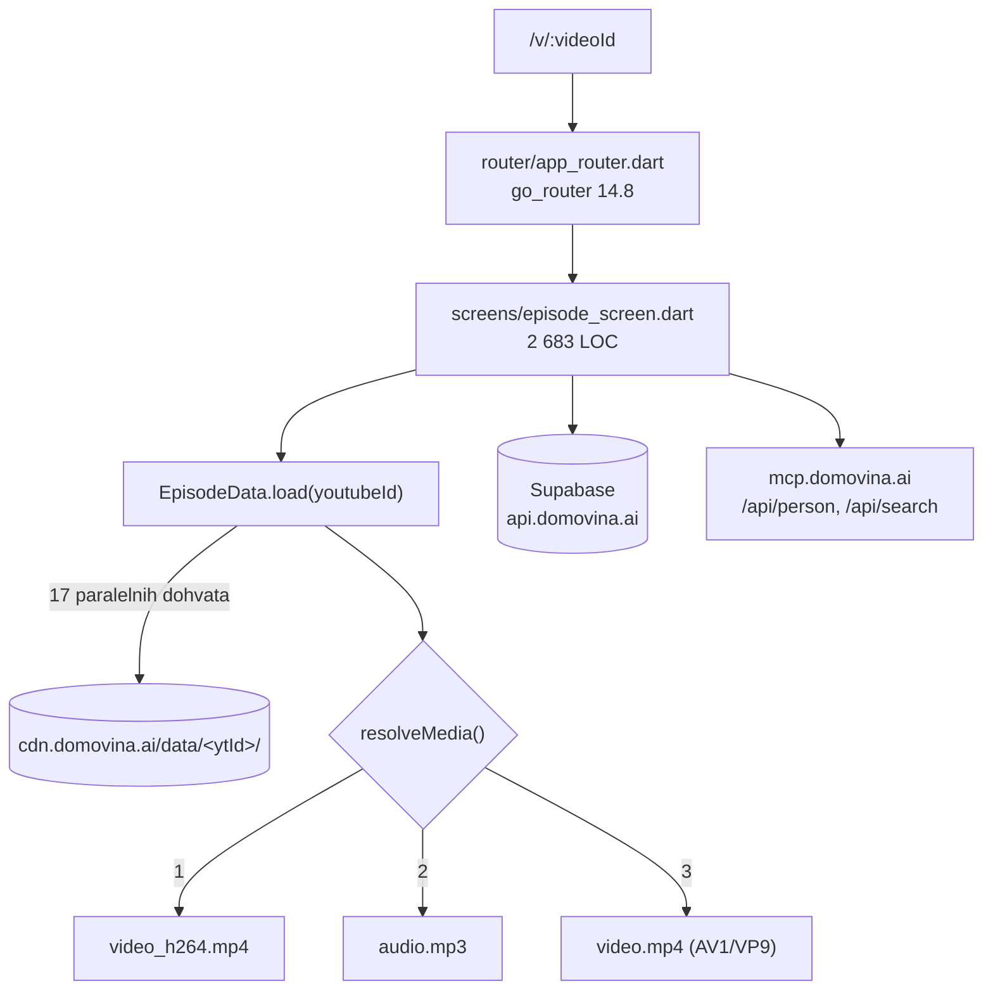

# Tehnički priručnik — DOMOVINA.ai / Podcasterium klijent

*Verificirano protiv `main` @ 7de73ea, 14. kolovoza 2026. · verzija aplikacije 2.0.136+158*

> Prethodna datoteka na ovoj putanji imala je 186 kB i sadržavala je rečenicu
> „This is a very detailed explanation." ponovljenu 5 000 puta, generiranu
> skriptom `modify_file.py`. Ovo je zamjena: modul po modul, sa stvarnim
> putanjama i ponašanjem provjerenim u kodu.

Ovaj priručnik pokriva **klijent**. Pipeline je u `../fetch.domovina.tv`
(`../fetch.domovina.tv/docs/PIPELINE.md`,
`../fetch.domovina.tv/docs/data_contract.md`), pretraga i person API u
`../domovina-rag`, baza u `../domovina-api`.

---

## 1. Arhitektonski model u jednoj rečenici

Aplikacija je **stateless čitač statičkog CDN kontrakta**, s Supabaseom
prilijepljenim sa strane za sve što je korisnikovo (identitet, favoriti,
napredak, glasovi, vlasništvo).



Ključna posljedica: **epizoda se prikazuje i kad većina podataka ne postoji.**
Od 17 dohvata samo `info.json` je obavezan — sve ostalo je nullable i 404 znači
„pipeline još nije došao dotle", ne grešku (`EpisodeData.hasAiContent` gejta
osnovni layout).

---

## 2. Podatkovni kontrakt (CDN)

Sve putanje su centralizirane u `lib/services/cdn_config.dart`. Ništa se ne
sklapa ad hoc drugdje.

### Po epizodi — `/data/<youtubeId>/`

| Datoteka | Obavezna | Model |
| :--- | :--- | :--- |
| `info.json` | **da** | `PodcastInfo` — naslov, kanal, trajanje, `_source`, `_yt_matched` |
| `summary.json` | ne | `PodcastSummary` |
| `outline.json` | ne | `PodcastOutline` — poglavlja s vremenskim oznakama |
| `article.json` | ne | `PodcastArticle` — iteracije (poglavlja) s tekstom |
| `article.magisterium.json` | ne | `MagisteriumData` |
| `article.magisterium_batch.json` | ne | `MagisteriumData` |
| `article.magisterium_full.json` | ne | `MagisteriumFullData` |
| `article.magisterium_full_v2.json` | ne | `MagisteriumFullV2Data` |
| `article.magisterium_full{,_v2}_prompt.md` | ne | sirovi prompt (transparentnost) |
| `*.en.json` (summary, article, magisterium, batch, full_v2) | ne | EN overlay; 404 dok prijevod nije producran |
| `diarized.srt` | ne | `SpeakerTimeline` — segmenti po govorniku |
| `video_h264.mp4` / `audio.mp3` / `video.mp4` | jedna | razrješava `resolveMedia()` |

Tri generacije Magisterium formata žive paralelno jer starije epizode nikad
nisu re-procesirane. Klijent podržava sve tri — to nije tehnički dug nego
posljedica nemutabilnog CDN-a.

**Jezik izlaza je uvijek hrvatski.** `article.json`, `summary.json`, `topics`
i `suggested_name` govornika pišu se na hrvatskom bez obzira na jezik audija —
engleski podcast (Sub Club, 178 epizoda) ima engleski zvuk i hrvatski članak,
uz `title_hr` kao prevedeni naslov. `*.en.json` overlay je **prijevod
hrvatskog članka**, ne izvorni engleski tekst, i postoji za 40 od 3 175
epizoda (1,3 %). Klijent nema način da to zaobiđe — mijenja se u
`generate_article_gemini.js`.

Pokrivenost obradom na dan 14. 8. 2026.: transkript / diarizacija / sažetak /
članak **99,5 %**, Magisterium **9,8 %** (311 epizoda, 28 kanala), EN **1,3 %**.
Kod koji ovisi o Magisteriju (npr. izbor istaknute epizode u
`screens/home/home_feed.dart`) time bira iz manje od desetine kataloga.

### Po kanalu — `/channels/`

`data/index.json` (48 kanala), `data/<id>.json`,
`images/<id>/avatar_square.jpg`, `images/<id>/avatar_cover.jpg`.

### Cache-busting

Uploader stavlja `Cache-Control: immutable` na **sve**. Per-epizoda datoteke to
podnose (nemutabilne su); listinzi kanala ne, pa `CdnConfig._channelCacheBuster()`
dodaje `?v=<epoch/300000>` — 5-minutni bucket, dovoljno svjež za nove epizode,
dovoljno stabilan da CDN služi isti URL svima.

Probe URL-ovi (`videoH264ProbeUrl`, `audioProbeUrl`) **moraju** nositi
cache-buster: CDN cachira 404 četiri sata, pa bi jedan prerani probe zaključao
fallback na cijeli prozor.

---

## 3. Ruting

`lib/router/app_router.dart`, go_router 14.8. *(CLAUDE.md na jednom mjestu još
tvrdi da ruting ide preko `onGenerateRoute` u `main.dart` — to je zastarjelo.)*

| Ruta | Ekran |
| :--- | :--- |
| `/` | `home/home_screen.dart` |
| `/channels`, `/c/:slug` | popis kanala, kanal |
| `/c/:slug/claim`, `/youtube-claim/callback` | preuzimanje vlasništva |
| `/p/:slug` | person hub |
| `/v/:videoId` | epizoda (detaljni prikaz) |
| `/v/:videoId/read` | TV/reader paginirani prikaz |
| `/v/:videoId/en`, `/m/:videoId`, `/m/:videoId/en` | jezične i „simple" varijante |
| `/v/:videoId/t/:seconds` (+ `/en`) | share s vremenskom oznakom |
| `/search`, `/favorites`, `/subscribe`, `/account` | — |
| `/account/channels/:ucId/campaigns/:campaignId` | pinka kampanje vlasnika |
| `/glasanje`, `/glasanje/:slug` | Izborni dan |
| `/handoff`, `/handoff/:code` | prijenos sesije mobitel ↔ web |

**Pravilo:** nova javna content ruta ide u **oba** popisa u
`web/_worker.js` (AASA `components`) i `android/app/src/main/AndroidManifest.xml`
(intent filter allowlist). Nova auth/callback ruta ide u **nijedan** i mora biti
pokrivena AASA exclusionom — inače native app presretne OAuth povratak i prekine
web prijavu.

---

## 4. Reprodukcija

`media_kit` 1.2.6 + `media_kit_video` 2.0.1. **Nikad goli `Video` widget** —
uvijek `widgets/episode_video.dart` (832 LOC), koji rješava četiri web zamke:

1. Ulazak u fullscreen re-parenta `<video>` u DOM-u → HTML spec kaže pauza.
   Wrapper radi auto-resume (retry 300/900 ms).
2. Esc izlazi iz browser fullscreena, ali Flutter ruta ostaje →
   `services/browser_fullscreen.dart` sluša `fullscreenchange`.
3. `playAndPauseOnTap` je po defaultu **isključen** — klik na video inače ne radi ništa.
4. `setSubtitleTrack` na webu traži VTT i u sourceu piše „UNTESTED" → titlove
   rendamo sami iz `diarized.srt` kroz `controls:` builder.

### Stanje kontrola ide kroz singletone, ne propove

`PlaybackSpeed`, `PlayerMute`, `BackgroundPlayback`, `SeekUndo`. Razlog je
konkretan: iste kontrole crta **tri** odvojena stabla (traka u videu,
`video_panel.dart`, `_PlayerTab` u `episode_simple_screen.dart`), a na mobitelu
je player u `endDraweru`. Prop drilling se tu ispusti — povijesno su
`mutedAutoplay`/`onUnmute` bili propovi i nedostajali su na obje mobilne
pozivne točke, pa unmute na mobitelu **nije postojao**.

Nova kontrola playera mora se pojaviti na sva tri mjesta. Zadnja dva su jedina
putanja za audio-only epizode, gdje `EpisodeVideo` uopće ne postoji.

### Mute na webu

Ide preko `<video>.muted` (`services/media_element_mute_web.dart`), **nikad**
preko `volume`: na iOS-u `HTMLMediaElement.volume` nije zapisiv, a media_kitov
`setVolume` usput skida `muted` flag. `player.setVolume` je samo native putanja.

### Fullscreen su tri putanje

Pravi landscape na nativeu (`SystemChrome`), `screen.orientation.lock` na
Android Chromeu, vizualna rotacija (`RotatedBox`) gdje oboje padne (iPhone
Safari/Chrome). Desktop široki viewport ostaje na media_kitovoj ruti.

### Seek undo

`services/seek_undo.dart` detektira **ručni** skok nad `player.stream.position`.
Prag ne spuštati ispod 1 s: stream fira ~5×/s, pri brzini 2,0× prirodni pomak je
~0,4 s. Programski seek (resume, tap na poglavlje, sam Undo) mora ići uz
`SeekUndo.suppress()`.

---

## 5. Članak ↔ video

`widgets/article_section.dart` (833) i `widgets/parallel_article_view.dart`.
Članak i Magisterium prikazuju se kao paired-row shared-scroll s ljepljivim
headerom, omjer flex 23:17.

Sidra za osobe: dolazak na `/v/<id>?p=<slug>` mora raditi i **bez** `/t/<sec>`.
Tada se sidro traži po sadržaju (prva sekcija koja referencira osobu), članak
se doscrolla, ali se video **ne** seeka — znamo sekciju, ne sekundu. Pill bez
ciljne sekunde nikad ne tvrdi „govori ovdje", nego „ovdje se spominje".

Markdown: svaki `MarkdownStyleSheet` mora proći kroz `.withBrandBlockquote(theme)`
(default blockquote je nečitljiv u dark temi), a custom inline builder mora
vratiti `Text.rich`/`RichText`.

---

## 6. Person hub

`models/person_hub.dart` + `screens/person/person_screen.dart` (1 524) +
`services/person_service.dart` → `GET mcp.domovina.ai/api/person/{slug}`.

Identitet osobe je **disjunkcija** dvaju izvora:

- `episodes[]` — osoba **govori** (diariziran govornik)
- `mentions[]` — osoba se **spominje**

Povijesna ili pokojna figura ima valjan profil samo iz spomena; 404 tek kad
nema ni jedno ni drugo.

Spomen ima **ili** razriješen `first_ts` (tap seeka na sekundu) **ili** ga nema
(~40 % slučajeva — tap otvara epizodu od početka). Te se dvije stvari ne smiju
prikazivati isto: `_MentionMomentChip` je puna brand crvena naspram prigušene
obrubljene.

Slug je primarni ključ u bazi i koristi se **doslovno** (s crticama) — ne
transformira se kao channel slug (`-`↔`_`). `personSlug()` radi ASCII-fold
(č→c, ž→z…) i mora se poklapati s backend logikom.

Prag „glavnog nastupa": `kPersonPrimaryShareThreshold = 0.15` udjela trajanja,
plus apsolutni prag u sekundama koji brani kratke samostalne nastupe u dugim
panelima. Obje granice su inkluzivne.

---

## 7. Pretraga — dva sustava, jedan UI

| | `services/meili_client.dart` | `services/search_service.dart` |
| :--- | :--- | :--- |
| Backend | Meilisearch (`search.domovina.ai`) | domovina-rag `/api/search` |
| Tip | keyword, egzaktna riječ + typo-tolerant | semantička (embeddings) |
| Granularnost | epizoda; `_formatted` snippet s `<em>` | chunk transkripta, `startTs`/`endTs`/`deepLink` |
| Ključ | read-only search key u bundleu (`actions:[search]`, deterministički HMAC) | — |

Ne miješati ih. Per-sekundu deep-linkove daje **samo** semantička putanja.
UI je zajednički: `screens/home/search_overlay.dart` (1 231) — command palette
s tipkovničkom navigacijom i metrom relevantnosti; `screens/search/meili_search_screen.dart`
je zasebna puna stranica.

---

## 8. Magisterium sloj

Prikazuje ocjenu **usklađenosti s katoličkim naukom** (0–100), ne točnosti.
Skala u `widgets/magisterium_section.dart:26-32`:

| Raspon | Ključ |
| ---: | :--- |
| ≥ 90 | `magisteriumScoreActivelyPromotes` |
| ≥ 70 | `magisteriumScoreMostlyAligned` |
| ≥ 50 | `magisteriumScorePartiallyAligned` |
| ≥ 30 | `magisteriumScoreDeviates` |
| < 30 | `magisteriumScoreContradicts` |

Dodiruje 38 datoteka izvan `l10n/`, ali gotovo isključivo kao **prikaz** —
kartice railova čitaju `avg_magisterium_score` za sortiranje i bedž. Nema
poslovne logike; generalizacija u domenski neutralan `DomainScore` je
preimenovanje + pluggable skala etiketa (vidi `podcasterium_analysis_report.md` §3).

EN varijanta nema `overall_score` — fallback je na HR vrijednost.

---

## 9. Pinka SDK (`lib/pinka_sdk/`)

Izoliran paket, 26 datoteka, dijeli backend s pinka.io. Dva rail-a: **SEPA**
(EPC QR kod) i **on-chain** (EURe/MPT).

- `pinka_client.dart` / `pinka_admin_client.dart` — REST
- `widgets/pinka_grid_wall.dart` (1 352) — zid podrške 120×120, jedan paint
  pass, deterministički placement. Mreža 120×120 je identitet proizvoda i ne
  prodaje se 1×1.
- `widgets/pinka_contribute_panel.dart` (1 387) — obrazac + živi pregled kartice
- `util/pinka_intent_status.dart` — živi „Korak M/N" iz `GET /api/intents/<sid>`

SEPA intent ima TTL (default 900 s, cap 24 h). Kasna uplata na istekli intent
**nikad** ne postaje `paid` — zato uvijek slati `expires_in_seconds`.

---

## 10. Auth

`services/auth_service.dart` + `onboarding/ui/auth_sheet.dart` (886).
Putanje: OAuth (Google, Apple), magic link / email OTP, passkeys, Certilia e-Osobna.

- **Return-to:** prije full-page redirecta path+query ide u localStorage
  (`auth_return_to`); `AuthCallbackScreen` vraća korisnika tamo. Sanitizacija u
  `services/auth_return_path.dart` (open-redirect guard + callback-loop guard),
  pokrivena unit testovima — ne zaobilaziti.
- **Identity linking:** GoTrue automatski povezuje Google i Apple po
  verificiranom emailu; ostale putanje konvergiraju samo preko `email_otp`
  (`generateLink` → `verifyOTP`), **ne** preko redirect linka (PKCE).
- **Nudge nikad ne prekida reprodukciju.** Modal samo kad ga je korisnik svojim
  tapom pozvao; inače trajna traka (`widgets/anonymous_signin_bar.dart`).
- **Safe area:** kad se u `bottomNavigationBar` slaže više traka koje se
  nezavisno pale/gase, donji `SafeArea` ide na zajednički `Column` — nikad na
  pojedinu traku (inače duplo ili nula).

---

## 11. Platformske specifičnosti

| Tema | Pravilo |
| :--- | :--- |
| SharedPreferences na webu | **Nikad.** Dart2js minifikacija strippa registraciju plugina → `MissingPluginException`. Web ide na `window.localStorage` preko `package:web`, gejtano `kIsWeb` |
| SVG na webu | `flutter_svg` ruši web build → `Image.asset` s PNG-om |
| Impeller na Androidu | Isključen (`EnableImpeller=false`), Skia renderer. Ne uključivati bez ponovnog mjerenja cold starta na EON boxu |
| Engine pre-warm | `FlutterEngineCache` kolidira s `audio_service.provideFlutterEngine()` → dupli `main()`. Ne koristiti |
| AV1 na Android TV-u | Amlogic (EON) nema funkcionalan HW dekoder → `player.platform.setProperty('hwdec','no')`. Pipeline sad producira `video_h264.mp4` paralelno |
| Native splash | Statičan. Rotacija citata nemoguća na Android < 12 (starting window se komponira prije Activityja). `NormalTheme.windowBackground` mora biti isti drawable kao `LaunchTheme` inače flash crnog |
| wasm | Buildamo s `--wasm`. Conditional import gejtati na `dart.library.js_interop`, **ne** `dart.library.html`. `meta passkeys` ruši wasm build |
| Service worker | Aktivan — potreban za iOS PWA pozadinski zvuk. Cache headeri idu u worker, ne u `_headers` |
| `_redirects` | Ne smije postojati — shadowa `env.ASSETS.fetch()` u workeru |
| iOS Dynamic Island | `MediaSession.clear()` na webu ne postavlja `playbackState='none'` → ostaje mrtva stavka. Poznato, nepopravljeno (`docs/ios-background-playback.md` §4.3) |

---

## 12. i18n

`gen-l10n`, ARB. **HR je template**, EN prijevod. 977 ključeva po jeziku.

- U widgetu s contextom: `AppLocalizations.of(context)`.
- Bez contexta: `appStrings` — ali **samo** za jednokratni event-time resolve
  (SnackBar, `_error` u catch bloku). `appStrings` ne registrira dependency na
  Localizations scope, pa tekst renderiran preko njega ostaje na starom jeziku
  nakon promjene UI jezika.
- Enum/model copy getteri primaju `AppLocalizations l` parametar.
- Registar: neformalno „ti". Iznimka su outreach poruke trećim stranama i
  pravni tekst — tamo „Vi".
- UI jezik (`LocaleController`) i jezik sadržaja (`episode_language.dart`) su
  odvojeni, ali dvosmjerno spregnuti: svaki prebacivač postavlja oba.

---

## 13. Build, deploy, testovi

```bash
./scripts/deploy.sh          # release build + deploy + CDN purge
./scripts/deploy.sh --debug  # profile build (neminificiran)
```

Lanac: `flutter pub get` → `flutter analyze` → `flutter build web` →
`wrangler pages deploy` → purge Cloudflare cachea → HTTP verifikacija.
Skripta sama bumpa patch + build broj; footer prikazuje verziju (signal za
hard refresh). Cache purge nije opcionalan — bez njega korisnici vide staru verziju.

Nightly (launchd, 01:00) gradi iOS + Android iz odvojenog worktreea i šalje na
TestFlight i Play internal; testovi su tvrda vrata. Sve u Telegram ide kroz
`scripts/telegram-notify.rb` (redigira `.env` vrijednosti i JWT-ove) — nikad
izravni `curl` na Bot API.

**Stanje testova, izmjereno 14. 8. 2026. na `7de73ea`:**

```
flutter test  →  +228 -2   (26 datoteka, 230 slučajeva)
```

Oba pada su poznata i izuzeta iz nightly vrata preko `.nightly/test-baseline.txt`:

| Test | Uzrok |
| :--- | :--- |
| `test/widget_test.dart` | smoke test gradi cijelu aplikaciju; puca na `HttpClient` u `TestWidgetsFlutterBinding` (mreža vraća 400) |
| `test/home_feed_test.dart` | `pickFeatured` očekuje `hiQualityRecent`, dobiva `hiQuality` |

Prije nego zaključiš da si nešto slomio — provjeri sa stashom. I obrnuto: ako
diraš izbor istaknute epizode u `home_feed.dart`, **prvo popravi
`home_feed_test.dart`** jer je to jedini test koji tu logiku pokriva.

### Provjera dokumentacije

```bash
./scripts/verify-doc-refs.sh docs/podcasterium_*.md   # ili bez argumenta: svi docs/
```

Provjeri da svaka `lib/…` putanja citirana u markdownu stvarno postoji, i
predloži pravu ako ne. Dokument koji namjerno citira krivu putanju (npr.
tablica ispravaka) omeđi s `<!-- doc-refs:ignore-start -->` /
`<!-- doc-refs:ignore-end -->`.

Lokalni web dev traži `--dart-define` vrijednosti iz `.env` i port 5173
(GoTrue allow-lista).

---

## 14. Gdje što tražiti

| Tema | Dokument |
| :--- | :--- |
| Pipeline (13 koraka, dijagrami) | `../fetch.domovina.tv/docs/PIPELINE.md` |
| Format CDN datoteka | `../fetch.domovina.tv/docs/data_contract.md` |
| Web isporuka, cache, rendering | `docs/web-delivery-and-rendering.md` |
| iOS pozadinski zvuk | `docs/ios-background-playback.md` |
| Android TV (perf, emulator, splash) | `docs/android-tv*.md`, `docs/splash-*.md` |
| Auth UX i backlog | `docs/auth-ux-backlog.md` |
| Vlasništvo kanala i isplate | `docs/channel-ownership-and-safe-payout-plan.md` |
| Baza (shema, RLS, RPC) | `../domovina-api/docs/` |
| Zašto Flutter a ne Expo | `docs/tech-stack-assessment-flutter-vs-expo.md` |
| Rebrand u Podcasterium | `docs/podcasterium_analysis_report.md` |
