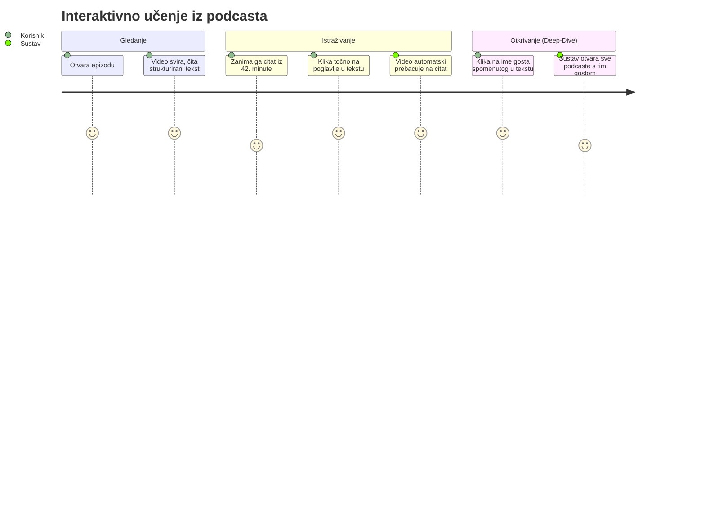

# Što je Podcasterium? Vodič za korisnike i kreatore

Dobrodošli u **Podcasterium** (tehnologija koja je pokretala _Domovina.ai_) – globalnu platformu koja u potpunosti mijenja način na koji slušamo, gledamo i učimo iz dugih razgovora i podcasta.

Ako ste ikada gledali podcast od 3 sata i pomislili: *"Ovo je odlično, ali volio bih to pročitati kao knjigu"* ili *"Zaboravio sam na kojoj je minuti gost objasnio onaj važan koncept"*, Podcasterium je dizajniran upravo za vas. Mi ne pokušavamo biti još jedan YouTube ili Spotify. Mi smo **interaktivni čitač podcasta** koji spaja autore sadržaja i publiku gladnu znanja.

---

## 🎙️ Zašto je Podcasterium poseban? (Za publiku)

Većina platformi danas dizajnirana je tako da vam odvrati pažnju – dok gledate jedan video, sa strane vam iskaču kratki videi (Shorts) i preporuke za stvari koje vas zapravo ne zanimaju. Podcasterium radi suprotno: **on vas uvlači u fokus**. 

### Vaše putovanje kroz sadržaj

Evo što možete raditi na našoj platformi, korak po korak:

### 1. Gledajte i čitajte u isto vrijeme
Kada otvorite epizodu na Podcasteriumu, na vrhu ekrana (ili sa strane) svira video, dok ispod njega prolazi strukturirani, prelijepo dizajnirani članak (tekst). To nije onaj obični, nabacani "transkript" bez interpunkcije koji jedva možete pratiti. AI pametno dijeli video na poglavlja i smislene odlomke. Možete pratiti video slušajući ga, a kad netko kaže nešto pametno, možete to odmah pročitati, podcrtati ili kopirati. 

### 2. Kliknite točno tamo gdje vas zanima
Nemate vremena slušati 4 sata razgovora? Nema problema. Pomoću pametnog sažetka i poglavlja, s jednim klikom možete uskočiti točno u minutu kada su gosti počeli pričati o temi koja vas zanima. 

### 3. Znamo "Tko je što rekao"
Zahvaljujući tehnologiji vizualnog raspoznavanja govornika, više nikada nećete morati nagađati tko je što izgovorio. Vidjet ćete jasne oznake na tekstu (npr. *"Govori: Ivan"*), tako da cijeli razgovor možete čitati glatko kao dramski scenarij.

### 4. Duboko istraživanje (Deep Dive)
Ako netko u podcastu spomene određenu knjigu, osobu ili organizaciju – taj pojam postaje pametna "oznaka". Možete kliknuti na ime tog gosta i platforma će vam reći u kojim je još podcastima on bio, te na kojim se točno sekundama njega spominje! 

### 5. Gledajte na čemu god želite
Slušajte u autu sa zaključanim mobitelom u džepu. Čitajte u miru na poslu preko weba (bez da uopće morate paliti zvuk). Ili, jednostavno, uzmite daljinski i uživajte na kauču putem naše Android TV aplikacije (tzv. "Leanback" iskustvo poput onog na Netflixu).

---

## 🎬 Zašto odabrati Podcasterium? (Za podcastere i kreatore)

Kao autor podcasta, uložili ste sate u pripremu gostiju, postavljanje mikrofona i kamera te vođenje dubokog, kvalitetnog razgovora. Nažalost, algoritmi društvenih mreža danas ne cijene vaš trud – oni cijene klikove.

**Podcasterium nudi vašoj publici premium iskustvo vašeg sadržaja:**
- **Vaš sadržaj postaje udžbenik:** AI tehnologija automatski obradi vašu 2-satnu epizodu i od nje radi pregledan članak i enciklopediju entiteta. Vaši slušatelji postaju vaši "učenici".
- **Bez distrakcija:** Gledatelji ne dobivaju sa strane preporuke da "kliknu na zabavni video mačke", već ostaju 100% fokusirani na vaš intervju, vaš glas i vašu poruku.
- **Drugačija vrsta publike:** Privlačite studente, novinare, znanstvenike i profesionalce koji vole analizirati sadržaj, citirati ga i tražiti specifične informacije u tekstu – onaj tip ljudi kojima klasičan YouTube player nije dovoljan.

### Što vi trebate napraviti?
Gotovo ništa! Proces je osmišljen tako da vi samo nastavite raditi ono što najbolje radite – stvarati sjajne podcaste.
1. **Prijava i povezivanje:** Unesete link svog postojećeg YouTube kanala ili RSS feeda u naš sustav.
2. **Magija u pozadini:** Naš moćni AI procesor (tzv. *Pipeline*) preuzima epizodu čim je objavite. Transkribira razgovor, prepoznaje lica i glasove, piše sažetke, detektira pojmove i stvara poglavlja.
3. **Objava:** U roku od nekoliko sati, vaša epizoda osviće na Podcasteriumu, pretvorena u predivnu interaktivnu knjigu. Nema dodatnog posla s vaše strane oko uređivanja tekstova.

### Financiranje (Podrška kreatorima)
Znamo da kvaliteta zahtijeva resurse. Umjesto da vas tjeramo na lov za sponzorima koji prodaju proizvode nevezane za vašu temu, uveli smo sustav **Pinka podrške** (uz SEPA/EPC QR kodove). 
Gledatelj koji je upravo riješio svoj problem gledajući vaš podcast može direktno, putem pametnog "Podrži ovu epizodu" panela unutar samog članka, poslati financijsku podršku izravno vama. Interakcija ostaje osobna, direktna i bez posredničkih provizija koje uzimaju klasične mreže.

---

## 🚀 Sažetak: Budućnost učenja

Platforme poput YouTubea su fantastične za pronalazak svega i svačega. Netflix služi za premium opuštanje. **Podcasterium** popunjava prazninu za sve ljude koji video konzumiraju zato da bi **naučili, analizirali i otkrili nešto novo**. 

Mi od dugačkih razgovora stvaramo interaktivne, indeksirane i pretražive "video-knjige" 21. stoljeća. Bilo da ste kreator koji ima puno toga za reći, ili gledatelj koji želi izvući maksimum znanja u minimumu vremena – dobrodošli!
