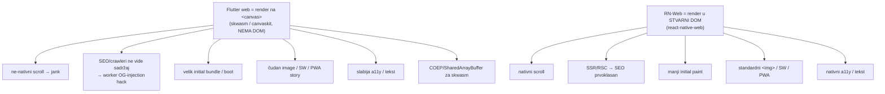
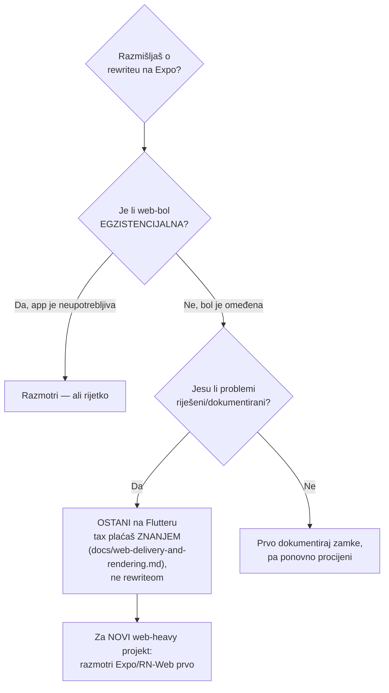

# Tech-stack assessment: Flutter vs Expo/React Native (2026)

> Objektivna procjena izbora tehnologije za **ovu** aplikaciju (DOMOVINA.ai),
> zapisana 2026-06-30 nakon zrelog codebasea i serije web-specific problema.
> **Zaključak unaprijed: NE prepisivati. Ostati na Flutteru.** Ovaj dokument
> objašnjava zašto, pošteno — uključujući gdje bi Expo bio bolji — da odluka
> bude trajna i da se rasprava ne otvara iznova svaki put kad iskrsne web bug.

---

## TL;DR

- Za **profil baš ove aplikacije** (web-primary, content/media, SEO/sharing, PWA)
  bi Expo/React Native-Web vjerojatno dao **mirniji web život** — strukturno, ne
  slučajno.
- **Ali to NIJE razlog za rewrite.** Web-bol nije egzistencijalna, većina je
  riješena i dokumentirana (`docs/web-delivery-and-rendering.md`), a migracija
  zrelog codebasea (auth, billing, eID, TV, pipeline) je mjeseci posla.
- **Pravilo:** za OVAJ projekt ostani na Flutteru. Za SLJEDEĆI web-heavy projekt
  ozbiljno razmotri Expo/RN-Web (ili čisti web framework) prije Fluttera.

---

## Zašto je web bio bolan — strukturni korijen

Aplikacija je **web-primary** (vidi `CLAUDE.md`). A web je **Flutterov najslabiji
target** jer Flutter web crta sve sam na `<canvas>` (skwasm/canvaskit) — **nema
pravi DOM**. Iz toga izravno slijedi većina ponavljajućih problema.

Skoro svi problemi iz debug sesije (SW staleness, slike ne crtaju, scroll jank,
COEP, `SharedPreferences` na webu, `flutter_svg` crash na webu, media_kit web
zamke, OG injection) su **posljedice canvas modela**. RN-Web (DOM) većinu njih
nema by-design.

---

## Decision matrica — što je za ovu app bolje

| Dimenzija | Flutter | Expo / RN-Web | Bitno za nas? |
|---|---|---|---|
| **Web rendering (scroll, slike, tekst)** | canvas → zamke | DOM → nativno | ⭐ web-primary |
| **SEO / sharing / OG** | hack (CF worker) | SSR/RSC native | ⭐ podcast share |
| **PWA / Service Worker** | krhko, Flutter-driven | prvoklasan web story | ⭐ iOS bg audio |
| **Supabase / RevenueCat SDK** | dobar | arguably zreliji | ✓ |
| **Android TV / Leanback / D-pad** | uniformno (DIY ali stabilno) | `react-native-tvos` community fork, manje uglađen | ⭐ velik ulog |
| **Pixel-identičnost svih platformi** | jedan engine | web vs native divergencija | ✓ |
| **Native UI perf / animacije** | jak | dobar | ✓ |
| **Native video/audio** | media_kit (web bol) | expo-video/av zreo | ✓ |
| **Postojeći codebase + skill** | sve već tu | rewrite od nule | ⭐⭐ presudno |

⭐ = jako bitno za ovu app. Web/SEO/PWA stupci favoriziraju Expo; TV i
postojeći-ulog stupci favoriziraju Flutter.

---

## Gdje Flutter ostaje bolji izbor

- **Android TV (10-foot UI, D-pad focus, Leanback)** — ozbiljan ulog (cijeli
  `lib/screens/tv/`, emulator setup, perf analiza). RN-TV je manje uglađen.
- **Jedan rendering engine = pixel-identičnost** na svim platformama; RN-Web znači
  održavanje dva seta quirkova (web vs native).
- **Native UI performance i animacije.**
- **Zreo codebase** — auth (Supabase/GoTrue, passkeys, Certilia eID, Apple/Google),
  RevenueCat billing, pipeline integracija, TV — sve već radi.

---

## Zašto NE prepisivati (presudno)

Migracija bi značila ponovno graditi: Supabase auth + RLS wiring, passkey/Certilia
eID bridge, RevenueCat sve-platforme, Android TV modul, video/audio player,
pipeline-driven content rendering. **Mjeseci posla, rizik regresija, nula nove
vrijednosti za korisnika.** Web-bol nije egzistencijalna i većina je riješena.

**Pravo pitanje nije "Flutter ili Expo", nego "jesu li preostali web problemi
omeđeni?"** — jesu. Dakle tax se plaća znanjem (dokumentirane zamke), ne rewriteom.

---

## Pravilo za buduće odluke

1. **Ovaj projekt:** ostani na Flutteru. Web zamke su poznate i dokumentirane.
2. **Novi projekt, web-primary / content / SEO-heavy:** ozbiljno razmotri
   Expo/RN-Web ili čisti web framework (Next.js + Capacitor za native) PRIJE
   Fluttera. Flutter web je upotrebljiv, ali nije put najmanjeg otpora za web.
3. **Novi projekt, native-primary + TV ili teška custom UI / animacije:** Flutter
   je i dalje odličan default.
4. **Odluku ne preispituj** na svaki web bug — preispituj samo ako bol postane
   egzistencijalna (app neupotrebljiva, ne "iritantna").

Vidi i `docs/web-delivery-and-rendering.md` za konkretne web zamke i njihova
rješenja.
