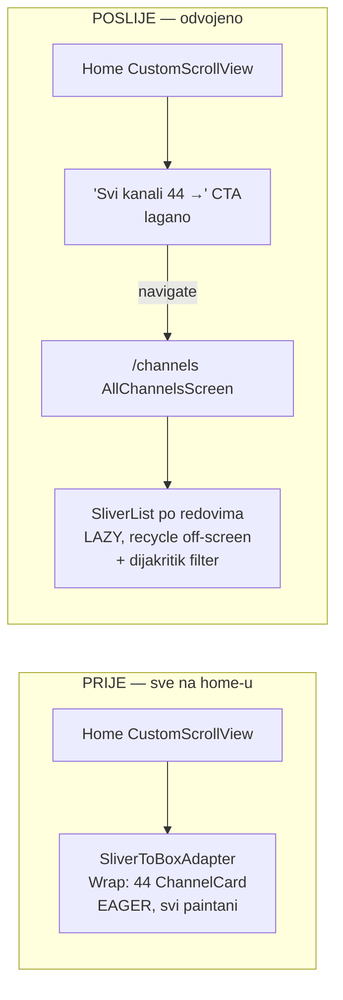
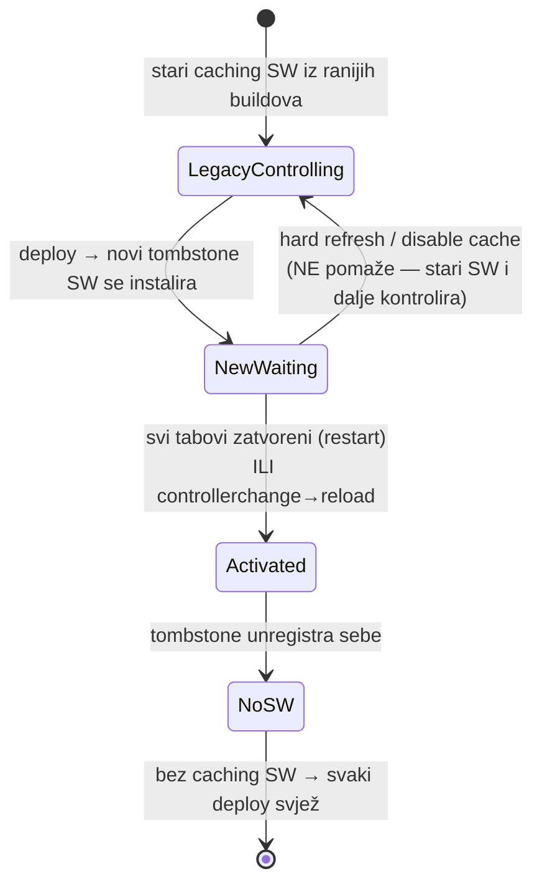
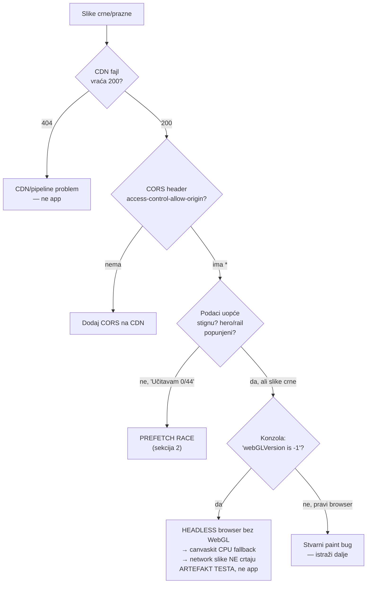

# Web delivery, rendering & caching

> Naučeno tijekom debug sesije 2026-06-29/30 (v2.0.61 → v2.0.64). Tri teme koje
> se zajedno objašnjavaju jer su se manifestirale kao **jedan** simptom
> ("homepage bez slika"), a imale tri različita uzroka.

DOMOVINA.ai je Flutter web app na Cloudflare Pages. Sav per-episode/per-channel
sadržaj loada se runtime s `cdn.domovina.ai`. Render je `--wasm` (skwasm GPU) s
canvaskit/dart2js fallbackom. Ova kombinacija (Flutter crta sve sam na canvas +
SW caching + cross-origin CDN) ima nekoliko ne-očiglednih zamki.

---

## 1. Channel list rendering & "scroll lag"

### Problem
Home je renderirao **sve kanale (44+) eager** u jednom `SliverToBoxAdapter` →
`Wrap`. Svaka `ChannelCard` živi u stablu i sudjeluje u **rasterizaciji svakog
scroll frame-a**. Na webu (skwasm) to je skupo jer se sadržaj re-rasterizira po
frameu na glavnoj niti → vidljiv jank. (Na nativnom iOS/Android isti eager build
je jeftin — bolji GPU pipeline + raster na zasebnoj niti.)

### Ključni uvid
Lag NIJE bio broj kartica per se — to je **per-frame raster** trošak, ne
build/layout trošak (koji se plaća jednom). Ali kako lista raste (44 → 100+),
lazy rendering postaje nužan. Riješeno seljenjem punog popisa s home-a.

### Rješenje — `/channels` lazy surface
`lib/screens/channels/all_channels_screen.dart`:
- **Lazy `SliverList` po REDOVIMA**, NE `SliverGrid`. Razlog: kanal kartice imaju
  varijabilnu visinu (banner vs square layout, 1–2 linije naziva), a `SliverGrid`
  forsira uniformnu visinu ćelije → clipanje. Red drži prirodne visine
  (top-aligned), `SliverList` recycle-a off-screen redove.
- Dijakritik-aware filter (`localMatchScore` iz `lib/utils/text_search.dart`).
- Home sad ima samo lagani **"Svi kanali (N) →" CTA** koji vodi na `/channels`.



**Pravilo:** za duge liste varijabilne visine na webu koristi `SliverList` po
redovima (ne `SliverGrid`), i ne drži ih sve u home scroll viewportu.

---

## 2. Prefetch race condition ("0/44 kanala, nema slika")

### Simptom
Homepage bez hero slike i thumbnaila; header zaglavljen na "Učitavam 0/44
kanala…". Intermitentno: na iOS Safari/5G radilo, na desktopu ne. Pojavilo se
nakon deploya koji je **olakšao** home (CTA umjesto 44 kartice).

### Root cause — latentni race
`channelCache.prefetchAll()` (loada per-channel detalje s kojih dolaze
hero/thumbnail podaci) zvao se iz `onChannelsLoaded` **iza** ovog reda:

```dart
if (!_simpleModeLoaded) return;   // ⟵ vrati PRIJE prefetchAll
_channelCache.prefetchAll(channels);
```

`onChannelsLoaded` okida post-frame callback kad index stigne. `_simpleModeLoaded`
postaje `true` tek kad async `loadSimpleModePref()` završi. **Dva neovisna async
toka → race.** Ako index stigne prije pref-a → early return preskoči prefetch
ZAUVIJEK (callback okida samo jednom) → 0/44, prazne slike.

Lakši home build je promijenio frame-timing pa je "loš" ishod postao čest na
desktopu. iOS/5G je imao drukčiji timing → "dobar" ishod → "radi na mobitelu".

```mermaid
sequenceDiagram
  participant I as loadIndex()
  participant S as loadSimpleModePref()
  participant O as onChannelsLoaded (post-frame)
  participant P as prefetchAll()

  Note over I,S: dva NEOVISNA async toka (race)
  rect rgba(255,80,80,0.12)
    Note over O,P: PRIJE (buggy) — index stigne prvi
    I->>O: index ready → post-frame
    O->>O: _simpleModeLoaded == false?
    O--xP: if(!loaded) return — prefetch PRESKOČEN
    S-->>O: (prekasno; callback se ne ponavlja)
  end
  rect rgba(80,200,120,0.12)
    Note over I,P: POSLIJE (fix) — prefetch vezan na index
    I->>P: _indexFuture.then(prefetchAll)  // deterministički
    Note right of P: neovisno o simpleMode i build timingu
  end
```

### Fix
Prefetch vezan na index future u `initState`, potpuno odvojen od build-timinga i
simpleMode-a. `prefetchAll` ima vlastiti guard protiv dvostrukog pokretanja.

```dart
_indexFuture = _channelCache.loadIndex();
_indexFuture.then((index) => _channelCache.prefetchAll(index.channels));
```

**Pravilo:** background prefetch/side-effecte NE vezuj za nepovezane async
preffove ni za widget build/post-frame timing. Veži ih na konkretan future
(ovdje: index) ili u `initState`. Inače latentni race čeka da ga promjena
timinga otkrije.

---

## 3. Service Worker staleness & cache busting

### Simptom
Nakon deploya, postojeći browseri serviraju **staru** verziju — čak i s hard
refreshom i "Disable cache" u Network tabu. Tek **gašenje i ponovno pokretanje
browsera** dovuče novu verziju.

### Zašto hard refresh ne pomaže
Service Worker **presreće fetcheve** i servira iz svog `CacheStorage`, neovisno o
HTTP cacheu. "Disable cache" gasi BROWSER HTTP cache, NE SW cache. Hard refresh
(većinom) zaobiđe HTTP cache ali ne pouzdano i SW. Novi SW ide u **"waiting"**
stanje i preuzme tek kad se **svi tabovi zatvore** → zato restart browsera radi.

### Što se zapravo dogodilo
Stari **offline-first caching SW** (iz ranijih buildova) zaostao je u browserima.
Flutter 3.41 je promijenio default `flutter build web` da generira
**self-unregistering "tombstone" SW** (`install→skipWaiting`,
`activate→registration.unregister()+navigate`) — de-facto `pwa-strategy=none`,
iako te zastavice NEMA u repou. Taj tombstone makne stari SW, ali tek kad stari
pusti kontrolu (restart).



### Cache header strategija (živi u `web/_worker.js`, NE u `_headers`)
> KRITIČNO: `web/_headers` se NE aplicira kad worker rukuje requestom kroz
> `env.ASSETS.fetch()` (Cloudflare Pages Advanced Mode contract). Cache headere
> MORAŠ postaviti u workeru.

| Resurs | Cache-Control | Zašto |
|---|---|---|
| HTML (index/SPA rute) | `no-store` | uvijek svjež entry-point |
| `flutter_bootstrap.js`, `main.dart.{js,wasm,mjs}`, `flutter.js`, `skwasm*`, `manifest.json`, `favicon.png` | `public, max-age=0, must-revalidate` + `CDN-Cache-Control: no-store` | isti URL na svaki rebuild → ETag revalidate (304 ili novi bytes) |
| Hashed asseti (`canvaskit/*`, `assets/*`) | `immutable, max-age=31536000` | URL se mijenja kad se sadržaj promijeni |

### Mitigacija dodana v2.0.64
Guarded `controllerchange → reload` u `web/index.html` — kad se stari SW makne
(controller se promijeni), reload JEDNOM, pa legacy korisnici ne moraju restartati
browser. Guard na `navigator.serviceWorker.controller` → samo korisnici koji
STVARNO imaju stari SW reloadaju; čisti/novi nemaju controller → nema suvišnog
reloada.

### ⚠️ Otvoreno pitanje — iOS background audio
Persistent SW je bio **namjerno** vraćen (2026-05-17) jer je nužan za iOS
cross-app background audio (PWA install → standalone privilegije). Flutter 3.41 ga
je tiho maknuo. **Treba re-verificirati radi li iOS background audio još.** Ako
ne → treba CUSTOM persistentni SW (registriran radi iOS audija) ali bez agresivnog
app-shell cachiranja, ILI offline-first + skipWaiting/claim/reload. Vidi
`feedback_no_service_worker` memoriju.

---

## 4. Debugging Flutter web slika — decision tree

Kad slike (thumbnaili/hero/screenshotovi) ne crtaju, NE pretpostavljaj uzrok —
prođi ovim redom. Svaki je bio razmatran u ovoj sesiji; samo zadnja dva su bili
stvarni uzroci.



### Glavne zamke iz ove sesije
- **COEP `credentialless`** (worker emita COOP/COEP za skwasm SharedArrayBuffer)
  djelovao je kao sumnjivac, ALI nije bio — `fetch` + `createImageBitmap` +
  `` svi rade u page kontekstu pod COEP-om. Provjeri JS probe-om
  prije nego okriviš COEP.
- **Headless/automation Chrome nema WebGL** (`webGLVersion is -1`) → canvaskit
  CPU-only → slike izgledaju puknuto. NIJE app bug. Verificiraj LOGIKU preko
  konzolnih logova (`ChannelCache: done, 44/44 cached`) i Network 200, vizualni
  paint slika prepusti pravom browseru. Vidi `feedback_headless_browser_no_webgl`
  memoriju.

---

## Brze dijagnostičke komande

```bash
# CDN slika — postoji + CORS?
curl -sI -H "Origin: https://domovina.ai" https://cdn.domovina.ai/images/<ytId>/thumbnail.png \
  | grep -iE "http|access-control|cache-control"

# Bootstrap revalidira? (mora biti max-age=0, must-revalidate)
curl -sI https://domovina.ai/flutter_bootstrap.js | grep -i cache-control

# Service worker stanje (u browser konzoli)
await navigator.serviceWorker.getRegistrations()
navigator.serviceWorker.controller?.scriptURL
await caches.keys()
```
